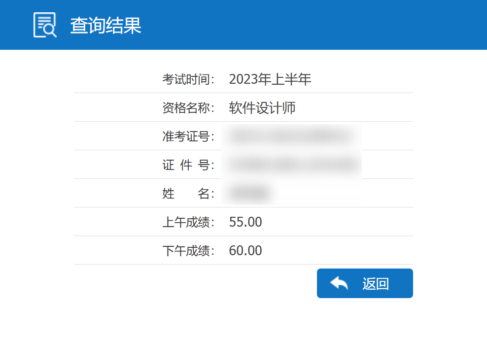
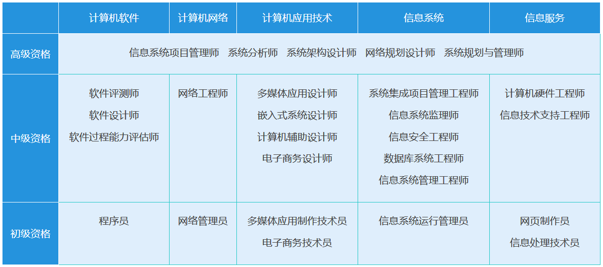
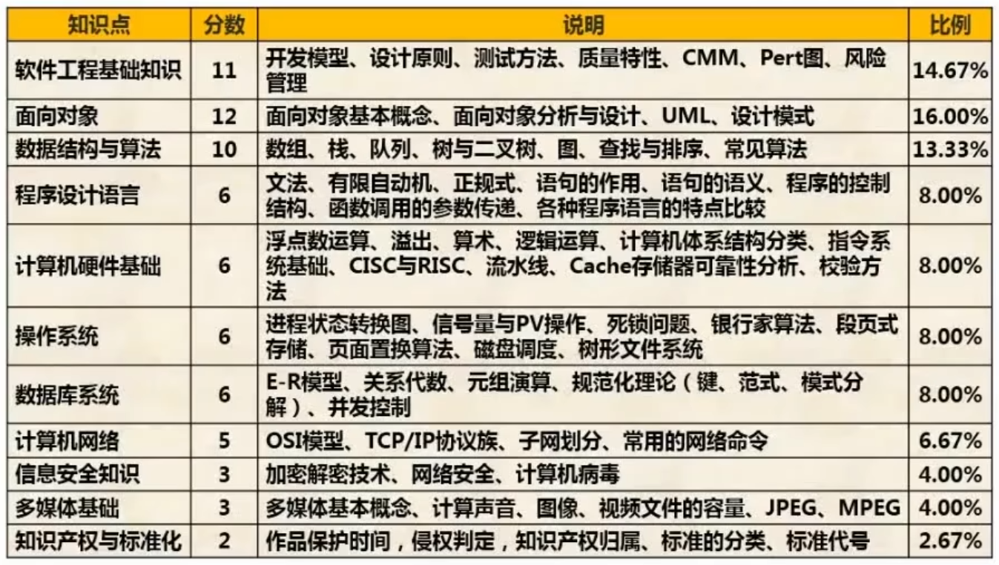
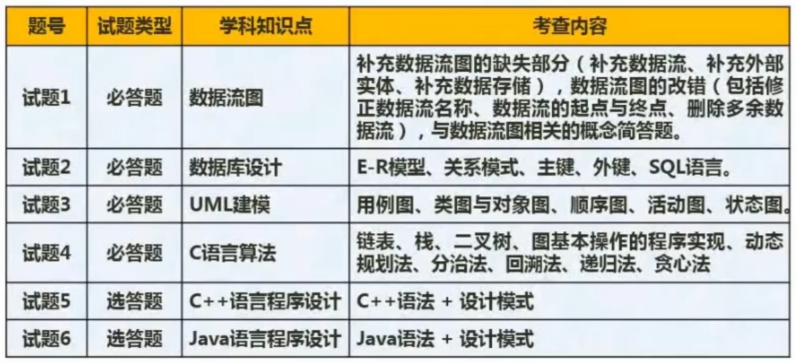

# 软考中级 | 软件设计师

## 考试介绍

软考即计算机技术与软件专业技术资格（水平）考试，是由国家人事部和信息产业部领导下的国家级考试，其目的是，科学、公正地对全国计算机与软件专业技术人员进行职业资格、专业技术资格认定和专业技术水平测试。

从整个方向来看，可以分为五个方向的考试。像计算机软件方向，网络方向，计算机应用技术，信息系统，信息服务，把软考划分了五个方向这样的一个考试。而这五个方面中又划分了初中高这三个级别。

软件设计师考试的前身是高级程序员考试。软件设计师考试考的是广度。

## 推荐视频

zst_2001 制作的[软件设计师学习路线](https://www.bilibili.com/read/cv18526892)

## 考试大纲

- 掌握计算机内的数据表示、算术和逻辑运算方法；
- 掌握相关的应用数学及离散数学基础知识；
- 掌握计算机体系结构以及各主要部件的性能和基本工作原理；
- 掌握操作系统、程序设计语言的基础知识，了解编译程序的基本知识；；
- 热练掌握常用数据结构和常用算法；
- 熟悉数据库、网络和多媒体的基础知识；
- 掌握 C 程序设计语言，以及 C++、Java 中的一种程序设计语言；
- 熟悉软件工程、软件过程改进和软件开发项目管理的基础知识；
- 掌握软件设计的方法和技术；
- 了解信息化、常用信息技术标准、安全性，以及有关法律、法规的基础知识；
- 正确阅读和理解计算机领域的英文资料；

## 考试形式

考试一共分两科，上午考科目一下午考科目二，每一科分数为 75 分，合格分数线为 45 分。

- 科目一：计算机与软件工程知识（150 分钟，笔试，选择题）
  - 75 个选择题，每空一分。
- 科目二：软件设计（150 分钟，笔试，问答题）
  - 一共有六个大题，每一个大题 15 分，试题五和试题六是选答。
  - 试题一：结构化开发方法 -- DFD 数据流图
  - 试题二：数据库 -- E-R 图
  - 试题三：软件工程 -- UML 图（类图+其他图）
  - 试题四：C 语言 -- 算法分析与设计
  - 试题五、六：C++/Java 语言 -- 二十三种设计模式（代码填空）

## 分值分布

- 计算机与软件工程知识

- 软件设计

