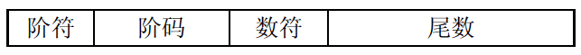
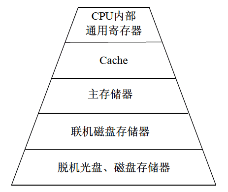
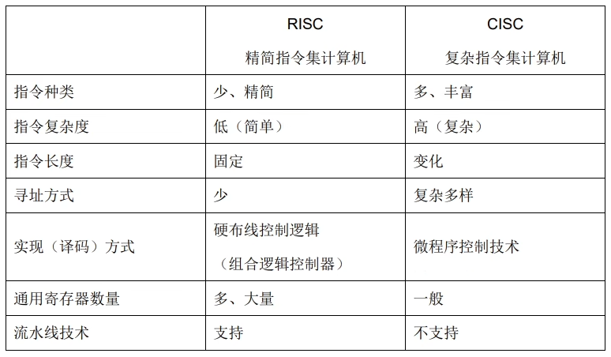
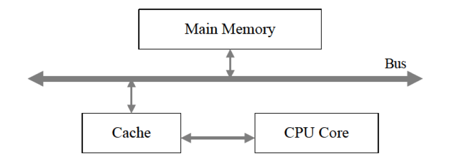
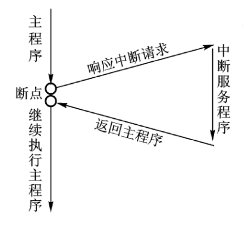
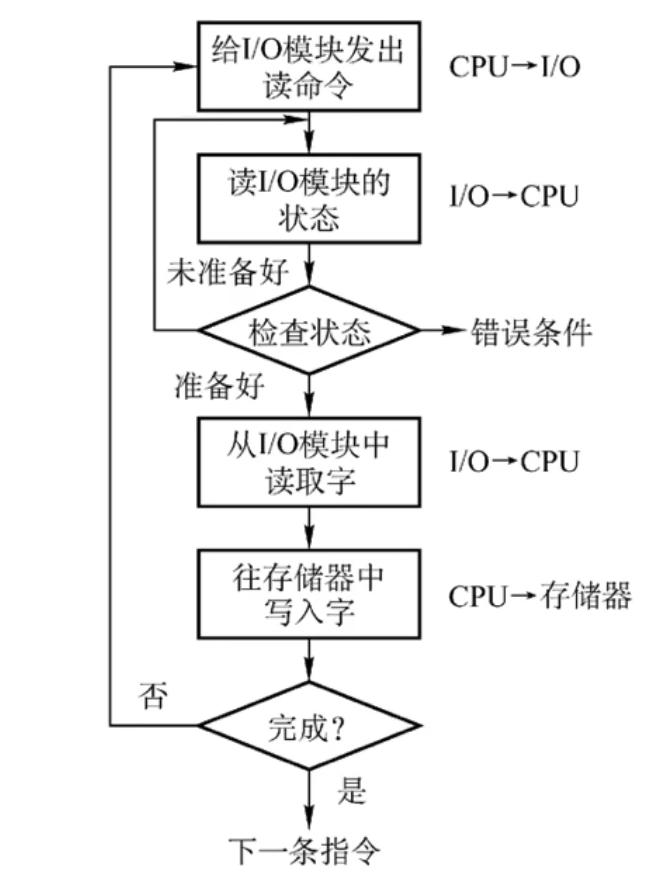
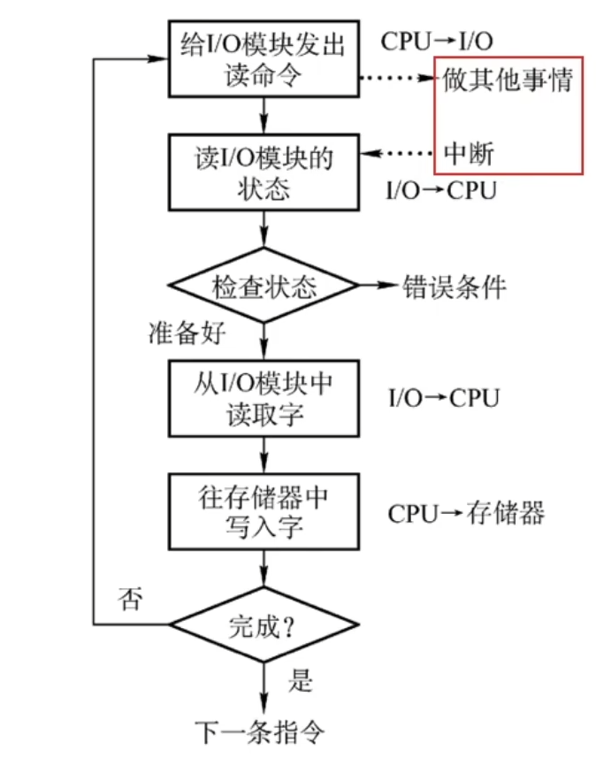
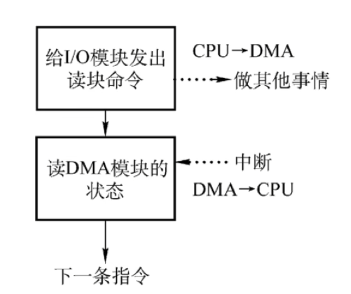
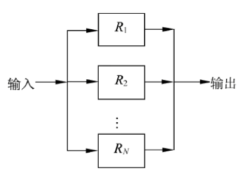

# 软件设计师 | 计算机系统

计算机系统是由硬件和软件组成的，计算机的基本硬件系统由**运算器、控制器、存储器、输入设备和输出设备**五大部件组成。运算器、控制器等部件被集成在一起统称为中央处理单元。

## 中央处理单元

中央处理单元（CPU）是计算机系统的核心部件，**它负责获取程序指令、对指令进行译码并加以执行**。CPU 是硬件系统的核心，用于数据的加工处理，能完成各种算术、逻辑运算及控制功能。此外 CPU 还需要对**系统内部和外部的中断（异常）做出响应**，进行相应的处理。

### 运算器

- 功能
  - 数据处理：CPU 通过对数据进行**算术运算及逻辑运算**等方式进行加工处理，数据加工处理的结果被人们所利用。所以，**对数据的加工处理也是 CPU 最根本的任务**。
  - 算术运算：加、减、乘、除等基本运算。
  - 逻辑运算：进行逻辑测试，例如与、或、非、零值测试或两个值的比较等。

- 组成
  - 算术逻辑单元（ALU）：**负责处理数据，实现对数据的算术运算和逻辑运算**。
  - 累加寄存器（AC）：简称为**累加器**，它是一个**通用寄存器**。功能是为 ALU 提供一个**工作区**。运算结果是放在累加器中的，运算器中至少要有一个累加寄存器。
  - 数据缓冲寄存器（DR）：暂时存放由内存储器读/写的一条指令或一个数据字。作为 CPU 的内存、外部设备之间数据传送的**中转站**。
  - 状态条件寄存器（PSW）：保存当前指令执行完成之后的状态，通常一个算术操作产生一个运算结果，而一个逻辑操作产生一个判决。

### 控制器

- 功能
  - 程序控制：CPU 通过执行指令来控制程序的执行顺序。
  - 操作控制：一条指令功能的实现需要若干操作信号配合来完成，CPU 产生每条指令的操作信号并将**操作信号**送往对应的部件，控制相应的部件按指令的功能要求进行操作。
  - 时间控制：CPU 对各种操作进行时间上的控制，即指令执行过程中操作信号的出现时间、持续时间及出现的时间顺序都需要进行严格控制。

- 组成
  - 指令寄存器（IR）：存放的是从内存中取得指令，就像个中间站一样，不过是存放指令的中间站。
  - **程序计数器**（PC）：又称为**指令计数器**，存放的是指令的地址，还有计数的功能。大多数指令都是按顺序来执行的，修改指令地址过程是对 PC 加 1。
  - 地址寄存器（AR）：存放的是 CPU 访问内存单元的地址。
  - 指令译码器（ID）：是把操作码解析成对应的指令操作。指令等于操作码加地址码。

## 计算机基本单位

|  中文名称  | 英文名称 | 缩写  |     换算     |
| :--------: | :------: | :---: | :----------: |
| 位（比特） |   bit    |   b   |  8bit = 1B   |
|    字节    |   byte   |   B   |  1B = 8bit   |
|   千字节   |  Kbytes  |  KB   | 1KB = 1024B  |
|   兆字节   |  Mbytes  |  MB   | 1MB = 1024KB |
|   吉字节   |  Gbytes  |  GB   | 1GB = 1024MB |
|   太字节   |  Tbytes  |  TB   | 1TB = 1024GB |

最小的数据单位：bit(b)  
最小的存储单位：byte(B)

## 进制的转换

- 十进制（D）：0 ~ 9
- 二进制（B）：0 ~ 1
- 八进制（O）：0 ~ 7
- 十六进制（H）：0 ~ 9、A ~ E

### R 进制转十进制

$R$ 进制（任意进制）转十进制使用按权展开法，其具体操作方式为：将 $R$ 进制数的每一位数值用 $R^k$ 形式表示，即幂的底数是 $R$，指数为 $k$，$k$ 与该位和小数点之间的距离有关，当该位位于小数点左边，$k$ 值是该位和小数点之间数码的个数，而当该位位于小数点右边，$k$ 值是负值，其绝对值是该位和小数点之间数码的个数加 1（**小数点左边从 0 开始数，右边从 -1 开始数**）。

例如：

- 二进制转十进制：$10100.01 = 1{\times}2^4 + 1{\times}2^2 + 1{\times}2^{-2}$
- 七进制转十进制：$604.01 = 6{\times}7^2 + 4{\times}7^0 + 1{\times}7^{-2}$

### 十进制转 R 进制

十进制转 $R$ 进制（任意进制）使用短除法，也叫除 $n$ 取余法，$n$ 代表你要转换为 $R$ 进制中的 $R$。

### 二进制转八进制与十六进制

二进制转八进制，每三个二进制位对应一个八进制位（**以小数点为分界点，小数点左边的往左分段，不足三位补零，小数点右边的往右分段，不足三位补零**），二进制转十六进制同理，每四个二进制位对应一个十六进制位。**需要注意的是十六进制中的 `10` ~ `15` 使用 `A` ~ `E` 表示**。

二进制与八进制编码对应表：

| 二进制 | 八进制 |
| :----: | :----: |
| `000`  |  `0`   |
| `001`  |  `1`   |
| `010`  |  `2`   |
| `011`  |  `3`   |
| `100`  |  `4`   |
| `101`  |  `5`   |
| `110`  |  `6`   |
| `111`  |  `7`   |

### 八进制与十六进制转二进制

八进制转二进制，每一个八进制位对应三个二进制位。十六进制转二进制，每一个十六进制位对应四个二进制位。

### 八进制与十六进制相互转换

八进制转十六进制，将八进制转换为二进制，然后再将二进制转换为十六进制，小数点位置不变。十六进制转八进制则相反，但原理一样，**都需要先转换为二进制**。

### 进制加减法

- 加法：逢 $n$ 进 1
- 减法：借 1 当 $n$

特别注意无论是进 1 还是借 1 都要看是多少进制，二进制就满 2 进 1，借的那个 1 当 2 用，八进制满 8 进 1，借的那个 1 当 8 用，十六进制就满 16 进 1，借的那个 1 当 16 用。

## 原码反码补码移码

首先将一个数（下面用 `1` 做演示）转化为二进制的表达形式，二进制的首位（最左边的一位）代表符号位，**正数的符号位是 `0`，负数的符号位是 `1`，符号位不参与进制转换**。

| 码制  |  数值 `1`   |  数值 `-1`  | `1` 加上 `-1` | 结果  |
| :---: | :---------: | :---------: | :-----------: | :---: |
| 源码  | `0000 0001` | `1000 0001` |  `1000 0010`  | `-2`  |
| 反码  | `0000 0001` | `1111 1110` |  `1111 1111`  | `-0`  |
| 补码  | `0000 0001` | `1111 1111` |  `0000 0000`  |  `0`  |
| 移码  | `1000 0001` | `0111 1111` |  `1000 0000`  |  `0`  |

可以看到 `1` 和 `-1` 的源码相加得到的源码并不是 `0` 的源码而是 `-2` 的源码，所以像源码的这种操作方式是不能直接在机器中做相关的运算的，所以有了其他的编码方式。

取值范围：

| 码制  |                  整数                  |       字长 $n=8$        |
| :---: | :------------------------------------: | :---------------------: |
| 源码  | $-(2^{n-1}-1){\ }{\sim}{\ }+2^{n-1}-1$ | $-127{\ }{\sim}{\ }127$ |
| 反码  | $-(2^{n-1}-1){\ }{\sim}{\ }+2^{n-1}-1$ | $-127{\ }{\sim}{\ }127$ |
| 补码  |   $-2^{n-1}{\ }{\sim}{\ }+2^{n-1}-1$   | $-128{\ }{\sim}{\ }127$ |
| 移码  |   $-2^{n-1}{\ }{\sim}{\ }+2^{n-1}-1$   | $-128{\ }{\sim}{\ }127$ |

可以看到最下面一行，补码比反码、源码取值范围要多一位，原因是源码和反码中的 `+0` 和 `-0` 是两个不同的编码，而补码不是，补码的 `+0` 和 `-0` 的编码是一样的，所以要少占用一个编码。

知识点:

- 原码：正数是其二进制本身；负数是符号位为 1，数值部分取X绝对值的二进制。
- 反码：正数的反码和原码相同；负数是符号位为 1，其它位是原码取反。
- 补码：正数的补码和原码、反码相同；负数是符号位为 1，其它位是原码取反，未位加 1（或者说负数的补码是其绝对值反码未位加 1。**注意 1+1 进 1**）。
- 移码：将符号位取反的补码（不区分正负）。

## 浮点数运算

一个二进制数 $N$ 可以表示为更一般的形式 $N=2^E{\times}F$，其中 $E$ 为阶码，$F$ 为尾数。用阶码和尾数表示的数称为浮点数，这种表示数的方法称为浮点表示法。

在浮点表示法中，阶码为带符号的**纯整数**，尾数为带符号的**纯小数**。浮点数的表示格式如下：

阶码不一致先对阶，小阶向大阶对齐，尾数右移。

浮点数所能表示的**数值范围由阶码 $E$ 决定**，所表示**数值的精度由尾数 $F$ 决定**。

当机器字长为 $n$ 时，补码和移码可表示 $2^n$ 个数（0 的表示有相同的编码），原码和反码只能表示 $2^n-1$ 个数（0 的表示占了两个编码）。

如果浮点数的**阶码（包括 1 位阶符）用 $R$ 位的移码表示**，**尾数（包括 1 位数符）用 $M$ 位的补码表示**，则这种浮点数所能表示的数值范围如下：

- 最大的正数：$+(1-2^{-M+1}){\times}2^{({2^{R-1}-1})}$
- 最小的负数：$-1{\times}2^{({2^{R-1}-1})}$

定点表示法中，**小数点不需要占用存储位**。

## 寻址

- 寻址方式
  - 立即寻址：操作数就包含在指令中。
  - 直接寻址：操作数存放在内存单元中，指令中直接给出操作数所在存储单元的地址。
  - 寄存器寻址：操作数存放在某一寄存器中，指令中给出存放操作数的寄存器名。
  - 寄存器间接寻址：操作数存放在内存单元中，操作数所在存储单元的地址在某个寄存器中。
  - 间接寻址：指令中给出操作数地址的地址。
  - 相对寻址：指令地址码给出的是一个偏移量（可正可负），操作数地址等于本条指令的地址加上该偏移量。
  - 变址寻址：操作数地址等于变址寄存器的内容加偏移量。

- 寻址方式的速度排序
  - 立即寻址 > 寄存器寻址 > 直接寻址 > 寄存器间接寻址 > 间接寻址。

- 采用不同寻址方式的目的是为了**扩大寻址空间并提高编程灵活性**。

- 存储系统的层次结构

  

## 校验码

码距：一个编码方案中任意两个合法编码之间至少有多少个数据位（码字）不同。（意思是一个合法编码需要改变几个码字才能得到另外一个合法编码，这几个码字个数就是码距）。例如 4 位 8421 码的码距为 1，在传输过程中，该代码的一位或多位发生错误，都将变成另外一个合法的编码，因此这种代码无检错能力。

码距等于 2 时有检错能力，码距大于等于 3 才可能有纠错能力。也就是一个校验码要想能够检错和纠错那么它的码距至少是 3。

### 奇偶校验码

对于奇偶校验，它可以检测代码奇数位出错（出错个数为奇数）的编码，但不能发现偶数位出错（出错个数为偶数）的情况。

奇偶校验：码距为 2，仅能检测出奇数位错误，不能纠错。

奇校验：增加一位校验码（码距加 1），使得编码中 1 的个数为奇数。

偶校验：增加一位校验码（码距加 1），使得编码中 1 的个数为偶数。

常用的奇偶校验码有 3 种：水平奇偶校验码、垂直奇偶校验码和水平垂直校验码。

### 海明校验码

海明码的构成方法是在数据位之间的特定位置上插入 $k$ 个校验位，通过扩大码距来实现检错和纠错。

设数据位是 $n$ 位，校验位是 $k$ 位，则 $n$ 和 $k$ 必须满足以下关系：

$$
2^k-1{\ }{\geqslant}{\ }n+k
$$

### 循环冗余校验码

$k$ 个数据位后跟 $r$ 个校验位，编码长度为 $k+r$，码距为 2 可以检错但不能纠错。

采用模 2 运算得到校验码。

## RISC 和 CISC

RISC 精简指令集（Reduced Instruction Set Computer）

CISC 复杂指令集（Complex Instruction Set Computer）

## 流水线

- 概念
  - 子过程：重复的指令分解为若干个子过程，每个子过程与其他子过程并行进行。
  - 操作周期：执行指令中用时最长的子过程的执行时间为流水线的操作周期。
- 流水线执行时间计算公式
  - 理论公式为：$(一条完整指令的时间)+(n-1){\times}操作周期$
  - 实践公式为：$(子过程数{\times}操作周期)+(n-1){\times}操作周期$

### 吞吐率

流水线的吞吐率 $TP$ 是指单位时间（固定时间）内所完成的任务数量或输出的结果数量。计算公式如下：

$$
TP=\frac{指令条数}{流水线执行时间}
$$

如果流水线的子过程所用时间不一样，则吞吐率 $TP$ 应为最长子过程的倒数。计算公式如下：

$$
TP=\frac{1}{max(t_1,t_2,{\cdots},t_k)}=\frac{1}{操作周期}
$$

### 加速比

完成同样一批任务，不使用流水线所用的时间与使用流水线所用的时间之比称为流水线的加速比。计算流水线加速比的基本公式如下：

$$
S=\frac{不使用流水线所用的时间}{使用流水线所用的时间}
$$

## 存储器

虚拟存储器由主存和辅存两级存储器组成。

### 局部性原理

- 时间局部性：是指如果程序中的某条指令一旦执行，则不久之后该指令可能再次被执行，如果某数据被访问，则不久之后该数据可能再次被访问。
- 空间局部性：是指一旦程序访问了某个存储单元，则不久之后，其附近的存储单元也将被访问。

### 存储器的分类

#### 按所处的位置分类

按存储器所处的位置可分为内存和外存。

- 内存：也称为主存，设在主机内或主机板上，用来存放机器当前运行所需要的程序和数据，以使向CPU提供信息。相对于外存，其特点是容量小、速度快。
  - DRAM：动态随机存储器，周期性的刷新。
  - SRAM：静态随机存储器。
- 外存：也称为辅存，如磁盘、磁带和光盘等，用来存放当前不参加运行的大量信息，而在需要时调入内存。

#### 按工作的方式分类

按存储器的工作方式可分为读/写存储器和只读存储器。

- 读/写存储器：简称 RAM，它指既能读取数据也能存入数据的存储器。
- 只读存储器：工作过程中仅能读取的存储器，根据数据的写入方式，这种存储器又可细分为ROM、PROM、EPROM和EEPROM等类型。
  - 闪速存储器（FlashMemory）：简称闪存，闪存的特性介于 EPROM 和 EEPROM 之间，类似于 EEPROM，也可使用电信号进行信息的擦除操作。**它以块为单位删除**，整块闪存可以在数秒内删除，速度远快于 EPROM，**可以代替 ROM 但不能代替主存**。

#### 按访问的方式分类

按访问方式可分为按地址访问的存储器和按内容访问的存储器。**相联存储器是一种按内容访问的存储器**。

#### 按寻址的方式分类

按寻址方式可分为**随机存储器、顺序存储器和直接存储器**。

### 高速缓存 Cache

高速缓存用来存放当前最活跃的程序和数据，其特点是：**位于 CPU 与主存之间**；容量一般在几千字节到几兆字节之间；速度一般比主存快 5～10 倍，由快速半导体存储器构成；其内容是主存局部域的副本，对程序员来说是**透明的**。

Cache 的设计思想是在合理成本下提高命中率。

高速缓存（Cache）、主存（Main Memory）与 CPU 的关系如图：

Cache 存储器部分用来存放主存的部分拷贝（副本）信息。控制部分的功能是判断 CPU 要访问的信息是否在 Cache 存储器中，若在即为命中，若不在则没有命中。命中时直接对 Cache 存储器寻址；未命中时，要按照替换原则决定主存的一块信息放到 Cache 存储器的哪一块里。

#### 替换算法

替换算法的目标就是使 Cache 获得尽可能高的命中率。常用算法有如下几种。

- 随机替换算法：就是用随机数发生器产生一个要替换的块号，将该块替换出去。
- 先进先出算法：就是将最先进入 Cache 的信息块替换出去。
- 近期最少使用算法：这种方法是将近期最少使用的 Cache 中的信息块替换出去。
- 优化替换算法：这种方法必须先执行一次程序，统计 Cache 的替换情况。有了这样的先验信息，在第二次执行该程序时便可以用最有效的方式来替换。

Cache 容量越大，则命中率越高，随着 Cache 容量的增加，其失效率接近 0%（命中率逐渐接近 100%）。但是，增加 Cache 容量意味着增加 Cache 的成本和增加 Cache 的命中时间。

Cache 设置多级高速缓存的主要目的是**提高 CPU 访问主存数据或指令的效率**。

#### 地址映像方法

Cache 与主存地址的**映射是由硬件自动完成的**。

在 CPU 工作时，送出的是主存单元的地址，而应从 Cache 存储器中读/写信息。这就需要将主存地址转换成 Cache 存储器的地址，这种地址的转换称为地址映像。

- 直接映像：直接映像是指主存的块与 Cache 块的对应关系是固定的。
- 全相联映像：这种映像方式允许主存的任一块可以调入 Cache 存储器的任何一个块的空间中。
- 组相联映像：这种方式是前面两种方式的折中。具体方法是将 Cache 中的块再分成组。

发生块冲突多少的排序：直接映像（冲突多） > 组相联映像（冲突较少） > 全相联映像（冲突少）

## 输入/输出

### 中断

计算机在执行程序过程中，当遇到急需处理的事件时，暂停当前正在运行的程序转去执行有关服务程序，处理完后自动返回源程序，这个过程称为中断。中断是一种非常重要的技术，输入输出设备和主机交换数据、分时操作、实时系统、计算机网络和分布式计算机系统中都要用到这种技术。为了提高响应中断的速度，通常把所有中断服务程序的入口地址（或称为中断向量）汇集为中断向量表。

- 中断向量：是中断服务程序的入口地址，或中断向量表（它是一个中断处理程序地址的数组）的表项。
- 中断响应时间：就是中断的响应过程的时间，从发出中断请求到进入中断服务程序的的时间。
- 保存现场：当出现中断时，为使中断处理程序不破坏主程序中寄存器的内容，应先将断点处各寄存器的内容**压入堆栈保护起来**。
- 恢复现场：当中断处理完毕后，用户通过 POP 指令将保存在堆栈中的各个寄存器的内容弹出，即恢复主程序断点处寄存器的原值。
- 可屏蔽中断：可屏蔽中断源的请求，CPU 可以响应，也可以不响应。I/O 设备提出的中断请求是可屏蔽中断。
- 不可屏蔽中断：不可屏蔽中断源一旦提出请求，CPU 必须无条件响应。电源掉电是不可屏蔽中断。

### I/O 控制方式

#### 程序查询方式

程序查询方式是一种程序直接控制方式，这是主机与外设间进行信息交换的最简单的方式，输入和输出完全是通过 CPU 执行程序来完成的。

- **CPU 和 I/O（外设）只能串行工作**。
- CPU 需要一直轮询检查，长期处于忙等状态。
- 一次只能读/写一个字。
- 由 CPU 将数据放入内存。
- CPU 的利用率底。

#### 中断驱动方式

中断驱动就是将 CPU 从繁忙等待的繁琐中解脱出来。在发送完一个或一批数据后，CPU 就去忙别的事情。I/O 设备处理完这批数据后，向 CPU 发出中断。CPU 响应中断后再发送下一批数据。

- **CPU 和 I/O（外设）可并行工作**。
- I/O 设备通过中断信号主动报告 I/O 操作已完成。
- 一次只能读/写一个字。
- 由 CPU 将数据放入内存。
- CPU 的利用率得到提升。

#### 直接存储器方式

直接存储器存取（DMA）是一种高速数据传输的方法，数据可以从一个通道，不经过 CPU 的处理就直接在存储器或输入输出设备之间进行传输。

- **CPU 和 I/O（外设）可并行工作**。
- **仅在传送数据块的开始和结束时才需要 CPU 的干预**。
- **由外设直接将数据放入内存**。
- 一次读写的单位是块而不是字。

## 总线

微机中的总线分为**数据总线、地址总线和控制总线** 3 类。

- 常见总线
  - ISA 总线：工业标准总线。
  - EISA 总线：EISA 是在 ISA 总线的基础上发展起来的 32 位总线。
  - PCI 总线：PCI 总线是日前微型机上广泛采用的**内总线**，采用**并行**传输方式。
  - PCI Express 总线：PCI Express 简称为 PCI-E，采用点对点串行连接，每个设备都有自已的专用连接，不需要向整个总线请求带宽，而且可以把数据传输率提高到一个很高的频率。
  - SCSI 总线：小型计算机系统接口（SCSI）是一条**并行外总线**。

## 加密技术与认证技术

### 加密技术

加密技术是最常用的安全保密手段，数据加密技术的关键在于加密/解密算法和密钥管理。数据加密的基本过程就是对原来为明文的文件或数据按某种加密算法进行处理，使其成为不可读的一段代码，通常称为“密文”。“密文”只能在输入相应的密钥之后才能显示出原来的内容，通过这样的途径使数据不被窃取。

#### 对称加密

对称加密是最快速、最简单的一种加密方式，**加密与解密用的是同样的密钥**，**加密解密速度快**，适合加密大量明文数据。**密钥的分发有缺陷**，发送密钥的过程中，密钥有很大的风险会被黑客们拦截。对称加密只能防止窃听。

对称加密算法：

- DES
- 3DES
- IDEA
- AES
- RC4
- RC5

#### 非对称加密

非对称加密使用了一对密钥，分别是公钥和私钥。私钥只能由一方安全保管，不能外泄，而公钥则可以发给任何请求它的人。非对称加密使用这对密钥中的一个进行加密，而解密则需要另一个密钥。你向银行请求公钥，银行将公钥发给你，你使用公钥对消息加密，那么只有私钥的持有人（银行）才能对你的消息解密。**加密解密速度慢**。

非对称加密算法：

- RSA
- ECC
- DSA

#### 混合加密

对称加密的密钥使用非对称加密的公钥进行加密，然后发送出去，接收方使用私钥进行解密得到对称加密的密钥，然后双方可以使用对称加密来进行沟通。

### 认证技术

#### 摘要认证

对一份数据进行一个单向的 Hash 函数，生成一个固定长度的 Hash 值，这个值就是这份数据的摘要，也称为指纹。

摘要算法是单向的，只能根据原始数据计算出它的摘要值，但是不能根据摘要值反算出原始数据。

对于同一个摘要算法，无论输入的数据是什么，输出都是相同长度的值。

将发送的明文进行 Hash 算法后得到摘要，将摘要和密文一起发送过去，然后与接收方解密后的明文进行相同的 Hash 算法得到的摘要进行对比，如果一致，则没有篡改，否则有篡改。

摘要一般不会单独使用，而是和数字签名一起使用。

#### 数字签名

发送方用自己的私钥对摘要进行签名（加密），将得到的数字签名和密文一起发送过去，然后接收方用发送方的公钥对数字签名进行验证（解密），如果验证成功，则该消息没有被假冒且不能否认（防止发送方否认签名），否则该消息的真实性为假冒发送。

#### 数字证书

数字证书是互联网通讯中标志通讯各方身份信息的一系列数据，提供了验证身份的方式。它是由一个由权威机构中心发行的，人们可以在网上用它来识别对方的身份。最简单的数字证书包含一个公开密钥、名称以及证书授权中心的数字签名。

用户向 CA 机构申请数字证书，将个人信息和公钥发给 CA 机构，CA 机构颁发数字证书给用户。数字证书用 CA 的私钥进行签名（加密），用 CA 的公钥验证（解密）数字证书，得到用户的公钥。

## 计算机可靠性

### 串联系统

设系统中各个子系统的可靠性分别用 $R_1,R_2,{\cdots},R_N$ 来表示，则系统的可靠性 $R$ 可由下式求得。

$$
R=R_1R_2{\cdots}R_N
$$

### 并联系统

设每个子系统的可靠性分别以 $R_1,R_2,{\cdots},R_N$ 表示，整个系统的可靠性可由下式求得。

$$
R=1-(1-R_1)(1-R_2){\cdots}(1-R_N)
$$

## 计算机系统杂题选讲

<https://www.bilibili.com/video/BV1ym4y1D7RW?p=187>
