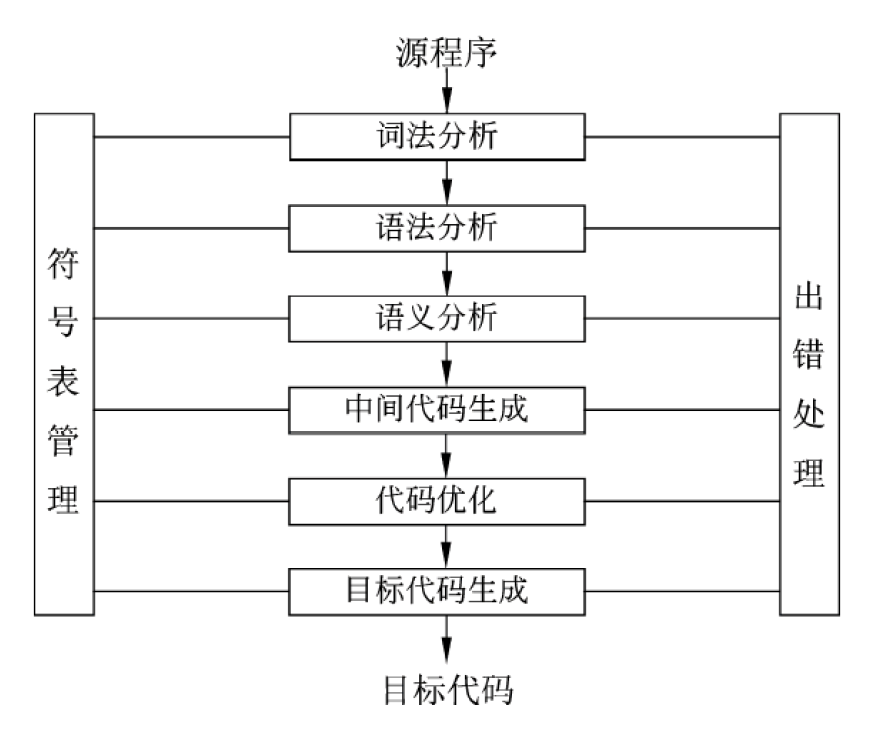
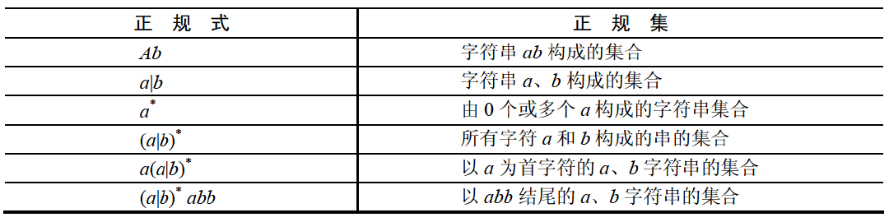
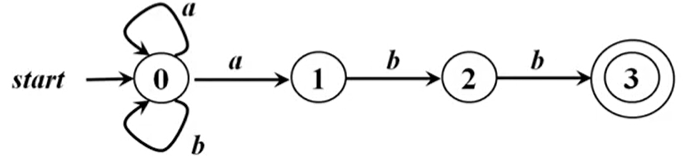
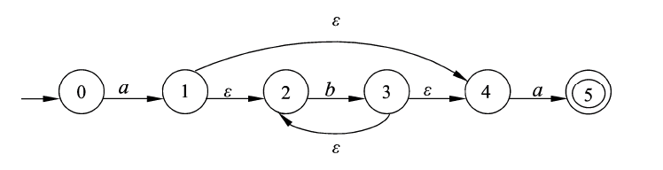

# 软件设计师 | 程序设计语言

语言之间的翻译形式有多种，基本方式为汇编、解释和编译。用某种高级语言或汇编语言编写的程序称为源程序，源程序不能直接在计算机上执行。

## 编译、解释程序

解释程序也称为解释器，它或者直接解释执行源程序，或者将源程序翻译成某种中间代码后再加以执行；编译程序（编译器）则是将源程序翻译成目标语言程序，然后在计算机上运行目标程序。

这两种语言处理程序的根本区别是：在编译方式下，机器上运行的是与源程序等价的目标程序，源程序和编译程序都不再参与目标程序的执行过程；而在解释方式下，解释程序和源程序（或其某种等价表示）要参与到程序的运行过程中，运行程序的控制权在解释程序。简单来说，在解释方式下，翻译源程序时不生成独立的目标程序，而编译器则将源程序翻译成独立保存的目标程序。

### 解释器

翻译源程序时不生成独立的目标程序。

解释程序和源程序要参与到程序的运行过程中。

### 编译器

翻译时将源程序翻译成独立保存的目标程序。

机器上运行的是与源程序等价的目标程序，源程序和编译程序都不再参与目标程序的运行过程。

## 编译、解释过程

编译方式：词法分析、语法分析、语义分析、中间代码生成、代码优化、目标代码生成。

解释方式：词法分析、语法分析、语义分析。

编译器和解释器都不可省略词法分析、语法分析、语义分析，且顺序不可交换。

编译器方式中，中间代码生成和代码优化不是必要，可省略，即编译器方式可以在词法分析、语法分析、语义分析阶段后直接生成目标代码。

## 编译过程概述

编译程序的功能是把某高级语言书写的源程序翻译成与之等价的日标程序（汇编语言或机器语言）。

关于词法、语法、语义：

- 词法：什么样的词是有效的。
  - 雪是 White：词法错误，White 不是有效的中文词。词法正确才能进行语法分析。
- 语法：有效的词进行排列组合，什么样的排列组合才是有效的。
  - 雪白的是：词法正确，语法错误。雪、白的、是，都是有效的中文词，但是词的排列组合错误。
- 语义：描述的内容是否正确。
  - 雪是红的：词法正确，语法正确，语义错误，描述的内容错误。

### 词法分析

源程序可以简单地被看成是一个多行的字符串。词法分析阶段是编译过程的第一个阶段，这个阶段的任务是对源程序从前到后（从左到右）逐个字符地扫描，从中识别出一个个“单词”符号。“单词”符号是程序设计语言的基本语法单位，如关键字（或称保留字）、标识符、常数、运算符和分隔符（如标点符号、左右括号）等。

输入源程序，输出记号流。词法分析阶段的主要作用是分析构成程序的字符及又字符按照构造规则构成的符号是否符合程序语言的规定。

### 语法分析

语法分析的任务是在词法分析的基础上，根据语言的语法规则将单词符号序列分解成各类语法单位，如“表达式”“语句”和“程序”等。语法规则就是各类语法单位的构成规则。通过语法分析确定整个输入串是否构成一个语法上正确的程序。如果源程序中没有语法错误，语法分析后就能正确地构造出其语法树；否则指出语法错误，并给出相应的诊断信息。

输入记号流，输出语法树（分析树）。语法分析阶段的主要作用是对各条语句的结构进行合法性分析，分析程序中的句子结构是否正确。语法分析阶段可以发现程序中的所有语法错误。

### 语义分析

语义分析阶段分析各语法结构的含义，检查源程序是否包含静态语义错误，并收集类型信息供后面的代码生成阶段使用。只有语法和语义都正确的源程序才能翻译成正确的目标代码。语义分析的一个主要工作是进行类型分析和检查。程序设计语言中的一个数据类型一般包含两个方面的内容：类型的载体及其上的运算。例如，整除取余运算符只能对整型数据进行运算，若其运算对象中有浮点数就认为是类型不匹配的错误。

输入语法树（分析树）。语义分析阶段的主要作用是进行类型分析和检查。语义分析阶段只能发现静态语义错误，不能发现动态语义错误。动态语义错误运行时才能发现。

有语义错误是可以编译成功的，例如 `a/0` 这是符合语法的，也符合静态语义，编译器检验不出来这个是错的，只有运行才会报错，也就是动态语义，动态语义错误常见的有死循环。

### 中间代码生成

中间代码生成阶段的工作是根据语义分析的输出生成中间代码。“中间代码”是一种简单且含义明确的记号系统，可以有若干种形式，它们的共同特征是与具体的机器无关。最常用的一种中间代码是与汇编语言的指令非常相似的三地址码，其实现方式常采用四元式。

常见的中间代码有：后缀式、三地址码、三元式、四元式和树（图）等形式。中间代码与具体的机器无关（不依赖具体的机器）。因为与具体的机器无关，使用中间代码有利于进行与机器无关的优化处理和提高编译程序的可移植性。可以将不同的高级程序语言翻译成同一种中间代码。中间代码可以跨平台。

### 目标代码生成

目标代码生成阶段的工作与具体的机器密切相关。寄存器的分配工作处于目标代码生成阶段。

## 符号表管理

符号表的作用是记录源程序中各个符号的必要信息，以辅助语义的正确性检查和代码生成，在编译过程中需要对符号表进行快速有效地查找、插入、修改和删除等操作。符号表的建立可以始于词法分析阶段，也可以放到语法分析和语义分析阶段，但符号表的使用有时会延续到目标代码的运行阶段。

## 词法分析工具

### 正规式和正规集

`|` 表示或， `*` 表示可以出现 0 次或者 n 次， `(……)` 表示一个整体。

### 有限自动机

有限自动机（有穷自动机）是一种识别装置的抽象概念，它能准确地识别正规集（通过正规式推到正规集）。有限自动机分为两类：确定的有限自动机和不确定的有限自动机。

- 确定的有限自动机（DFA）：对每一个状态来说识别字符后转移的状态是唯一的。
- 不确定的有限自动机（NFA）：对每一个状态来说识别字符后转移的状态是不唯一的。

状态转换图表示法如下：

其中 start 指向的表示初始状态（初始态或初态），箭头上面的表示输入，有向边（箭头）就是变化，圆圈内表示状态，圆圈内嵌套一个圆圈（例如状态 3）表示结束状态（结束态或终态），在这种状态下就不接受输入了。

对于确定的有限自动机，一个输入决定的状态转移只可能有一个状态，这一点从根本上与不确定的有限自动机相区别。从上面的状态转换表我们能看到，对应的一个状态，和一个输入，可能有多种状态转移，比如状态 0 遇到 a 的时候既可能转移到状态 1，也有可能保持状态 0 不变。这种就是不确定有限自动机。

上图中的 ${\varepsilon}$ 符号是表示空，意思是不用识别直转移状态。

串能否识别成功的依据是路跑的通并且跑完后的终点是终态。

## 上下文无关文法

下面这个是一个上下文无关文法的一个例子，称为 $G1$：

$$
\begin{align}
S & {\ }{\rightarrow}{\ }aSb  \newline
S & {\ }{\rightarrow}{\ }T    \newline
T & {\ }{\rightarrow}{\ }*
\end{align}
$$

上下文无关文法（CFG, Context-free Grammar）是由一系列产生式组成，每个产生式是由被一个箭头分成左右两个部分。左边的符号被称为非终结符，一般用大写字母表示。右边是一个字符串，包括非终结符和被称为终结符的其他符号组成，终结符可以是小写字母、数字和特殊符号组成。第一个产生式左边的非终结符被成为起始符。例如 $G1$ 有三个产生式，$S$ 和 $T$ 是非终结符，并且 $S$ 是起始符，$G1$ 的终止符为 $a、b$ 和 $∗$。

上下文无关文法的形式化定义如下：

- 上下文无关文法是一个四元组 $(V,Σ,R,S)$，其中
  - $V$ 是非终结符的有限集。
  - $Σ$ 是终结符的有限集。
  - $R$ 是产生式的有限集，每个产生式是由非终结符和非终结符、终结符的字符串组成。
  - $S$ 是起始符，$S ∈ V$。

使用文法产生一个具体的语句的过程被称为推导，推导的过程就是不断挑选文法中的产生式将起始符的右边替换成只有终结符的字符串为止。例如，使用 $G1$ 产生字符串 $aaa∗bbb$ 的推导如下：

$$
\begin{align}
S & {\ }{\rightarrow}{\ }aSb      \newline
  & {\ }{\rightarrow}{\ }aaSbb    \newline
  & {\ }{\rightarrow}{\ }aaaSbbb  \newline
  & {\ }{\rightarrow}{\ }aaaTbbb  \newline
  & {\ }{\rightarrow}{\ }aaa*bbb
\end{align}
$$

这里安利一个非常好用的工具，可戳 [cfg-grammar-tool](https://bakkot.github.io/cfgrammar-tool/)，能够根据 CFG 文法推到句子和判断句子是否可以被推导。

上下文无关文法之所以是“上下文无关”的，那是因为该文法中每个产生式的左边只有唯一符号（即非终结符）。每个产生式左边的非终结符可以自由地被替换成右边的字符串，而不管这个非终结符出现的位置（所处的上下文）。例如：

$$
\begin{align}
S & {\ }{\rightarrow}{\ }aSb  \newline
S & {\ }{\rightarrow}{\ }ab
\end{align}
$$

这个就是一个上下文无关文法。而下面的例子则不是：

$$
\begin{align}
aSb & {\ }{\rightarrow}{\ }aaSbb  \newline
S   & {\ }{\rightarrow}{\ }ab
\end{align}
$$

这是个上下文相关文法，它的第一个产生式左边有不止一个符号，所以你在匹配这个产生式中的 $S$ 的时候必需确保 $S$ 所处的“上下文”，即其左边的 $a$ 和右边的 $b$，所以是上下文相关文法。

在 CFG 中可能存在多个产生式的左边非终结符相同，可以将这样的产生式合并简化。例如：

$$
\begin{align}
S & {\ }{\rightarrow}{\ }aSb  \newline
S & {\ }{\rightarrow}{\ }ab
\end{align}
$$

可以简化为：

$$
\begin{align}
S {\ }{\rightarrow}{\ } &  aSb  \newline
  {\ }|{\ } &  ab
\end{align}
$$

或者：

$$
S {\ }{\rightarrow}{\ }aSb{\ }|{\ }ab
$$

## 中缀和后缀表达式

什么是中缀表达式和后缀表达式（逆波兰表达式）：

- 中缀表达式是最常用的算术表达式形式，运算符在运算数中间，但运算时需要考虑运算符优先级。
  - 例如：`1 + 2 * 3`
- ​后缀表达式是计算机容易运算的表达式，运算符在运算数后面，从左到右进行运算无需考虑优先级，运算呈线性结构。
  - 例如：`1 2 3 * +`

将中缀表达式 `1 - 2 * (3 + 4) / 5` 转为后缀表达式：

- 首先判断中缀表达式中运算符的优先级。
- 括号优先级最高，所以将括号中的 `a?b` 格式转为 `ab?` 得到 `34+`。
  - `1 - 2 * 34+ / 5`
- 优先级次高的是除号，将 `34+` 看作一个整体与 `/ 5` 进行转换得到 `34+5/`。
  - `1 - 2 * 34+5/`
- 按照上面的方式依次转换。
  - `1 - 234+5/*`
- 最后得到后缀表达式。
  - `1234+5/*-`

将后缀表达式 `1234+5/*-` 转为中缀表达式：

- 首先从左往右数，直到遇到运算符。
- 将第一个遇到的运算符以及右边的两位数进行转换得到 `3 + 4`。
  - `12 3 + 4 5/*-`
- 然后接着向右数，直到遇到的二个运算符，将 `3 + 4` 看作一个整体与 `5/` 进行转换得到 `(3 + 4) / 5`。
  - `12 (3 + 4) / 5 *-`
- 按照上面的方式依次转换。
  - `1 2 * (3 + 4) / 5 -`
- 最后得到中缀表达式。
  - `1 - 2 * (3 + 4) / 5`

## 语法树遍历

语法树也就是一个二叉树，二叉树的中根遍历结果就是中缀表达式的结果，后根遍历就是后缀表达式的结果。

- 遍历方法
  - 中根遍历（第二次访问的结点）：左子树 ---> 根结点 ---> 右子树
  - 后根遍历（第三次访问的结点）：左子树 ---> 右子树 ---> 根结点

## 程序设计语言杂题选讲

<https://www.bilibili.com/video/BV1tL411c7gi?p=131>
