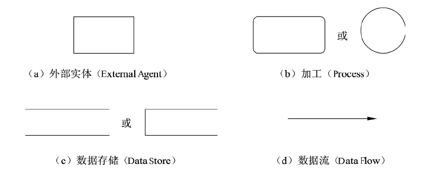

# 软件设计师 | 数据流图

数据流图也称数据流程图（DFD），它从数据传递和加工角度，以图形方式来表达系统的逻辑功能、数据在系统内部的逻辑流向和逻辑变换过程，是结构化系统分析方法的主要表达工具及用于表示软件模型的一种图示方法。

## 数据流图基本图形元素

数据流图中的基本图形元素包括数据流（Data Flow）、加工（Process，一般用 P 表示）、数据存储（Data Store，一般用 D 表示）和外部实体（External Agent，一般用 E 表示）。

### 数据流

数据流由一组固定成分的数据组成，表示数据的流向，**数据流的起点或终点必须有一个是加工**。在 DFD 中，数据流的流向可以有以下几种：

- 从一个加工流向另一个加工。
- 从加工流向数据存储（写）。
- 从数据存储流向加工（读）。
- 从外部实体流向加工（输入）。
- 从加工流向外部实体（输出）。

### 加工

- 加工：将输入数据处理后得到输出数据，一个加工至少有一个输入数据流和一个输出数据流。
  - 加工只有输入没有输出称为：黑洞。
  - 加工只有输出没有输入称为：白洞。
  - 加工的输入数据不足以产生输出数据：灰洞。

### 数据存储

- 数据存储：存储数据和提供数据，即存储加工的输出数据和提供加工的输入数据。
  - 例如：客户表、订单表、学生表、巴士列表文件、维修记录文件、课表文件……

### 外部实体

- 外部实体：当前系统之外的人、物、外部系统。
  - 人：学生、老师、员工、主管、医生、客户、供应商……
  - 物：传感器、控制器、单车、车辆、采购部门……
  - 外部系统：支付系统、车辆交易系统、库存管理系统、道闸控制系统……

## 三大设计原则

这三大设计原则是解题的法宝。

### 父图子图平衡原则

模型分解时必须保持父图的输入输出数据流和子图输入输出数据流相同。

### 数据守恒原则

对不论什么一个加工来说，其全部输出数据流中的数据必须能从该加工的输入数据流中直接获得。

- 外部实体与外部实体之间不存在数据流。
- 外部实体与数据存储之间不存在数据流。
- 数据存储与数据存储之间不存在数据流。

### 守恒加工原则

对同一个加工来说，输入与输出的名字必须不同样。即使它们的组成成分同样。

- 对于数据流图的任意一个加工，必须既有输入数据流，又有输出数据流。
- 数据流与加工有关，且必须经过加工。
  - 输入与输出一样，加工没有作用，违反了数据守恒原则。
  - 仅仅有输入，没有输出，违反了数据守恒原则。
  - 仅仅有输出，没有输入，违反了数据守恒原则。
