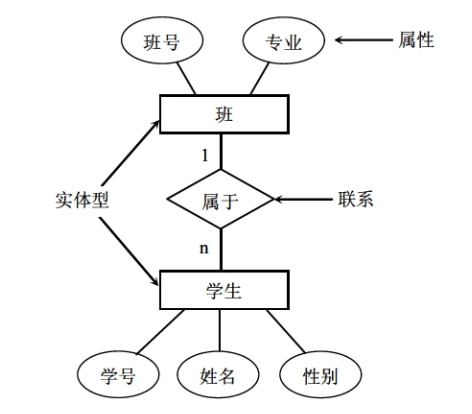
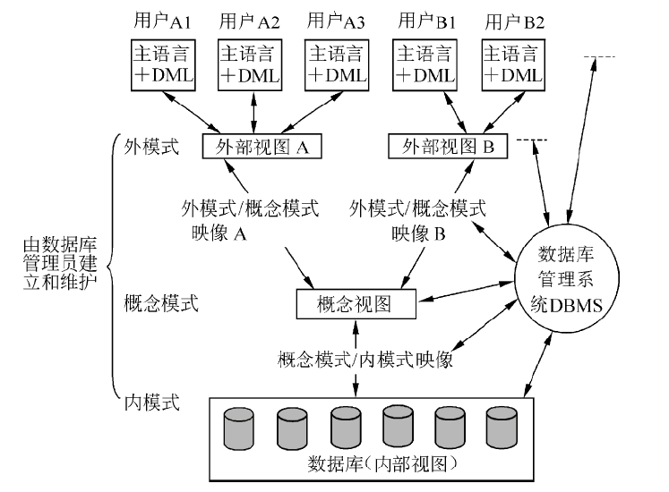
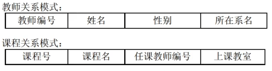
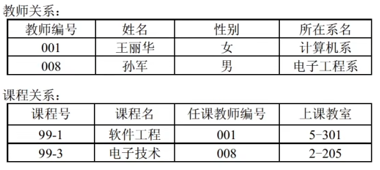
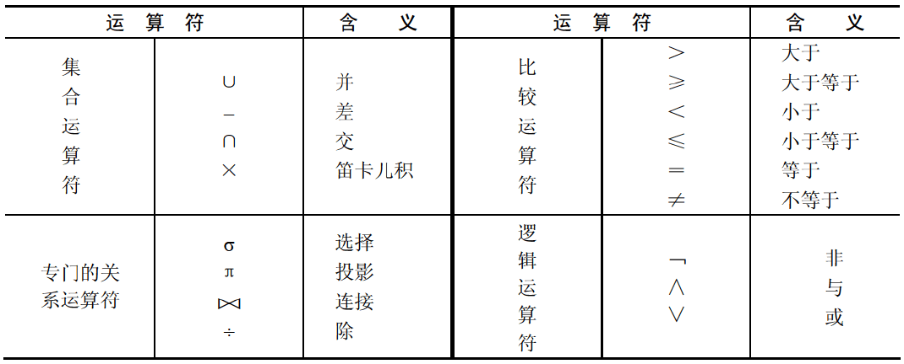

# 软件设计师 | 数据库

数据与信息之间的关系可以表示为：信息 = 数据 + 数据处理。

## 概念数据模型

### 概念数据模型常用术语

- 实体：客观存在并可以相互区别的事物称为实体。
- 属性：描述实体的特性称为属性，一个实体可以由若干个属性来刻画。属性的具体取值称为属性值，用以表示一个具体实体。
- 码：唯一标识实体的属性集称为码。
- 域：属性的取值范围称为该属性的域。
- 实体型：具有相同属性的实体必然具有共同的特征和性质，用实体名及其属性名集合来抽象和刻画同类实体，称为实体型。
- 实体集：同型实体的集合称为实体集。
- 联系：实体（型）之间的对应关系称为联系。

### 实体之间的联系

- 一对一联系：指实体集 A 中的一个实体最多只与实体集 B 中的一个实体相联系。如班和班长之间是一对一联系。
- 一对多联系：表示实体集 A 中的一个实体可与实体集 B 中的多个实体相联系。如班和学生之间是一对多联系。
- 多对多联系：表示实体集 A 中的多个实体可与实体集 B 中的多个实体相联系。如课程和学生之间是多对多联系。

### E-R 图

E-R 图是抽象和描述现实世界的有力工具，它提供了表示实体型、属性和联系的方法。

- 实体型用矩形表示，矩形框内写明实体名。
- 属性用椭圆形表示，并用无向边将其相应的实体连接起来。
- 联系用菱形表示，菱形框内写明联系名，并用无向边将其分别与有关实体连接起来，同时在无向边旁标上联系的类型（1:1、1:n 或 m:n）。如果一个联系具有属性，这些属性也要用无向边与该联系连接起来。

### 三级模式和两级映像

- 三级模式
  - 外模式（用户模式或子模式）：视图
  - 概念模式（模式）：基本表
  - 内模式（存储模式）：存储文件
- 两级映像
  - 模式/内模式映像：概念模式和内模式之间的相互转换。保证数据的物理独立性。
  - 外模式/模式映像：外模式和概念模式之间的相互转换。保证数据的逻辑独立性。

## 关系数据模型

### 关系模型基本概念

关系模型是一种用二维表格结构来表示实体以及实体之间联系的数据模型。每个二维表由行、列组成，又可称为关系，**关系模式是对关系的描述**。因此可以说，关系模型是由关系模式组成的集合。

两个关系模式：

- 教师（教师编号，姓名，性别，所在系名）
- 课程（课程号，课程名，任课教师编号，上课教室）

两个关系模式的关系：

两个关系均包含两个元组。教师关系的教师编号为主码，课程关系的课程号为主码。

### 关系模型基本术语

- 关系（表）：一个关系就是一张二维表，每个关系有一个关系名（表名）。
- 元组（行）：表中的一行即为一个元组，对应存储文件中的一个记录值。
- 属性（列）：表中的列称为属性，每一列有一个属性名。属性值相当于记录中的数据项或字段值。
- 域（取值范围）：属性的取值范围，即不同元组对同一个属性的值所限定的范围。
- 关系模式（表结构、表头）：对关系的描述称为关系模式，由关系名和其属性集合构成。
- 候选码：属性或属性组合，其值能够唯一地标识一个元组。
- 主码：在一个关系中可能有多个候选码，从中选择一个作为主码。
- 主属性与非主属性：包含在任何候选码中的属性称为主属性。不包含在任何候选码中的属性为非主属性。
- 外码：如果一个关系中的一个属性是另外一个关系中的主码，则该属性为外码。
- 全码：若关系中只有一个候选码，且这个候选码中包含全部属性，则该候选码为全码。
- 超码：一个包含主码的属性集称为超码。

### 关系完整性约束

- 实体完整性：关系中主码的值不能为空或部分为空，也就是说，主码中的属性即主属性不能取空值。
- 参照完整性：又称引用完整性，如果关系 $R_2$ 的外码 $X$ 与关系 $R_1$ 的主码相对应（$R_1$ 和 $R_2$ 可以是同一个关系），则外码 $X$ 的每个值必须在关系 $R_1$ 中主码的值中找到，或者为空值。
- 用户定义完整性：指用户对某一具体数据指定的约束条件进行检验。

## 关系代数

关系代数运算符：

### 集合运算符

- 关系的并：关系 $R$ 和关系 $S$ 的所有元组合并，再删去重复的元组，组成一个新的关系，称为 $R$ 和 $S$ 的并，记为 $R{\ }{\bigcup}{\ }S$。
- 关系的交：关系 $R$ 和关系 $S$ 的交是由即属于 $R$ 又属于 $S$ 的元组组成的集合，即在两个关系 $R$ 和 $S$ 中取相同的元组，组成一个新的关系，记为 $R{\ }{\bigcap}{\ }S$。
- 关系的差：关系 $R$ 和关系 $S$ 的差是由属于 $R$ 而不属于 $S$ 的所有元组组成的集合，即关系 $R$ 中删去与关系 $S$ 中相同的元组，组成一个新的关系，记为 $R-S$。
- 笛卡尔积：两个关系 $R$ 和 $S$ 的笛卡尔积记为 $R{\ }{\times}{\ }S$。

### 关系运算符

#### 投影运算

从关系的垂直方向进行运算，在关系 $R$ 中选取若干属性列 $A$，并用这些属性组成一个新的关系，记作 ${\pi}_A(R)$。例如：

$$\pi_{Sname,Sdept}(Student)$$

#### 选择运算

从关系的水平方向进行运算，从关系 $R$ 中选出满足给定条件 $F$ 的元组而组成的一个新的关系，记作 ${\sigma}_F(R)$。例如：

$$\sigma_{Sdept='computer'}(Student)$$

#### 连接运算

从两个关系 $R$ 和 $S$ 的笛卡尔积中选取满足条件的元组。因此，可以认为笛卡尔积是无条件的连接，其他连接认为是有条件连接。连接运算主要有一下几种：

1. ${\theta}$ 连接：${\theta}$ 是比较运算符。

    $$R \mathop ⋈ \limits_{X{\theta}Y} S = \sigma_{X{\theta}Y}(R{\times}S)$$

2. 等值连接：是 ${\theta}$ 连接的特例，与 ${\theta}$ 连接一致，是当 ${\theta}$ 为 $=$ 时的情况。

    $$R \mathop ⋈ \limits_{X=Y} S = \sigma_{X=Y}(R{\times}S)$$

3. 自然连接：自然连接是除去重复属性的等值连接，它要求两个关系中进行比较的分量必须是相同的属性或属性组，并且在连接结果中去掉重复的属性列，使公共属性列只保留一个。

4. 外连接：如果希望不满足连接条件的元组也出现在连接结果中，则可以通过外连接操作实现。外连接有三种形式：左外连接、右外连接、全外连接。含义是将指定一边（如左连接就是左边的关系）中不满足的元组也保留到连接后的结果中，并在结果中将另一关系各属性置为空（NULL）值。

## SQL 语句分类

SOL 语言按照用途可以分为如下 4 类：

- DDL（Data Definition Language，数据定义语言）：在数据库系统中，每一个数据库、数据库中的表、视图和索引等都是数据库对象。要建立和删除一个数据库对象，都可以通过 SOL 语言来完成。DDL 包括 CREATE、ALTER 和 DROP 等。
- DML（Data Manipulation Language，数据操纵语言）：DML 是指用来添加、修改和删除数据库中数据的语句，包括 INSERT（插入）、DELETE（删除）和 UPDATE（更新）等。
- DQL（Data Query Language，数据查询语言）：查询是数据库的基本功能，查询操作通过 SOL 数据查询语言来实现，例如，用 SELECT 查询表中的内容。
- DCL（Data Control Language，数据控制语言）：DCL 包括数据库对象的权限管理和事务管理等。

## 数据库规范化

### 关系模式

关系的描述称为关系模式，它可以形式化地表示为：

$$R（U，D，dom，F）$$

其中 $R$ 为关系名，$U$ 为组成该关系的属性名集合，$D$ 为属性组 $U$ 中属性所来自的域，$dom$ 为属性到域的映射，$F$ 为属性组 $U$ 上的一组数据依赖。

### 函数依赖

设 $R(U)$ 是一个属性集 $U$ 上的关系模式，$X$ 和 $Y$ 是 $U$ 的子集。

若对于 $R(U)$ 的任意两个可能的关系 `r1`、`r2`，若 `r1[x]` 等于 `r2[x]`，则 `r1[y]` 等于 `r2[y]`，或者若 `r1[y]` 不等于 `r2[y]`，则 `r1[x]` 不等于 `r2[x]`，称 $X$ 决定 $Y$，或者 $Y$ 依赖 $X$。

比如在设计学生表时，一个学生的学号能决定学生的姓名，也可称姓名属性依赖于学号，对于现实来说，就是如果知道一个学生的学号，就一定能知道学生的姓名，这种情况就是姓名依赖于学号，这就是函数依赖，函数依赖又分为非平凡依赖，平凡依赖；从性质上还可以分为完全函数依赖、部分函数依赖和传递函数依赖。

1. 数据依赖

    在计算机科学中，数据依赖是指一种状态，当程序结构导致数据引用之前处理过的数据时的状态。其中最重要的是函数依赖和多值依赖。

2. 函数依赖

    设 $X,Y$ 是关系 $R$ 的两个属性集合，当任何时刻 $R$ 中的任意两个元组中的 $X$ 属性值相同时，则它们的 $Y$ 属性值也相同，则称 $X$ 函数决定 $Y$，或 $Y$ 函数依赖于 $X$， 记作 $(X{\rightarrow}Y)$。

3. 平凡函数依赖

    当关系中属性集合 $Y$ 是属性集合 $X$ 的子集时 $(Y{\subseteq}X)$，存在函数依赖 $X{\rightarrow}Y$ ，即一组属性函数决定它的所有子集，这种函数依赖称为平凡函数依赖。

4. 非平凡函数依赖

    当关系中属性集合 $Y$ 不是属性集合 $X$ 的子集时 $(Y{\nsubseteq}X)$，存在函数依赖 $X{\rightarrow}Y$，则称这种函数依赖为非平凡函数依赖。

5. 完全函数依赖

    设 $X,Y$ 是关系 $R$ 的两个属性集合，$X'$ 是 $X$ 的真子集，存在 $X{\rightarrow}Y$，但对每一个 $X'$ 都有 $X'$ 不能函数决定 $Y$，则称 $Y$ 完全函数依赖于 $X$。

6. 部分函数依赖

    设 $X,Y$ 是关系 $R$ 的两个属性集合，存在 $X{\rightarrow}Y$，若 $X'$ 是 $X$ 的真子集，存在 $X'{\rightarrow}Y$，则称 $Y$ 部分函数依赖于 $X$。

7. 传递函数依赖

    设 $X,Y,Z$ 是关系 $R$ 中互不相同的属性集合，存在 $X{\rightarrow}Y，(Y{\nsubseteq}X)，Y{\rightarrow}Z$，则称 $Z$ 传递函数依赖于 $X$。

设关系模式 $R(U,F)$，其中 $U$ 为属性集，$F$ 是 $U$ 上的一组函数依赖，那么有以下推理规则。

- 合并规则：若 $X{\rightarrow}Y，X{\rightarrow}Z$，则 $X{\rightarrow}YZ$ 为 $F$ 所蕴涵。
- 伪传递率：若 $X{\rightarrow}Y，WY{\rightarrow}Z$，则 $WX{\rightarrow}Z$ 为 $F$ 所蕴涵。
- 分解规则：若 $X{\rightarrow}Y，Z{\subseteq}Y$，则 $X{\rightarrow}Z$ 为 $F$ 所蕴涵。

### 规范化范式

规范化是指用形式更为简洁、结构更加规范的关系模式取代原有关系模式的过程。数据库的设计范式是数据库设计所需要满足的规范，满足这些规范的数据库是简洁的、结构明晰的，同时，不会发生插入、删除、和更新操作异常。

在对数据库进行一些操作的时候我们可能会遇到以下的一些问题：

- 数据冗余：想修改一个属性，就要更新多行数据。
- 插入异常：想要插入数据，结构因为表设计的问题，导致不能成功插入。
- 删除异常：只想删除其中的某些数据 ，结果把不该删的也删了。
- 更新异常：想更新一条数据，结果工作量大，还容易出错。

目前主要有 6 种范式，按规范化程度从低到高可分为：1NF、2NF、3NF、BCNF、4NF、5NF。各种范式之间存在的关系：1NF ⊃ 2NF ⊃ 3NF ⊃ BCNF ⊃ 4NF ⊃ 5NF。

1. 第一范式（1NF）

    若关系模式 $R$ 的每一个分量是不可再分的数据项（每个属性都是不可再分的），则关系模式 $R$ 属于第一范式。1NF 不能排除数据冗余和更新异常（包括修改，删除，插入异常），因为其中可能存在部分函数依赖。

2. 第二范式（2NF）

    不存在非主属性对主属性的部分函数依赖（每个主属性都完全函数依赖于候选码）。2NF 也可能存在数据冗余和更新异常等问题，因为其中可能存在传递函数依赖。

3. 第三范式（3NF）

    不存在非主属性对主属性的传递函数依赖（每个非主属性都非传递依赖于候选码）。3NF 中数据冗余和更新异常没有完全解决，因为可能存在主属性对候选码的部分依赖和传递依赖。

4. BC 范式（BCNF）

    1. 所有非主属性对每一个候选码都是完全函数依赖。
    2. 所有的主属性对每一个不包含它的候选码，也是完全函数依赖。
    3. 没有任何属性完全函数依赖于非候选码码的任何一组属性。

    一个满足 BCNF 范式的关系模式已消除了插入和删除异常。

### 关系模式分解

对存在数据元余、插入异常、删除异常问题的关系模式，应采取将一个关系模式分解为多个关系模式的方法进行处理，相应地，原来存储在一个二维表内的数据就要分散到多个二维表中，要使这个分解有意义，起码的要求是后者不能去失前者的信息。

在分解处理中会涉及一些新问题，为使分解后的模式保持原模式所满足的特性，其基本要求是模式分解具有无损连接性和保持函数依赖性。

- 无损连接：对关系模式分解时，原关系模式下任一合法的关系实例在分解之后应能通过自然连接运算恢复起来。反之，则称为有损分解。
- 保持函数依赖：对关系模式分解时，原关系的闭包与分解后关系闭包的并集相等。

## 数据库杂题选讲

<https://www.bilibili.com/video/BV1LZ4y1k7ma?p=145>
