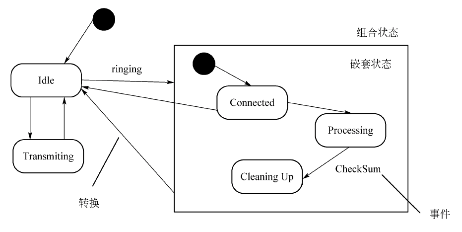
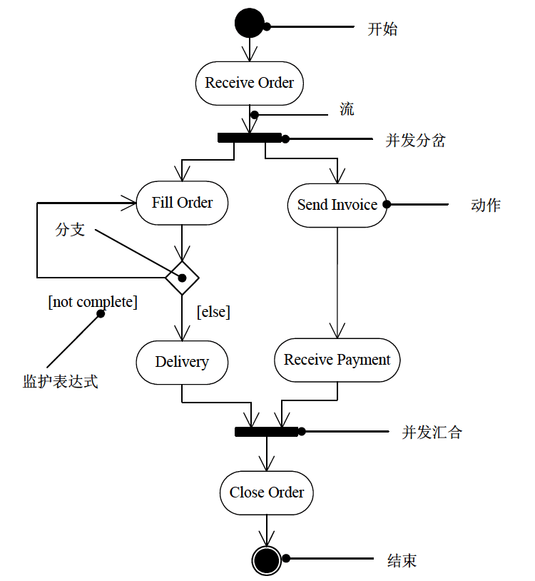

# 软件设计师 | UML

UML 即统一建模语言，是面向对象开发系统的产品进行说明、可视化、和编制文档的一种标准语言；UML 作为一种模型语言，它使开发人员专注于建立产品的模型和结构，而不是选用什么程序语言和算法实现。

## UML 概述

UML 描述了一个系统的静态结构和动态行为。

UML 由 3 个要素构成：UML 的基本构造块、支配这些构造块如何放置在一起的规则和运用与整个语言的一些公共机制。

UML 的词汇表包含 3 种构造块：事物、关系和图。事物是对模型中最具有代表性的成分的抽象；关系把事物结合在一起；图聚集了相关的事物。

## UML 事物

UML 中有 4 种事物：结构事物、行为事物、分组事物和注释事物。

### 结构事物

结构事物是 UML 模型中的名词。它们通常是模型的静态部分，描述概念或物理元素。

- 类：具有相同的属性、相同的方法、和相同关系的一组对象的集合。
- 接口：指类或组件所提供的、可以完成特定功能的一组操作的集合（接口描述类或组件对外的、可见的动作）。
- 协作：定义了交互的操作，是一些角色和其他元素一起工作，提供一些合作的动作。
- 用例：定义系统执行的一组操作，对特定的用户产生可以观察的结果。
- 活动类：对拥有线程并可发起控制活动的对象。
- 构件：构件是系统中物理的、可替代的部件，它遵循且提供一组接口的实现。
- 结点：是一个物理元素，在运行时存在，代表一个可计算的资源（如数据库服务器）。

### 行为事物

行为事物是 UML 模型的动态部分。它们是模型中的动词，描述了跨越时间和空间的行为。行为事物包括交互（Interaction）、状态机（State Machine）和活动（Activity）。在 UML 中交互的消息通常画成带箭头的直线，状态机是对象的一个或多个状态的集合。

- 交互：在特定语境中共同完成一定特定任务的一组对象之间交换的消息组成。
- 状态机：描述了一个对象或一个交互在生命期内响应事件所经历的状态序列。
- 活动：是描述计算机过程执行的步骤序列，注重步骤之间的流而不关心哪个对象执行哪个步骤。

### 分组事物

分组事物是 UML 模型的组织部分，是一些由模型分解成的“盒子”。在所有的分组事物中，最主要的分组事物是包（Package）。

- 包：包是把元素组织成组的机制，这种机制具有多种用途。结构事物、行为事物甚至其他分组事物都可以放进包内。

### 注释事物

注释事物是 UML 模型的解释部分。这些注释事物用来描述、说明和标注模型的任何元素。注解（Note）是一种主要的注释事物。

- 注解：是一个依附于一个元素或一组元素之上，对它进行约束或解释的简单符号。

## UML 关系

UML 中有 4 中关系：依赖、关联、泛化和实现。

类关系涉及依赖、关联、聚合、组合和泛化这五种关系，耦合度依次递增。关于耦合度，可以简单地理解为当一个类发生变更时，对其他类造成的影响程度，影响越小则耦合度越弱，影响越大耦合度越强。

### 依赖

依赖是两个事物间的语义关系，其中一个事物（独立事物）发生变化会影响另一个事物（依赖事物）的语义。对于两个对象 X、Y，如果对象 X 发生变化，可能会引起对另一对象 Y 的变化，则称 Y 依赖于 X。

依赖关系用一条带箭头的虚线表示，如下图所示：

学生在学习生活中经常使用电脑，于是对电脑产生了依赖。依赖关系是五种关系中耦合最小的一种关系。类 A 要完成某个功能引用了类 B，则类 A 依赖类 B。依赖在代码中主要体现为类 A 的某个成员函数的返回值、形参、局部变量或静态方法的调用，则表示类 A 引用了类 B。

### 关联

关联是一种结构关系，它描述了一组链，链是对象之间的连接。

关联关系使用实线加箭头表示，如下图所示：

类之间的关系比依赖要强。学生与老师是关联的，学生可以不用电脑，但是学生不能没有老师。

关联与依赖的对比：

- 相似之处：
  - 关联暗示了依赖，二者都用来表示无法用聚合和组合表示的关系。
- 区别：
  - 发生依赖关系的两个类都不会增加属性。其中的一个类作为另一个类的方法的参数或者返回值，或者是某个方法的变量而已。
  - 发生关联关系的两个类，类 A 成为类 B 的属性，而属性是一种更为紧密的耦合，更为长久的持有关系。
  - 从关系的生命周期来看，依赖关系是仅当类的方法被调用时而产生，伴随着方法的结束而结束。关联关系当类实例化的时候产生，当类对象销毁的时候关系结束。相比依赖，关联关系的生存期更长。

关联关系有单向关联、双向关联、自身关联、多维关联等等。其中后三个可以不加箭头。

单向关联：

双向关联：

自身关联：

多维关联：

聚集是一种特殊类型的关联，它描述了整体和部分间的结构关系。聚集又分为聚合和组合。

#### 聚合

聚合关系使用实线加空心菱形表示。聚合用来表示集体与个体之间的关联关系。

例如班级与学生之间存在聚合关系，类图表示如下：

#### 组合

组合（又叫复合）关系使用实线加实心菱形表示，用来表示个体与组成部分之间的关联关系。

例如学生与心脏之间存在复合关系，类图表示如下：

聚合与组合的对比：

- 聚合关系没有组合紧密。
  - 学生不会因为班级的解散而无法存在，聚合关系的类具有不同的生命周期。
  - 而学生如果没有心脏将无法存活，组合关系的类具有相同的生命周期。
  - 聚合类的构造函数中包含另一个类的实例作为参数，因为构造函数中传递另一个类的实例，因此学生可以脱离班级体独立存在。
  - 组合类的构造函数包含另一个类的实例化。因为在构造函数中进行实例化，因此两者紧密耦合在一起，同生同灭，学生不能脱离心脏而存在。
- 信息的封装性不同。
  - 在聚合关系中，客户端可以同时了解 Classes 类和 Student 类，因为他们是独立的。
  - 在组合关系中，客户端只认识 Student 类，根本不知道 Heart 类的存在，因为心脏类被严密地封装在学生类中。

理解聚合与组合的区别，主要在于聚合的成员可独立，组合的成员必须依赖于整体才有意义。

### 泛化

泛化是一种特殊/一般关系，特殊元素（子元素）的对象可替代一般元素（父元素）的对象。用这种方法，子元素共享了父元素的结构和行为。在图形上，把一个泛化关系画成一条带有空心箭头的实线，它指向父元素。

泛化是学术名称，通俗来讲，泛化指的是类与类之间的继承关系和类与接口之间的实现关系。

继承关系使用直线加空心三角形表示。类图结构如下：

### 实现

实现是类元之间的语义关系，其中一个类元指定了由另一个类元保证执行的契约。在两种情况下会使用实现关系：一种是在接口和实现它们的类或构件之间；另一种是在用例和实现它们的协作之间。在图形上，把一个实现关系画成一条带有空心箭头的虚线。

类接口的实现关系使用虚线加空心三角形表示。类图结构如下：

## UML 中的图

静态建模：类图、对象图、用例图。

动态建模：序列图（顺序图，时序图），通信图（协作图），状态图，活动图。

物理建模：构件图（组件图）、部署图。

交互图包含：序列图（顺序图，时序图）、通信图（协作图）。

### 类图

类图展现了一组对象、接口、协作和它们之间的关系。

类图组成元素：类、接口、协作、依赖、泛化和关联关系。

当对系统的静态设计视图建模时，通常以下述 3 种方式之一使用类图：

- 对系统的词汇建模
- 对简单的协作建模
- 对逻辑数据库模式建模

### 对象图

对象图展现了某一时刻一组对象以及它们之间的关系，描述了类图中所建立的事物的实例的静态快照。

对象图组成元素：对象和链。

### 用例图

用例图展现了一组用例（使用案例）、参与者以及它们之间的关系。

用例图组成元素：用例、参与者、用例之间的扩展关系和包含关系，参与者和用例之间的关联关系，用例与用例以及参与者与参与者之间的泛化关系。

当对系统的静态用例视图建模时，可以用下列两种方式来使用用例图：

- 对系统的语境建模
- 对系统的需求建模

### 序列图

序列图，又名顺序图、时序图。用于描述对象之间的传递消息的时间顺序（包括发送消息、接收消息、处理消息、返回消息等）。

序列图组成元素：对象、生命线、消息。其中消息又分为同步消息（调用消息）、异步消息、返回消息、自关联消息。

对象可以在交互过程中创建，它们的生命线从接收到构造型为 create 的消息时开始。对象也可以在交互过程中撤销，它们的生命线在接收到构造型为 destroy 的消息时结束（并且给出一个大 X 的标记表明生命的结束）。

序列图有两个不同于通信图的特性：

- 序列图有对象生命线。对象的生命线是一条垂直的虚线，表示一个对象在一段时间内存在。
- 序列图有控制焦点。控制焦点是一个瘦高的矩形，表示一个对象执行一个动作所经历的时间段。

### 通信图

通信图，又名协作图。用于强调收发消息的对象的结构组织。通信图强调参加交互的对象的组织。

通信图描述的是对象和对象之间的调用关系，体现的是一种组织关系。

通信图组成元素：对象、链、消息。连接对象的链表示为图的弧。

通信图和时序图有点类似。但时序图着重于时间顺序，而通信图则关注的是对象之间的组织关系，通信图中的时间顺序可以从消息序号中获得。在语义上这两个图是等价的可以互相转换而不会丢失信息。

通信图有两个不同于序列图的特性：

- 通信图有路径。为了指出一个对象如何与另一个对象链接。
- 通信图有顺序号。为了表示一个消息的时间顺序。

### 状态图

状态图展现了一个状态机，它由状态、转换、事件和活动组成。状态图通常是对反应型对象建模。

状态图主要用于描述对象具有的各种状态、状态之间的转换过程以及触发状态转换的各种事件和条件。

状态图通常包括简单状态和组合状态、转换（事件和动作）。

状态是任何可以被观察到的系统行为模式，一个状态代表系统的一种行为模式，状态主要有初态、终态和中间状态。

事件是在某个特定时刻发生的事情，它是对引起系统做动作或（和）从一个状态转换到另一个状态的外界事件的抽象。

转换包含源状态和目标状态以及触发事件、监护条件和动作。

活动（动作）可以在状态内执行，也可以在状态转换（迁移）时执行。

### 活动图

活动图是一种特殊的状态图，它展现了在系统内从一个活动到另一个**活动的流程**。活动图专注于系统的动态视图，它对于系统的功能建模特别重要，并强调对象间的控制流程。

活动图一般包括活动状态和动作状态、转换和对象。活动图可以表示分支、合并、分岔和汇合。

当对一个系统的动态方面建模时，通常有两种使用活动图的方式：

- 对工作流建模
- 对操作建模

### 构件图

构件图，又称组件图，展现了一组构件（组件）之间的组织和依赖。构件图专注于系统的静态实现视图。它与类图相关，通常把构件映射为一个或多个类、接口或协作。

### 部署图

部署图是用来对面向对象系统的物理方面建模的方法，展现了运行时处理结点以及其中构件（制品）的配置。部署图对系统的静态部署视图进行建模，它与构件图相关。通常，一个结点是一个在运行时存在并代表一项计算资源的物理元素，至少拥有一些内容，常常具有处理能力，包含一个或多个构件。

部署图将显示系统中的软件组件和硬件组件之间的关系以及处理工作的物理分布。部署图通常是在开发过程中的实现（实施）阶段准备的。

## UML 杂题选讲

<https://www.bilibili.com/video/BV1a44y1K7HH?p=77>
