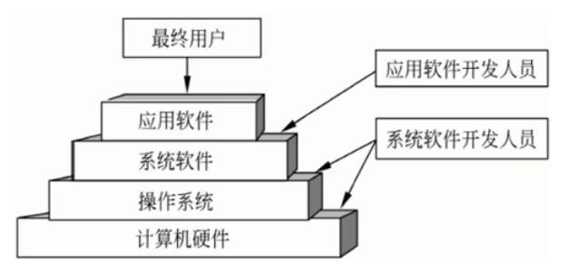

# 软件设计师 | 操作系统

计算机系统由硬件和软件两部分组成。通常把未配置软件的计算机称为裸机。直接使用裸机不仅不方便，而且将严重降低工作效率和机器的利用率。操作系统（Operating System）目的是为了填补人与机器之间的鸿沟，即建立用户与计算机之间的接口，而为裸机配置的一种系统软件。

**操作系统在计算机系统中的地位：**

## 进程管理

进程管理也称处理机管理。在多道程序批处理系统和分时系统中有多个并发执行的程序，为了描述系统中程序执行时动态变化的过程引入了进程。进程是资源分配和独立运行的基本单位。进程管理重点需要研究诸进程之间的并发特性，以及进程之间相互合作与资源竞争产生的问题。

### 程序与进程

#### 程序顺序执行的特征

前趋图是一个有向无循环图，由结点和有向边组成，结点代表各程序段的操作，而结点间的有向边表示两个程序段操作之间存在的前趋关系。

例如，下图三个程序段，其中输入是计算的前驱（计算是输入的后继），输入结束才能进行计算；计算是输出的前驱，计算结束才能进行输出。

序顺序执行时的主要特征包括顺序性、封闭性和可再现性。

#### 程序并发执行的特征

若在计算机系统中采用多道程序设计技术，则主存中的多道程序可处于并发执行状态。对于上述有 3 个程序段的作业类，虽然每个作业有前趋关系的各程序段不能在 CPU 和输入/输出各部件并行执行，但是同一个作业内没有前超关系的程序段或不同作业的程序段可以分别在 CPU 和各输入/输出部件上并行执行。

下图为三个作业的各程序段并发执行的前驱图，从图中可以看出，$I_2$ 与 $C_1$ 并行执行；$I_3$、$C_2$ 与 $P_1$ 并行执行；$C_3$ 与 $P_2$ 并行执行。

**程序并发执行时的特征如下：**

- 失去了程序的封闭性。
- 程序和机器的执行程序的活动不再一一对应。
- 并发程序间的相互制约性。

### 进程的状态

#### 三态模型

在多道程序系统中，进程在处理器上交替运行，状态也不断地发生变化，因此进程一般有 3 种基本状态：运行、就绪和阻塞。下图显示了进程基本状态及其转换，也称三态模型。

1. 运行：当一个进程在处理机上运行时，则称该进程处于运行状态。显然，对于单处理机系统，处于运行状态的进程只有一个。
2. 就绪：一个进程获得了除处理机外的一切所需资源，一旦得到处理机即可运行，则称此进程处于就绪状态。
3. 阻塞：阻塞也称等待或睡眠状态，一个进程正在等待某一事件发生（例如请求 I/O 等待 I/O 完成等）而暂时停止运行，这时即使把处理机分配给进程也无法运行，故称该进程处于阻塞状态。

#### 五态模型

事实上，对于一个实际的系统，进程的状态及其转换更复杂。例如，引入新建态和终止态构成了进程的五态模型，如下图所示：

其中，新建态对应于进程刚刚被创建时没有被提交的状态，并等待系统完成创建进程的所有必要信息。因为创建进程时分为两个阶段，第一个阶段为一个新进程创建必要的管理信息，第二个阶段让该进程进入就绪状态。由于有了新建态操作系统，往往可以根据系统的性能和主存容量的限制推退新建态进程的提交。

### 进程中的通信

在多道程序环境的系统中存在多个可以并发执行的进程，故进程间必然存在资源共享和相互合作的问题。进程通信是指各个进程交换信息的过程。

#### 同步与互斥

同步是合作进程间的直接制约问题，互斥是申请临界资源进程间的间接制约问题。

1. 进程间的同步

    在计算机系统中，多个进程可以并发执行，每个进程都以各自独立的、不可预知的速度向前推进，但是需要在某些确定点上协调相互合作进程间的工作。例如，进程 A 向缓冲区送数据，进程 B 从缓冲区取数据加工，当进程 B 要取数据加工时，必须是进程 A 完成了向缓冲区送数据的操作，否则进程 B 必须停下来等待进程 A 的操作结束。

    可见，所谓进程间的同步是指在系统中一些需要相互合作，协同工作的进程，这样的相互联系称为进程的同步。

2. 进程间的互斥

    进程的互斥是指系统中多个进程因争用临界资源而互斥执行。在多道程序系统环境中，各进程可以共享各类资源，但有些资源一次只能供一个进程使用，称为临界资源（Critical Resource，CR），如打印机、共享变量和表格等。

3. 临界区管理的原则

    临界区（Critical Section，CS）是进程中对临界资源实施操作的那段程序。

4. 对互斥临界区管理的 4 条原则如下

    - 有空即进：当无进程处于临界区时，允许进程进入临界区，并且只能在临界区运行有限的时间。
    - 无空则等：当有一个进程在临界区时，其他欲进入临界区的进程必须等待，以保证进程互斥地访问临界资源。
    - 有限等待：对于要求访问临界资源的进程，应保证进程能在有限的时间进入临界区，以免陷入“机饿”状态。
    - 让权等待：当进程不能进入自己的临界区时，应立即释放处理机，以免进程陷入忙等状态。

#### 信号量机制

信号量机制主要有整型信号量、记录型信号量和信号量集机制。

**整型信号量与 PV 操作：**

信号量是一个整型变量，根据控制对象的不同被赋予不同的值。信号量分为如下两类：

- 公用信号量：实现进程间的互斥，初值为 1 或资源的数目。
- 私用信号量：实现进程间的同步，初值为 0 或某个正整数。

信号量 S 的物理意义：`S >= 0` 表示某资源的可用数，若 `S < 0`，则其绝对值表示阻塞队列中等待该资源的进程数。

对于系统中的每个进程，其工作的正确与否不仅取决于它自身的正确性，而且与它在执行中能否与其他相关进程正确地实施同步互异有关。PV 操作是实现进程同步与互斥的常用方法。P 操作和 V 操作是低级通信原语，在执行期间不可分割。其中，P 操作表示申请一个资源，V 操作表示释放一个资源。

- P 操作的定义：`S = S - 1`，若 `S >= 0`，则执行 P 操作的进程继续执行；若 `S < 0`，则置该进程为阻塞状态（因为无可用资源），并将其插入阻塞队列。

- V 操作的定义：`S = S + 1`，若 `S > 0`，则执行 V 操作的进程继续执行；若 `S <= 0`，则从阻塞状态唤醒一个进程，并将其插入就络队列，然后执行 V 操作的进程继续。

**利用 PV 操作实现进程的互斥：**

令信号量 mutex 的初值为 1，当进入临界区时执行 P 操作，退出临界区时执行 V 操作。

**利用 PV 操作实现进程的同步：**

进程的同步是由于进程间合作引起的相互制约的问题，要实现进程的同步可用一个信号量与消息联系起来，当信号量的值为 0 时表示希望的消息未产生，当信号量的值为非 0 时表示希望的消息已经存在。假定用信号量 S 表示某条消息，进程可以通过调用 P 操作测试消息是否到达，调用 V 操作通知消息已准备好。最典型的同步问题是单缓冲区的生产者和消费者的同步问题。

### 死锁

在计算机系统中有许多互斥资源（如磁带机、打印机和绘图仪等）或软件资源（如进程表、临界区等），若两个进程同时使用打印机，或同时进入临界区必然会出现问题。所谓死锁，是指两个以上的进程互相都要求对方已经占有的资源导致无法继续运行下去的现象。

当有 n 个进程、m 个资源、且每个进程所需要的资源数为 k，并且系统采用的分配策略是轮流地为每个进程分配资源时，判断是否会发生死锁的公式如下：

$$
m \geq n *（k-1）+1
$$

为真就不会发生死锁、为假就会发生死锁。

#### 死锁的处理

死锁的处理策略主要有4种：驼鸟策略（即不理联策略）、预防策略、避免策略和检测与解除死锁。

死锁预防是设法破坏产生死锁的 4 个必要条件之一，严格防止死锁的产生。死锁避免则不那么严格地限制产生死锁的必要条件。最著名的死锁避免算法是 Dijkstra 提出的银行家算法死锁避免算法需要很大的系统开销。

银行家算法对于进程发出的每一个系统可以满足的资源请求命令加以检测，如果发现分配资源后系统进入不安全状态，则不予分配；若分配资源后系统仍处于安全状态，则实施分配。与死锁预防策略相比，它提高了资源的利用率，但检测分配资源后系统是否安全增加了系统开销。

所谓安全状态，是指系统能按某种顺序如 $<P_1, P_2, ..., P_n>$ 来为每个进程分配其所需资源，直到最大需求，使每个进程都可顺序完成。通常称 $<P_1, P_2, ..., P_n>$ 序列为安全序列。若系统不存在这样一个安全序列，则称系统处于不安全状态。

### 线程

传统的进程有两个基本属性：可拥有资源的独立单位；可独立调度和分配的基本单位。引入线程的原因是进程在创建、撤销和切换中，系统必须为之付出较大的时空开销，故在系统中设置的进程数目不宜过多，进程切换的频率不宜太高，这就限制了并发程度的提高。引入线程后，将传统进程的两个基本属性分开，线程作为调度和分配的基本单位，进程作为独立分配资源的单位。用户可以通过创建线程来完成任务，以减少程序并发执行时付出的时空开销。

例如，在文件服务进程中可设置多个服务线程，当一个线程受阻时，第二个线程可以继续运行，当第二个线程受阻时，第三个线程可以继续运行……从而显著地提高了文件系统的服务质量及系统的吞吐量。

这样，对于拥有资源的基本单位，不用频繁地切换，进一步提高了系统中各程序的并发程度。需要说明的是，线程是进程中的一个实体，是被系统独立分配和调度的基本单位。线程基本上不拥有资源，只拥有一点运行中必不可少的资源（如程序计数器、一组寄存器和栈），它可与同属一个进程的其他线程共享进程所拥有的全部资源。

## 存储管理

### 局部性原理

程序的局限性表现在时间局限性和空间局限性两个方面。

时间局限性是指如果程序中的某条指令一旦执行，则不久的将来该指令可能再次被执行；如果某个存储单元被访问，则不久以后该存储单元可能再次被访问。产生时间局限性的典型原因是在程序中存在着大量的循环操作。

空间局限性是指一旦程序访问了某个存储单元，则在不久的将来，其附近的存储单元也最有可能被访问。即程序在一段时间内所访问的地址可能集中在一定的范围内，其典型原因为程序是顺序执行的。

## 设备管理

### 磁盘调度算法

常用的磁盘调度算法如下：

1. 先来先服务（FCFS）

    按请求访问者的先后次序启动磁盘驱动器，而不考虑它们要访问的物理位置。

2. 最短寻道时间优先（SSTF）

    让离当前磁道最近的请求访问者启动磁盘驱动器，即让查找时间最短的那个作业先执行，而不考虑请求访问者到来的先后次序，这样就克服了先来先服务调度算法中磁头移动过大的问题。

3. 扫描算法（SCAN）或电梯调度算法

    总是从磁头当前位置开始，沿磁头的移动方向去选择离当前磁头最近的那个柱面的请求。如果沿磁头的方向无请求访问时，就改变磁头的移动方向。在这种调度方法下磁头的移动类似于电梯的调度，所以它也称为电梯调度算法。

4. 单向扫描调度算法（CSCAN）或循环扫描算法

    循环扫描调度算法是在扫描算法的基础上改进的。为了减少延迟，规定磁头单向移动，例如，只是自里向外移动，从当前位置开始沿磁头的移动方向去选择离当前磁头最近的那个柱面访问，如果沿磁头的方向无请求访问时，磁头立即返回到最里面的欲访问的柱面，再亦即将最小柱面号紧接着最大柱面号构成循环，进行循环扫描。

## 文件管理

### 文件目录

为了实现“按名存取”，系统必须为每个文件设置用于描述和控制文件的数据结构，它至少要包括文件名和存放文件的物理地址，这个数据结构称为文件控制块（FCB），文件控制块的有序集合称为文件目录。换句话说，文件目录是由文件控制块组成的，专门用于文件的检索。文件控制块也称为文件的说明或文件目录项（简称目录项）。

#### 文件控制块

文件控制块中包含以下三类信息：基本信息类、存取控制信息类和使用信息类。

- 基本信息类：例如文件名、文件的物理地址、文件长度和文件块数等。
- 存取控制信息类：文件的存取权限，像 UNIX 用户分成文件主、同组用户和般用户三类，这三类用户的读/写执行 RWX 权限。
- 使用信息类：文件建立日期、最后一次修改日期、最后一次访问的日期、当前使用的信息（如打开文件的进程数、在文件上的等待队列）等。

### 目录结构

文件目录结构的组织方式直接影响到文件的存取速度，关系到文件的共享性和安全性，因此组织好文件的目录是设计文件系统的重要环节。常见的目录结构有 3 种：一级目录结构、二级目录结构和多级目录结构。

#### 多级目录结构

为了解决以上问题，在多道程序设计系统中常采用多级目录结构，这种目录结构像一棵倒置的有根树，所以也称为树型目录结构。从树根向下，每一个结点是一个目录，叶结点是文件。MS-DOS 和 UNIX 等操作系统均采用多级目录结构。

在采用多级目录结构的文件系统中，用户要访问一个文件，必须指出文件所在的路径名，路径名是从根目录开始到该文件的通路上所有各级目录名拼起来得到的。在各目录名之间、目录名与文件名之间需要用分隔符隔开。例如，在 MS-DOS 中分隔符为“\”，在 UNIX 中分隔符为“/”。

绝对路径名（Absolute Path Name）是指从根目录“/”开始的完整文件名，即它是由从根目录开始的所有目录名以及文件名构成的。
