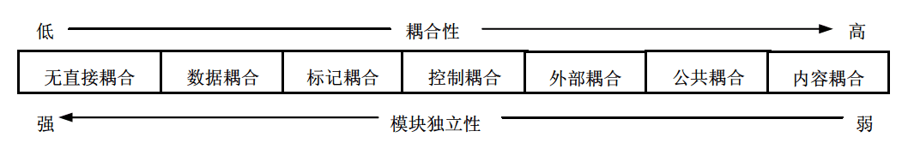
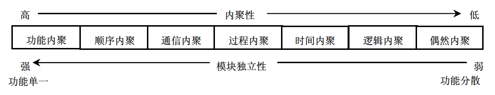

# 软件设计师 | 结构化开发

结构化方法由结构化分析、结构化设计、结构化程序设计构成，它是一种面向数据流的开发方法。

## 模块化

模块在程序中是数据说明、可执行语句等程序对象的集合，或者是单独命名和编址的元素，例如高级语言中的过程、函数和子程序等。在软件的体系结构中，模块是可组合、分解和更换的单元。

模块化是指将一个待开发的软件分解成若干个小的简单部分，每个模块可独立地开发、测试，最后组装成完整的程序。这是一种复杂问题“分而治之”的原则。模块化的目的是使程序的结构清晰，容易阅读、理解、测试和修改。

## 模块独立

模块独立是指每个模块完成一个相对独立的特定子功能，并且与其他模块之间的联系简单。衡量模块独立程度的标准有两个：耦合性和内聚性。

耦合性和内聚性是模块独立性的两个定性标准，在将软件系统划分模块时，应尽量做到高内聚、低耦合，提高模块的独立性。

### 耦合

耦合是模块之间的相对独立性（互相连接的紧密程度）的度量。耦合取决于各个模块之间接口的复杂程度、调用模块的方式以及通过接口的信息类型等。一般模块之间可能的耦合方式有 7 种类型，如下图所示。

- 无直接耦合：指两个模块之间没有直接的关系，它们分别从属于不同模块的控制与调用，它们之间不传递任何信息。因此，模块间耦合性最弱，模块独立性最高。

- 数据耦合：指两个模块之间有调用关系，传递的是简单的数据值，相当于高级语言中的值传递。

- 标记耦合：指两个模块之间传递的是数据结构。

- 控制耦合：指一个模块调用另一个模块时，传递的是控制变量，被调用模块通过该控制变量的值有选择地执行模块内的某一功能。因此，被调用模块应具有多个功能，哪个功能起作用受调用模块控制。

- 外部耦合：模块间通过软件之外的环境联结（如 I/O 将模块耦合到特定的设备、格式、通信协议上）时称为外部耦合。

- 公共耦合：指通过一个公共数据环境相互作用的那些模块间的耦合。

- 内容耦合：当一个模块直接使用另一个模块的内部数据，或通过非正常入口转入另一个模块内部时，这种模块之间的耦合称为内容耦合。

### 内聚

内聚是对一个模块内部各个元素彼此结合的紧密程度的度量。一个内聚程度高的模块（在理想情况下）应当只做一件事。一般模块的内聚性分为 7 种类型，如下图所示。

- 偶然内聚：也称巧合内聚，指一个模块内的各处理元素之间没有任何联系。

- 逻辑内聚：指模块内执行若干个逻辑上相似的功能，通过参数确定该模块完成哪一个功能。

- 时间内聚：把需要同时执行的动作组合在一起形成的模块称为时间内聚模块。

- 过程内聚：指一个模块完成多个任务，这些任务必须按指定的过程执行。

- 通信内聚：指模块内的所有处理元素都在同一个数据结构上操作，或者各处理使用相同的输入数据或者产生相同的输出数据。

- 顺序内聚：指一个模块中的各个处理元素都密切相关于同一功能且必须顺序执行，前一功能元素的输出就是下一功能元素的输入。

- 功能内聚：这是最强的内聚，指模块内的所有元素共同作用完成一个功能，缺一不可。

## 设计原则

为保证总体结构设计顺利完成，应遵循以下几条原则。

- 分解-协调原则。整个系统是一个整体，具有整体目的和功能，但这些目的和功能的实现又是由相互联系的各个组成部分共同工作的结果。解决复杂问题的一个很重要的原则就是把它分解成多个小问题分别处理，在处理过程中根据系统总体要求协调各部门的关系。

- 自顶向下的原则。首先抓住系统总的功能目的，然后逐层分解，即先确定上层模块的功能，再确定下层模块的功能

- 信息隐蔽、抽象的原则。上层模块只规定下层模块做什么和所属模块间的协调关系但不规定怎么做，以保证各模块的相对独立性和内部结构的合理性，使得模块与模块之间层次分明，易于理解、实施和维护。

- 一致性原则。要保证整个软件设计过程中具有统一的规范、统一的标准和统一的文件模式等。

- 明确性原则。每个模块必须功能明确、接口明确，消除多重功能和无用接口。

- 模块之间的耦合尽可能小，模块的内聚度尽可能高。

- 模块的扇入系数和扇出系数要合理。一个模块直接调用其他模块的个数称为模块的扇出系数；反之，一个模块被其他模块调用时，直接调用它的模块个数称为模块的扇入系数。模块的扇入、扇出系数必须适当。经验表明，一个设计得好的系统的平均扇入、扇出系数通常是 3 或 4，一般不应超过 7，否则会引起出错概率的增大。但菜单调用型模块的扇入与扇出系数可以大一些，公用模块的扇入系数可以大一些。

- 模块的规模适当。过大的模块常常使系统分解得不充分，其内部可能包含了若干部分的功能，因此有必要进一步把原有的模块分解成若干功能尽可能单一的模块。但分解也必须适度，因为过小的模块有可能降低模块的独立性，造成系统接口的复杂性。

- 模块的作用范围应该在其控制范围之内。

## 系统文档

信息系统的文档是系统建设过程的“痕迹”，是系统维护人员的指南，是开发人员与用户交流的工具。规范的文档意味着系统是按照工程化开发的，意味着信息系统的质量有了形式上的保障。文档的欠缺、文档的随意性和文档的不规范，极有可能导致原来的开发人员流动以后，系统不可维护、不可升级，变成了一个没有扩展性、没有生命力的系统。

对文档在系统开发人员、项目管理人员、系统维护人员、系统评价人员以及用户之间的多种作用总结如下。

- 用户与系统分析人员在系统规划和系统分析阶段通过文档进行沟通。这里的文档主要包括可行性研究报告、总体规划报告、系统开发合同和系统方案说明书等。有了文档，用户就能依次对系统分析师是否正确理解了系统的需求进行评价，如不正确，可以在已有文档的基础上进行修正。

- 系统开发人员与项目管理人员通过文档在项目期内进行沟通。这里的文档主要有系统开发计划（包括工作任务分解表、PERT 图、甘特图和预算分配表等）、系统开发月报以及系统开发总结报告等项目管理文件。有了这些文档，不同阶段之间的开发人员就可以进行工作的顺利交接，同时还能降低因为人员流动带来的风险，因为接替人员可以根据文档理解前面人员的设计思路或开发思路。

- 系统测试人员与系统开发人员通过文档进行沟通。系统测试人员可以根据系统方案说明书、系统开发合同、系统设计说明书和测试计划等文档对系统开发人员所开发的系统进行测试。系统测试人员再将评估结果撰写成系统测试报告。

- 系统开发人员与用户在系统运行期间进行沟通。用户通过系统开发人员撰写的文档运行系统。这里的文档主要是用户手册和操作指南。

- 系统开发人员与系统维护人员通过文档进行沟通。这里的文档主要有系统设计说明书和系统开发总结报告。有的开发总结报告写得很详细，分为研制报告、技术报告和技术手册 3 个文档，其中的技术手册记录了系统开发过程中的各种主要技术细节。这样，即使系统维护人员不是原来的开发人员，也可以在这些文档的基础上进行系统的维护与升级。

- 用户与维修人员在运行维护期间进行沟通。用户在使用信息系统的过程中，将运行过程中的问题进行记载，形成系统运行报告和维护修改建议。系统维护人员根据维护修改建议以及系统开发人员留下的技术手册等文档对系统进行维护和升级。

## 数据字典

数据流图描述了系统的分解，但没有对图中各成分进行说明。数据字典就是为数据流图中的每个数据流、文件、加工，以及组成数据流或文件的数据项做出说明。其中，对加工的描述称为“小说明”，也可以称为“加工逻辑说明”。

### 数据字典的内容

数据字典有以下 4 类条目：数据流、数据项、数据存储和基本加工。数据项是组成数据流和数据存储的最小元素。源点、终点不在系统之内，故一般不在字典中说明。

### 数据词典管理

词典管理主要是把词典条目按照某种格式组织后存储在词典中，并提供排序、查找和统计等功能。如果数据流条目包含了来源和去向，文件条目包含了读文件和写文件，还可以检查数据词典与数据流图的一致性。

### 加工逻辑的描述

加工逻辑也称为“小说明”。常用的加工逻辑描述方法有结构化语言、判定表和判定树 3 种。

结构化语言通常可分为内层和外层。外层有严格的语法，内层的语法比较灵活，可以接近于自然语言的描述。外层用来描述控制结构，采用顺序、选择和重复 3 种基本结构。
