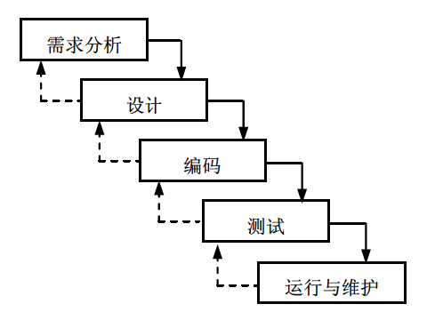
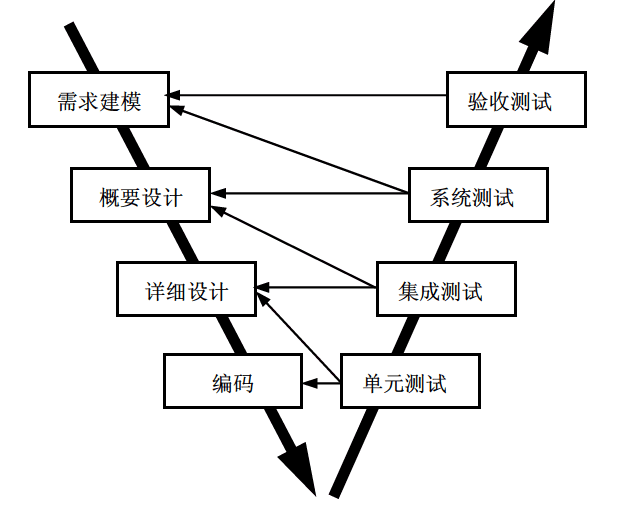
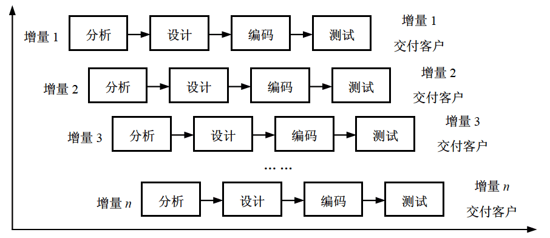
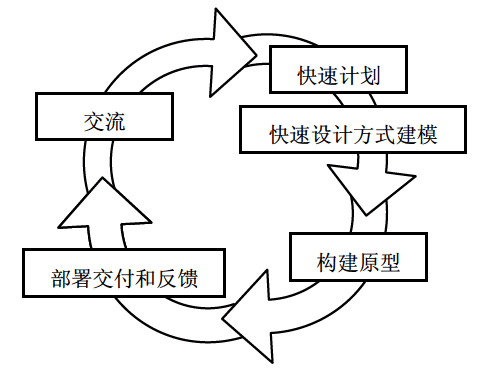
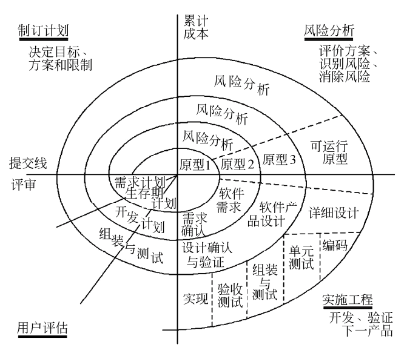
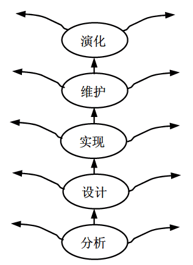
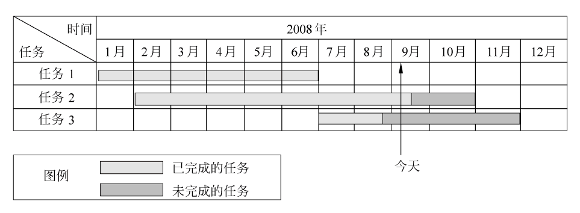
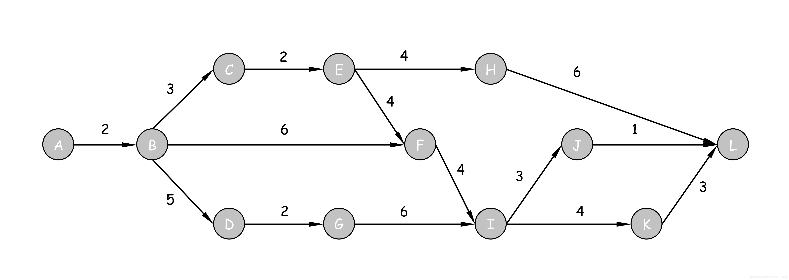
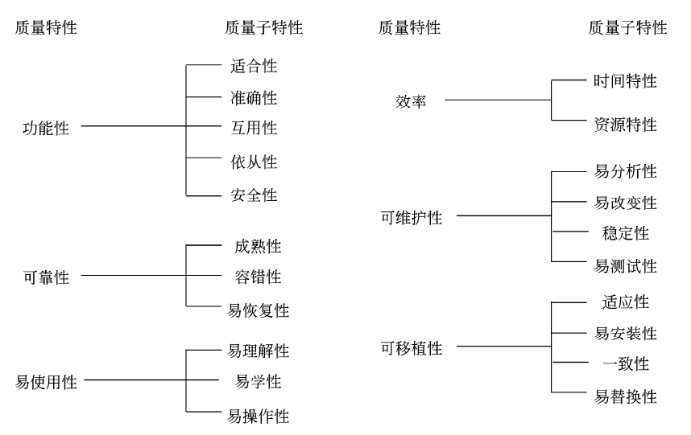

# 软件设计师 | 软件工程

软件工程是指应用计算机科学、数学及管理科学等原理，以工程化的原则和方法来解决软件问题的工程，其目的是提高软件生产率、提高软件质量、降低软件成本。

## 软件过程

### 能力成熟度模型

能力成熟度模型（CMM）将软件过程改进分为以下 5 个成熟度级别。

1. 初始级。软件过程的特点是杂乱无章，有时甚至很混乱，几乎没有明确定义的步骤，项目的成功完全依赖个人的努力和英雄式核心人物的作用。

2. 可重复级。建立了基本的项目管理过程和实践来跟踪项目费用、进度和功能特性，有必要的过程准则来重复以前在同类项目中的成功。

3. 已定义级。管理和工程两方面的软件过程已经文档化、标准化，并综合成整个软件开发组织的标准软件过程。所有项目都采用根据实际情况修改后得到的标准软件过程来开发和维护软件。

4. 已管理级。制定了软件过程和产品质量的详细度量标准。软件过程的产品质量都被开发组织的成员所理解和控制。

5. 优化级。加强了定量分析，通过来自过程质量反馈和来自新观念、新技术的反馈使过程能不断持续地改进。

### 能力成熟度模型集成

能力成熟度模型集成（CMMI）提供了两种表示方法：阶段式模型和连续式模型。

#### 阶段式模型

阶段式模型的结构类似于 CMM，它关注组织的成熟度。

- 初始的：过程不可预测且缺乏控制。

- 已管理的：过程为项目服务。

- 已定义的：过程为组织服务。

- 定量管理的：过程已度量和控制。

- 优化的：集中于过程改进。

#### 连续式模型

连续式模型关注每个过程域的能力，一个组织对不同的过程域可以达到不同的过程域能力等级。CMMI 中包括 6 个过程域能力等级，等级号为 0~5。

能力等级可以独立地应用于任何单独的过程域，任何一个能力等级都必须满足比它等级低的能力等级的所有准则。对各能力等级的含义简述如下。

- 未完成的：过程域未执行或未得到“已执行的”中定义的所有目标。

- 已执行的：其共性目标是过程将可标识的输入工作产品转换成可标识的输出工作产品，以实现支持过程域的特定目标。

- 已管理的：其共性目标集中于已管理的过程的制度化。根据组织级政策规定过程的运作将使用哪个过程，项目遵循已文档化的计划和过程描述，所有正在工作的人都有权使用足够的资源，所有工作任务和工作产品都被监控、控制和评审。

- 已定义级的：其共性目标集中于已定义的过程的制度化。过程是按照组织的剪裁指南从组织的标准过程集中剪裁得到的，还必须收集过程资产和过程的度量，并用于将来对过程的改进。

- 定量管理的：其共性目标集中于可定量管理的过程的制度化。使用测量和质量保证来控制和改进过程域，建立和使用关于质量和过程执行的定量目标作为管理准则。

- 优化的：使用量化（统计学）手段改变和优化过程域，以满足客户要求的改变和持续改进计划中的过程域的功效。

## 软件过程模型

软件过程模型习惯上也称为软件开发模型，它是软件开发全部过程、活动和任务的结构框架。典型的软件过程模型有瀑布模型、增量模型、演化模型（原型模型、螺旋模型）、喷泉模型、基于构件的开发模型和形式化方法模型等。

### 瀑布模型

瀑布模型是将软件生存周期中的各个活动规定为依线性顺序连接的若干阶段的模型，包括需求分析、设计、编码、测试、运行与维护。它规定了由前至后、相互衔接的固定次序，如同瀑布流水逐级下落，如下图所示。

**优点：**

- 容易理解和管理，且管理成本低。
- 过程可见，项目经理能够根据项目计划监控项目过程。

**缺点：**

- 客户必须能够完整、正确和清晰地表达他们的需要。
- 在开始的两个或三个阶段中，很难评估真正的进度状态。
- 当接近项目结束时，出现了大量的集成和测试工作。
- 直到项目结束之前，都不能演示系统的能力。
- 需求或设计中的错误往往只有到了项目后期才能够被发现。
- 对于项目风险的控制能力较弱，从而导致项目常常延期完成，开发费用超出预算。

**适用范围：**

- 瀑布模型是以文档作为驱动，适合于软件需求很明确的软件项目的模型。
- 系统开发过程中不太可能发生重大改变。

### V 模型

V 模型是瀑布模型的一个变体，强调在各个阶段进行测试和验证，以提升软件质量。

左侧大体遵照瀑布模型，在编码完成后反弹，逐阶段测试。

优缺点：

- V 模型是瀑布模型的一种加强，可以提升软件质量，但也更消耗人力和时间。

### 增量模型

增量模型，先开发出一个初始的实现，给用户使用并听取用户的使用意见，通过不断修改直到产生一个充分的版本。各活动不是分离而是交织在一起的。反应了我们解决问题的方法，我们很少能提前制定出完整的问题解决方案，而是摸着石头过河，逐步逼近结果。

增量模型融合了瀑布模型的基本成分和原型实现的送代特征，它假设可以将需求分段为一系列增量产品，每一增量可以分别开发。

当使用增量模型时，第一个增量往往是核心的产品。客户对每个增量的使用和评估都作为下一个增量发布的新特征和功能，这个过程在每一个增量发布后不断重复，直到产生了最终的完善产品。增量模型强调每个增量均发布一个可操作的产品。

**优点：**

- 增量模型作为瀑布模型的一个变体，具有瀑布模型的所有优点。
- 第一个可交付版本所需要的成本和时间很少。
- 开发由增量表示的小系统所承担的风险不大。
- 由于很快发布了第一个版本，因此可以减少用户需求的变更。
- 运行增量投资，即在项目开始时，可以仅对一个或两个增量投资。
- 用户可以更早的使用软件并创造价值。

**缺点：**

- 过程不可见，不方便管理。
- 缺乏整体规划，导致功能堆砌。
- 越往后变更越困难，成本逐渐上升。
- 如果没有对用户的变更要求进行规划，那么产生的初始增量可能会造成后来增量的不稳定。
- 如果需求不像早期思考的那样稳定和完整，那么一些增量就可能需要重新开发，重新发布。
- 管理发生的成本、进度和配置的复杂性可能会超出组织的能力。

**适用范围：**

- 软件产品可以分批次地进行交付。
- 待开发的软件系统能够被模块化。
- 软件开发人员对应用领域不熟悉，难以一次性地进行系统开发。
- 项目管理人员把握全局的水平较高。
- 需要快速构造可运行的产品。
- 开发团队人力资源、时间不充足的情况。

### 演化模型

软件类似于其他复杂的系统，会随着时间的推移而演化。演化模型主要针对事先不能完整定义需求的软件开发。

在开发过程中，常常会面临以下情形：

- 商业和产品需求经常发生变化，直接导致最终产品难以实现。
- 严格的交付时间使得开发团队不可能圆满地完成软件产品，但是必须交付功能有限的版本以应对竞争或商业压力。
- 很好地理解了核心产品和系统需求，但是产品或系统扩展的细节问题却没有定义。

在上述情况和类似情况下，软件开发人员需要一种专门应对不断演变的软件产品的过程模型。

演化模型是送代的过程模型，使得软件开发人员能够逐步开发出更完整的软件版本。演化模型特别适用于对软件需求缺乏准确认识的情况。典型的演化模型有原型模型和螺旋模型等。

### 原型模型

并非所有的需求都能够预先定义，大量的实践表明，在开发初期很难得到一个完整的、准确的需求规格说明。这主要是由于客户往往不能准确地表达对未来系统的全面要求，开发者对要解决的应用问题模糊不清，以至于形成的需求规格说明常常是不完整的、不准确的，有时甚全是有歧异的。

在整个开发过程中，用户可能会产生新的要求，导致需求的变更。而瀑布模型难以适应这种需求的不确定性和变化，于是出现了快速原型这种新的开发方法。

原型开发模型开始于沟通，开发人员和用户沟通，了解软件整体目标，明确已知需求，大致勾画出以后进一步定义的东西，然后迅速策划一个原型，进行建模，快速开发一个原型，对原型进行部署，由相关人员进行评价，根据评价进一步细化软件的需求，不断调整已满足需求。

**优点：**

- 有助于启发和验证系统需求。
- 可以有效地捕获系统的需求。

**缺点：**

- 原型开发会忽略掉非功能性要求 ，如性能、安全性、可靠性等。
- 开发过程的快速更改意味着没有文档，唯一的设计描述是原型的代码，这不利于长期的维护。

**适用范围：**

- 用户需求模糊、需求经常变化。
- 系统规模不是很大也不太复杂时，采用该方法比较好。
- 开发人员对算法效率、操作系统的兼容性，人机交互形式等情况不明确。

根据使用原型的目的不同，原型可以分为探索型原型、实验型原型和演化型原型 3 种。

- 探索型原型的目的是要弄清目标的要求，确定所希望的特性，并探讨多种方案的可行性。
- 实验型原型的目的是验证方案或算法的合理性，是在大规模开发和实现前，用于考查方案是否合适、规格说明是否可靠等。
- 演化型原型的目的是将原型作为目标系统的一部分，通过对原型的多次改进，逐步将原型演化成最终的目标系统。

### 螺旋模型

对于复杂的大型软件，开发一个原型往往达不到要求。螺旋模型将瀑布模型和演化模型结合起来，加入了两种模型均忽略的风险分析，弥补了这两种模型的不足。

螺旋模型将开发过程分为几个螺旋周期，每个螺旋周期大致和瀑布模型相符合。每个螺旋周期分为如下 4 个工作步骤。

- 制订计划：确定软件的目标，选定实施方案，明确项目开发的限制条件。
- 风险分析：分析所选的方案，识别风险，消除风险。
- 实施工程：实施软件开发，验证阶段性产品。
- 用户评估：评价开发工作，提出修正建议，建立下一个周期的开发计划。

螺旋模型强调风险分析，使得开发人员和用户对每个演化层出现的风险有所了解，从而做出应有的反应。

**优点：**

- 实现风险管理，降低变更风险。
- 确定一系列里程碑，确保利益相关者都能支持。
- 与瀑布模型相比，螺旋模型支持用户需求的动态变化。
- 为用户参与软件开发的所有关键决策提供了方便，有助于提高软件的适应能力。
- 为项目管理人员及时调整管理决策提供了便利，从而降低了软件开发的风险。

**缺点：**

- 很难说服客户以合同形式合作。
- 依赖大量风险评估专家及风险评估工作。
- 过多的迭代次数会增加开发成本，延迟提交时间。
- 需要开发人员具有相当丰富的风险评估经验和专门知识。

**适用范围：**

- 开发大型系统和软件。
- 预期存在较大风险的项目。
- 适用于庞大、复杂并且具有高风险的系统。

### 喷泉模型

喷泉模型是一种以用户需求为动力，以对象作为驱动的模型，适合于面向对象的开发方法。该模型认为软件开发过程自下而上周期的各阶段是相互迭代和无间隙的。

软件的某个部分常常被重复工作多次，相关对象在每次迭代中随之加入渐进的软件成分。由于对象概念的引入，表达分析、设计、实现等活动只用对象类和关系，从而可以较为容易地实现活动的迭代和无间隙（无间隙指在各项活动之间无明显边界，如分析和设计活动之间没有明显的界限）。

**优点：**

- 可以提高软件项目的开发效率，节省开发时间。
- 喷泉模型的各个阶段没有明显的界线，开发人员可以同步进行。
- 克服了瀑布模型不支持软件重用和多项开发活动集成的局限性。
- 将功能需求、功能模块间的关系、数据流等描述清楚，提升需求、设计准确性，最终提升软件质量。

**缺点：**

- 各个阶段有重叠，在开发过程中需要大量的开发人员，不利于项目的管理。
- 这种模型要求严格管理文档，使得审核的难度加大。

### 统一过程模型

统一过程模型是一种“用例驱动，以体系结构为核心，迭代及增量”的软件过程框架，由 UML 方法和工具支持。

统一过程定义了 4 个技术阶段及其制品。

1. 起始阶段。起始阶段专注于项目的初创活动，产生的主要工作产品有构想文档、初始用例模型、初始项目术语表、初始业务用例、初始风险评估、项目计划（阶段及送代）、业务模型以及一个或多个原型（需要时）。

2. 精化阶段。精化阶段在理解了最初的领域范围之后进行需求分析和架构演进，产生的主要工作产品有用例模型、补充需求（包括非功能需求）、分析模型、软件体系结构描述、可执行的软件体系结构原型、初步的设计模型、修订的风险列表、项目计划（包括送代计划、调整的工作流、里程碑和技术工作产品）以及初始用户手册。

3. 构建阶段。构建阶段关注系统的构建，产生实现模型，产生的主要工作产品有设计模型、软件构件、集成的软件增量、测试计划及步骤、测试用例以及支持文档（用户手册、安装手册和对于并发增量的描述）。

4. 移交阶段。移交阶段关注于软件提交方面的工作，产生软件增量，产生的主要工作产品有提交的软件增量、测试报告和综合用户反馈。

在每个送代中有 5 个核心工作流。

- 捕获系统应该做什么的需求工作流。
- 精化和结构化需求的分析工作流。
- 在系统构架内实现需求的设计工作流
- 构造软件的实现工作流。
- 验证实现是否如期望那样工作的测试工作流。

随着统一过程模型的阶段进展，每个核心工作流的工作量发生了变化。4 个技术阶段由主要里程硬所终止。

- 初始阶段：生命周期目标。
- 精化阶段：生命周期架构。
- 构建阶段：初始运作功能。
- 移交阶段：产品发布。

### 敏捷方法

敏捷开发的总体目标是通过“尽可能早地、持续地对有价值的软件的交付”使客户满意。

#### 极限编程

极限编程（XP）是一种轻量级（敏捷）、高效、低风险、柔性、可预测的、科学的软件开发方式。它由价值观、原则、实践和行为 4 个部分组成，彼此相互依赖、关联，并通过行为贯穿于整个生存周期。

- 4 大价值观
  - 沟通、简单性、反馈和勇气。
- 5 个原则
  - 快速反馈、简单性假设、逐步修改、提倡更改和优质工作。
- 12 个最佳实践
  - 计划游戏：快速制定计划、随着细节的不断变化而完善。
  - 小型发布：系统的设计要能够尽可能早地交付。
  - 简单设计：只处理当前的需求，使设计保持简单。
  - 测试先行：先写测试代码，然后再编写程序。
  - 持续集成：可以按日甚至按小时为客户提供可运行的版本。
  - 隐喻：找到合适的比喻传达信息。
  - 重构：重新审视需求和设计，重新明确地描述它们以符合新的和现有的需求。
  - 结队编程。
  - 集体代码所有制。
  - 每周工作 40 个小时。
  - 现场客户和编码标准。

#### 水晶法

水晶法认为每一个不同的项目都需要一套不同的策略、约定和方法论，认为人对软件质量有重要的影响，因此随着项目质量和开发人员素质的提高，项目和过程的质量也随之提高。通过更好地交流和经常性的交付，软件生产力得到提高。

#### 并列争求法

并列争求法使用迭代的方法，其中，把每 30 天一次的送代称为一个“冲刺”，并按需求的优先级别来实现产品。多个自组织和自治的小组并行地递增实现产品。协调是通过简短的日常情况会议来进行，就像橄榄球中的“并列争球”。

#### 自适应软件开发

ASD 有 6 个基本的原则：

- 有一个使命作为指导。
- 特征被视为客户价值的关键点。
- 过程中的等待是很重要的，因此“重做”与“做”同样关键。
- 变化不被视为改正，而是被视为对软件开发实际情况的调整。
- 确定的交付时间迫使开发人员认真考虑每一个生产的版本的关键需求。
- 风险也包含其中。

#### 敏捷统一过程

敏捷统一过程采用“在大型上连续”以及在“在小型上送代”的原理来构建软件系统。采用经典的统一过程模型（UP）阶段性活动（初始、精化、构建和转换），提供了一系列活动，能够使团队为软件项目构想出一个全面的过程流。在每个活动里，一个团队迭代使用敏捷，并将有意义的软件增量尽可能快地交付给最终用户。

每个敏捷统一过程（AUP）迭代执行以下活动：

- 建模：建立对商业和问题域的模型表述，这些模型“足够好”即可，以便团队继续前进。
- 实现：将模型翻译成源代码。
- 测试：像极限编程一样，团队设计和执行一系列的测试来发现错误以保证源代码满足需求。
- 部署：对软件增量的交付以及获取最终用户的反馈。
- 配置及项目管理：着眼于变更管理、风险管理以及对团队的任一制品的控制。项目管理追踪和控制开发团队的工作进展并协调团队活动。
- 环境管理：协调标准、工具以及适用于开发团队的支持技术等过程基础设施。

## 软件需求

- 功能需求：考虑系统要做什么，在何时做，在何时以及如何修改或升级。

- 性能需求：考虑软件开发的技术性指标。例如，存储容量限制、执行速度、响应时间及吞吐量。

- 用户或人的因素：考虑用户的类型。例如，各种用户对使用计算机的熟练程度，需要接受的训练，用户理解、使用系统的难度，用户错误操作系统的可能性等。

- 环境需求：考虑未来软件应用的环境，包括硬件和软件。对硬件设备的需求包括机型、外设、接口、地点、分布、湿度、磁场干扰等；对软件的需求包括操作系统、网络、数据库等。

- 界面需求：考虑来自其他系统的输入，到其他系统的输出，对数据格式的特殊规定，对数据存储介质的规定。

- 文档需求：考虑需要哪些文档，文档针对哪些读者。

- 数据需求：考虑输入、输出数据的格式，接收、发送数据的频率，数据的准确性和精度，数据流量，数据需保持的时间。

- 资源使用需求：考虑软件运行时所需要的数据、其他软件、内存空间等资源；软件开发、维护所需的人力、支撑软件、开发设备等。

- 安全保密要求：考虑是否需要对访问系统或系统信息加以控制，隔离用户数据的方法，用户程序如何与其他程序和操作系统隔离以及系统备份要求等。

- 可靠性要求：考虑系统的可靠性要求，系统是否必须检测和隔离错误；出错后，重启系统允许的时间等。

- 软件成本消耗与开发进度需求：考虑开发是否有规定的时间表，软/硬件投资有无限制等。

- 其他非功能性要求：如采用某种开发模式，确定质量控制标准、里程碑和评审、验收标准、各种质量要求的优先级等，以及可维护性方面的要求。

## 软件设计

### 概要设计

- 设计软件系统总体结构
  - 其基本任务是采用某种设计方法，将一个复杂的系统按功能划分成模块。
  - 确定每个模块的功能。
  - 确定模块之间的调用关系。
  - 确定模块之间的接口，即模块之间传递的信息。
  - 评价模块结构的质量。
- 数据结构及数据库设计
- 编写概要设计文档。文档主要有概要设计说明书、数据库设计说明书、用户手册以及修订测试计划。
- 评审。对设计部分是否完整地实现了需求中规定的功能、性能等要求，设计方法的可行性，关键的处理及内外部接口定义的正确性、有效性、各部分之间的一致性等都一一进行评审。

### 详细设计

- 对每个模块进行详细的算法设计，用某种图形、表格和语言等工具将每个模块处理过程的详细算法描述出来。
- 对模块内的数据结构进行设计。
- 对数据库进行物理设计，即确定数据库的物理结构。
- 其他设计。根据软件系统的类型，还可能要进行以下设计。
  - 代码设计。
  - 输入/输出格式设计。
  - 用户界面设计。
- 编写详细设计说明书。
- 评审。对处理过程的算法和数据库的物理结构都要评审。

## 软件测试

软件测试是为了发现错误而执行程序的过程，成功的测试是发现了全今尚未发现的错误的测试。

测试的目的就是希望能以最少的人力和时间发现潜在的各种错误和缺陷。用户应根据开发各阶段的需求、设计等文档或程序的内部结构精心设计测试实例，并利用这些实例来运行程序，以便发现错误的过程。

根据测试的概念和目的，在进行信息软件测试时应遵循以下基本原则。

1. 应尽早并不断地进行测试。测试不是在应用系统开发完之后才进行的。由于原始问题的复杂性、开发各阶段的多样性以及参加人员之间的协调等因素，使得在开发的各个阶段都有可能出现错误。因此，测试应贯穿在开发的各个阶段，应尽早纠正错误，消除隐患。

2. 测试工作应该避免由原开发软件的人或小组承担，一方面，开发人员往往不愿否认自已的工作，总认为自己开发的软件没有错误；另一方面，开发人员的错误很难由本人测试出来，很容易根据自己编程的思路来制定测试思路，具有局限性。测试工作应由专门人员来进行，这样会更客观、更有效。

3. 在设计测试方案时，不仅要确定输入数据，而且要根据系统功能确定预期输出结果。将实际输出结果与预期结果相比较就能发现测试对象是否正确。

4. 在设计测试用例时，不仅要设计有效、合理的输入条件，也要包含不合理、失效的输入条件。在测试的时候，人们往往习惯按照合理的、正常的情况进行测试，而忽略了对异常、不合理、意想不到的情况进行测试，而这可能就是隐患。

5. 在测试程序时，不仅要检验程序是否做了该做的事，还要检验程序是否做了不该做的事。多余的工作会带来副作用，影响程序的效率，有时会带来潜在的危害或错误。

6. 严格按照测试计划来进行，避免测试的随意性。测试计划应包括测试内容、进度安排、人员安排、测试环境、测试工具和测试资料等。严格地按照测试计划可以保证进度，使各方面都得以协调进行。

7. 妥善保存测试计划、测试用例，作为软件文档的组成部分，为维护提供方便。

8. 测试用例都是精心设计出来的，可以为重新测试或追加测试提供方便。当纠正错误、系统功能扩充后，都需要重新开始测试，而这些工作的重复性很高，可以利用以前的测试用例或在其基础上修改，然后进行测试。

### 测试方法

在软件测试过程中，应该为定义软件测试模板，即将特定的测试方法和测试用例设计放在一系列的测试步骤中。

软件测试方法分为静态测试和动态测试。

1. 静态测试。静态测试是指被测试程序不在机器上运行，而是采用人工检测和计算机辅助静态分析的手段对程序进行检测。

2. 动态测试。动态测试是指通过运行程序发现错误。在对软件产品进行动态测试时可以采用黑盒测试法和白盒测试法。

### 黑盒测试

黑盒测试也称为功能测试，在完全不考虑软件的内部结构和特性的情况下，测试软件的外部特性。

常用的黑盒测试技术有等价类划分、边界值分析、错误推测和因果图等。

1. 等价类划分。等价类划分法将程序的输入域划分为若干等价类，然后从每个等价类中选取一个代表性数据作为测试用例。每一类的代表性数据在测试中的作用等价于这一类中的其他值，这样就可以用少量代表性的测试用例取得较好的测试效果。等价类划分有两种不同的情况：有效等价类和无效等价类。在设计测试用例时，要同时考虑这两种等价类。

2. 边界值分析。输入的边界比中间更加容易发生错误，因此用边界值分析来补充等价类划分的测试用例设计技术。边界值划分选择等价类边界的测试用例，既注重于输入条件边界，又适用于输出域测试用例。

### 白盒测试

白盒测试也称为结构测试，根据程序的内部结构和逻辑来设计测试用例，对程序的路径和过程进行测试，检查是否满足设计的需要。

白盒测试常用的技术是逻辑覆盖、循环覆盖和基本路径测试。

#### 逻辑覆盖

逻辑覆盖考察用测试数据运行被测程序时对程序逻辑的覆盖程度，主要的逻辑覆盖标准有语句覆盖、判定覆盖、条件覆盖、判定/条件覆盖、条件组合覆盖和路径覆盖 6 种。

1. 语句覆盖是指选择足够的测试数据，使被测试程序中的每条语句至少执行一次。语句覆盖对程序执行逻辑的覆盖很低，因此一般认为它是很弱的逻辑覆盖。

2. 判定覆盖是指设计足够的测试用例，使得被测程序中的每个判定表达式至少获得一次“真”值和“假”值，或者说是程序中的每一个取“真”分支和取“假”分支至少都通过一次，因此判定覆盖也称为分支覆盖。判定覆盖要比语句覆盖更强一些。

3. 条件覆盖是指构造一组测试用例，使得每一判定语句中每个逻辑条件的各种可能的值至少满足一次。

4. 判定/条件覆盖是指设计足够的测试用例，使得判定中每个条件的所有可能取值（真/假）至少出现一次，并使每个判定本身的判定结果（真/假）也至少出现一次。

5. 条件组合覆盖是指设计足够的测试用例，使得每个判定中条件的各种可能值的组合都至少出现一次。满足条件组合覆盖的测试用例是一定满足判定覆盖、条件覆盖和判定/条件覆盖的。

6. 路径覆盖是指覆盖被测试程序中所有可能的路径。

白盒测试的原则如下。

- 程序模块中的所有独立路径至少执行一次。
- 在所有的逻辑判断中，取“真”和取“假”的两种情况至少都能执行一次。
- 每个循环都应在边界条件和一般条件下各执行一次。
- 测试程序内部数据结构的有效性等。

## 软件维护

软件维护是软件生命周期中的最后一个阶段，处于系统投入生产性运行以后的时期中，因此不属于系统开发过程。

软件维护主要是指根据需求变化或硬件环境的变化对应用程序进行部分或全部修改。

### 可维护性

软件系统可维护性的评价指标：

- 可理解性
- 可测试行
- 可修改性

### 软件文档

- 文档是软件可维护性的决定因素。
- 在开发阶段必须保证软件具有可维护的特点。
- 在软件工程的每一个阶段都应考虑并提高软件的可维护性。

### 维护内容

1. 正确性维护是指改正在系统开发阶段已发生而系统测试阶段尚未发现的错误。

2. 适应性维护是指使应用软件适应信息技术变化和管理需求变化而进行的修改。

3. 完善性维护是为扩充功能和改善性能而进行的修改，主要是指对已有的软件系统增加一些在系统分析和设计阶段中没有规定的功能与性能特征。

4. 预防性维护是为了改进应用软件的可靠性和可维护性，为了适应未来的软/硬件环境的变化，应主动增加预防性的新的功能，以使应用系统适应各类变化而不被淘汰。

## 项目管理

### 项目估算

#### COCOMO 估算模型

- 基本 COCOMO 估算是一个静态单变量模型。
- 中级 COCOMO 估算是一个静态多变量模型。

#### COCOMOⅡ 估算模型

COCOMOⅡ 被分为 3 个阶段性模型：

- 应用组装模型，估算信息是对象点。
- 早期设计阶段模型，估算信息是功能点。
- 体系结构阶段模型，估算信息是代码行。

### 进度安排

#### Gantt 图

Gantt 图（甘特图）是一种简单的水平条形图，它以日历为基准描述项目任务。水平轴表示日历时间线（如时、天、周、月和年等），每个条形表示一个任务，任务名称垂直地列在左边的列中，图中水平条的起点和终点对应水平轴上的时间，分别表示该任务的开始时间和结束时间，水平条的长度表示完成该任务所持续的时间。当日历中同一时段存在多个水平条时，表示任务之间的并发。

Gantt 图能清晰地描述每个任务从何时开始，到何时结束，任务的进展情况以及各个任务之间的并行性。但是它不能清晰地反映出各任务之间的依赖关系，难以确定整个项目的关键所在，也不能反映计划中有潜力的部分。

#### PERT 图

PERT 图不仅给出了每个任务的开始时间、结束时间和完成该任务所需的时间，还给出了任务之间的关系，即哪些任务完成后才能开始另外一些任务，以及如期完成整个工程的关键路径。图中的松驰时间则反映了完成某些任务是可以推迟其开始时间或延长其所需完成的时间。但是，PERT 图不能反映任务之间的并行关系。

#### 项目活动图

下图是一个软件项目的活动图，其中顶点表示项目里程碑，连接顶点的边表示活动，边上的值表示完成活动所需要的时间，没有前驱的顶点是开始，没有后继的顶点是结束。

**关键路径：**

- 从开始到结束的所有路径中，时间最长的一条为关键路径。
  - 特点：在关键路径上，所有任务的松弛时间都为 0。

**松弛时间：**

- 第一种方法：最晚开始时间 - 最早开始时间。

- 第二种方法：关键路径的总时间 - 包含该任务的任务路径花的时间。
  - 前提条件：必须不影响该任务以后的任务路径。

### 风险管理

软件风险包含两个特性：

- 不确定性：指风险可能发生也可能不发生。
- 损失：指如果风险发生，就会产生恶性后果。

三种风险类型：

- 项目风险威胁到项目计划。项目风险是指预算、进度、人员（聘用职员及组织）、资源、利益相关者、需求等方面的潜在问题以及它们对软件项目的影响。项目复杂度、规模及结构不确定性也属于项目风险因素。

- 技术风险威胁到要开发软件的质量及交付时间。技术风险是指设计、实现、接口、验证和维护等方面的潜在问题。

- 商业风险威胁到要开发软件的生存能力，且常常会危害到项目或产品。

风险预测又称风险估计，它试图从两个方面评估一个风险：

- 风险发生的可能性或概率。

- 如果风险发生了所产生的后果。

风险控制的目的是辅助项目组建立处理风险的策略。一个有效的策略必须考虑以下问题：

- 风险避免。主动地避免风险，即在风险发生前分析引起风险的原因，然后采取措施，以避免风险的发生。

- 风险监控。项目管理者应监控某些因素，这些因素可以提供风险是否正在变高或变低的指示。

- RMMM 计划。评估所预测的风险是否真的发生了；保证正确地实施了各风险的缓解步骤；收集能够用于今后风险分析的信息。

风险显露度 = 风险发生的概率 * 风险发生时带来的项目成本

## 软件质量

### 质量模型

## 软件度量

可靠性、可用性和可维护性是软件的质量属性，软件工程中，用 `0~1` 之间的数来度量。

可靠性是指一个系统对于给定的时间间隔内，在给定条件下无失效运作的概率。可以用 `MTTF/(1+MTTF)` 来度量，其中 `MTTF` 为平均无故障时间。

可用性是在给定的时间点上，一个系统能够按照规格说明正确运作的概率。可以用 `MTBF/(1+MTBF)` 来度量，其中 `MTBF` 为平均失效间隔时间。

可维护性是在给定的使用条件下，在规定的时间间隔内，使用规定的过程和资源完成维护活动的概率。可以用 `1/(1+MTTR)` 来度量，其中 `MTTR` 为平均修复时间。

### McCabe 度量法

McCabe 度量法是由 *托马斯·麦克凯* 提出的一种基于程序控制流的复杂性度量方法。又称环路度量，循环复杂度（Cyclomatic complexity）， 也称为条件复杂度或圈复杂度，是一种软件度量。它认为程序的复杂性很大程度上取决于程序图的复杂性。单一的顺序结构最为简单，循环和选择所构成的环路越多，程序就越复杂。

根据图论，在一个强连通的有向图 $G$ 中，环的个数 $V(G)$ 由以下公式给出：

$$
V(G) = m - n + 2
$$

其中，$V(G)$ 是有向图 $G$ 中环路数，$m$ 是图 $G$ 中弧数，$n$ 是图 $G$ 中结点数，$p$ 是图 $G$ 中强连通分量个数。在一个程序中，从程序图的入口点总能到达图中任何一个结点，因此，程序总是连通的，但不是强连通的。为了使图成为强连通图，从图的出口点到入口点加一条用虚线表示的有向边，使图成为强连通图。这样就可以使用上式计算环路复杂性了。
