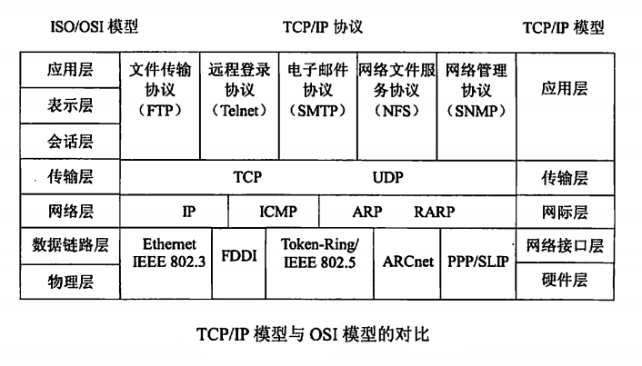
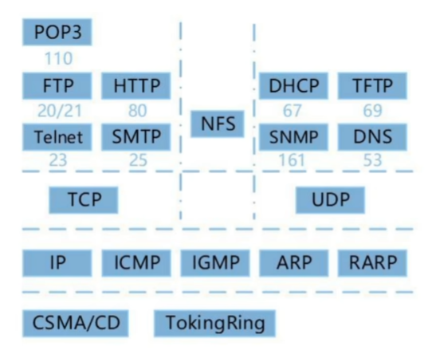

# 软件设计师 | 计算机网络

计算机网络是计算机技术与通信技术相结合的产物，它实现了远程通信、远程信息处理和资源共享。

## 网络设备

- 物理层的互连设备有中继器和集线器。集线器是一个多端口的中继器。

- 数据链路层的互连设备有网桥和交换机。交换机是一个多端口的网桥。

- 网络层的互联设备有路由器。

- 应用层的互联设备有网关。

## 协议簇

### TCP

TCP 的全称是传输控制协议是一种面向连接的、可靠的、基于字节流的传输层通信协议。TCP 是面向连接的、可靠的流协议（流就是指不间断的数据结构）。

- 是一个可靠的、面向连接的全双工的数据传输协议。
- TCP 是面向连接（虚连接）的传输层协议。
- TCP 的流量控制采用了可变大小的滑动窗口协议。
- TCP 提供可靠交付的服务，无差错、不丢失、不重复、按序到达。
- 每一条 TCP 连接只能有两个端点，每一条 TCP 连接只能是点对点的。
- 主机之间建立和关闭连接操作时，均需要通过三次握手来确认建立和关闭是否成功。

### UDP

UDP 的全称是用户数据报协议，在网络中它与 TCP 协议一样用于处理数据包，是一种无连接的协议。在 OSI 模型中，在传输层，处于 IP 协议的上一层。UDP 有不提供数据包分组、组装和不能对数据包进行排序的缺点，也就是说，当报文发送之后，是无法得知其是否安全完整到达的。

- 是一个不可靠的、无连接的协议。
- UDP 有助于提高传输的高速率性。
- UDP 是无连接的，减少开销和发送数据之前的时延。
- UDP 使用最大努力交付，即不保证可靠交付。
- UDP 是面向报文的，适合一次性传输少量数据的网络应用。
- UDP 无拥塞控制，适合很多实时应用。
- UDP 首部开销小。

## ipconfig 工具

- ipconfig：显示所有网络适配器的 IP 地址、子网拖码和缺省网关值。
- ipconfig/all：显示所有网络适配器的完整 TCP/IP 配置信息，包括 DHCP 服务是否已启动。
- ipconfig/renew：DHCP 客户端手工向服务器刷新请求（重新申请 IP 地址）。
- ipconfig/release：DHCP 客户端手工释放 IP 地址。
- ipconfig/flushdns：清除本地 DNS 缓存内容。
- ipconfig/displaydns：显示本地 DNS 内容。
- ipconfig/registerdns：DNS 客户端手工向服务器进行注册。
