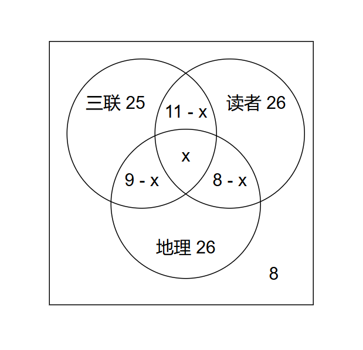
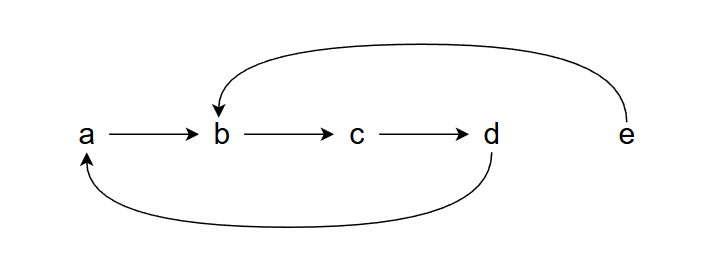

# 离散数学

- 考试题型：四道大题
- 时间：14:40 - 16:40
- 地点：西楼 - 507
- 监考老师：赵雪、程良

## 第一大题

灯泡L只有同时满足以下逻辑条件才会亮起：

- 如果 $S_1$ 闭合，则 $S_2$ 闭合
- 开关 $S_3$ 闭合
- 如果 $S_2$ 断开，则 $S_3$ 也断开

### 第一小题

> 命题的概念？以上三个条件都是命题吗？陈述句一定是命题吗？如果不是请举例。

- 命题是指可以被判断为真或为假的陈述句
- 都是命题
- 陈述句不一定是命题，例如：$x + 3 > 5$ （$x$ 是变量，没有具体值，无法判断真假）

### 第二小题

> 将以上三个条件符号化，并写出灯泡 L 亮的判定公式。

设：$p$：$S_1$ 闭合、$q$：$S_2$ 闭合、$r$：$S_3$ 闭合

三个条件符号化：① $p → q$、② $r$、③ $¬q → ¬r$

灯泡 L 亮的判定公式：$A = (p → q) ∧ r ∧ (¬q → ¬r)$

### 第三小题

> 写出判定公式的真值表，并根据真值表写主范式。

|  $p$  |  $q$  |  $r$  | $¬q$  | $¬r$  | $p → q$ | $¬q → ¬r$ | $(p → q) ∧ r$ | $(p → q) ∧ r ∧ (¬q → ¬r)$ |
| :---: | :---: | :---: | :---: | :---: | :-----: | :-------: | :-----------: | :-----------------------: |
|   0   |   0   |   0   |   1   |   1   |    1    |     1     |       0       |             0             |
|   0   |   0   |   1   |   1   |   0   |    1    |     0     |       1       |             0             |
|   0   |   1   |   0   |   0   |   1   |    1    |     1     |       0       |             0             |
|   0   |   1   |   1   |   0   |   0   |    1    |     1     |       1       |             1             |
|   1   |   0   |   0   |   1   |   1   |    0    |     1     |       0       |             0             |
|   1   |   0   |   1   |   1   |   0   |    0    |     0     |       0       |             0             |
|   1   |   1   |   0   |   0   |   1   |    1    |     1     |       0       |             0             |
|   1   |   1   |   1   |   0   |   0   |    1    |     1     |       1       |             1             |

由真值表可得，`011` 和 `111` 为成真赋值

故 $A = (p → q) ∧ r ∧ (¬q → ¬r) ⇔ m_3 ∨ m_7$

### 第四小题

> 一阶命题逻辑符号化，用以下谓词描述三场景。

- $S(x)$：$x$ 是一个开关
- $L(x)$：$x$ 是一个灯泡
- $C(x, y)$：$x$ 与 $y$ 是连接的
- $P(x)$：$x$ 是闭合的
- $B(x)$：$x$ 是亮的

1. 所有开关都是可以控制灯泡的。

    $∀x(S(x) → ∃y(L(y) ∧ C(x,y)))$

2. 如果 $S_1$ 闭合，那么灯泡 $L_1$ 就会亮。

    $P(S_1) ∧ C(S_1, L_1) → B(L_1)$

3. 如果 $L_1$ 与 $L_2$ 都亮，那么他们至少有一个共同开关。

    $B(L_1) ∧ B(L_2) → ∃z(S(z) ∧ C(L1, z) ∧ C(L2, z))$

## 第二大题

> 对 60 个人的调查表明，有 25 人阅读《三联生活周刊》杂志，26 人阅读《读者》杂志，26 人阅读《中国国家地理》杂志，9 人阅读《三联生活周刊》和《中国国家地理》杂志，11 人阅读《三联生活周刊》和《读者》杂志，8 人阅读《读者》和《中国国家地理》杂志，还有 8 人什么杂志也不读。

### 第一小题

> 求阅读全部三种杂志的人数。



解：设三者共同有人数为 $x$，阅读三联与读者人数为 $(11-x)$ 人，读者与地理的人数为 $(8-x)$ 人，三联与地理的人数为 $(9-x)$ 人，因为 8 人什么也不读，所以 $60-8=52$ 人。

- 三联：$25-[(9-x)+x+(11-x)]=25-(20-x)=5+x$
- 地理：$26-[(9-x)+x+(8-x)]=26-(17-x)=9+x$
- 读者：$26-[(11-x)+x+(8-x)]=26-(19-x)=7+x$

> $$
> \begin{aligned}
> (9+x)+(5+x)+(7+x)+(9-x)+(11-x)+(8-x)+x &= 52 \\
> 49+x &= 52 \\
> x &= 3 \\
> \end{aligned}
> $$

答：阅读全部杂志的人数为3人

### 第二小题

> 分别求只阅读《三联生活周刊》《读者》和《中国国家地理》杂志的人数。

解：由上题可知

三联人数：$x+5=3+5=8$ 人

读者人数：$x+7=3+7=10$ 人

地理人数：$x+9=3+9=12$ 人

综上三联人数 8 人，读者人数 10 人，地理人数 12 人。

## 第三大题

> 五个学生 a，b，c，d，e
>
> a 关注 b 的社交账号，b 关注 c，c 关注 d，d 关注 a，e 关注 b。

### 第一小题

> 写出这几个同学的集合。

$A=\{a,\ b,\ c,\ d,\ e\}$

### 第二小题

> 写出二元关系中的有序队，例如 a 关注 b 写为 $<a, b>$。

$R=\{<a,b>,\ <b,c>,\ <c,d>,\ <d,a>,\ <e,b>\}$

### 第三小题

> 画出二元关系的关系图，判断该关系是否有自反性，对称性，传递性。



没有自反性，没有对称性，没有传递性。

### 第四小题

> 写出还关系的自发闭包、对称闭包、传递闭包。

自反闭包：

$$
\begin{aligned}
s(R)=\{&<a,a>,<b,b>,<c,c>,<d,d>,<e,e>, \\
       &<a,b>,<b,c>,<c,d>,<d,a>,<e,b>\}
\end{aligned}
$$

对称闭包：

$$
\begin{aligned}
r(R)=\{&<a,b>,<b,a>,<b,c>,<c,b>,<c,d>, \\
       &<d,c>,<d,a>,<a,d>,<e,b>,<b,e>\}
\end{aligned}
$$

传递闭包：

$$
\begin{aligned}
t(R)=\{&<a,a>,<a,b>,<a,c>,<a,d>, \\
       &<b,a>,<b,b>,<b,c>,<b,d>, \\
       &<c,a>,<c,b>,<c,c>,<c,d>, \\
       &<d,a>,<d,b>,<d,c>,<d,d>, \\
       &<e,a>,<e,b>,<e,c>,<e,d>,\}
\end{aligned}
$$

### 第五小题

> a，b，c 上台领奖，奖品有 A、B 两种，可以怎样分配这些奖品。

设：$L=\{a,b,c\}$，$X=\{A,B\}$ 求 $X^L$

解：$X^L=\{f_0, \dots, f_7\}$

$$
\begin{aligned}
f_0 &= \{<a,A>,<b,A>,<c,A>\} \\
f_1 &= \{<a,A>,<b,A>,<c,B>\} \\
f_2 &= \{<a,A>,<b,B>,<c,A>\} \\
f_3 &= \{<a,A>,<b,B>,<c,B>\} \\
f_4 &= \{<a,B>,<b,A>,<c,A>\} \\
f_5 &= \{<a,B>,<b,A>,<c,B>\} \\
f_6 &= \{<a,B>,<b,B>,<c,A>\} \\
f_7 &= \{<a,B>,<b,B>,<c,B>\} \\
\end{aligned}
$$

## 第四大题

> 某城市因空气严重污染出台了汽车数字单、双号限行政策分析一下问题。

### 第一小题

> 结合题写出单双号限行的等价关系 $R$ 的集合定义，阐述等价关系定义，求解各尾号的的等价类。

解：汽车尾号集合

$A=\{0,1,2,3,4,5,6,7,8,9\}$

$R=\{(x,y)\ |\ x, y∈A ∧ x≡y(mod2)\}$

$R$ 是 $A$ 上的等价关系，则 $R$ 满足以下三个条件。

- $R$ 满足自反性：对于 $x∈A$，均有 $<x,x>∈R$

- $R$ 满足对称性：对于所有 $x,y∈A$，如果 $<x,y>∈R$，则 $<y,x>∈R$

- $R$ 满足传递性：对于所有 $x,y,z∈A$，如果 $<x,y>∈R$，且 $<y,z>∈R$，则 $<x,z>∈R$

- 汽车尾号各数字等价类

$$
[1]=[3]=[5]=[7]=[9] = \{1,3,5,7,9\}
$$

$$
[0]=[2]=[4]=[6]=[8] = \{0,2,4,6,8\}
$$

### 第二小题

> 编写模块化程序，实现等价关系判定，假设关系用一个 `n*n` 矩阵 $R =(rij)_{n×n}$ 表示。可定义一个 `n*n` 数组 `r[n][n]` 表示矩阵关系，根据题意补全算法。

```c
r[i][i] == 1
r[i][j] == r[j][i]
r[i][j] && r[j][k] && !r[i][k]
checkzifan() && checkduichen() && checkchuandi()
```
