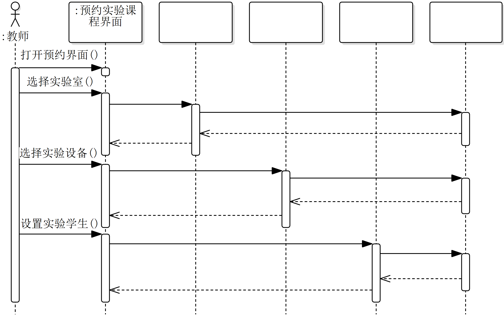
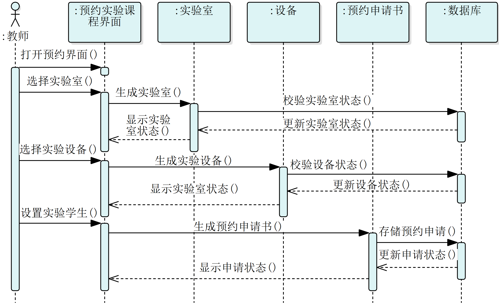

# 可视化建模与 UML

- 时间：10:30 - 12:30
- 地点：中心楼 628-630
- 监考老师：卢启领、王博

## 第一大题

::: tip 情景

高校实验室管理系统中的“预约实验课程”业务。该业务主要涉及教师、实验员和学生三类用户。

:::

### 1.1

> 请说明“4+1”视图模型包含哪些视图以及各自的主要关注点是什么，结合预约实验课程业务的需求描述，说明运用 UML 用例图构建该业务场景视图的步骤。

**“4+1”视图模型包含**：

- **逻辑视图**：关注系统的功能需求和静态结构（如类、对象、关系），描述系统提供什么功能。
- **开发视图**：关注系统的静态组织结构（如模块、组件、包及其依赖关系），描述如何分解和构建软件。
- **进程视图**：关注系统的动态行为、并发性、同步、通信（如进程、线程、活动图、顺序图），描述系统运行时的情况。
- **部署视图**：关注系统的物理部署、硬件配置、网络拓扑（如节点、设备、连接），描述软件如何映射到硬件。
- **场景视图**：整合其他视图，通过用例或场景（通常用用例图描述）展示系统如何满足用户需求，验证设计的有效性。

**运用用例图构建预约实验课程业务的场景视图需经过以下步骤**：识别参与者、提取用例、确定关系并绘制用例图。

- **识别参与者**：主要有教师（发起预约请求）、实验员（审批预约申请）、学生（接收预约通知）、系统（处理资源冲突）。
- **核心用例**：主要有浏览实验室空闲时段、浏览设备状态、提交预约申请、查看历史预约、审批预约申请、检查资源冲突、查看预约通知。

### 1.2

> 针对预约实验课程业务的需求描述，按照如图所示的结构重新绘制该业务的 UML ⽤例图，应补全缺失的⽤例或关系。
>
> 

## 第二大题

::: tip 情景

实验过程中需使用仪器设备，系统应实现设备管理业务，需对实验室仪器设备进行全生命周期管理。每台设备具有唯一编号、名称、型号、规格、购买日期等基础属性，以及当前状态（如：空闲、使用中、维修中、报废）、所属实验室等动态属性。

实验员可查询设备状态。当设备被预约使用时，其状态自动更新为“使用中”。使用结束后，状态可手动或由系统根据预约结束时间自动置为“空闲”。实验员可登记设备维修信息（维修时间、原因、设备状态），设备状态随之变为“维修中”，维修完成后更新状态为“空闲”。达到报废条件的设备，由实验员发起报废流程，管理员审批后，状态置为“报废”。管理员可添加新设备信息或修改设备基础属性。

:::

### 2.1

> 结合实验室仪器设备管理业务说明从业务需求抽象类的方法？

**依据业务需求描述抽象的方法有 4 个步骤**：

1. **识别核心实体对象**：从业务流程中提取关键名词 (如设备、维修记录、报废申请)；
2. **识别业务参与者**：明确操作系统的角色 (如实验员、管理员)；
3. **定义对象属性与方法**：属性描述对象静态特征 (如设备编号、状态)，方法描述对象动态行为 (如更新状态、提交申请)；
4. **建立对象间关系**：如继承 (实验员→用户)，关联 (设备→维修记录)；

### 2.2

> 从业务层面抽象该业务涉及的类，给出这些类必要的属性和方法。

该业务涉及的类包括设备、用户、实验员（继承自用户）、管理员（继承自用户）、维修记录、报废申请、审批记录等。

| **类**         | **主要属性**                                      | **主要方法**                     |
| -------------- | ------------------------------------------------- | -------------------------------- |
| **设备类**     | `设备编号` `设备名称` `设备状态` `所属实验室编号` | `更新状态()` `自动释放()`        |
| **用户基类**   | `用户 ID` `密码` `角色类型`                       | `查询设备状态()`                 |
| **实验员类**   | （继承自用户基类的所有属性）                      | `登记维修()` `发起报废()`        |
| **管理员类**   | （继承自用户基类的所有属性）                      | `审批报废()` `修改设备信息()`    |
| **维修记录类** | `记录 ID` `设备编号` `维修原因` `处理结果`        | `完成维修()`                     |
| **报废申请类** | `申请单 ID` `设备编号` `审批状态`                 | `通过审批()`                     |
| **审批记录类** | `审批 ID` `申请单 ID` `审批意见` `审批状态`       | `签署审批意⻅()` `更新审批状态()` |

- `设备状态`：空闲/使用中/维修中/报废
- `角色类型`：实验员/管理员
- `审批状态`：代批准/已批准

### 2.3

> 依据上⼀个抽象的类绘制类图，要求只标注类的名称，若为关联关系应标注名称及多重性。

## 第三大题

::: tip 情景

在构建系统进程试图时，预约实验课程业务的流程定义有以下环节：

教师打开预约界面后选择目标实验室、实验设备和设置学生人数后提交预约申请；生成预约申请后，从数据库中读取、检查实验室状态、所需设备状态。若实验室状态为“空闲”且设备充足，则将预约申请的状态设为“待审核”。

在构建系统进程视图的过程中，逐渐明确了实验仪器设备的状态包括空闲、使用中、维修中、报废等。状态迁移过程如下;

初始状态为空闲，当设备被成功预约使用时，状态由空闲转换为使用中。当设备使用结束 (到达预约结束时或实验员手动结束)，状态由使用中转换为空闲，当实验员登记设备维修时，状态由空闲或使用中 (需先结束使用) 转换为维修中，当维修完成，状态由维修中转换为空闲。当管理员审批通过报废申请时，状态由空闲或维修中转换为报废，报废是终止状态。

某设计人员分析教师预约实验课程业务的流程后，绘制了该业务的顺序图，但缺失了部分对象及他们之间传递的消息；请参照该顺序图的结构回答以下问题。

:::

### 3.1

> 请在图中空白位置标注序号，再将对应序号的对象名称或消息名称写在答题区域。
>
> 

### 3.2

> 分析情景中描述的设备状态转换过程绘制状态机图，要求应标注出初态、终止状态，以及每个状态的入口动作、出口动作或内部执行活动，并注明状态转换的触发事件。

## 第四大题

::: tip 情景

实验教学实施业务经历实验启动、实验实施、实验结束等环节。

其中，在实验启动环节，实验室依据预约记录启动教师、学生签到任务，学生扫码签到，实验室记录教师、学生到场时间，同步至实验签到记录表。

在实验实施环节，学生领用仪器设备，在设备领用记录中记录启用时间、学号；在使用过程中，若发现设备运行异常则由学生报实验员终止使用该设备 (同时记录停用时间)，并启动设备维修流程；若未发生异常，学生继续使用设备直至实验结束，学生归还仪器设备。

在实验结束环节，学生上传实验报告，教师接收该报告并评阅，再将评阅结果反馈学生，学生可查阅成绩。

:::

### 4.1

> 根据 RUP 统一软件开发过程的理论框架，分析实验室管理系统的开发过程，说明需要设计哪些 UML 模型描述“实验教学实施环节”的业务逻辑？要求给出实体模型名称并简述其用途。

根据 RUP 的理论框架，结合业务建模、需求分析、系统设计、实现与测试等核心工作流。

实验室管理系统的开发过程需要设计以下 UML 模型来描述“实验教学实施环节”的业务逻辑：

**业务建模阶段**：主要描述业务流程与角色交互

- **用例图**：定义“实验教学实施环节”的核心业务场景，识别参与者与系统功能的交互关系
- **活动图**：描述“实验教学实施环节”中跨角色的业务活动顺序，通过泳道划分职责

**需求分析阶段主**：主要细化功能与规则

- **顺序图**：按时间顺序展示“实验教学实施环节”中对象间的消息传递，聚焦交互细节
- **状态机图**：描述“实验教学实施环节”中关键对象（如实验设备）的状态转换逻辑

**系统设计阶段**：主要将业务逻辑映射到技术实现

- **类图**：定义“实验教学实施环节”涉及的业务实体类及其关系，如学生、设备及其之间的操作关系
- **组件图**：描述实现“实验教学实施环节”功能的系统组件（如签到模块）及其依赖关系

### 4.2

> 分析实验启动环节的全流程，抽象业务涉及得泳道（对象）及完成该环节必要的动作或活动绘制活动图。

