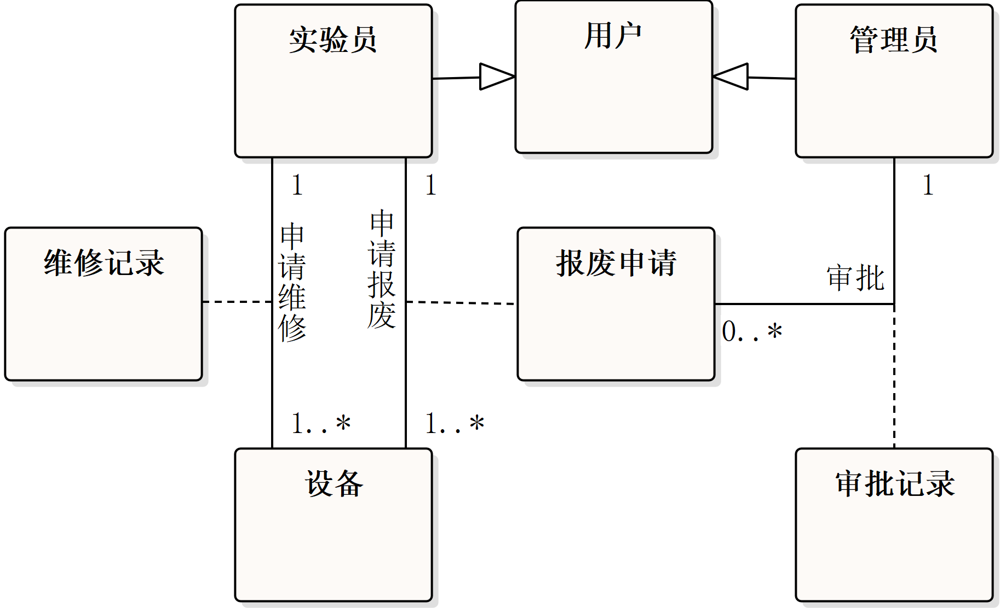

# 可视化建模与 UML

- 时间：10:30 - 12:30
- 地点：中心楼 628-630
- 监考老师：

## 第一大题

::: tip 场景

高校实验室管理系统中的“预约实验课程”业务。该业务主要涉及教师、实验员和学生三类用户。

**业务描述：**

1. **教师发起预约：** 教师需在浏览实验室空闲时段和设备状态后，提交实验课程预约申请。预约申请可能包含多种信息。
2. **系统检测：** 系统需要自动检测资源是否冲突，例如实验室是否已被占用、设备是否不足或设备状态异常。
3. **待审核状态：** 如果资源可用，预约申请将进入待审核状态。
4. **实验员审批：** 实验员负责审批预约申请。
    - **审批通过：** 如果审批通过，系统将锁定预约的实验室和设备资源（改变其状态为“预约”或“使用中”），并通知教师和学生预约成功。
    - **审批不通过：** 如果审批不通过，实验员需填写原因，并通知教师。学生可以通过系统查看被安排的实验室预约通知。

:::

### 1.1

> 请说明“4+1”视图模型包含哪些视图以及各自的主要关注点是什么，结合预约实验课程业务的需求描述，说明运用 UML 用例图构建该业务场景视图的步骤。

- **“4+1”视图模型包含：** 逻辑视图、开发视图、进程视图、部署视图、场景视图。
  - **逻辑视图：** 关注系统的功能需求和静态结构（如类、对象、关系），描述系统提供什么功能。
  - **开发视图：** 关注系统的静态组织结构（如模块、组件、包及其依赖关系），描述如何分解和构建软件。
  - **进程视图：** 关注系统的动态行为、并发性、同步通信（如进程、线程）。
  - **部署视图：** 关注系统的物理部署、硬件配置、网络拓扑（如节点、设备、连接），描述软件如何映射到硬件。
  - **场景视图：** 整合其他视图，通过用例或场景（通常用用例图描述）展示系统如何满足用户需求，验证设计的有效性。
- **运用用例图构建预约实验课程业务的场景视图需经过以下步骤：** 识别参与者、提取用例、确定关系并绘制用例图。
  - **识别参与者：** 主要有教师（发起预约请求）、实验员（审批预约申请）、学生（接收预约通知）、系统（处理资源冲突）。
  - **核心用例：** 主要有浏览实验室空闲时段、浏览设备状态、提交预约申请、查看历史预约、审批预约申请、检查资源冲突、查看预约通知。

### 1.2

> 针对预约实验课程业务的需求描述，请补全用例图（此处应附图，但文本无法展示，故以文字描述用例关系）。

- **教师：**
  - **预约实验课程** (主用例)
    - `<<include>>` **浏览实验室空闲时段**
    - `<<include>>` **浏览设备状态**
    - `<<extend>>` **提交预约申请** (扩展点：资源冲突)
      - `<<include>>` **检查资源冲突**
- **实验员：**
  - **审批预约申请** (主用例)
    - `<<include>>` **锁定资源**
    - `<<include>>` **通知教师和学生**
- **学生：**
  - **查看预约通知**

## 第二大题

::: tip 场景

高校实验室仪器设备生命周期管理。该业务主要关注实验室中仪器设备的采购、登记、使用、维护、维修、报废等全过程管理。

**业务描述：**

1. **核心实体对象：** 主要包括设备、维修记录、报废申请等。
2. **参与者：** 主要参与者有实验员和管理员。
3. **对象属性与方法：**
    - **设备：** 包含设备编号、名称、状态（如“正常”、“维修中”、“报废”等）等属性；具有更新状态、登记维修、发起报废等方法。
    - **维修记录：** 记录维修时间、维修人员、维修内容、费用等信息。
    - **报废申请：** 记录申请编号、设备信息、报废原因、申请人、申请时间等信息。
4. **对象间关系：** 设备与维修记录之间存在一对多关系（一台设备可以有多条维修记录）；设备与报废申请之间存在一对多关系（一台设备可以有多次报废申请，但通常只有一次最终报废）。维修记录和报废申请可能需要管理员的审批。

:::

### 2.1

> 结合实验室仪器设备管理业务说明从业务需求抽象类的方法？

1. 核心实体对象：设备、维修记录、报废申请
2. 参与者：实验员、管理员
3. 定义对象属性与方法：设备编号、状态，更新状态、提交申请
4. 建立对象间关系：

### 2.2

> 从业务层面抽象该业务涉及的类，给出这些类必要的需求属性和方法。

该业务涉及的类包括设备、用户、实验员（继承自用户）、管理员（继承自用户）、维修记录、报废申请、审批记录等。

- **设备类：**
  - **主要属性：** 设备编号（唯一标识）、设备名称、设备型号、设备规格、购买日期、当前状态（枚举值：空闲/使用中/维修中/报废）、所属实验室编号。
  - **主要方法：** `更新状态()`、`登记维修()`、`发起报废()`、`自动更新状态()`（根据预约结束时间）。
- **用户基类：**
  - **主要属性：** 用户 ID（唯一标识）、密码、角色类型（枚举值：实验员/管理员）。
  - **主要方法：** `登录()`、`查询设备状态()`。
- **实验员类（继承自用户）：**
  - **主要属性：** （继承用户属性）
  - **主要方法：** `登记维修信息()`、`发起报废申请()`、`审批预约申请()`。
- **管理员类（继承自用户）：**
  - **主要属性：** （继承用户属性）
  - **主要方法：** `审批报废申请()`、`修改设备信息()`、`管理用户()`。
- **维修记录类：**
  - **主要属性：** 维修记录 ID、设备编号、维修时间、维修原因、维修人员、维修费用、维修状态。
  - **主要方法：** `创建维修记录()`、`更新维修记录()`。
- **报废申请类：**
  - **主要属性：** 报废申请 ID、设备编号、申请人 ID、申请时间、报废原因、审批状态。
  - **主要方法：** `提交报废申请()`。
- **审批记录类：**
  - **主要属性：** 审批记录 ID、申请类型（维修/报废）、申请 ID、审批人 ID、审批时间、审批结果、审批意见。
  - **主要方法：** `创建审批记录()`。

### 2.3

## 第三大题

::: tip 场景

在构建系统进程试图时，预约实验课程业务的流程定义有以下环节：

教师打开预约界面后选择目标实验室、实验设备和设置学生人数后提交预约申请，生成预约申请后，从数据库中读取、检查实验室状态、所需设备状态。若实验室状态为“空闲”且设备充足，则将预约申请的状态设为“待审核”。

在构建系统进程视图的过程中，逐渐明确了实验仪器设备的状态包括空闲、使用中、维修中、报废等。状态迁移过程如下;

初始状态为空闲，当设备被成功预约使用时，状态由空闲转换为使用中。当设备使用结束 (到达预约结束时或实验员手动结束)，状态由使用中转换为空闲，当实验员登记设备维修时，状态由空闲或使用中 (需先结束使用) 转换为维修中，当维修完成，状态由维修中转换为空闲。当管理员审批通过报废申请时，状态由空闲或维修中转换为报废，报废是终止状态。

某设计人员分析教师预约实验课程业务的流程后，绘制了该业务的顺序图，但缺失了部分对象及他们之间传递的消息;请参照该顺序图的结构回答以下问题。

:::

### 3.1

> 请在图中空白位置标注序号，再将对应序号名称或内容写对应？

### 3.2

> 分析情景中描述的设备状态转换过程绘制状态机图，要求应标注出初态、终止状态，以及每个状态的入口动作、出口动作或内部执行活动，并注明状态转换的触发事件？

## 第四大题

::: tip 场景

实验教学实施业务经历实验启动、实验实施、实验结束等环节。其中，在实验启动环节，实验室依据预约记录启动教师、学生签到任务，学生扫码签到，实验室记录教师、学生到场时间，同步至实验签到记录表。

在实验实施环节，学生领用仪器设备，在设备领用记录中记录启用时间、学号：在使用过程中，若发现设备运行异常则由学生报实验员终止使用该设备 (同时记录停用时间)，并启动设备维修流程;若未发生异常，学生继续使用设备直至实验结束，学生归还仪器设备。

在实验结束环节，学生上传实验报告，教师接收该报告并评阅，再将评阅结果反馈学生，学生可查阅成绩。

:::

### 4.1

> 根据 RUP 统一软件开发过程的理论框架，分析实验室管理系统的开发过程，说明需要设计哪些 UML 模型描述“实验教学实施环节”的业务逻辑？要求给出实体模型名称并简述其用途。

根据 RUP 的理论框架，结合业务建模、需求分析、系统设计、实现与测试等核心工作流。实现“实验教学实施环节”的业务逻辑时，需通过以下 UML 模型进行描述。

在业务建模阶段主要描述业务流程与角色交互，使用用例图定义“实验教学实施环节”的核心业务场景，识别参与者与系统功能的交互关系：使用活动图描述“实验教学实施环节”中跨角色的业务活动顺序，通过泳道划分职责。

在需求分析阶段主要细化功能与规则，使用顺序图按时间顺序展示“实验教学实施环节”中对象间的消息传递，聚焦交互细节：使用状态机图描述“实验教学实施环节”中关键对象 (如实验设备) 的状态转换逻辑。

在系统设计阶段主要将业务逻辑映射到技术实现，使用类图定义“实验教学实施环节”涉及的业务实体类及其关系，如学生、设备及其之间的操作关系：使用组件图描述实现“实验教学实施环节”功能的系统组件 (如签到模块) 及其依赖关系。

### 4.2

> 分析实验启动环节的全流程，抽象业务涉及得泳道（对象）及完成该环节必要的动作或活动绘制活动图。

## 第五大题

::: tip 场景

暂无

:::

### 5.1

> 依据上述需求描述，简述如何应用“4+1”视图构建毕业生就业管理系统的模型？

“4+1 视图”模型旨在通过逻辑视图、开发视图、过程视图、物理视图和场景视图等不同的视角来描述软件系统的各个方面，每个视图专注于系统的不同方面。

运用用例图描述系统应实现的业务，从而构建系统的场景视图，如就业离校管理、学生个人信息管理业务的参与者及其完成的事项等；

使用类图描述系统的功能需求，从而构建系统的逻辑视图，如抽象学生、用人单位类和它们之间的关系，以及实现业务的逻辑关系；
