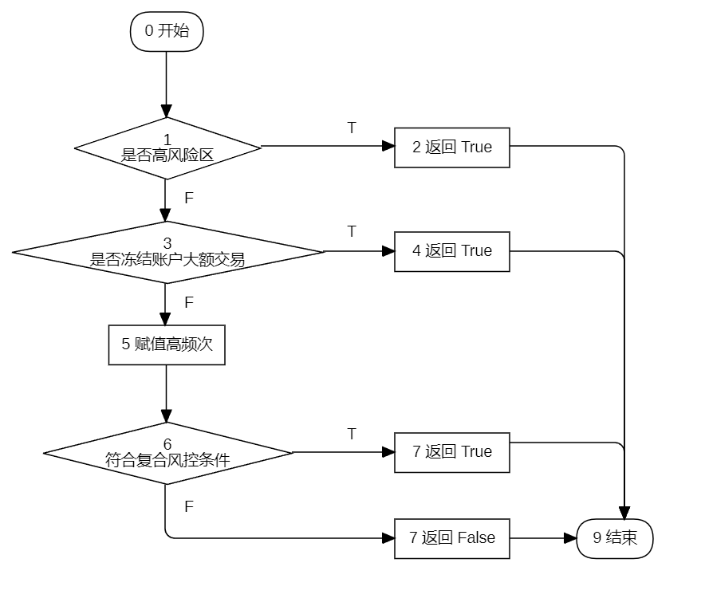

# 软件测试

- 时间：14:30 - 16:30
- 地点：中心楼 627-629
- 监考老师：董笑、王欣

## 第一大题

::: tip 情景

某银行响应国家《反洗钱法》《数据安全法》要求，开发了交易风险检测系统，根据交易金额、账户状态、交易频率、高风险地区标记等因素判断是否需要人工审核，检测规则为高风险地区账户发生交易时必须经人工审核；账户处于冻结状态，交易金额大于等于 10000 元时需人工审核；一日内交易次数大于等于 5 次即为高频交易，需人工审核。依据需求描述，交易风险检测的核心代码如下：

```java
public class RiskDetector {
    // 交易风控检测方法
    public bool NeedManualReview(double amount, bool isAccountFrozen, int recentTransactions, bool isHighRiskRegion) {
        // 规则 1：高风险地区交易必须审核（反洗钱要求）
        if (isHighRiskRegion) return true;
        // 规则 2：冻结账户大额交易需审核（保护用户资产安全）
        if (isAccountFrozen && amount > 10000) return true;
        // 规则 3：高频交易标记
        bool highFrequency = (recentTransactions >= 5);
        // 规则 4：复合风控条件（防诈骗核心逻辑）
        if ( (amount > 20000 && highFrequency) || amount > 50000 ) {
            return true;
        }
        return false;
    }
}
```

作为测试负责人，请完成以下任务。

:::

### 1.1

> 请依据基本路径法的思路绘制交易风控检测方法的控制流图（CFG），并计算其环路复杂度、列出独立路径集合。

**依据核心代码绘制程序流程图如下**：



**依据程序流程图可得控制流图如下**：


**计算环路复杂度**：V(G) = `判断节点个数 + 1` = `3 + 1` = `4`

**独立路径为**：

- 路径 1：`0-->1-->2-->9`
- 路径 2：`0-->1-->3-->4-->9`
- 路径 3：`0-->1-->3-->5、6-->7-->9`
- 路径 4：`0-->1-->3-->5、6-->8-->9`

### 1.2

> 请基于上一问的独立路径设计测试用例，要求为每条独立路径设计 1 组测试数据？

设定测试输入数据的顺序为（金额，账户状态，交易频次，是否高风险区域），按语句覆盖要求，每条独立路径的测试用例如下表所示：

| 独立路径 | 测试数据组合              | 预期输出 |
| -------- | ------------------------- | -------- |
| 路径 1   | （500，False，3，True）   | True     |
| 路径 2   | （15000，True，2，False） | True     |
| 路径 3   | （21000，True，5，False） | True     |
| 路径 4   | （21000，True，3，False） | False    |

## 第二大题

::: tip 情景

某电商平台为响应国家“拉动内需、促进消费”政策，制定购物优惠规则，倡导诚信消费和公平交易，确保系统精准执行优惠逻辑，保障用户权益。设定规则的条件有用户类型分为普通用户（C1=0）、VIP 用户（C1=1），优惠券类型分为满减券（C2=0）、折扣券（C2=1），订单金额达标情况分为是（C3=1）、否（C3=0），商品类型分为普通商品（C4=0）、限时秒杀商品（C4=1）。系统输出动作包括 A1 执行满减券抵扣、A2 执行折扣券抵扣、A3VIP 用户叠加优惠（先执行 A1 或 A2 后再执行 A3），A4 提示“优惠券不可用”。优惠规则如下：

（1）购买限时秒杀商品时，仅允许使用满减券。若用户使用折扣券或使用满减券但订单金额未达标，则输出 A4；若用户使用满减券且订单金额达标，则输出 A1。

（2）若普通用户购买普通商品，订单金额达标，则基于优惠券类型输出动作，使用满减券时输出 A1，使用折扣券时输出 A2；订单金额未达标，则输出 A4。

（3）若 VIP 用户购买普通商品，订单金额达标，则基于优惠券类型输出动作，用户使用满減券，则输出 A1 并附加额外折扣（执行 A3）；用户使用折扣券，则输出 A2 并附加额外折扣（执行 A3）；若订单金额未达标，则输出 A4。

作为测试负责人，请完成以下任务。

:::

### 2.1

> 请依据情景描述生成决策表，要求覆盖所有优惠规则？

|            | 规则编号 | 条件与动作          | 1   | 2   | 3   | 4   | 5   | 6   | 7   | 8   | 9   | 10  | 11  | 12  |
| ---------- | -------- | ------------------- | --- | --- | --- | --- | --- | --- | --- | --- | --- | --- | --- | --- |
| **条件桩** | C4       | 是否限时秒杀商品    | 1   | 1   | 1   | 1   | 0   | 0   | 0   | 0   | 0   | 0   | 0   | 0   |
|            | C1       | 用户类型            | -   | -   | -   | -   | 0   | 0   | 0   | 0   | 1   | 1   | 1   | 1   |
|            | C2       | 优惠券类型          | 0   | 0   | 1   | 1   | 0   | 0   | 1   | 1   | 0   | 0   | 1   | 1   |
|            | C3       | 订单金额 ≥ 门槛金额 | 1   | 0   | 1   | 0   | 1   | 0   | 1   | 0   | 1   | 0   | 1   | 0   |
| **动作桩** | A1       | 执行满减券          | ✔   |     |     |     | ✔   |     |     |     | ✔   |     | ✔   |     |
|            | A2       | 执行折扣券          |     |     |     |     |     | ✔   |     |     |     |     |     | ✔   |
|            | A3       | VIP 叠加优惠        |     |     |     |     |     |     |     |     |     | ✔   | ✔   |     |
|            | A4       | 提示不可用          |     | ✔   | ✔   | ✔   |     | ✔   | ✔   | ✔   |     | ✔   |     | ✔   |

**符号说明**：

- `1`：条件为真
- `0`：条件为假
- `-`：条件不适用/不相关
- `✔`：执行该动作

### 2.2

> 根据决策表的每个规则设计测试用例？

设定输入数据的顺序为（商品类型，用户类型，优惠券类型，订单金额达标），则测试用例如表所示。

| 规则 | 测试数据组合                                                     | 预期输出 |
| ---- | ---------------------------------------------------------------- | -------- |
| 1    | （限时秒杀，不考虑，满减券，是）                                 | A1       |
| 2    | 商品类型=限时秒杀，优惠券类型=满减券，订单金额达标=否            | A4       |
| 3    | 商品类型=限时秒杀，优惠券类型=折扣券，订单金额达标=是            | A4       |
| 4    | 商品类型=限时秒杀，优惠券类型=折扣券，订单金额达标=否            | A4       |
| 5    | 商品类型=普通，用户类型=普通，优惠券类型=满减券，订单金额达标=是 | A1       |
| 6    | 商品类型=普通，用户类型=普通，优惠券类型=满减券，订单金额达标=否 | A4       |
| 7    | 商品类型=普通，用户类型=普通，优惠券类型=折扣券，订单金额达标=是 | A2       |
| 8    | 商品类型=普通，用户类型=普通，优惠券类型=折扣券，订单金额达标=否 | A4       |
| 9    | 商品类型=普通，用户类型=VIP, 优惠券类型=满减券，订单金额达标=是  | A1 + A3  |
| 10   | 商品类型=普通，用户类型=VIP, 优惠券类型=满减券，订单金额达标=否  | A4       |
| 11   | 商品类型=普通，用户类型=VIP, 优惠券类型=折扣券，订单金额达标=是  | A2 + A3  |
| 12   | 商品类型=普通，用户类型=VIP, 优惠券类型=折扣券，订单金额达标=否  | A4       |

## 第三大题

::: tip 情景

某电商平台为响应国家“促进消费升级”政策要求，开发了会员积分奖励系统。积分计算式规则为：

系统根据用户会员等级（operation_type）计算单次积分奖励，若为普通会员则每次加 2 分；若为银卡会员则每次加 10 分；金卡会员则每次加 20 分。

初始积分基数（initial_num）决定奖励计算次数，系统循环执行积分奖励计算，每次循环根据会员等级累加相应积分，同时奖励计算次数减 1，直至积分基数为 0 结束积分奖励计算。作为测试负责人，请使用 Unittest+ddt 完成单元测试。

:::

### 3.1

> 请补全积分奖励计算函数，应使用循环实现积分累加，能正确处理三种会员等级，能正确退出循环？

::: code-group

```python [修改前]
# sort.py
def iterative_calculation('''_____''', '''_____'''):
    result = 0
    current_num = '''_____'''
    while '''_____''':
        if operation_type == 0:
            '''_____'''
        elif operation_type == 1:
            '''_____'''
        else:
            '''_____'''
            '''_____'''
    return result
```

```python [修改后]
# sort.py
def iterative_calculation(initial_num, operation_type):
    result = 0
    current_num = initial_num
    while current_num > 0:
        if operation_type == 0:
            result += 2
        elif operation_type == 1:
            result += 10
        else:
            result += 20
            current_num -= 1
    return result
```

:::

### 3.2

> 请补全针对积分奖励计算函数的测试代码，应正确调用数据驱动测试库，能正确调用被测函数（积分奖励计算函数），能正确使用 ddt 开展单元测试。

::: code-group

```python [修改前]
# sort_test.py
import sys
import unittest

from ddt import '''_____''', '''_____''', '''_____'''

sys.path.append(r"D:\Demo")
from sort import '''_____'''   # 被测模块


@ddt
class TestRewardSystem(unittest.TestCase):
    @data(
        (3, 0, 6),             # 普通会员 3 次消费
        (0, 0, '''_____'''),   # 边界值（消费 0 次）
        (5, 1, '''_____'''),   # 银卡会员 5 次消费
        (5, 2, '''_____'''),   # 金卡会员 5 次消费
        (-1, 5, '''_____'''),  # 无效消费次数
        (10, 1, '''_____''')   # 大数据量验证
    )
    @unpack
    def test_calculate_rewards(self, input_num, mode, expected):
        # 调用被测函数
        result = iterative_calculation('''_____''', '''_____''') 
        # 断言方法
        self.'''_____'''(result, expected, msg=f"实际结果:{result}")  

    def test_policy_compliance(self):
        # 测试金卡会员大额消费（至少 10 次）
        agricultural_points = iterative_calculation('''_____''', '''_____''')
        self.assertEqual(agricultural_points, '''_____''', "应支持农产品兑换") 


if __name__ == '__main__':
        '''_____'''  # 启动测试
```

```python [修改后]
# sort_test.py
import sys
import unittest

from ddt import ddt, data, unpack

sys.path.append(r"D:\Demo")
from sort import iterative_calculation  # 被测模块


@ddt
class TestRewardSystem(unittest.TestCase):
    @data(
        (3, 0, 6),      # 普通会员 3 次消费
        (0, 0, 0),      # 边界值（消费 0 次）
        (5, 1, 50),     # 银卡会员 5 次消费
        (5, 2, 100),    # 金卡会员 5 次消费
        (-1, 5, 0),     # 无效消费次数
        (10, 1, 100)    # 大数据量验证
    )
    @unpack
    def test_calculate_rewards(self, input_num, mode, expected):
        # 调用被测函数
        result = iterative_calculation(input_num, mode)
        # 断言方法
        self.assertEqual(result, expected, msg=f"实际结果:{result}")

    def test_policy_compliance(self):
        # 测试金卡会员大额消费（至少 10 次）
        agricultural_points = iterative_calculation(15, 2)
        self.assertEqual(agricultural_points, 300, "应支持农产品兑换")


if __name__ == '__main__':
    unittest.main()  # 启动测试
```

:::

## 第四大题

::: tip 情景

某市卫生健康委为落实“基本医疗卫生服务更加公平可及”的要求，委托某软件公司开发适用于全市医疗机构的“医捷通”预约挂号系统，核心业务需求有：

（1）多身份服务。支持社保患者（需对接省级医保平台）、自费患者、异地医保患者（需对接国家医保平台）三类身份挂号，确保不同参保状态、不同地域的患者都能公平、便捷地享受基本医疗服务。

（2）关键业务流程，强调规范与效率。挂号流程为选择科室→选择医生→选择时段→身份认证→支付（社保账户/个人账户/第三方支付）；退号流程为退号申请→医保退款审核（社保患者需省级平台确认）→原路返款；必须确保流程合规、透明、可追溯。

（3）政策约束，保障资源合理分配与资金安全。社保患者每日限挂 1 个专家号；退号后，医保资金需在 48 小时内返还。

系统上线运行后暴露出了异地医保患者挂号时系统崩溃，退款超时导致患者投诉，黑客利用漏洞获取他人就诊记录等问题。作为测试负责人，请完成以下任务。

:::

### 4.1

> 结合系统故障引发的社会影响，说明软件测试对保障公共利益的意义，并指出在开发环节中可能存在的责任缺失点？

从题设描述可知由于系统故障引发的社会影响有挂号系统崩溃导致异地患者就医受阻，破坏“公平可及”要求；退款超时引发医患矛盾激增会导致信任危机；隐私泄露会引发诈骗风险，触及法律红线。

由此，开展充分功能/性能测试可以保障系统可用性（异地挂号不崩溃），实现“公平可及”；开展足够的合规/时效性测试可以确保政策要求落地（48 小时退款），维护患者经济权益；充分实施安全性测试可以防止隐私泄露，保障公共数据安全。

综上所述，在该系统的开发过程中可能缺失了以下测试：

（1）在需求分析阶段，未定义异地医保高并发场景导致性能测试需求遗漏；

（2）在测试设计阶段，无超时边界测试（退款>48h 验证），缺失时效性测试用例；

（3）在测试执行阶段，未实施渗透测试，未检查就诊记录访问控制；

（4）整个测试过程管理中缺少端到端的流程追踪，如退款流程。

### 4.2

> 针对题设的需求描述和暴露的软件缺陷，请分项说明覆盖三类患者全流程、资金安全时效、安全防护等核心业务的测试方案；以及针对医保政策变更、接口调整等需求变化，提出测试流程优化建议？

针对三类患者全流程测试，采用自动化测试工具 Selenium 模拟社保、自费、异地医保患者执行挂号、退号流程，重点验证省级/国家医保平台对接的稳定性与跨系统兼容性。

针对资金安全时效测试，运用边界值分析法（47/48/49 小时超时阈值），强制触发退款延迟场景，监控医保资金返还路径的合规性与可追溯性。

针对安全防护测试，实施渗透测试，模拟伪造异地医保凭证的越权访问攻击，检测就诊记录泄露风险及身份认证漏洞。

系统中存在因医保报销政策调整导致计费规则失效的风险可构建动态策略规则库，实现自动化业务逻辑测试，确保实现 100% 覆盖测试。

存在因国家/省级医保接口升级导致数据报文兼容性故障的风险，运用 Pact 契约工具，提前验证接口交互逻辑暴露兼容问题。
