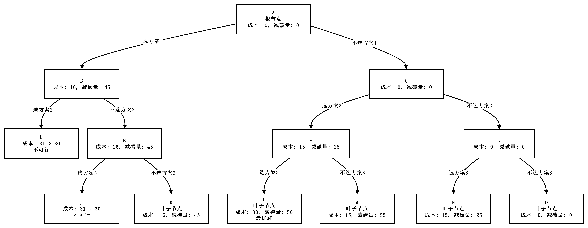
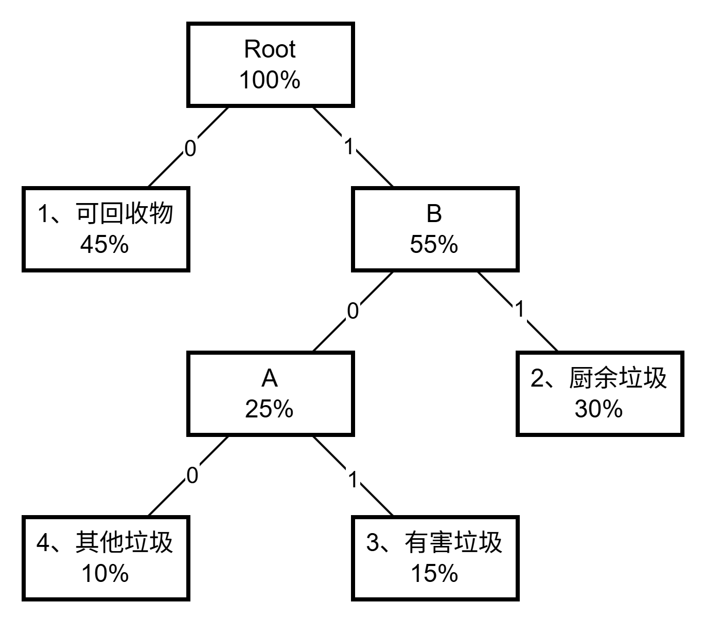

# 算法分析与设计

- 时间：10:30 - 12:30
- 地点：中心楼 612-614
- 监考老师：杨晓明、肖琼谞

## 第一大题

::: tip 情景

分支限界法与回溯法（环保方案投资问题）

**题目背景**

有 3 个环保投资方案：

- 方案 1：成本 16 万元，减碳量 45 万吨
- 方案 2：成本 15 万元，减碳量 25 万吨
- 方案 3：成本 15 万元，减碳量 25 万吨

总投资成本上限 30 万元，目标是最大化总减碳量。

:::

### 1.1

> 分支限界法和回溯法的区别及相同点？

求解目标不同：

- 回溯法的求解目标是找出解空间树中满足约束条件的所有解
- 分支限界法的求解目标是找出满足约束条件的一个解，或是在满足约束条件的解中找出在某种意义下的最优解

搜索方式不同：

- 回溯法以深度优先的方式搜索解空间树
- 分支限界法以广度优先或以最小耗费优先的方式搜索解空间树

相同点：

- 均基于解空间树搜索；采用剪枝优化搜索效率。

### 1.2

> 数学建模。

1. **问题转化**：将环保投资问题建模为 0-1 背包问题模型。
2. **变量定义**：$x_i \in \{0,1\}$ 表示是否投资第 $i$ 个方案（1=投资，0=不投资）。
3. **目标函数**：最大化总减碳量 $\max \sum_{i=1}^{3} v_i x_i$（$v_i$ 为减碳量）。
4. **约束条件**：总成本 $\sum_{i=1}^{3} w_i x_i \leq 30$（$w_i$ 为成本）。
5. **结论**：减碳量等效为背包"价值"，成本等效为"重量"，投资上限 30 等效为背包容量。

> 队列式分支限界法求解过程？最大减碳量？最优方案组合？

1. **构造解空间树**：三层二叉树（左分支=选方案，右分支=不选方案）。
2. **搜索过程**：

    ```txt
    [A] B, C        => B, C
    [B, C] D, E     => E
    [C, E] F, G     => F, G
    [E, F, G] J, K  => K(45)[1,0,0]
    [F, G] L, M     => L(50)[0,1,1], M(25)[0,1,0]
    [G] N, O        => N(25)[0,0,1], O(0)[0,0,0]
    ```

3. **最优值（最大减碳量）**：50 万吨
4. **最优解（最优方案组合）**：选方案 2 和方案 3，即 $x = [0,1,1]$



### 1.3

> 回溯法编程实现，找这个方案的最大减碳量以及最优方案组合。

```cpp [回溯函数]
void Backtrack(int i) {
    // 如果到达叶子节点
    if (i > n) { 
        bestp = cp; 
        return; 
    }

    // 进入左子树
    if (cw + w[i] <= c) {
        cw += w[i];
        cp += p[i];
        Backtrack(i + 1);
        cw -= w[i];
        cp -= p[i];
    }

    // 进入右子树
    if (Bound(i + 1) > bestp) {
        Backtrack(i + 1);
    }
}
```

```cpp [限界函数]
private static double Bound(int i) {
    // 计算剩余容量
    double cleft = c - cw;  

    double bound = cp;

    // 以物品单位重量价值递减序装入物品
    while (i <= n && w[i] <= cleft) {
        cleft -= w[i];
        bound += p[i];
        i++;
    }

    // 装满背包
    if (i <= n) {
        bound += p[i] / w[i] * cleft; 
    }

    return bound;
}
```

## 第二大题

::: tip 情景

贪心算法（哈夫曼编码应用）

**题目背景**

对 4 类垃圾编码，出现频率：

| 编号 | 垃圾类型 | 频率 |
| ---- | -------- | ---- |
| 1    | 可回收物 | 45%  |
| 2    | 厨余垃圾 | 30%  |
| 3    | 有害垃圾 | 15%  |
| 4    | 其他垃圾 | 10%  |

:::

### 2.1

> 贪心算法的原理是什么？

- 贪心算法是一种通过局部最优选择来构建全局最优解的算法。
- 它依赖于贪心选择性质和最优子结构，即每一步都选择当前最优，期望最终得到全局最优解，且无需回溯。

> 哈夫曼编码原理是什么？

1. **变长编码**：哈夫曼编码是一种变长编码方式。出现频率高的字符分配较短的编码，出现频率低的字符分配较长的编码。

2. **频率排序**：首先将字符按照出现频率从小到大排序。

3. **构造哈夫曼树**：
    - 每次选取频率最小的两个节点。
    - 创建一个父节点，其频率等于这两个子节点频率之和。
    - 将该父节点按照频率大小重新插入到排序好的节点队列中。
    - 重复以上步骤，直到队列中只剩下一个节点，这个节点就是哈夫曼树的根节点。

4. **编码**：在哈夫曼树上，左分支编 `0` 右分支编 `1`，直到到达叶子节点，路径上的 `0` 和 `1` 组成的字符串就是该字符的哈夫曼编码。

> 定长编码的原理是什么？

定长编码也称为等长编码，是一种数据编码方式，其中每个字符或符号都用固定长度的二进制位来表示。

定长编码计算方式：

1. 确定字符集大小 $N$（需编码的不同字符总数）。

2. 计算最小编码位长 $L$：$2^L \geqslant N$
    - 等价对数形式：$L = \lceil \log_2 N \rceil$，其中 $\lceil \cdot \rceil$ 表示向上取整函数。

### 2.2

> 构造哈夫曼树及编码，写出具体的构造过程，写出每种垃圾名称的具体编码。

垃圾类型由小到大排序：

| 4        | 3        | 2        | 1          |
| -------- | -------- | -------- | ---------- |
| 其他垃圾 | 有害垃圾 | 厨余垃圾 | 可回收垃圾 |
| 10%      | 15%      | 30%      | 45%        |

构造哈夫曼树：



根据哈夫曼树可得：

- 可回收物：`0`
- 厨余垃圾：`11`
- 有害垃圾：`101`
- 其他垃圾：`100`

### 2.3

> 编码长度与节省比例计算

1. **定长编码**：
    - 4 种类型需 2 位二进制（$2^2=4$），总码长 = $2 \times 10000 = 20000$ 位（假设处理 1 万次）。
2. **哈夫曼编码**：
    - 可回收物：1 位 × 4500 次 = 4500 位
    - 厨余垃圾：2 位 × 3000 次 = 6000 位
    - 有害垃圾：3 位 × 1500 次 = 4500 位
    - 其他垃圾：3 位 × 1000 次 = 3000 位
    - 总码长 = $4500 + 6000 + 4500 + 3000 = 18000$ 位。
3. **节省比例**：
    - 节省位数 = $20000 - 18000 = 2000$ 位
    - 节省比例 = $2000 / 20000 = 10\%$。

## 第三大题

::: tip 情景

动态规划（多阶段决策问题）

**题目背景**

求图 3-16 中节点 1 到 10 的最短路径（边权已知）。

:::

### 3.1

> 动态规划求解最短路径步骤

1. 找出最优解的性质，并描绘其结构特征。
2. 递归的定义最优值。
3. 以自底向上的方式计算出最优值，构造最优解。

### 3.2

> 建立状态转移方程

1. **定义**：
    - $s$：当前节点
    - $x$：节点 $s$ 的前驱节点
    - $c(x, s)$：$x$ 到 $s$ 的边
2. **转移方程分段函数**：
    $$
    f(s) =
    \begin{cases}
    0 & \text{若 } s = 1 & \text{(起点)} \\
    \min \big\{ f(x) + c(x, s) \big\} & \text{若 } s \neq 1 & \text{(其他节点)}
    \end{cases}
    $$

> 填表计算最优值

- $f[i]$：从节点 1 到节点 $i$ 的最短距离
- $p[i]$：节点 $i$ 的前驱节点

|      | 1   | 2   | 3   | 4   | 5   | 6   | 7   | 8   | 9   | 10  |
| ---- | --- | --- | --- | --- | --- | --- | --- | --- | --- | --- |
| f[i] | 0   | 4   | 2   | 3   | 8   | 6   | 11  | 12  | 12  | 16  |
| p[i] | 0   | 1   | 1   | 1   | 3   | 4   | 4   | 5   | 6   | 9   |

> 最短路径长度及最优路线

1. **最短路径长度**：$f(10) = 16$。
2. **路径**：$1 \to 4 \to 6 \to 9 \to 10$。

## 第四大题

::: tip 情景

分治法（大整数乘法）

**题目背景**

用分治法计算两个 8 位数乘法（如 $X = 12345678$，$Y = 56784321$)。

:::

### 4.1

> 分治法

将 $X，Y$ 拆分为两半（$k = n/2 = 4$ 位）：

$A=1234$，$B=5678$，$C=5678$，$D=4321$

$X = A \times 10^k + B$，$Y = C \times 10^k + D$

$XY = AC \cdot 10^{2k} + (AD + BC) \cdot 10^k + BD$

乘法次数：4 次

### 4.2

> 算法优化

优化关键点：

$$
\begin{align*}
(AD + BC) &= (AC + AD + BC + BD) - AC - BD \\
&= A(C+D) + B(C+D) - AC - BD \\
&= (A+B)(C+D) - AC - BD
\end{align*}
$$

$XY = AC \cdot 10^{2k} + [(A+B)(C+D) - AC - BD] \cdot 10^k + BD$

乘法次数：$AC$、$BD$、$(A+B)(C+D)$

### 4.3

> 复杂度对比

1. **优化前**：$T(n) = 4T(n/2) + O(n)$，解得 $T(n) = O(n^2)$。
2. **优化后**：$T(n) = 3T(n/2) + O(n)$，解得 $T(n) = O(n^{\log_2 3}) \approx O(n^{1.585})$。
3. **结论**：优化后效率显著提升（指数级降低）。

## 总结

<iframe src="/XASYU/Second/2025-07-01/00.算法分析与设计.html" width="100%" height="600" style="border:none;"></iframe>
