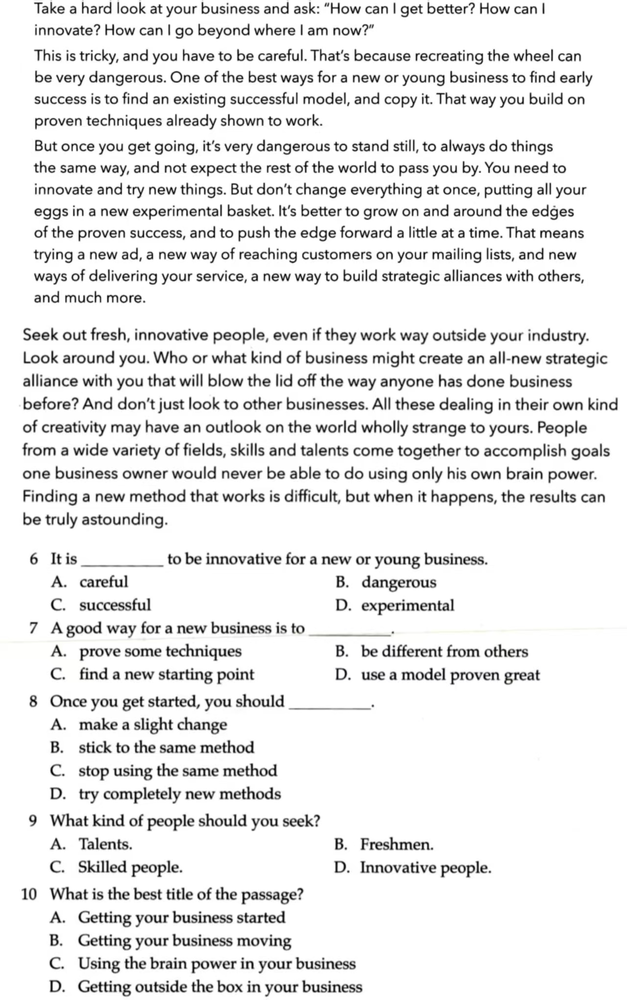
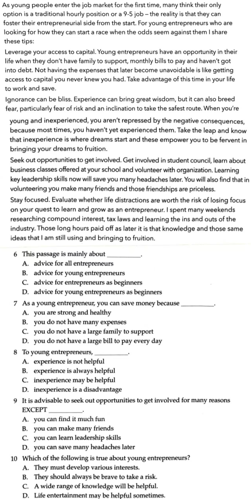
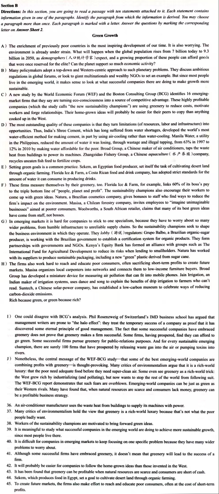
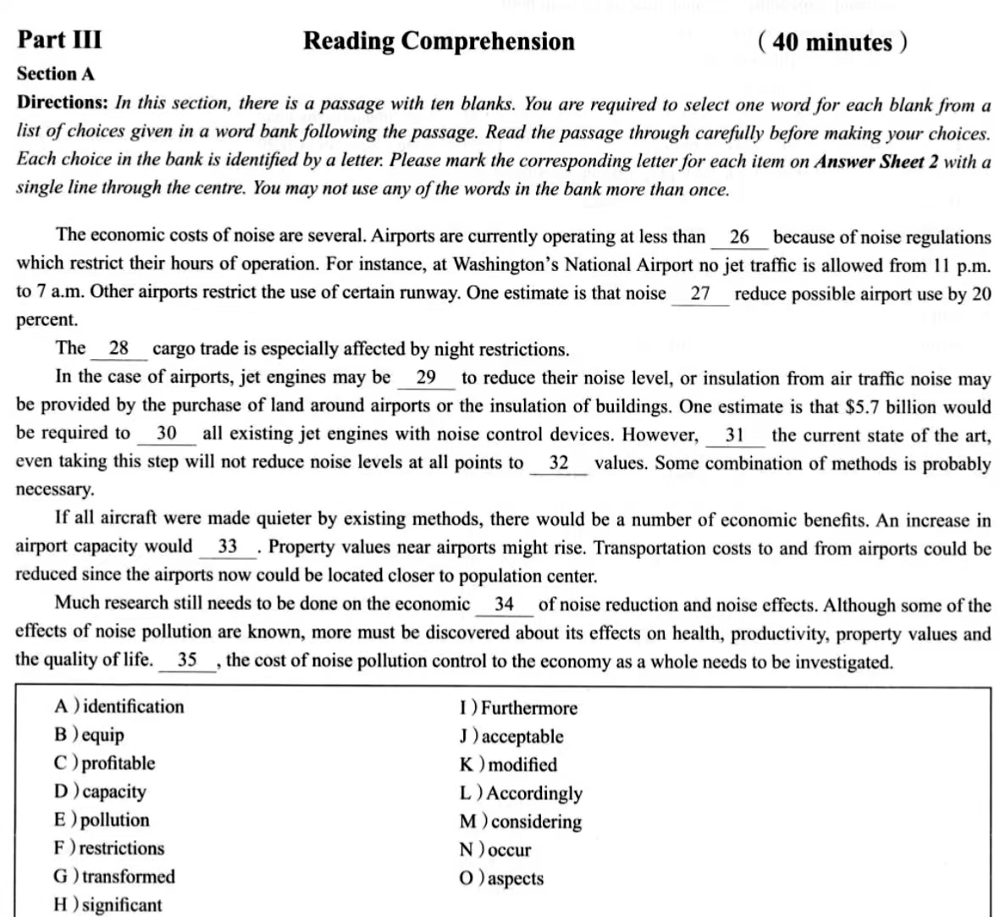

# 大学英语

- 时间：14:30 - 16:30
- 地点：中心楼 612-614
- 监考老师：赵雪、王丽

## 听力

暂无

## 阅读（4 选 2）

### 第一篇

::: details 原题

:::

> Take a hard look at your business and ask ...

- B (dangerous)
- D (use a ...)
- A (make a ...)
- D (Innovation people)
- D (Getting outside ...)

### 第二篇

::: details 原题

:::

> Information and communication technology has changed ...

- B (The appearance of ...)
- A (social media)
- B (Internet users ...)
- D (... candidates)
- D (lack intimacy)

### 第三篇

::: details 原题

:::

> Social media is all about ...

- C (make people ...)
- A (He is the independent ...)
- C (... half ...)
- D (Do not spend ...)
- D (The hidden ...)

### 第四篇

::: details 原题

:::

> As young people enter the job ...

- D (... young entrepreneurs as ...)
- B (... expenses)
- C (... may be ...)
- A (... find it ...)
- C (A wide ...)

## 段落匹配（2 选 1）

### 第一篇

::: details 原题

:::

D, J(many), F(worker), B, G, I, C, J, E, H

### 第二篇

::: details 原题

暂无

:::

C, A, G, B, E, H, D, I, J, F(chen make)

## 完形填空（2 选 1）

### 第一篇

::: details 原题

暂无

:::

> Humans use water ...

G, L, I, O, H, F, E, A, J, D

### 第二篇

::: details 原题

:::

> The economic costs of noise are several ...

D, F, C, K, B, M, J, N, O, I

## 作文（3 选 1）

### 第一篇

> The use of social media and its impact on college students.

### 第二篇

> How to deal with mental health problems correctly.

### 第三篇

> How to make good use of university resonices.

## 翻译（3 选 1）

### 第一篇

> 据报道，中国已成为世界上最大的智能手机市场之一。移动设备的低成本和移动网络的快速增长刺激了中国智能手机市场的发展。据估计，超过半数的中国网民（netizen）首选智能手机上网。2013 年，中国智能手机使用者占所手机用户的 43%。2015 年，约 70% 的中青年人选用智能手机。到 2018 年，这一比例上升至 80%。

### 第二篇

> 2016 年 7 月 29 日，以“青年·未来”为主题的星巴克（Starbucks）中国青年领导力发展项目总决赛在北京举行。10 名中国大学生荣膺“年度星巴克青年领袖”称号。该项目始于 2014 年 11 月其训练营吸引了来自全国 10 所大学的 500 名学生参加。训练营旨在提升营员的管理技能。

### 第三篇

> 截止到 2016 年底，中国有 15% 的人口年龄超过了 60 岁。预计中国老年人口每年还要增长约 1,000 万。这对中国是一个挑战，因为中国的养老产业尚未充分发展。不仅如此，区域经济发展不平衡、城乡差别等因素又使中国的养老需求多元而庞杂。因此，随着人口老龄化的不断加快，中国必须尽快找到适当的养老方式。
