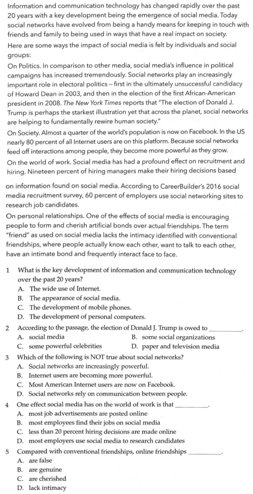

# 大学英语

- 时间：14:30 - 16:30
- 地点：中心楼 612-614
- 监考老师：赵雪、王丽

## 听力

### Unit 1

#### Section A

01. C) It sent two dogs to the wrong destinations.
02. A) Correct their mistake as soon as possible.
03. A) Ship traffic in the Atlantic.
04. D) They may be affecting the world's climate.
05. D) Old taxis were replaced with new cabs.
06. A) All taxis began to use meters.
07. B) All new cabs provide air-conditioning.

#### Section B

08. A) She wanted to save for a new phone.
09. D) They are less aware of the value of their money.
10. B) More non-essential things.
11. C) It may lead to excessive spending.
12. D) From a professional interior designer.
13. B) She is well informed about the design business.
14. C) The cost was affordable.
15. B) She wants him to share his renovation experience with her.

#### Section C

16. D) The change in people's immune system as they get older.
17. B) Offer blood samples.
18. C) Helping improve old people's health conditions.
19. A) To solve word search puzzles.
20. B) They could no longer concentrate on their task.
21. C) A reduction in the amount of sleep.
22. B) Reading to their children is important.
23. D) The quality and quantity of time parents spend playing with them.
24. D) Books with specifically labeled images.
25. C) Choose carefully what to read to their children.

### Unit 2

#### Section A

01. C) Less than 3 million.
02. B) To protect people from being attacked by hackers.
03. A) The melting of the entire glacier in Greenland.
04. C) Warmer air temperatures.
05. C) France.
06. C) The cost of education is lower.
07. B) To improve its economic competitiveness.

#### Section B

08. A) Disappointed  
09. D) They have two books left in another store.
10. D) Pay the reservation fee.
11. C) Fill in the customer card.
12. C) He used to work out with the woman.
13. D) She felt tired and lonely.
14. A) Help the clients re-evaluate their lives.
15. A) To ask for professional advice.

#### Section C

16. C) The widespread use of color in commerce and art.
17. A) It made the mass production of color possible.
18. C) German immigrants brought it there.
19. D) The reason is not clear to us.
20. C) The subjects can easily fall asleep when imagining a soothing scene.
21. D) Imagine soothing images before sleep.
22. C) The temperature has reached a new high this month.
23. C) Global warming as well as natural climate variability.
24. B) High food prices.
25. D) The annual bushfire.

### Unit 3

#### Section A

01. D) It started from Turkey.
02. B) They went to Europe by sea.
03. B) Serena Williams was pronounced Sportsperson of the year.
04. C) They raised a number of complaints.
05. D) It would keep prices steady.
06. C) Less than 1%.
07. A) The economy would react badly.

#### Section B

08. B) He has missed too many classes.
09. A) He has a part-time job.
10. B) It's the last day Steve can drop the class with a full refund.
11. A) Drop the class.
12. B) Most people are reducing their consumption.
13. A) Electrical appliances.
14. B) 90 per cent of them are reasonable.
15. C) Two to three weeks.

#### Section C

16. A) It is an international organization.
17. B) To help the wounded in the battle.
18. B) Teaching first aid to the public.
19. C) People who will retire in a few years are the target students.
20. B) Retired people.
21. A) They can attend any courses for free.
22. D) It is provided only in the evening.
23. B) They know clearly what they want to learn.
24. A) The knowledge of teachers.
25. D) English for businessman.

### Unit 4

#### Section A

01. C) Cease building new coal power plants.
02. B) Market force.
03. C) 13
04. C) By sea.
05. D) Protecting the Great Barrier Reef.
06. C) Sediment has been down 12 percent.
07. C) Excited.

#### Section B

08. B) Interviewing a person for a job.
09. D) How much the job pays.
10. C) He has classes earlier in the day.
11. C) To fill in an application form and hand it back.
12. D) To raise funds for a hospital.
13. A) In tents.
14. C) Serve refreshments.
15. B) He feels it would be worthwhile.

#### Section C

16. B) Only a few people had them.
17. A) They were a symbol of wealth.
18. C) The availability of watches increased.
19. C) To prevent car accidents.
20. D) It bases its analysis on the driver's heartbeat.
21. B) It sounds an alarm to warn the driver.
22. C) Familiarizing new students with the campus.
23. D) A campus map.
24. D) In the cafeteria.
25. B) Find their classrooms.

### Unit 5

#### Section A

01. B) Guests can go direct to their rooms.
02. A) 2
03. A) He will be sent back even if he is unfit to stand trial.
04. D) Having his wife killed.
05. C) Their parents failed to pay for school lunch.
06. B) They were surprised.
07. C) On Monday.

#### Section B

08. A) She is environmentally-concerned.
09. C) Diana has taken a class on environmental engineering.
10. A) It makes the fuel burn more efficiently.
11. D) Better environment.
12. A) The hotel confused him with another guest.
13. C) There was a conference going on.
14. C) There is a roll-away bed.
15. B) A honeymoon suite for $225 for the night and free breakfast of western style.

#### Section C

16. A) Watching TV can cause physical diseases.
17. D) Television in itself is neither good nor bad.
18. C) How people put it to use.
19. D) He was extremely anxious about its negative effect.
20. C) He was becoming very difficult to be with in 1804.
21. B) He remained single all his life.
22. A) About 1920.
23. D) Over 2.5 million.
24. B) Soybean.
25. A) Corn.

### Unit 6

#### Section A

01. C) The amount of it grows in winter and shrinks in summer.
02. C) It is hard to identify.
03. B) It is warming at a quicker pace that elsewhere.
04. D) The sea-level rise is accelerating.
05. B) Hydrogen might be turned into a metal.
06. A) By compressing it to 4.9 million times atmospheric pressure.
07. C) Most of them work only at extremely cold temperatures.

#### Section B

08. A) He is applying for a job.
09. A) Because he does not want his college education to be useless.
10. C) How to understand the needs of the poor.
11. B) It is natural.
12. B) Because people in that period believed in the power of mankind.
13. B) He was one of the drafters of the Declaration of Independence.
14. D) He was a successful statesman and scientist.
15. A) So far as you work hard, you can make your dream come true.

#### Section C

16. A) A new exhibition to explore the significance of selfies as an art form.
17. C) A shift in society using technology as a means of self-expression.
18. C) The smartphone.
19. A) A punishing figure.
20. B) They try to run away.
21. B) In Austrian folklore.
22. C) The key to learning English speaking.
23. D) More input.
24. A) Because they tend to think in their native language.
25. B) It is a skill and should be trained.

## 阅读（4 选 2）

### 第一篇

::: details 原题

:::

> Take a hard look at your business and ask ...

- B (dangerous)
- D (use a ...)
- A (make a ...)
- D (Innovation people)
- D (Getting outside ...)

### 第二篇

::: details 原题

:::

> Information and communication technology has changed ...

- B (The appearance of ...)
- A (social media)
- B (Internet users ...)
- D (...candidates)
- D (lack intimacy)

### 第三篇

::: details 原题

:::

> Social media is all about ...

- C (make people ...)
- A (He is the independent ...)
- C (...half ...)
- D (Do not spend ...)
- D (The hidden ...)

### 第四篇

::: details 原题

:::

> As young people enter the job ...

- D (...young entrepreneurs as ...)
- B (...expenses)
- C (...may be ...)
- A (...find it ...)
- C (A wide ...)

## 段落匹配（2 选 1）

### 第一篇

::: details 原题

:::

D, J(many), F(worker), B, G, I, C, J, E, H

### 第二篇

::: details 原题

暂无

:::

C, A, G, B, E, H, D, I, J, F(chen make)

## 选词填空（2 选 1）

### 第一篇

::: details 原题

暂无

:::

> Humans use water ...

- G (available)
- N (raising)
- I (unevenly)
- O (supply)
- H (determined)
- F (distribution)
- E (negative)
- A (access)
- J (unfit)
- D (compete)

### 第二篇

::: details 原题

:::

> The economic costs of noise are several ...

- D (capacity)
- F (restrictions)
- C (profitable)
- K (modified)
- B (equip)
- M (considering)
- J (acceptable)
- N (occur)
- O (aspect)
- I (Furthermore)

## 作文（3 选 1）

### 第一篇

> The use of social media and its impact on college students.

### 第二篇

> How to deal with mental health problems correctly.

### 第三篇

> How to make good use of university resonices.

## 翻译（3 选 1）

### 第一篇

> 据报道，中国已成为世界上最大的智能手机市场之一。移动设备的低成本和移动网络的快速增长刺激了中国智能手机市场的发展。据估计，超过半数的中国网民（netizen）首选智能手机上网。2013 年，中国智能手机使用者占所手机用户的 43%。2015 年，约 70% 的中青年人选用智能手机。到 2018 年，这一比例上升至 80%。

### 第二篇

> 2016 年 7 月 29 日，以“青年·未来”为主题的星巴克（Starbucks）中国青年领导力发展项目总决赛在北京举行。10 名中国大学生荣膺“年度星巴克青年领袖”称号。该项目始于 2014 年 11 月其训练营吸引了来自全国 10 所大学的 500 名学生参加。训练营旨在提升营员的管理技能。

### 第三篇

> 截止到 2016 年底，中国有 15% 的人口年龄超过了 60 岁。预计中国老年人口每年还要增长约 1,000 万。这对中国是一个挑战，因为中国的养老产业尚未充分发展。不仅如此，区域经济发展不平衡、城乡差别等因素又使中国的养老需求多元而庞杂。因此，随着人口老龄化的不断加快，中国必须尽快找到适当的养老方式。

## 总结

<iframe src="/XASYU/Second/2025-07-01/01.大学英语.html" width="100%" height="600" style="border:none;"></iframe>
