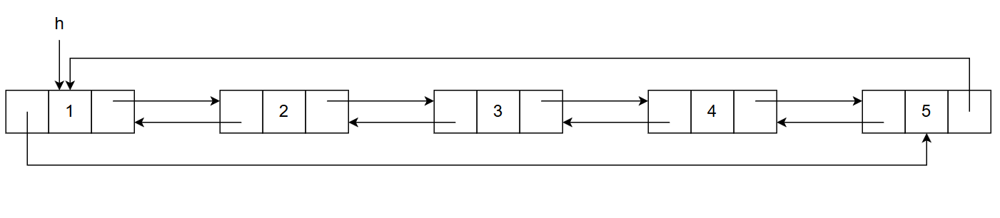
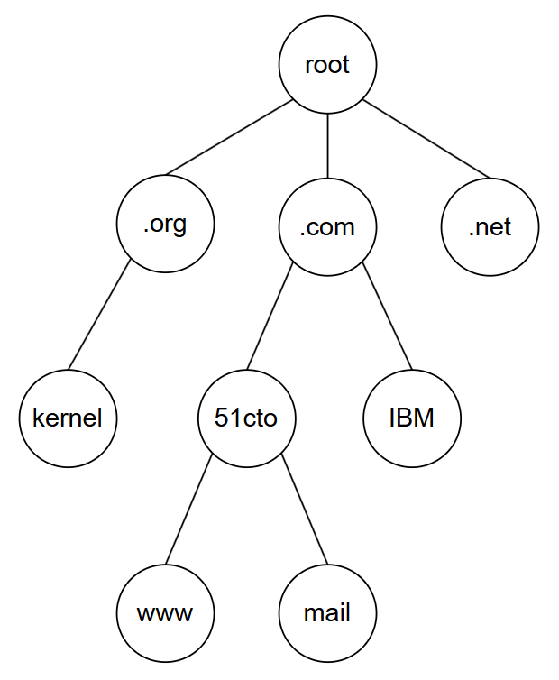
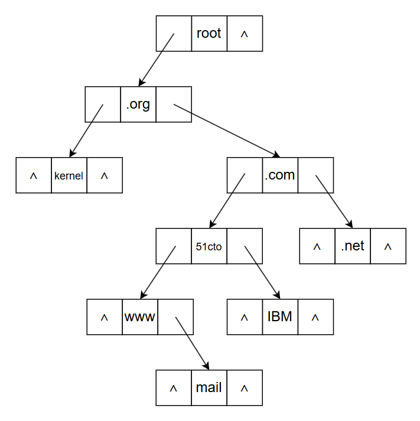
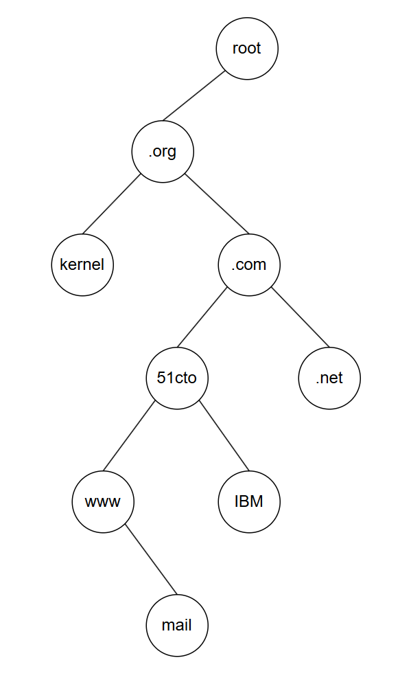
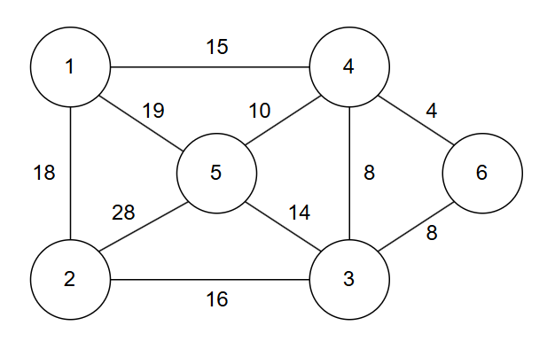
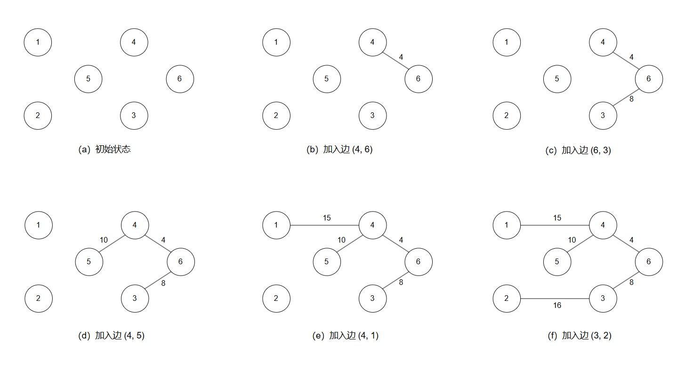

# 数据结构

- 考试题型：四道大题（情景题）
- 时间：14:40 - 16:40
- 地点：西楼 - 507
- 监考老师：肖剑波、张宝移

## 第一大题

电信学院某班级在教室举办新年元旦晚会，要求每位同学出一个节目，将全体同学排成一个圆圈就坐，选取其中一个同学将其设置为编号 1，依次按照逆时针方向进行编号，编号最大值为 10（最后一人，其右侧人编号为 1），形成约瑟夫环。从编号为 1 的同学开始报数，报数到 m，选出去上台表演节目，接着从下一个未参加过表演的同学继续报数，依次上台表演，直到所有同学都表演完节目。请结合场景完成以下题目。

### 第一小题

> 若要求用算法模拟此约瑟夫环问题，你会选择什么数据结构实现？并给出存储结构的结构定义（用C语言描述）。

对于约瑟夫环问题，可以采用顺序表、单循环链表或双循环链表数据结构实现。以下三种存储结构任选一种可得分。

1. 顺序表的存储结构定义：

    ```c
    #define MAXSIZE 100     //线性表的最大长度

    typedef struct {
        ElemType elem[MAXSIZE];
        int last;
    }SqList;
    ```

2. 单链表存储结构定义：

    ```c
    typedef struct Node{
        ElemType data;
        struct Node* next;
    }Node;
    ```

3. 双向链表存储结构定义：

    ```c
    typedef struct DNode{
        ElemType data; 
        struct DNode *prior, *next;
    }DNode;
    ```

### 第二小题

> 若采用双向循环链表实现，请画出此链表（假设学生人数 n = 5 人）。



### 第三小题

> 若指针 p 已遍历到要出圈表演的同学，请在横线处完成下列删除结点 p 的语句。

```c
int DlinkDel(DoubleList L, int i, ElemType* e) {
    DNode* p;
    *e = p->data;
    p->prior->next = p->next; // [!code focus]
    p->next->prior = p->prior; // [!code focus]    
    free(p);
}
```

## 第二大题

互联网域名系统是一个典型的树层次结构。从根节点往下的第一层是顶层域，如 cn、com 等，最底层（第四层）是叶子节点，如 www 等。因此，域名搜索可以看成是树的遍历问题。请结合场景完成以下题目。



### 第一小题

> 若在设计搜索互联网域名程序时，采用孩子兄弟链表存储结构，请画出该链表。



### 第二小题

> 为方便搜索操作，将此互联网域名的树形结构转化为二叉树，请画出此二叉树，并分别写出二叉树的先、中、后序遍历序列。



- 先序遍历序列：root、org、kernel、com、51cto、www、mail、IBM、net；
- 中序遍历序列：kernel、org、www、mail、51otc、IBM、com、net、root；
- 后序遍历序列：kernel、mail、www、IBM、51cto、net、com、org、root；

## 第三大题

为改善某地区城乡居民的生活条件，某天然气公司计划在 A 地区的 6 个县城间铺设天然气管道，要求各县城都能互通，且成本最小。



### 第一小题

> 假设铺设天然气管道的单位造价相同，为使总造价最低，请利用克鲁斯卡尔法画出所有方案对应的最小生成树。

- 方案一

    

- 方案二

    

### 第二小题

> 已知各县城间铺设管道的成本为以下序列 `{20, 16, 30, 8, 36, 18, 21, 25, 12, 32}`，为得到该序列的升序排列结果，请按照简单选择排序算法写出前五趟排序结果。

- 第1趟：`8, {16, 30, 20, 36, 18, 21, 25, 12, 32}`
- 第2趟：`8, 12, {30, 20, 36, 18, 21, 25, 16, 32}`
- 第3趟：`8, 12, 16, {20, 36, 18, 21, 25, 30, 32}`
- 第4趟：`8, 12, 16, 18, {36, 20, 21, 25, 30, 32}`
- 第5趟：`8, 12, 16, 18, 20, {36, 21, 25, 30, 32}`

### 第三小题

> 按照简单选择排序算法编写函数 `void selectsort(float a[], int n)` 升序排列上述成本序列，注意：`a[1] ~ a[n]` 分别存放各个成本的值。

```c
void selectsort(float a[], int n) {
    int i, j, k;
    float t;
    for (i = 1; i <= n - 1; i++) {
        k = i;
        for (j = i + 1; j <= n; j++) {
            if (a[k] > a[j]) {
                k = j;
            }
        }
        if (k != i) {
            t = a[i];
            a[i] = a[k];
            a[k] = t;
        }
    }
}
```

## 第四大题

某小区因场地受限，采用了旋转立体停车库的方案，该停车库共有 10 个车位，通过自动化系统存放或取出车辆，使用循环队列存储车辆存放情况，车位结构体包括车牌号、车位号，即循环队列的数据元素为车位结构体，该循环队列的最大长度为 10。另外，使用车位状态数组（一维数组）存储每个车位的占用情况。

存车时，先判断循环队列是否已满，若满即代表所有车位均被占用；若未满，则从车位状态数组中查找未被占用的车位号，再在循环队列的队尾存入车牌号、车位号，并更新队尾位置，更新相应的车位状态为被占用。

取车时，先判断循环队列是否为空，若为空则代表所有车位均未被占用，若不为空，则从循环队列的队头元素开始检索车牌号。若队头元素不是待取车辆，则将队头元素出队（包括取出车牌号、车位号，将队头车位结构体置空等操作），修改队头位置，再将取出的车牌号、车位号加入循环队列的队尾，同时修改队尾位置；直至队头元素是待取车辆，则从队头取出车牌号、车位号，循环队列更新队头位置，同时修改一维数组中相应车位的状态。请结合上述场景完成以下题目。

### 第一小题

> 不考虑物理控制部分，补全以下能实现上述算法的头文件、结构体定义或初始化停车队列的代码。

```c
#include <stdio.h>
#include <stdbool.h>
#include <string.h>
#define MAX_PS 10   //最大车位数
#define LP_LEN 15   //车牌号最大长度

// 车位结构体
typedef struct {
    char lp [LP_LEN];     // 车牌号
    int  snum;            // 车位号
} PSpot;

// 停车队列（循环队列）结构体
typedef struct {
    PSpot spots[MAX_PS];  // 停车位数组
    int front;
    int rear;
    int count;  // 队头、队尾指针及当前占用车位数量
} ParkingQueue;

// 用于存储车位占用情况
bool parking_status[MAX_PS]; // true 表示占用，false 表示空位

// 初始化停车队列
void initialize_queue(ParkingQueue* queue) {
    queue->front = 0;
    queue->rear = 0;
    queue->count = 0;
    for (int i = 0; i < MAX_PS; i++) {
        parking_status[i] = false;   // 初始化为空
    }
}
```

- 第一空：`string.h`
- 第二空：`char lp [LP_LEN];`
- 第三空：`int  snum;`
- 第四空：`PSpot spots[MAX_PS];`
- 第五空：`queue->front = 0;`
- 第六空：`queue->rear = 0;`
- 第七空：`int i = 0; i < MAX_PS; i++`

### 第二小题（18 分）

> 不考虑物理控制部分，依据上述算法描述设计存车的算法代码。要求应使用第 1 小题中定义的结构体或变量，在存车成功后应提示将该车辆存入了哪个车位。

```c
int park_car(ParkingQueue* queue, const char* lp) {
    //判断车库是否已存满
    if ( queue->count == MAX_PS ) {
        printf("停车库已满，无法存车。\n");
        return -1;
    }
    // 查找第一个空车位
    for (int i = 0; i < MAX_PS; i++) {
        if (!parking_status[i]) {
            // 找到空车位
            strcpy(queue->spots[queue->rear].lp, lp);
            queue->spots[queue->rear].snum = i + 1;
            parking_status[i] = true; // 更新状态为占用
            queue->rear = (queue->rear + 1) % MAX_PS;
            queue->count++;
            printf("车辆 %s 停入车位 %d。\n", lp, i + 1);
            return 1; // 返回车位号
        }
    }
    return -1; // 理论上不应该执行到这里
}
```
