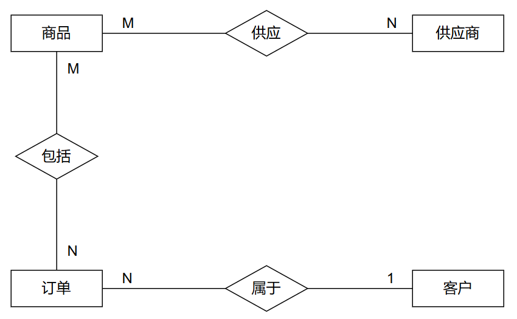

# 数据库原理及应用

- 考试题型：四道大题（情景题）
- 时间：8:10 - 10:10
- 地点：西楼 - 507
- 监考老师：任雨、杨洪涛

## 第一大题（共 20 分）

场景一：环保产品的商品管理和销售的数据库系统

### 系统构成

> 第一小题（10 分）
>
> 数据库系统由哪些部分构成？分别描述其功能。

- **数据库系统的组成**：

  1. **计算机硬件系统**：提供数据库系统运行的物理基础，包括服务器、存储设备、网络设备等，确保系统稳定高效运行。

  2. **计算机软件系统**：

      - **操作系统**：提供数据库运行的软件环境，负责资源分配与进程调度。

      - **数据库管理系统（DBMS）**：核心软件，负责存储、检索、更新与管理数据；DBMS 提供了一系列工具和功能，如数据定义语言 DDL 数据操作语言 DLL 数据控制语言 DCL 等，以支持数据库的创建、查询、更新和删除操作。

      - **应用开发工具**：用于开发数据库应用的工具，如编程语言 Java、Python，开发框架 Spring、Django 等。

      - **应用系统**：面向用户的前端程序，负责实现具体功能，如供应商管理、商品管理、订单管理、客户管理等，通过调用 DBMS 提供的接口与数据库进行交互，实现数据的增删改查操作。

  3. **数据库**：存储系统所有的核心数据，如供应商信息、商品信息、订单信息等；数据库是系统的数据仓库，为其他部分提供数据支持。

  4. **用户**：数据库系统的使用者，如供应商、普通客户、系统管理员等，通过应用系统访问数据库进行数据的录入、查询和修改等操作。

### 实体与属性分析

> 第二小题（10 分）
>
> 针对题目给出的场景，分析系统的实体及其属性。

- **商品实体（Product）**：
  - 属性：商品ID、名称、类别、价格、库存量、环保等级、是否有机。

- **供应商实体（Supplier）**：
  - 属性：供应商ID、名称、联系方式、地址、环保认证情况。

- **客户实体（Customer）**：
  - 属性：客户ID、姓名、联系方式、地址。

- **订单实体（Order）**：
  - 属性：订单ID、客户ID、下单时间、订单状态、支付状态、环保商品标识。

## 第二大题（共 30 分）

### ER 图设计

> 第一小题（10 分）
>
> 根据分析出的实体及其属性，绘制ER图。  

- ER 图需包含以下关系：
  - 供应商与商品：多对多。
  - 商品与订单：多对多。
  - 客户与订单：一对多。

- 图中需标明联系类型（如一对多、多对多），属性无需画出。

  

### 关系模式设计

> 第二小题（8 分）
>
> 将 ER 图转换为关系模式，并判断是否满足第三范式。
>
> 这里主键使用加粗表示，外键使用斜体表示，既是主键又是外键则加粗且斜体
>
> 实际上主键使用下划线，外键使用波浪线

1. 关系模式：

    - 商品（**商品ID**，名称，类别，价格，库存量，环保等级，是否有机）
    - 供应商（**供应商ID**，名称，联系方式，地址，环保商品标识）
    - 客户（**客户ID**，姓名，联系方式，地址）
    - 订单（**订单ID**，*客户ID*，下单时间，订单状态，支付状态）
    - 订单详情表（***订单ID***，***商品ID***，购买数量，单价）
    - 供应表（***供应商ID***，***商品ID***，供应日期）

2. 是否满足第三范式

    - 在上述的关系模式中均不存在部分依赖和传递依赖，转换出的关系模式满足第三范式。

### SQL 语句创建表

> 第三小题（12 分）
>
> 根据设计的关系模式，编写 SQL 语句创建表结构。

1. **商品表（Product）**

    ```sql
    create table Product (
        ProductID int primary key,
        Name nvarchar(255) not null,
        Category nvarchar(255),
        Price decimal(18, 2) not null,
        Stock int not null,
        EcoLevel nvarchar(255),
        IsOrganic bit
    );
    ```

2. **供应商表（Supplier）**

    ```sql
    create table Supplier (
        SupplierID int primary key identity(1,1),
        Name nvarchar(255) not null,
        Contact nvarchar(255),
        Address nvarchar(255),
        EcoCert nvarchar(255)
    );
    ```

3. **客户表（Customer）**

    ```sql
    create table Customer (
        CustomerID int primary key identity(1,1),
        Name nvarchar(255) not null,
        Contact nvarchar(255),
        Address nvarchar(255)
    );
    ```

4. **订单表（Order）**

    ```sql
    create table OrderTable (
        OrderID int primary key identity(1,1),
        CustomerID int not null,
        OrderDate datetime not null default getdate(),
        OrderStatus nvarchar(50),
        PaymentStatus nvarchar(50),
        foreign key (CustomerID) references Customer(CustomerID)
    );
    ```

5. **订单详情表（Shipment）**

    ```sql
    create table Shipment (
        OrderID int,
        ProductID int,
        Quantity int not null,
        UnitPrice decimal(18, 2) not null,
        primary key (OrderID, ProductID),
        foreign key (OrderID) references OrderTable(OrderID),
        foreign key (ProductID) references Product(ProductID)
    );
    ```

6. **供应表（Supply）**

    ```sql
    create table Supply (
        SupplierID int,
        ProductID int,
        SupplyDate date not null,
        primary key (SupplierID, ProductID),
        foreign key (SupplierID) references Supplier(SupplierID),
        foreign key (ProductID) references Product(ProductID)
    );
    ```

## 第三大题（共 30 分）

场景二：学校开发点餐服务系统，方便管理的同时还要实现为全校学生伙食费进行部分补贴，为经济困难的学生伙食费进行限额补贴，并能够完成学校财务与食堂的结算功能。

然后会给你三个表：

- 学生信息表：学号、姓名、性别、班级、是否为贫困生、备注（可控字段）
- 菜单表：菜品编号、菜名价格
- 订单表：学号、菜品编号、点餐时间、点餐学期、是否完成订单

### 查询与插入操作

> 第一小题（18 分）

1. **根据菜品名称查询菜单编号（4 分）**

    ```sql
    select menu_id
    from t_menu
    where dish_name = '鱼香肉丝盖饭';
    ```

2. **向订单表中插入记录（4 分）**

    ```sql
    insert into t_orders (student_id, dish_id, order_date, term, completed)
    values ('sy0110153', 1851, 2024-12-30, '2024-2025-1', false);
    ```

3. **违反参照完整性约束时的错误处理（2 分）**  
    - 如果学生表中没有 `student_id` 或菜单表中没有 `menu_id`，插入操作将失败，因违反参照完整性约束。

4. **创建存储过程实现插入操作（4 分）**

    ```sql
    create procedure insert_order
        @student_id nvarchar(255),
        @menu_id int,
        @order_date datetime,
        @term nvarchar(50)
    as
    insert into t_orders (student_id, menu_id, order_date, term, completed)
    values (@student_id, @menu_id, @order_date, @term, false);
    ```

    - 第一空：`create` 后面加 `procedure`
    - 第二空：`@menu_id` 后面加类型 `int`
    - 第三空：`as`
    - 第四空：`values` 括号中的值，注意要加 `@`

5. **删除订单（4 分）**  

    ```sql
    delete from t_orders
    where student_id = 'sy0110153'
    and menu_id = 1851
    and completed = false;
    ```

### 更新操作

> 第二小题（4 分）
>
> 更新菜单价格

```sql
update t_menu
set price = price * 1.1;
```

### 设计查询语句与视图

> 第三小题（8 分）
>
> 查询符合条件的贫困生

1. 统计上学期点餐次数超过 300 次，且总费用小于 3000 元的学生（5 分）  

    ```sql
    select student_id, count(*) as order_count, sum(price) as total_amount
    from t_orders
    join t_menu
    on t_orders.menu_id = t_menu.menu_id
    where term = '2023-2024-2'
    group by student_id
    having order_count >= 300 and total_amount < 3000;
    /*
      使用 count(*) 统计每个学生的订单总数，并将结果命名为 order_count。
      使用 sum(price) 计算每个学生的点餐总费用，并将结果命名为 total_amount。
      将 t_orders 表与 t_menu 表连接，用于查询菜品的价格。
      定义两个表的连接条件：t_orders.menu_id 和 t_menu.menu_id 的值相等。
      指定查询条件，过滤出学期为 2023-2024-2 的订单记录。
      按照学生的学号 student_id 对结果进行分组。
      最后筛选分组后的数据。
    */
    ```

    - 第一空：count
    - 第二空：t_orders.menu_id = t_menu.menu_id
    - 第三空：term
    - 第四空：student_id
    - 第五空：having order_count

2. 非贫困生支付 92% 的菜品价格，剩余部分由学校补贴（3 分）

    ```sql
    create view NonPoorSubsidy as
    select student_id, sum(Price * 0.08) as SubsidyAmount
    from t_orders -- 指定查询的数据来源表
    join t_menu
    on t_orders.menu_id = t_menu.menu_id
    where is_poor = false
    group by student_id;
    /*
      创建一个名为 NonPoorSubsidy 的视图。
      使用 sum 函数将每位学生所有订单的补贴金额相加，作为 SubsidyAmount。
      仅查询 is_poor 为 false 的学生，即非贫困生的订单。
    */
    ```

    - 第一空：create
    - 第二空：view
    - 第三空：false

## 第四大题（共 20 分）

场景三：某公司进行了一次完整备份之后，数据库管理员发现了一个 SQL 注入攻击，部分商品的价格被恶意篡改。

解释一下，就是之前进行了一次完整备份，后来这个数据库被攻击了，所以又进行了一次差异备份的这个场景。
然后现在问你为什么这个场景中需要进行差异备份进行恢复。

### 简答题

> 第一小题（10 分）
>
> 简述备份类型及其使用场景

1. **完整备份与差异备份的区别（5 分）**  

    - **完整备份**：备份整个数据库的所有数据，包括表、索引、存储过程等，完整备份是独立的，不依赖于其他备份。  
    - **差异备份**：备份自上次完整备份以来数据库中发生变更的所有数据，差异备份依赖最近一次的完整备份。

2. **差异备份的适用场景（5 分）**

    - 当数据量较大且变更范围较小时，使用差异备份可减少存储需求并加快恢复速度。
    - 在这个场景中，由于已经进行了完整备份，并且之后只发生了部分数据的篡改，因此使用差异备份。只恢复篡改之前的数据状态，而不需要恢复整个数据库，从而节省了恢复时间和存储空间。

### 备份与恢复

> 第二小题（10 分）
>
> 编写备份与恢复的 SQL 语句
>
> 注意这里的数据库名和路径只是做一个演示，和题目中给出的并不一致

1. **备份操作（5 分）**

    - 完整备份：

        ```sql
        backup database SchoolDB
        to disk = 'C:\Backup\FullBackup.bak'
        with init;
        ```

    - 差异备份：

        ```sql
        backup database SchoolDB
        to disk = 'C:\Backup\DiffBackup.bak'
        with differential;
        ```

2. **恢复操作（5 分）**

    - 恢复完整备份：  

        ```sql
        restore database SchoolDB_Backup
        from disk = 'C:\Backup\FullBackup.bak'
        with norecovery; -- 将数据库保持在“还原模式”状态，等待后续的还原操作。
        ```

    - 恢复差异备份：  

        ```sql
        restore database SchoolDB_Backup
        from disk = 'C:\Backup\DiffBackup.bak'
        with recovery; -- 将数据库恢复到可用状态，并完成还原操作。
        ```
