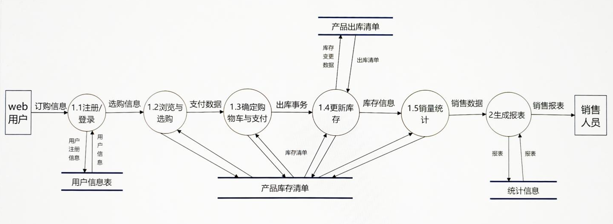
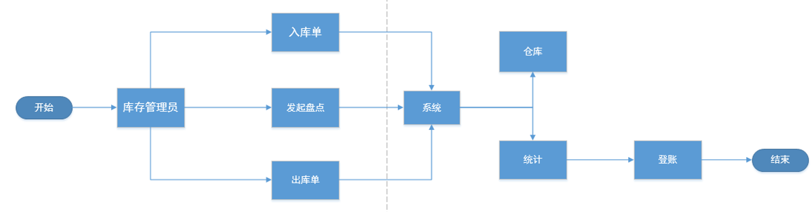
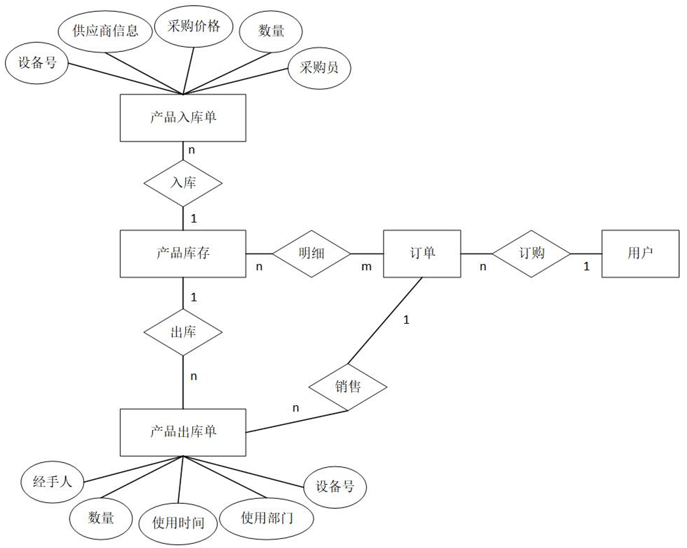
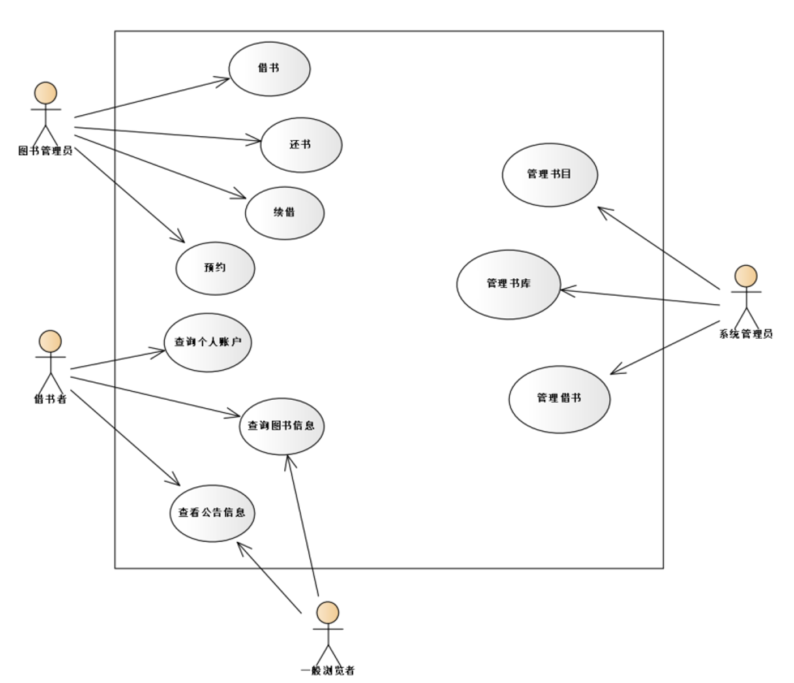
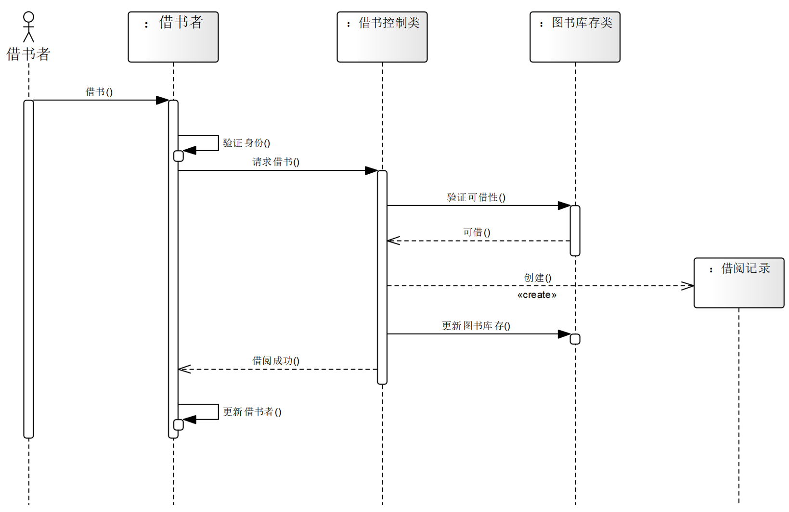

# 软件工程

- 考试题型：四道大题
- 时间：8:10 - 10:10
- 地点：东楼 - 210
- 监考老师：卢启领、周函蒨

## 第一大题（共 35 分）

> Web 商品进销存信息系统

### 第一小题（8 分）

> 假如你是软件需求分析师，经过多次需求调研，对 Web 商品进销存信息系统的业务流程进行分析。请用文字描述一下该系统当中包括哪些功能？

- **用户管理**：实现用户权限分配和身份验证。
- **商品管理**：提供商品的入库、出库、修改、删除和查询等功能。
- **库存管理**：实时更新库存数据，提供库存查询、盘点、库存预警等功能。
- **订单处理**：管理采购和销售订单，包括在线订购。
- **财务管理**：记录销售、采购等财务数据，生成账单和报表，支持结算操作。
- **统计报表**：提供各种查询、统计、图表展示功能，帮助分析库存、销售等数据。
- **数据操作**：支持增、删、改、查等操作，确保数据的准确性和一致性。

### 第二小题（7 分）

> 在认真调查分析有关信息需求的基础上，通过对网上订购子系统业务流程分析，请画出“网上订购”部分的数据流程图。



### 第三小题（7 分）

> 库存管理业务主要处理商品的入库、出库、登账、盘点、统计等操作，请结合功能需求分析，画出库存管理子系统的业务流程图。



### 第四小题（7 分）

> 数据字典是系统中各类数据描述的集合，请给出“商品入库单”的数据字典描述。

- **数据项**
  - **名字**：入库单号
  - **别名**：序号
  - **描述**：唯一标识某商品入库的数字编号
  - **定义**：整型数
  - **位置**：商品入库表、商品入出库表

- **数据结构**
  - **名字**：商品入库单
  - **别名**：商品生产量
  - **描述**：记录商品入库详细信息的单据
  - **定义**：`商品入库单 = 入库单号 + 商品编号 + 商品名称 + 规格型号 + 数量 + 单价 + 总金额 + 供应商编号 + 入库日期 + 仓库位置 + 经办人 + 备注`
  - **位置**：保存到数据库的入库单表中，可能也会打印保存

- **数据流**
  - **名字**：入库单数据流
  - **来源**：采购部门或供应商
  - **平均流量**：根据企业规模和业务量变化
  - **去向**：库存管理系统，用于更新库存信息

- **数据存储**
  - **名字**：入库单存储
  - **输入**：入库单数据流
  - **输出**：库存更新数据流，用于财务和销售部门
  - **数据结构**：包含商品入库单的所有字段，如入库单号、商品信息、供应商信息等

- **处理过程**
  - **名字**：入库单处理
  - **输入**：入库单数据流
  - **输出**：更新后的库存信息，入库单记录
  - **处理**：接收入库单信息，验证数据完整性和准确性，更新库存数据库，记录入库单信息，生成相关报表和通知

### 第五小题（6 分）

> 数据库结构设计的好坏将直接对 Web 进销存系统的效率产生影响，请根据实体联系分析画出进销存系统的 E-R 图。



## 第二大题

> 图书信息管理系统

### 第一小题（8 分）

> 结合问题描述，给出图书信息管理系统的用例视图。



### 第二小题（7 分）

> 图书信息管理系统为借阅者提供了便捷的借阅服务，请使用时序图对借书功能进行动态建模。



### 第三小题

> 在图书信息管理系统中，图书的入库操作一般通过读取图书信息、检查图书是否已存在添加图书信息、更新库存数量等步骤实现。请使用你熟悉的语言给出入库操作的代码示例。

```java
public void addBook(Book book) {
    // 检查图书是否已存在
    if (inventory.containsKey(book.getIsbn())) {
        // 图书已存在，更新库存数量
        Book existingBook = inventory.get(book.getIsbn());
        existingBook.updateQuantity(book.getQuantity());
        System.out.println("图书已存在，更新库存数量！");
    } else {
        // 图书不存在，添加新图书到库存
        inventory.put(book.getIsbn(), book);
        System.out.println("图书添加成功！");
    }
}
```

### 第四小题（6 分）

> 软件测试是软件质量保证的重要手段，请设计图书信息管理系统中验证登录功能的测试用例。

| 编号  | 测试场景         | 前置条件                         | 测试步骤                           | 预期结果                                             |
| ----- | ---------------- | -------------------------------- | ---------------------------------- | ---------------------------------------------------- |
| TC-01 | 成功登录         | 用户已注册，拥有有效用户名和密码 | 输入正确用户名和密码，点击登录     | 用户成功登录，跳转到主页或用户主界面                 |
| TC-02 | 用户名错误       | 用户已注册，用户名正确，密码已知 | 输入错误用户名，正确密码，点击登录 | 系统提示“用户名或密码错误”，不允许登录               |
| TC-03 | 密码错误         | 用户已注册，用户名正确，密码错误 | 输入正确用户名，错误密码，点击登录 | 系统提示“用户名或密码错误”，不允许登录               |
| TC-04 | 用户名或密码为空 | 无用户登录                       | 留空用户名或密码字段，点击登录     | 系统提示“用户名不能为空”或“密码不能为空”，不允许登录 |

## 第三大题

> 高校医疗费报销系统

### 第一小题

> 针对所选软件项目，深入该高校进行初步的调研，并进行软件问题定义。

- **数据应用方面**：需有效利用职工医疗费相关数据，实现从数据存储到合理运用，确保数据质量与高效使用，服务于费用监管与经办服务。
- **信息存储方面**：数据库要存储职工号、姓名、所属部门等职工基本信息，以及报销时的日期、医疗费类别和数额等报销信息。
- **报销规则方面**：职工每年医疗费报销限额为 480 元，超限额部分个人负担 10%；职工子女医疗费报销限额为 240 元，超限额部分报销 50%。

### 第二小题

> 假设开发一套企业进销存应用系统，需要一次性投资 20 万元，未来 5 年内每年可产生的直接经济效益为 9.6 万元，年利率为 5%。试计算该项目的投入产出比。

1. 已知条件

    - 每年收益：$FV = 9.6 \, \text{万元}$
    - 年利率：$i = 0.05$
    - 投资总额：$K = 20 \, \text{万元}$
    - 未来 5 年收益的现值总和：$IN$

2. 计算公式

    - **未来价值公式**：$FV = PV \times (1 + i)^n$
    - **当前价值公式**：$PV = \frac{FV}{(1 + i)^n}$
    - **投入产出比公式**：$R = \frac{K}{IN}$

3. 计算过程

    - **第一年**：$PV_1 = \frac{FV_1}{(1 + i)^1} = \frac{9.6}{(1 + 0.05)^1} \approx 9.1429 \, \text{万元}$
    - **第二年**：$PV_2 = \frac{FV_2}{(1 + i)^2} = \frac{9.6}{(1 + 0.05)^2} \approx 8.7075 \, \text{万元}$
    - **第三年**：$PV_3 = \frac{FV_3}{(1 + i)^3} = \frac{9.6}{(1 + 0.05)^3} \approx 8.2928 \, \text{万元}$
    - **第四年**：$PV_4 = \frac{FV_4}{(1 + i)^4} = \frac{9.6}{(1 + 0.05)^4} \approx 7.8979 \, \text{万元}$
    - **第五年**：$PV_5 = \frac{FV_5}{(1 + i)^5} = \frac{9.6}{(1 + 0.05)^5} \approx 7.5219 \, \text{万元}$
    - ${IN} = 9.1429 + 8.7075 + 8.2928 + 7.8979 + 7.5219 = 41.5630 \, \text{万元}$

4. 计算投入产出比

    - $R = \frac{K}{IN} = \frac{20}{41.5630} \approx 0.4812$

## 第四大题

> 质量管理案例分析

### 第一小题

> 请指出这个项目在质量管理方面可能存在的问题。

1. **职责设置不合理**：任命程序员小李兼任质量保证人员，可能因精力分散无法全面履行质量保证职责，且缺乏专业性。
2. **质量检查频率不足**：每月一次的质量检查可能不足以及时发现和修正问题，导致问题累积，影响项目进度和质量。
3. **沟通和协作问题**：开发人员和质量保证人员在代码修改问题上存在分歧，反映出团队内部沟通和协作的不足。
4. **质量意识淡薄**：开发人员未按公司要求的编码规范编写代码，反映出团队整体质量意识不足，对质量规范重视不够。

### 第二小题

> 结合案例回答质量保证和质量控制的区别是什么？

- **质量保证（QA）**：侧重于过程，是通过有计划、系统的活动，确保项目遵循合适的标准和流程，从整体上保证项目能满足相关质量要求，如制定编码规范等流程性工作。在本案例中，小李作为兼任的 QA，应提前制定并监督编码规范的执行。
- **质量控制（QC）**：关注具体的工作成果，通过检查、测试等手段发现并纠正工作成果中的质量问题，如小李对代码进行检查，发现代码错误并要求修改。案例中，小李对已完成的模块代码进行检查纠错属于质量控制。
