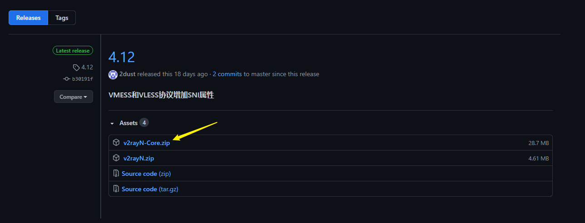
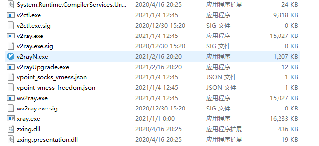

# v2rayN 使用教程

v2rayN 是 PC 平台上一个对新手比较友好的 v2ray Windows 客户端。

写个简单的 v2rayN 使用教程帮助新手。

## 下载 v2rayN

下载链接：<https://github.com/2dust/v2rayN/releases/latest>

然后点击 v2rayN-With-Core.zip 下载

下载好了之后，解压，然后打开解压的文件夹

目录结构大概如下图所示：

## 配置 v2rayN

双击`v2rayN.exe`启动，然后在任务栏托盘找到 v2rayN 图标并双击它

添加一个 VMess 服务器

## 添加订阅

- 订阅链接：<https://ijg.cc/helloworld>

  

## 避免 DNS 泄露

- 检测是否泄露

  - <https://ipleak.net>
  - <https://browserleaks.com/ip>

- v2rayN

  - ✅域名解析策略选择 AsIs
  - ✅路由规则选择绕过大陆

- v2rayNG：

  - ✅启用本地 DNS
  - ✅启用虚拟 DNS
  - ✅域名解析策略选择 AsIs
  - ✅绕过局域网及大陆地址后而代理

- NekoBox：

  - ✅启用 FakeDNS
