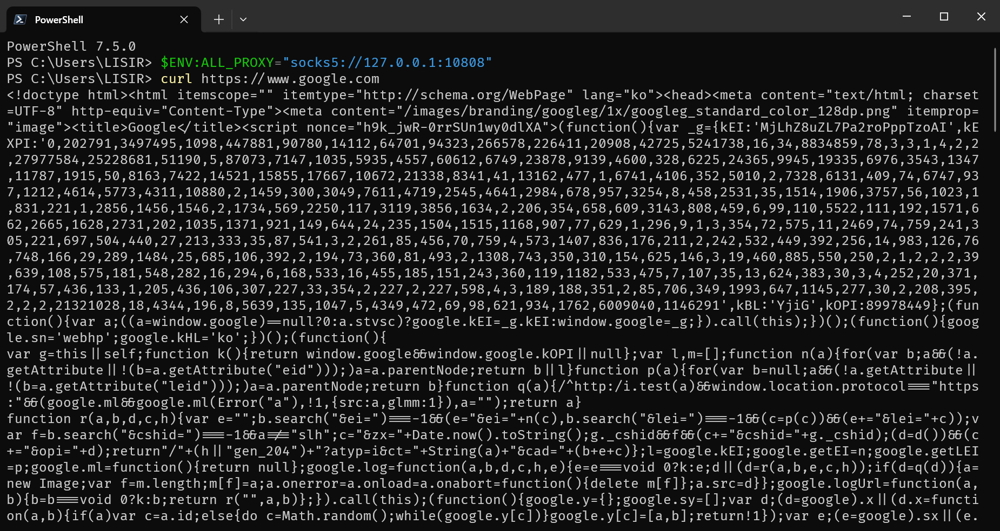

# 让 CMD 使用代理

在使用 CMD 命令行执行某些需要访问国外服务器的操作时，可能会遇到下载失败或卡顿的问题，即使你已经开启了 ShadowSocks、v2rayN 等工具的“全局代理”。

这是因为这类代理工具的“全局代理”通常只对使用 IE 代理设置的程序生效，并非真正的全局代理（例如 VPN），并且不支持 PAC 模式。

因此，我们需要手动为 CMD 命令行设置代理才能正常访问外部网络。

## 设置方法

在使用其他命令之前，请先执行以下命令来设置代理：

- CMD

  ```cmd
  set ALL_PROXY=socks5://127.0.0.1:10808
  set HTTP_PROXY=http://127.0.0.1:10808
  set HTTPS_PROXY=http://127.0.0.1:10808
  ```

- WSL 或 Linux 虚拟机

  ```bash
  export ALL_PROXY="socks5://127.0.0.1:10808"
  export HTTP_PROXY="http://127.0.0.1:10808"
  export HTTPS_PROXY="http://127.0.0.1:10808"
  ```

- PowerShell

  ```powershell
  $ENV:ALL_PROXY="socks5://127.0.0.1:10808"
  $ENV:HTTP_PROXY="http://127.0.0.1:10808"
  $ENV:HTTPS_PROXY="http://127.0.0.1:10808"
  ```

::: tip 注意

上述命令中的代理地址和端口只是示例，请替换为你实际使用的代理地址和端口。

这些命令设置的只是临时的环境变量，关闭当前命令行窗口后即失效。

:::

## 测试是否生效

设置完成后，建议使用 curl 命令来验证代理是否配置成功，而不是使用 ping 命令。

```bash
curl https://www.google.com
```

如果代理设置正确，你将会看到类似于下图的返回内容：


