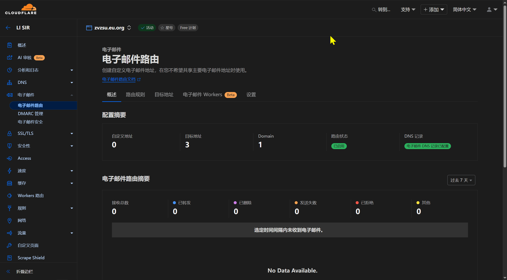

# Cursor 无限续杯

Cursor 是一款集成了 AI 功能的代码编辑器，旨在提高开发效率。

**请注意：** 此方法依赖于 Cursor 和 Cloudflare 当前的策略，未来可能失效。请合理使用，并遵守相关服务条款。

## 先决条件

在开始之前，请确保你满足以下条件：

1. **稳定的科学上网环境：**
    - **原因：** Cursor 的部分服务及注册验证过程可能需要访问国际网络。Cloudflare 的某些功能也可能需要。
    - **验证：** 确保你的代理工具（如 v2rayN, Clash 等）工作正常，可以顺畅访问 Google、GitHub 等网站。
    - **使用：** 你需要知道代理工具提供的 HTTP 或 SOCKS5 代理地址和端口（例如 `http://127.0.0.1:10808`）。
    - **教程参考：** [v2rayN 使用教程](https://lisir.me/GFW/使用/00.v2rayN-使用教程)

2. **已注册的 Cloudflare 账户：**
    - **原因：** 我们将利用 Cloudflare 强大的 DNS 管理和免费的电子邮件路由功能来接收 Cursor 的验证邮件。
    - **注册地址：** [https://dash.cloudflare.com/sign-up](https://dash.cloudflare.com/sign-up)

3. **拥有至少一个域名，并将其 DNS 服务器设置为 Cloudflare:**
    - **原因：** 需要一个域名来创建自定义的邮箱地址。该域名的 DNS 记录需要在 Cloudflare 上管理，以便配置邮件路由。
    - **操作：** 购买域名后，在域名注册商处将域名的 Name Servers（NS）记录修改为 Cloudflare 提供的 NS 地址。等待 DNS 生效。

4. **域名注册商：**

    - 如果你没有域名，可以考虑以下免费域名提供商：
      - US.KG：<https://nic.us.kg>
      - EU.org：<https://nic.eu.org>
    - 或者低价域名提供商：
      - Spaceship：<https://www.spaceship.com>
    - 你可以在这个网站进行域名价格比较：
      - TLD-LIST：<https://zh-hans.tld-list.com>

5. **一个用于接收转发邮件的常用邮箱（例如 QQ 邮箱）:**
    - **原因：** Cloudflare 会将 `*@yourdomain.com` 收到的邮件转发到这个邮箱。后续自动化脚本需要访问此邮箱以读取验证码。
    - **要求：** 该邮箱需要支持 IMAP 协议，并且你需要知道如何开启 IMAP 服务并获取授权码。

## 操作步骤

### 配置 Cloudflare 域名邮箱

登录你的 Cloudflare 账户，选择你要用于接收邮件的域名。

1. **启用电子邮件路由，添加 DNS 记录：**
    - 在左侧菜单中找到“电子邮件” → “电子邮件路由”。
    - 点击“开始使用”或“启用电子邮件路由”。
    - Cloudflare 会提示需要添加 MX 和 TXT 记录到你的 DNS 设置中。通常它会提供一个按钮让你 **自动添加记录**。点击该按钮。
    - 你可以回到该域名的 DNS 管理页面，确认已成功添加类型为 `MX` 和 `TXT` 的相关记录。DNS 记录生效可能需要几分钟到几小时不等。

    

2. **添加目标地址：**
    - 在“电子邮件路由”页面，选择“目标地址”选项卡。
    - 点击“创建目标地址”。
    - 输入你的常用邮箱地址（例如 `youraccount@qq.com`）。
    - Cloudflare 会向这个邮箱发送一封验证邮件。登录你的 QQ 邮箱，找到来自 Cloudflare 的邮件，点击其中的验证链接。
    - 验证成功后，目标地址状态会变为“已验证”。

    

3. **配置 Catch-All 路由规则：**
    - 在“电子邮件路由”页面，选择“路由规则”选项卡。
    - 找到“Catch-all 地址”部分，点击编辑。
    - 找到“操作”下拉框选择“发送到电子邮件”，“目标”下拉框选择你刚刚验证通过的 QQ 邮箱地址，点击“保存”。
    - 打开 Catch-all 规则旁边的开关，确保它是活动状态。发送到 `any-prefix@yourdomain.com` 的邮件都会被转发到你的 QQ 邮箱。

    

### 获取邮箱 IMAP 授权码

自动化脚本需要通过 IMAP 协议登录你的 QQ 邮箱来读取 Cursor 发送的验证码邮件。

1. 登录你的 QQ 邮箱网页版。
2. 进入“设置” → “账号与安全”，或者直接访问 <https://wx.mail.qq.com/account>。
3. 打开“安全设置”向下滚动找到“POP3/IMAP/SMTP/Exchange/CardDAV 服务”。
4. 确保服务是 **开启** 状态。如果未开启，请开启它。
5. 在开启状态下，旁边通常会有“生成授权码”的选项。按照提示（可能需要短信验证）生成授权码。
6. **妥善保存这个授权码**，后面的配置文件中会用到。


### 准备自动注册工具

1. **下载自动注册软件：**
    - **下载地址：** <https://cloud.lisir.me/Teambition/软件/编程类/Cursor>
    - **说明：** 这是一个包含了自动化逻辑的程序或脚本。下载后解压到你方便访问的目录。

2. **编辑配置文件：**
    - 首次运行 `Yan_cursor_Change_ID_Auto_Windows_7.6.0.exe` 会自动在运行目录生成 `.env` 配置文件。
    - 使用文本编辑器打开它，根据以下说明填写或修改配置项：

    ```ini
    # --- 网络代理配置 ---
    # 脚本访问网络时使用的 HTTP 或 SOCKS5 代理
    # 需要与你本地科学上网工具监听的地址和端口一致
    # 示例：http://127.0.0.1:10808 或 socks5://127.0.0.1:10808
    # 运行脚本前确保代理工具已启动并全局代理或设置了相应规则
    BROWSER_PROXY='http://127.0.0.1:10808'    # 仅在自动注册时有效

    # --- Cloudflare 域名配置 ---
    # 你在 Cloudflare 上配置好邮件路由的域名
    DOMAIN=yourdomain.com               # [必填] 替换成你的域名

    # --- IMAP 邮箱配置 ---
    # 用于接收转发邮件并读取验证码的邮箱的 IMAP 信息
    IMAP_SERVER=imap.qq.com       # [必填] QQ 邮箱的 IMAP 服务器地址（通常无需修改）
    IMAP_PORT=993                 # [必填] QQ 邮箱的 IMAP SSL 端口（通常无需修改）
    IMAP_USER=youraccount@qq.com  # [必填] 你的完整 QQ 邮箱地址
    IMAP_PASS=xxxxxxxxxxxxxxxx    # [必填] 你在第二步获取的 QQ 邮箱授权码
    IMAP_DIR=inbox                # [可选] 读取邮件的文件夹，默认为收件箱（inbox），一般无需修改

    # --- 脚本运行参数 ---
    # 这些参数通常保持默认即可
    TURNSTILE_TIMEOUT=20            # Cloudflare Turnstile 人机验证的超时时间（秒）
    VERIFICATION_CODE_TIMEOUT=180   # 等待验证码邮件的最长时间（秒），默认 3 分钟
    ```

    **重要提示：**
    - 确保 `BROWSER_PROXY` 配置正确且代理工具正在运行。
    - `DOMAIN` 必须是你在 Cloudflare 配置好的那个域名。
    - `IMAP_PASS` 必须是授权码，不是邮箱登录密码。

### 运行自动注册程序

- 再次运行 `Yan_cursor_Change_ID_Auto_Windows_7.6.0.exe` 输入对应选项。
- 如果你注册了多个账号，可以运行 `YCursor_win_v3.2.5.exe` 快速切换账号。

## 注意事项

- **原理：** 此方法的核心是利用 Cloudflare 免费邮件路由将发送到 `*@yourdomain.com` 的邮件转发到你的 QQ 邮箱，再通过 IMAP 读取验证码，自动化完成 Cursor 的注册流程。
- **安全性：** 保护好你的 Cloudflare 账户、域名和 QQ 邮箱授权码。不要泄露配置文件。
- **时效性：** Cursor 或 Cloudflare 可能随时更改策略导致此方法失效。
- **网络问题：** 最常见的问题是代理配置错误或网络不稳定。确保 `BROWSER_PROXY` 设置正确，并且科学上网工具工作正常。
- **IMAP 问题：**
  - 确认 QQ 邮箱的 IMAP 服务已开启。
  - 确认 `IMAP_PASS` 填写的是授权码，而非密码。
  - 确认 `IMAP_USER` 是完整的邮箱地址。
  - 检查 QQ 邮箱的安全设置，是否阻止了不常见的 IMAP 登录。
- **Cloudflare 配置问题：**
  - 确认域名 NS 记录已指向 Cloudflare 且生效。
  - 确认 MX 和 TXT 记录已正确添加。
  - 确认目标地址已验证。
  - 确认 Catch-All 路由规则已启用，并指向正确的已验证目标地址。

## 其他方法

以管理员方式打开 PowerShell 执行下面的脚本：

```powershell
irm https://aizaozao.com/accelerate.php/https://raw.githubusercontent.com/yuaotian/go-cursor-help/refs/heads/master/scripts/run/cursor_win_id_modifier.ps1 | iex
```

- 项目地址：<https://github.com/yuaotian/go-cursor-help>
- 支持版本：最新的 `0.47.x` 版本（已支持）
