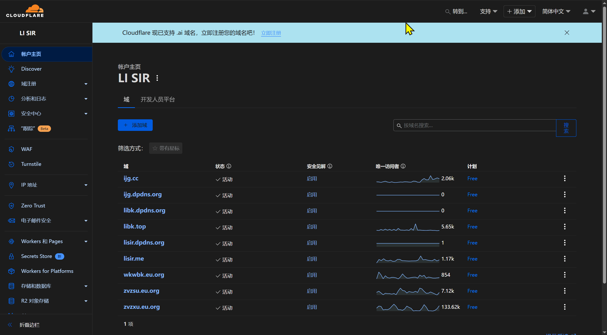

# Cursor 无限续杯

Cursor 是一款集成 AI 功能的代码编辑器，旨在极大提高开发效率。

::: warning 注意

本方法依赖于 Cursor 和 Cloudflare 当前的策略，未来可能失效。请合理使用，并遵守相关服务条款。

:::

## 先决条件

开始之前，请确保满足以下条件：

1. **稳定的科学上网环境**
   - **原因**：Cursor 的部分服务和注册验证过程需要访问国际网络，Cloudflare 的部分功能也依赖外网连接。
   - **验证**：确保你的代理工具（如 v2rayN、Clash 等）正常工作，能顺利访问 Google、GitHub 等网站。
   - **使用**：了解并获取你的代理软件提供的 HTTP 或 SOCKS5 代理地址和端口，例如：`http://127.0.0.1:10808`。
   - **参考教程**：[v2rayN 使用教程](https://lisir.me/GFW/使用/00.v2rayN-使用教程)

2. **已注册 Cloudflare 账户**
   - **原因**：我们将使用 Cloudflare 提供的 DNS 和免费电子邮件路由功能，来接收 Cursor 验证邮件。
   - **注册地址**：[Cloudflare 注册页面](https://dash.cloudflare.com/sign-up)

3. **拥有至少一个域名，且 DNS 托管在 Cloudflare**
   - **原因**：需要一个域名来创建自定义邮箱地址，并通过 Cloudflare 配置邮件路由。
   - **操作**：购买域名后，在注册商处将域名的 NS（Name Servers）记录指向 Cloudflare 提供的地址。等待 DNS 更新生效。

4. **域名购买建议**
   - 免费域名推荐：
     - [US.KG](https://nic.us.kg)
     - [EU.org](https://nic.eu.org)
   - 低价域名推荐：
     - [Spaceship](https://www.spaceship.com)
   - 域名价格比较网站：
     - [TLD-LIST](https://zh-hans.tld-list.com)

5. **一个用于接收转发邮件的常用邮箱（如 QQ 邮箱）**
   - **原因**：Cloudflare 会把发送到 `*@yourdomain.com` 的邮件转发到你的常用邮箱，供脚本读取验证码。
   - **要求**：邮箱需支持 IMAP 协议，并需要开启 IMAP 服务，获取授权码。

## 操作步骤

### 配置 Cloudflare 邮件路由

登录 Cloudflare 后，选择你的域名并按照以下步骤操作：

1. **启用电子邮件路由并添加 DNS 记录**
   - 在侧边栏找到“电子邮件” → “电子邮件路由”。
   - 点击“开始使用”或“启用电子邮件路由”。
   - 按提示一键添加 MX 和 TXT 记录到 DNS 中。
   - 可回到 DNS 设置页确认 MX 和 TXT 记录已添加，通常几分钟内生效。

   

2. **添加目标地址**
   - 在“电子邮件路由”页面，切换到“目标地址”选项卡。
   - 点击“创建目标地址”，填写你的常用邮箱地址（例如 `youraccount@qq.com`）。
   - 前往该邮箱收取来自 Cloudflare 的验证邮件，点击链接完成验证。
   - 验证成功后，目标地址状态将变为“已验证”。

   

3. **配置 Catch-All 路由规则**
   - 返回“电子邮件路由”页面，选择“路由规则”选项卡。
   - 编辑“Catch-all 地址”，选择将所有邮件转发到刚刚验证过的邮箱地址。
   - 保存并确保 Catch-all 开关处于开启状态。

   

### 获取 QQ 邮箱 IMAP 授权码

自动化脚本需要通过 IMAP 登录邮箱以读取验证码邮件：

1. 登录 [QQ 邮箱网页版](https://mail.qq.com)。
2. 进入“设置” → “账号与安全”，或者直接访问 <https://wx.mail.qq.com/account>。
3. 找到“POP3/IMAP/SMTP/Exchange/CardDAV 服务”部分。
4. 确保 IMAP 服务已开启，并根据提示生成**授权码**（需要短信验证）。
5. 妥善保存授权码，稍后需要在配置文件中使用。

## 自动注册

1. **下载注册工具**
   - 打开 [下载页面](https://cloud.lisir.me/Teambition/软件/编程类/Cursor)
   - 进入 `新版自动注册程序` 目录
   - 下载最新安装包

2. **填写配置信息**
   - 打开设置页
   - 填入域名
   - 填入 QQ 邮箱
   - 填入授权码
   - 其他设置按需配置

3. **运行自动注册**
   - 打开功能页
   - 点击自动注册

::: warning 注意

一个域名不要一次性注册多个账号，容易被封域名，导致你需要重新注册一个新的域名。

:::

## 注意事项

- **原理简介**：通过 Cloudflare 邮件路由 + IMAP 邮箱读取，自动化注册 Cursor 账号。
- **安全建议**：保护好你的 Cloudflare 账户、域名和 QQ 邮箱授权码。
- **时效风险**：Cursor 和 Cloudflare 的政策可能随时变更，请及时关注。
