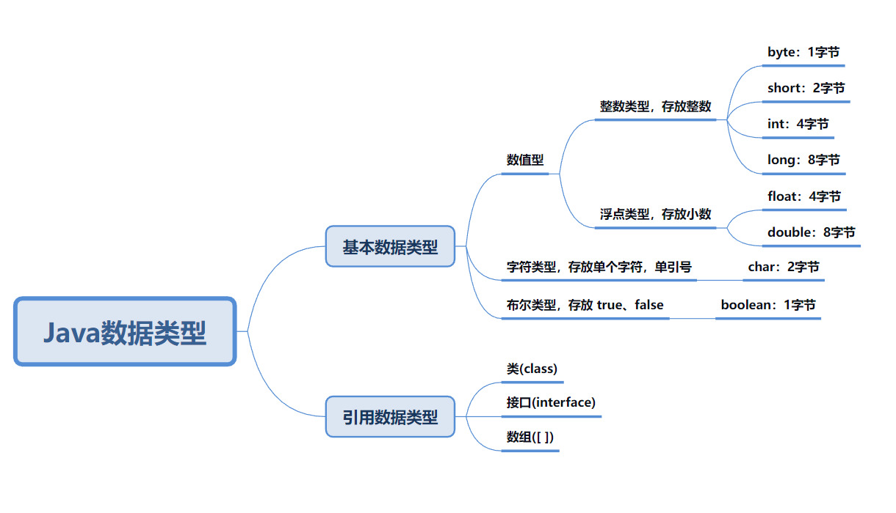

# Java | 变量

变量相当于内存中一个数据存储空间的表示，你可以把变量看做是一个房间的门牌号，通过门牌号我们可以找到房间，而通过变量名可以访问到变量的值。

- 不同的变量，类型不同，占用的空间大小不同。
- 变量必须先声明，后使用。
- 变量在同一个作用域内不能重名。

## 基本数据类型

每一种数据都定义了明确的数据类型，在内存中分配了不同大小的内存空间。

### 整数类型

- 整数类型有固定的范围和字段长度，不受操作系统的影响。
- 整数常量默认为 int 型，声明 long 型常量需要在后面加 `l` 或 `L`。
- bit（位）是计算机最小存储单位，byte（字节）是计算机中基本存储单位，1byte 等于 8bit。

### 浮点类型

- 浮点数 = 符号位 + 指数位 + 尾数位
- 尾数部分可能丢失，造成精度损失（小数都是近似值）。
- 浮点数常量默认为 double 型，声明 float 型常量需要在后面加 `f` 或 `F`。

### 字符类型

- 字符常量是用单引号括起来的单个字符。
- 转义字符 `\` 可以将其后的字符转变为特殊字符常量。
- char 本质是一个整数，在输出时，是 Unicode 码对应的字符。
- 可以直接给 char 赋一个整数，然后输出时，会按照对应的 Unicode 字符输出。
- char 是可以进行运算的，相当于一个整数。

### 布尔类型

- 布尔类型数据只允许取值 `true` 和 `false`，没有 `null`。

## 基本数据类型转换

精度就是这个类型在内存中分配的内存空间，也就是容量。

### 自动类型转换

在进行赋值或者运算时，精度小的类型自动转换为精度大的数据类型。

- char ---> int ---> long ---> float ---> double
- byte ---> short ---> int ---> long ---> float ---> double

注意细节：

- 多种类型的数据混合运算时，系统首先自动将所有的数据转换成精度最大的那种数据类型，然后再进行计算。
- 把精度大的数据类型赋值给精度小的数据类型时，就会报错，反之就会进行自动类型转换。
- 在进行赋值时，byte 或 short 与 char 之间不会相互自动转换。
- byte、short、char 它们三者可以进行混合运算，在运算时首先转换为 int 类型。
- boolean 不参与转换。
- 表达式结果的类型自动提升为操作数中精度最大的类型。

### 强制类型转换

自动类型转换的逆过程，将精度大的数据类型转换为精度小的数据类型。
使用时要加上强制转换符 `()`，但可能造成精度降低或溢出，格外要注意。

注意细节：

- 强转符号只针对最近的操作数有效，多个操作数往往会使用小括号提升优先级。
- char 可以保存 int 的常量值，但不能保存 int 的变量值，需要强转。
- byte、short、char 在进行运算时，当做 int 处理。

### 转 String 类型

- 基本数据类型转 String 类型：将基本数据类型的值 + `""` 即可。
- String 类型转基本数据类型：通过基本数据类型的包装类调用 parseXxx 方法即可。
