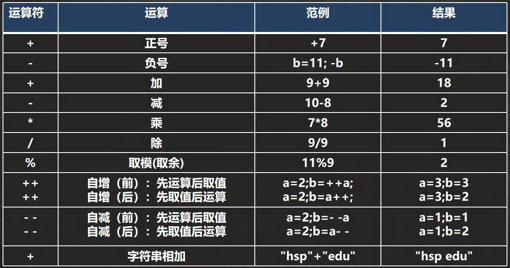
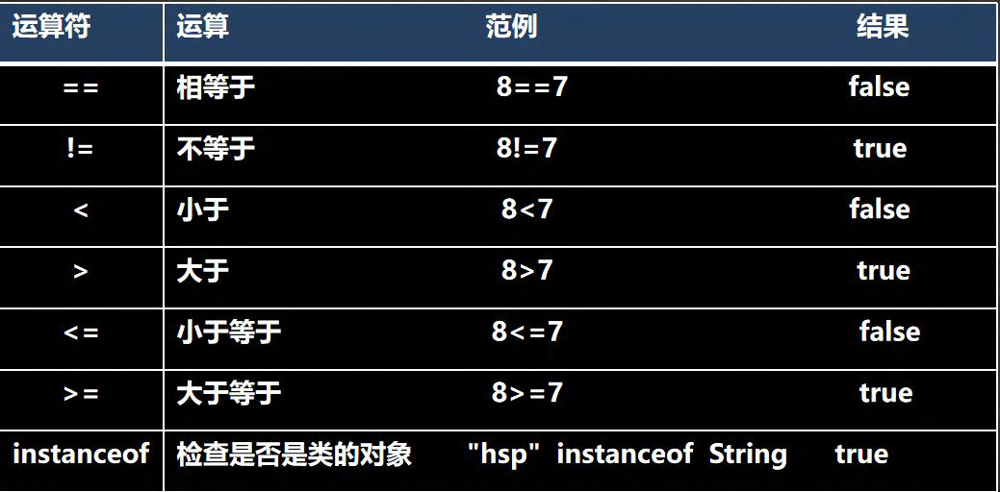
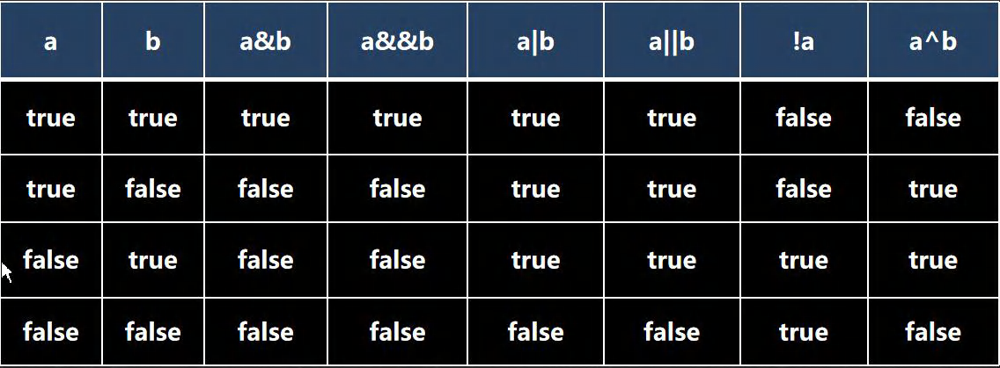

# Java | 运算符

运算符是一种特殊的符号，用以表示数据的运算、赋值和比较等。

## 算数运算符

算术运算符是对数值类型的变量进行运算的，在 Java 程序中使用的非常多。

注意细节：

> - 对于除号 `/`，它的整数除和小数除是有区别的，整数之间做除法时，只保留整数部分舍弃小数部分。
> - 取模 `%` 的本质，`a % b` 等于 `a - (int)(a / b) * b`。

`+` 号的使用：

> - 当左右两边都是数值型时，则做加法运算。
> - 当左右两边有一方为字符串时，则做拼接运算。
> - 运算顺序是从左到右。

## 关系运算符

关系运算符的结果都是 boolean 型，也就是要么是 true，要么是 false。
关系表达式经常用在 if 结构的条件中或循环结构的条件中。
关系运算符组成的表达式，我们称为关系表达式。

## 逻辑运算符

用于连接多个条件表达式，最终的结果也是一个 boolean 值。

运算规则：

> - `a & b` 逻辑与：当 a 和 b 同时为 true，则结果为 true，否则为 false。
> - `a && b` 短路与：当 a 和 b 同时为 true，则结果为 true，否则为 false。
> - `a | b` 逻辑或：当 a 和 b 有一个为 true，则结果为 true，否则为 false。
> - `a || b` 短路或：当 a 和 b 有一个为 true，则结果为 true，否则为 false。
> - `a ^ b` 逻辑异或：当 a 和 b 不同时，则结果为 true，否则为 false。
> - `!a` 取反，或者非运算：当 a 为 true，则结果为 false，当 a 为 false 是，结果为 true。

`&&` 与 `&` 的区别：

> - `&` 逻辑与：不管第一个条件是否为 false，第二个条件都要判断，效率低。
> - `&&` 短路与：如果第一个条件为 false，则第二个条件不会判断，最终结果为 false，效率高。

`||` 与 `|` 的区别：

> - `|` 逻辑或：不管第一个条件是否为 true，第二个条件都要判断，效率低。
> - `||` 短路或：如果第一个条件为 true，则第二个条件不会判断，最终结果为 true，效率高。

## 赋值运算符

- 基本赋值运算符：`=`
- 复合赋值运算符：`+=`，`-=`，`*=`，`/=`，`%=` 等。

注意细节：

- 运算顺序从右往左。
- 赋值运算符的左边只能是变量，右边可以是变量、表达式、常量值。

## 三元运算符

条件表达式 ? 表达式一 : 表达式二;

运算规则：

- 如果条件表达式为 true，运算后的结果是表达式一。
- 如果条件表达式为 false，运算后的结果是表达式二。

## 位运算符

## 运算符优先级

运算符有不同的优先级，所谓优先级就是表达式运算中的运算顺序。
只有单目运算符、赋值运算符是从右向左运算的。
如下表，上一行运算符总优先于下一行。
