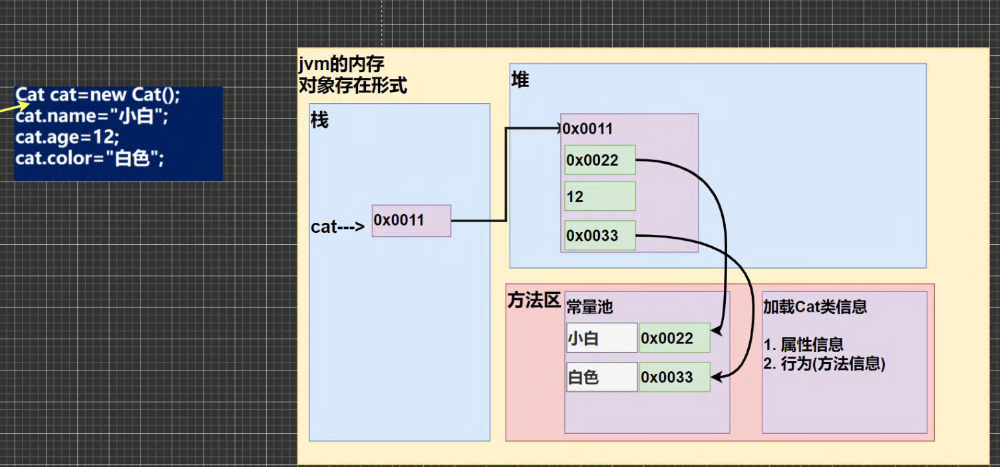
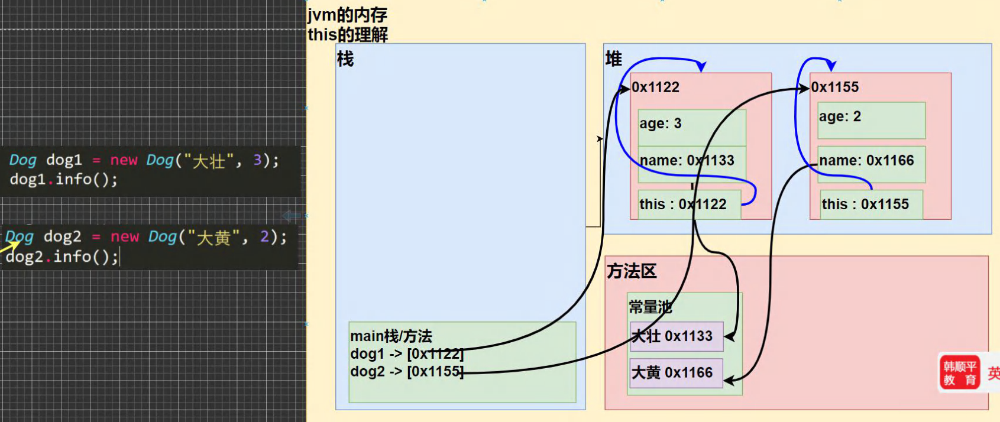

# 基础部分

## 基本概念

- **类**：类是具有相同属性和行为的一组对象的抽象，是对象的模板。
- **对象**：现实世界中任何事物都可以看作对象，对象是拥有状态和行为的实体。
- **属性**：对象的状态，例如颜色、大小、重量等。
- **行为**：对象可以执行的操作，例如移动、说话、吃饭等。
- **封装**：将对象的属性和行为组合在一起，并控制对内部数据的访问。
- **继承**：子类继承父类的属性和行为，并可以扩展或修改它们。
- **多态**：允许使用父类类型的引用来引用子类对象，从而实现不同的行为。

## 类和对象

- 类是一种抽象的概念，定义了一类事物的属性和行为，比如“人类”或“猫类”，相当于一种数据类型。  
- 对象是类的具体实例，代表某个特定的事物，比如“张三”或“一只橘猫”。  
- 类是对象的模板，规定了对象的属性和行为，而对象则是类的实际存在。

### 对象在内存中存在形式

- 字符串本质上是一个引用类型，按照 JVM 的规则会把字符串放在方法区的常量池中间。
- 栈中的是对象引用（对象名），实际上的对象在堆中。

### 对象创建的流程分析

1. 加载类信息

    - 类的信息（属性、方法、构造器等）会被加载到方法区。  
    - 这个过程只会执行一次。  

2. 在堆中分配空间  

    - 在堆内存中为新对象分配空间，确保对象的数据结构完整。  
    - 堆是存放实例对象的区域，所有对象都存储在堆中。  

3. 完成对象初始化  

    - 属性赋默认值。  
    - 执行构造方法，如果构造方法中有赋值操作，会覆盖默认值。  

4. 返回对象地址  

    - `new` 操作返回的是对象在堆中的地址，这个地址被赋值给对象引用变量。  
    - 变量本身存储在栈内存，用于指向堆中的对象。  

## 作用域

> 在 Java 编程中，变量主要分为全局变量（属性）和局部变量。

1. 作用域的分类

    - **全局变量（属性）**：作用域为整个类体，可以在类的任何方法中使用。
    - **局部变量**：定义在方法、构造器或代码块中，作用域仅限于该代码块。

2. 默认值

    - **全局变量**：可以在未赋值的情况下使用，因为它们有默认值（如 `int` 默认 `0`，`boolean` 默认 `false`）。
    - **局部变量**：必须显式赋值后才能使用，否则会报错。

3. 作用域规则

    - **就近原则**：如果属性和局部变量同名，访问时优先使用局部变量。
    - **命名冲突**：在同一作用域（方法）内，不能定义两个同名的局部变量。

4. 生命周期

    - **全局变量**：生命周期较长，随对象的创建而存在，随对象的销毁而消失。
    - **局部变量**：生命周期较短，随代码块的执行而创建，随代码块的结束而销毁。

5. 作用范围

    - **全局变量**：可在本类中使用，也可通过对象在其他类中访问。
    - **局部变量**：仅能在其定义的方法或代码块中使用，无法在其他方法中访问。

6. 修饰符使用

    - **全局变量**：可以使用 `public`、`private`、`static`、`final` 等修饰符。
    - **局部变量**：不能使用访问修饰符，但可使用 `final`（表示只赋值一次）。

## this 关键字

> 在 Java 中，`this` 关键字代表当前对象的引用，指向该对象在堆中的地址。
>
> JVM 会给每个对象分配一个隐藏的 `this`，用于指向自身。

- 使用方式

  - `this` 关键字可以用来访问本类的属性、方法和构造器。
  - `this` 用于区分当前类的属性和局部变量，避免命名冲突。
  - `this.方法名()` 可以调用当前对象的其他实例方法（非静态方法）。
  - `this(参数列表)` 可以调用当前类中的另一个构造器，必须放在构造器的第一行。

- 使用细节

  - `this` 不能在类定义的外部使用，只能在类定义的方法中使用。
  - 所有实例方法在调用时，JVM 都会自动将调用者对象的引用作为第一个隐含参数传递给方法。
  - 即使实例方法内部没有显式使用 `this`，JVM 依然会隐式地将调用者对象作为 `this` 参数传递给方法。
  - 实例方法的本质是“面向对象语法糖”，底层行为类似于在静态方法中显式传递 `this` 参数。

- 使用限制

  - `this` 不能在类的外部使用，只能在类的实例方法或构造器中使用。
  - `this()` 调用构造方法时，必须放在第一条语句，否则会报错。
  - 静态方法不能使用 `this`，因为 `this` 代表实例，而静态方法属于类，不属于对象。
