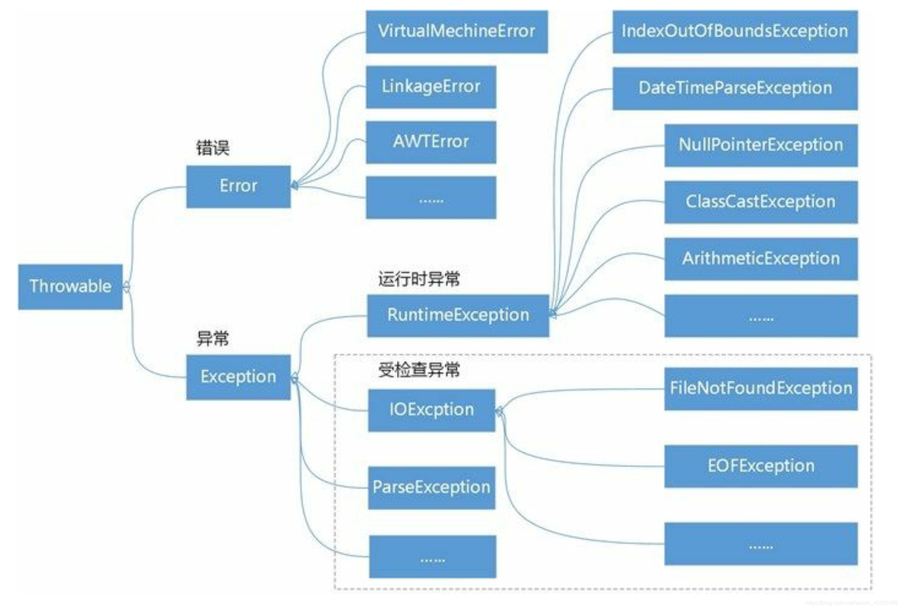

# Java | 异常处理

异常是程序中的一些错误，但并不是所有的错误都是异常，并且错误有时候是可以避免的。

## 异常的概念

```java
public class Main {
    public static void main(String[] args) {
        int num1 = 10;
        int num2 = 0;

        try {
            int res = num1 / num2;
        } catch (Exception e) {
            e.printStackTrace();
        }

        System.out.println("程序继续执行……");
    }
}
```

Java 语言中，将程序执行中发生的不正常情况称为“异常”（开发过程中的语法错误和逻辑错误不是异常）。

**执行过程中所发生的异常事件可分为两大类：**

1. Error（错误）：Java 虚拟机无法解决的严重问题。如：JVM 系统内部错误、资源耗尽等严重情况。比如 StackOverflowError（栈溢出）和 OOM（out of memory），Error 是严重错误，程序会崩溃。

2. Exception：其它因编程错误或偶然的外在因素导致的一般性问题，可以使用针对性的代码进行处理。例如空指针访问，试图读取不存在的文件，网络连接中断等等。Exception 分为两大类：运行时异常（程序运行时，发生的异常），编译时异常（编程时，编译器检查出的异常）。

**Java 异常层次结构图：**



## 运行时异常

运行时异常，编译器不要求强制处置的异常。一般是指编程时的逻辑错误，是程序员应该避免其出现的异常。对于运行时异常，可以不作处理，因为这类异常很普遍，若全处理可能会对程序的可读性和运行效率产生影响。

**常见的运行时异常包括：**

- NullPointerException 空指针异常：当应用程序试图在需要对象的地方使用 null 时，抛出该异常。

- ArithmeticException 数学运算异常：当出现异常的运算条件时，抛出该异常。

- ArraylndexOutOfBoundsException 数组下标越界异常：用非法的索引访问数组时，抛出该异常。

- ClassCastException 类型转换异常：当试图将对象强制转换为不是实例的子类时，抛出该异常。

- NumberFormatException 数字格式不正确异常：当应用程序试图将字符串转换成一种数值类型，但该字符串不能转换为适当的格式时，抛出该异常。

## 编译时异常

编译时异常是指在编译期间，就必须处理的异常，否则代码不能通过编译。

**常见的编译时异常包括：**

- SQLException 操作数据库时，查询表可能发生异常。

- IOException 操作文件时，发生的异常。

- FileNotFoundException 当操作一个不存在的文件时，发生异常。

- ClassNotFoundException 加载类，而该类不存在时，发生异常。

- EOFException 操作文件，到文件末尾，发生异常。

- IllegalArguementException 参数异常。

## 处理异常过程

1. 当程序运行到某一语句时，发生了异常，那么程序会先停下来；

2. 程序会在这句代码处查看原因，生成一个合理“异常对象”，然后“抛”出；

3. JVM 会检测这句代码的外围是否有 `try...catch` 结构可以“捕获”它；

4. 如果可以捕获，那么程序在处理完异常后，继续下面的运行，不会崩溃；

5. 如果不能捕获，那么会把这个异常继续抛给“上级”；

6. 如果“上级”能处理，那么程序从“上级"处理完的代码后面继续运行；

7. 如果“上级”也不能处理，那么继续往上抛，一直到达 JVM，那么就“崩溃”；

## 异常处理机制

异常处理就是当异常发生时，对异常处理的方式。处理方式有以下两种：

- try-catch-finally：程序在代码中捕获发生的异常，自行处理。

- throws：将发生的异常抛出，交给调用者（方法）来处理，最顶级的处理着就是 JVM。

### 捕获异常

- try 和 catch 都不能单独使用，必须连用；finally 不能单独使用，必须和 try 一起使用。

- 如果没有发生异常，则顺序执行 try 块，不会进入到 catch 块。

- 如果发生了异常，则 try 块剩下的语句不再执行，直接进入到 catch 块。

- 如果有 finally 块，不论 try 块是否发生了异常，finally 块中的语句都会被执行。

- finally 一般用于资源释放（资源回收），无论程序是否出现异常，最后都要资源释放。

- 可以有多个 catch 块，捕获不同的异常（进行不同的业务处理），要求父类异常在后，子类异常在前，如果发生异常，只会匹配一个 catch 块。

- 当只有在 try 或者 catch 中调用退出 JVM 的相关方法 `System.exit(0);`，此时 finally 才不会执行，否则 finally 永远会执行。

- 可以进行 try-finally 配合使用，这种用法相当于没有捕获异常，因此程序会直接崩溃。应用场景就是执行一段代码，不管是否发生异常，都必须执行某个业务逻辑。

### 抛出异常

- 对于运行时异常，程序中如果没有处理，默认就是 throws 的方式处理。

- 在 throws 过程中，如果使用了 try-catch，就相当于处理了异常，就不必再 throws。

- 在方法声明中用 throws 语句可以声明抛出异常的列表，throws 后面的异常类型可以是方法中产生的异常类型，也可以是它的父类。

- 子类重写父类的方法时，对抛出异常的规定：子类重写的方法所抛出的异常类型，要么和父类方法抛出的异常类型一致，要么为父类方法抛出的异常类型的子类型。

- 如果一个方法抛出了一个运行时异常，调用者可以不用显示处理，因为 Java 有默认的处理机制。如果抛出了一个编译时异常，则调用者必须显示处理，否则程序就不能编译通过。

- 如果一个方法或者方法中的语句执行时可能生成某种异常，但是并不能确定如何处理这种异常，则此方法应显示地声明抛出异常，表明该方法将不对这些异常进行处理，而由该方法的调用者负责处理。

## 自定义异常

当程序出现了某些“错误”，但该错误信息并没有在 Throwable 子类中描述处理，这个时候可以自己设计异常类，用于描述该错误信息。

**自定义异常的步骤：**

- 定义类：自定义异常类名（程序员自己写）继承 Exception 或 RuntimeException。

- 如果继承 Exception，属于编译时异常。

- 如果继承 RuntimeException，属于运行时异常。

- 一般情况下，自定义异常建议继承 RuntimeException，因为可以使用 Java 默认的处理机制。

**throw 和 throws 的区别：**

- throw 是具体向外抛异常的动作，所以它是抛出一个异常实例。

- throws 主要是声明这个方法会抛出这种类型的异常，使它的调用者知道要捕获这个异常。

**实现代码：**

```java
import java.util.Scanner;

public class Main {
    public static void main(String[] args) {
        Scanner scanner = new Scanner(System.in);
        System.out.print("输入年龄：");
        int age = scanner.nextInt();

        // 要求年龄范围在 18-120 之间，否则抛出自定义异常
        if (!(age >= 18 && age <= 120)) {
            // 通过构造器设置信息
            throw new AgeException("年龄需要在 18-120 之间！");
        }

        System.out.println("你的年龄范围正确。");
    }
}

class AgeException extends RuntimeException {
    public AgeException(String message) {
        super(message);
    }
}
```
