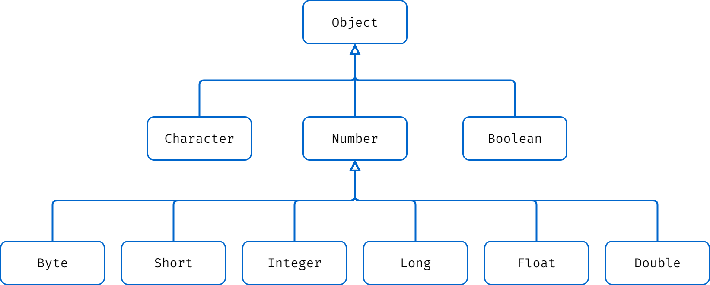
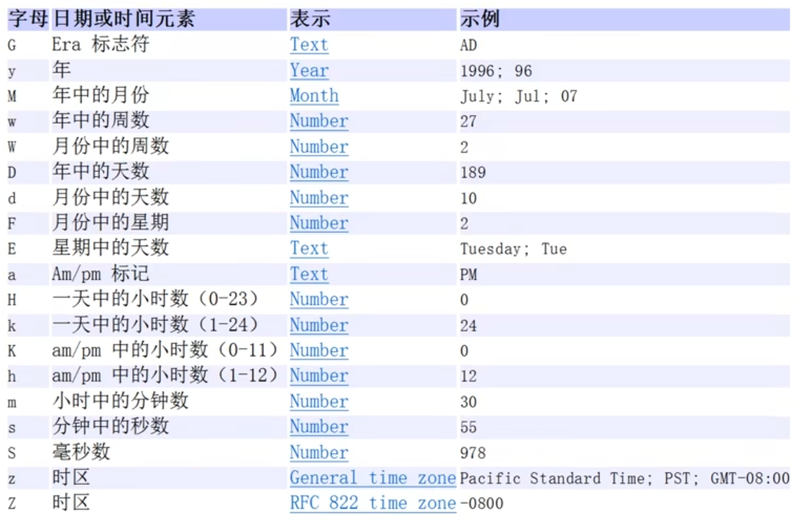

# Java | 常用类

Java 的常用类有包装类、字符串类、Math 类、Arrays 类、System 类、大数字类、日期类。

## 包装类

Java 有 8 种基本数据类型，Java 中的每个基本数据类型都被包装成了一个类，这些类被称为包装类。

**包装类可以分为 3 类：**`Number`、`Character`、`Boolean`。

**包装类的架构图如下所示：**



| 基本数据类型 | 对应的包装类 |
| :----------: | :----------: |
|   boolean    |   Boolean    |
|     char     |  Character   |
|     byte     |     Byte     |
|    short     |    Short     |
|     int      |   Integer    |
|     long     |     Long     |
|    float     |    Float     |
|    double    |    Double    |

除了 `int` 对应的包装类名称为 `Integer` 以及 `char` 对应的包装类名称 `Character`，其他 6 种数据类型对应的包装类，命名都为其基本数据类型的首字母的大写。

### 装箱和拆箱

**什么是装箱和拆箱：**

- 装箱就是基本数据类型向包装类转换。

- 拆箱就是包装类向基本数据类型转换。

- 装箱和拆箱又有自动和手动之分。

jdk 5 以前需要手动装箱和手段拆箱，jdk 5 以后（含 jdk 5）实现了自动装箱和自动拆箱。

**手动装箱和拆箱：**

```java
public class Main {
    public static void main(String[] args) {
        int n1 = 100;

        // 手动装箱 int -> Integer
        Integer integer = Integer.valueOf(n1); // Integer integer = new Integer(n1);

        // 手动拆箱 Integer -> int
        int n2 = integer.intValue();
    }
}
```

**自动装箱和拆箱：**

```java
public class Main {
    public static void main(String[] args) {
        int n1 = 100;

        // 自动装箱 int -> Integer 底层仍然是使用 valueOf() 方法
        Integer integer = n1;

        // 自动拆箱 Integer -> int 底层仍然是使用 intValue() 方法
        int n2 = integer;
    }
}
```

### 包装类常用方法

**包装类和 String 类型的相互转换：**

```java
public class Main {
    public static void main(String[] args) {
        // 包装类（Integer） -> String
        // 其他包装类方法类似
        Integer n1 = 100;
        String str1 = n1 + ""; // 方式一
        String str2 = n1.toString(); // 方式二
        String str3 = String.valueOf(n1); // 方式三

        // String -> 包装类（Integer）
        String str4 = "1234";
        Integer n2 = Integer.parseInt(str4); // 方法一
        Integer n3 = new Integer(str4); // 方法二
    }
}
```

## 字符串类

在 Java 中字符串属于对象，Java 提供了 String、StringBuffer 和 StringBuilder 三种类来创建和操作字符串。

**字符串的基本概念：**

- 字符串常量就是双引号括起的字符序列。

- 字符串的字符使用 Unicode 字符编码，一个字符（不区分字母还是汉字）占两个字节。

**三种字符串类的共同点：**

- 都由 final 修饰，即都不能被其他的类继承。

- 都实现了 CharSequence 接口。

- 都实现了 Serializable 接口，可以串行化即可以在网络传输。

**三种字符串类的效率比较：**

一般情况下 StringBuilder > StringBuffer > String，当然这是相对的，不是绝对的。

**三种字符串类的使用的原则：**

如果字符串存在大量的修改操作，一般使用 StringBuffer 或 StringBuilder，并在单线程的情况，使用 StringBuilder，多线程的情况，使用 StringBuffer。如果我们字符串很少修改，且被多个对象引用，则使用 String，例如配置信息等。

### String 类

- String 类是不可变字符串类，效率较低，但是复用率高。

- String 类实现了 Comparable 接口，对象可以比较大小。

- String 类是不可变的，对 String 对象进行任何操作，其实都是创建一个新的对象，再把引用指向该对象，效率较低。

**两种创建 String 对象的区别：**

1. 直接赋值：`String str = "abc";`

    先从常量池查看是否有 `"abc"` 数据空间，如果有，直接指向，如果没有则重新创建，然后指向。`str` 最终指向的是常量池中 `"abc"` 的地址。

2. 调用构造器：`String str = new String("abc");`

    先在堆中分配对象所需内存空间，里面有 `value` 属性，并指向常量池中 `"abc"` 的地址。如果常量池没有 `"abc"`，则重新创建，如果有，直接通过 `value` 指向。`str` 最终指向的是堆中的空间地址。

**String 类常用方法：**

| 方法名称             | 描述                                                                     |
| -------------------- | ------------------------------------------------------------------------ |
| `equals()`           | 判断内容是否相等（区分大小写）                                           |
| `equalsIgnoreCase()` | 判断内容是否相等（忽略大小写）                                           |
| `length()`           | 获取字符的个数，字符串的长度                                             |
| `indexOf()`          | 获取字符在字符串中第一次出现的索引，索引从 0 开始，如果找不到，返回 -1   |
| `lastIndexOf()`      | 获取字符在字符串中最后一次出现的索引，索引从 0 开始，如果找不到，返回 -1 |
| `substring()`        | 截取指定范围的子串                                                       |
| `trim()`             | 去前后空格                                                               |
| `charAt()`           | 获取某索引处的字符，注意不能使用数组下标这种方式                         |
| `toUpperCase()`      | 把字符串转换为大写                                                       |
| `toLowerCase()`      | 把字符串转换为小写                                                       |
| `concat()`           | 拼接字符                                                                 |
| `replace()`          | 替换字符串中的字符                                                       |
| `split()`            | 分割字符串                                                               |
| `toCharArray()`      | 转换成字符数组                                                           |
| `compareTo()`        | 比较两个字符串的大小，前者大则返回正数，后者大则返回负数，相等则返回 0   |
| `String.format()`    | 格式化的字符串                                                           |

### StringBuffer 类

- StringBuffer 类是可变字符串类，效率较高，线程安全。

- StringBuffer 类的直接父类是 AbstractStringBuilder。

- StringBuffer 对象保存的是字符串变量，里面的值可以更改，每次 StringBuffer 对象的更新实际上可以更新内容，不用每次都创建新对象，效率较高

**String 和 StringBuffer 类的相互转换：**

```java
public class Main {
    public static void main(String[] args) {
        // String -> StringBuffer
        String str1 = "Hello World!";
        // 方式一：使用构造器
        StringBuffer stringBuffer1 = new StringBuffer(str1);
        // 方式二：使用 append 方法
        StringBuffer stringBuffer2 = new StringBuffer();
        stringBuffer1.append(str1);

        // StringBuffer -> String
        StringBuffer stringBuffer3 = new StringBuffer("Hello World!");
        // 方式一：使用构造器
        String str2 = new String(stringBuffer3);
        // 方式二：使用 toString 方法
        String str3 = stringBuffer3.toString();
    }
}
```

### StringBuilder 类

- StringBuilder 类是可变字符串类，效率最高，线程不安全。

- StringBuilder 类的直接父类是 AbstractStringBuilder。

- StringBuilder 类中的方法没有做互斥的处理，因此在单线程的情况下才使用。

**StringBuffer 和 StringBuilder 类常用方法：**

| 方法名称    | 描述                                                          |
| ----------- | ------------------------------------------------------------- |
| `append()`  | 追加指定字符串                                                |
| `delete()`  | 删除指定字符串                                                |
| `replace()` | 替换指定字符串                                                |
| `indexOf()` | 查找指定的字符串在字符串第一次出现的索引，如果找不到则返回 -1 |
| `insert()`  | 指定一个位置插入字符串                                        |
| `length()`  | 获取字符的个数，字符串的长度                                  |

## Math 类

Math 类包含用于执行基本数学运算的方法，如初等指数、对数、平方根和三角函数。

**Math 类常用方法：**

| 方法名称        | 描述                |
| --------------- | ------------------- |
| `Math.abs()`    | 求绝对值            |
| `Math.pow()`    | 求幂                |
| `Math.ceil()`   | 向上取整            |
| `Math.floor()`  | 向下取整            |
| `Math.round()`  | 四舍五入            |
| `Math.sqrt()`   | 求开方              |
| `Math.random()` | 返回 0~1 的随机小数 |
| `Math.min()`    | 求最小值            |
| `Math.max()`    | 求最大值            |

## Arrays 类

Arrays 类里面包含了一系列静态方法，用于管理或操作数组（比如排序和搜索）。

**Arrays 类常用方法：**

| 方法名称                | 描述                                   |
| ----------------------- | -------------------------------------- |
| `Arrays.toString()`     | 返回数组的字符串形式                   |
| `Arrays.sort()`         | 排序（自然排序和定制排序）             |
| `Arrays.binarySearch()` | 二分搜索进行查找，要求数组必须是有序的 |
| `Arrays.copyOf()`       | 数组元素的复制                         |
| `Arrays.fill()`         | 数组元素的填充                         |
| `Arrays.equals()`       | 比较两个数组元素内容是否完全一致       |
| `Arrays.asList()`       | 将一组值转换为 List                    |

## System 类

System 类代表当前 Java 程序的运行平台，系统级的很多属性和控制方法都放置在该类的内部。由于该类的构造方法是 private 的，所以无法创建该类的对象，也就是无法实例化该类。

**System 类常用方法：**

| 方法名称                     | 描述                               |
| ---------------------------- | ---------------------------------- |
| `System.exit()`              | 退出当前程序                       |
| `System.arraycopy()`         | 复制数组元素，比较适合底层调用     |
| `System.currentTimeMillis()` | 用于获取当前系统时间，以毫秒为单位 |
| `System.gc()`                | 运行垃圾回收机制                   |

## 大数字类

### BigInteger 类

如果要存储比 Integer 更大的数字，Integer 数据类型就无能为力了。因此，Java 中提供 BigInteger 类来处理更大的数字。

### BigDecimal 类

BigInteger 和 BigDecimal 都能实现大数字的运算，不同的是 BigDecimal 加入了小数的概念。BigDecimal 类支持任何精度的浮点数，可以用来精确计算货币值。

**BigInteger 和 BigDecimal 类常用方法：**

| 方法名称     | 描述     |
| ------------ | -------- |
| `add()`      | 加法运算 |
| `subtract()` | 减法运算 |
| `multiply()` | 乘法运算 |
| `divide()`   | 除法运算 |

## 日期类

### 第一代日期类

- Date 类用来封装当前的日期和时间。日期格式是国外的格式，因此通常需要对格式进行转换。

- SimpleDateFormat 类用来格式化和解析日期，它允许进行日期到文本的格式化，文本到日期的解析。

**使用 SimpleDateFormat 类格式化日期：**

```java
import java.text.ParseException;
import java.text.SimpleDateFormat;
import java.util.Date;

public class Main {
    public static void main(String[] args) throws ParseException {
        // 获取当前系统时间
        Date date = new Date();
        // 创建 SimpleDateFormat 对象，可以指定相应的格式
        SimpleDateFormat simpleDateFormat = new SimpleDateFormat("yyyy年MM月dd日 HH:mm:ss E");
        // 使用 format 方法转换成指定格式的字符串
        String format = simpleDateFormat.format(date);
        System.out.println(format);

        // 将一个格式化后的字符串转成对应的 Date
        // 字符串的格式需要和 simpleDateFormat 格式一样，否则会抛出异常
        String str = "2023年05月01日 12:41:34 星期一";
        Date parse = simpleDateFormat.parse(str);
        System.out.println(simpleDateFormat.format(parse));
    }
}
```

**SimpleDateFormat 类的格式化编码：**



### 第二代日期类

- Calendar 类是一个抽象类，且构造器是 protected 的，需要使用 `getInstance()` 方法来获取对象。

- Calendar 没有提供对应的格式化类，因此需要自己自定义组合来输出。

**自定义组合输出：**

```java
import java.util.Calendar;

public class Main {
    public static void main(String[] args) {
        // 创建 Calendar 对象
        Calendar calendar = Calendar.getInstance();
        // 组合输出
        System.out.println(calendar.get(Calendar.YEAR) + "年" +
                (calendar.get(Calendar.MARCH) + 1) + "月" +
                calendar.get(Calendar.DAY_OF_MONTH) + "日 " +
                calendar.get(Calendar.HOUR_OF_DAY) + ":" +
                calendar.get(Calendar.MINUTE) + ":" +
                calendar.get(Calendar.SECOND));
    }
}
```

### 第三代日期类

- LocalDate 类只包含日期。

- LocalTime 类只包含时间。

- LocalDateTime 类包含日期和时间。

- 三种类的构造器都是 private 的，都只能使用 `now()` 方法来获取对象。

- DateTimeFormatter 类用来格式化和解析日期。

- Instant 类是处理时间戳的，其构造器也是 private 的，需要使用 `now()` 方法来获取对象。

**三种类的使用：**

```java
import java.time.LocalDate;
import java.time.LocalTime;
import java.time.LocalDateTime;

public class Main {
    public static void main(String[] args) {
        // 获取日期
        LocalDate date = LocalDate.now();
        System.out.println(date);

        // 获取时间
        LocalTime time = LocalTime.now();
        System.out.println(time);

        // 获取日期和时间
        LocalDateTime dateTime = LocalDateTime.now();
        System.out.println(dateTime);
    }
}
```

**使用 DateTimeFormatter 类格式化日期：**

```java
import java.time.LocalDateTime;
import java.time.format.DateTimeFormatter;

public class Main {
    public static void main(String[] args) {
        // 获取日期和时间
        LocalDateTime dateTime = LocalDateTime.now();
        // 创建 DateTimeFormatter 对象
        DateTimeFormatter dateTimeFormatter = DateTimeFormatter.ofPattern("yyyy-MM-dd HH:mm:ss");
        String format = dateTimeFormatter.format(dateTime);
        System.out.println(format);
    }
}
```

**Instant 和 Date 类的相互转换：**

```java
import java.util.Date;
import java.time.Instant;

public class Main {
    public static void main(String[] args) {
        // 创建 Instant 对象
        Instant instant = Instant.now();
        // 通过 from 方法将 Instant 类转成 Date 类
        Date date = Date.from(instant);
        // 通过 toInstant 方法将 Date 类转成 Instant 类
        Instant instant1 = date.toInstant();
    }
}
```
