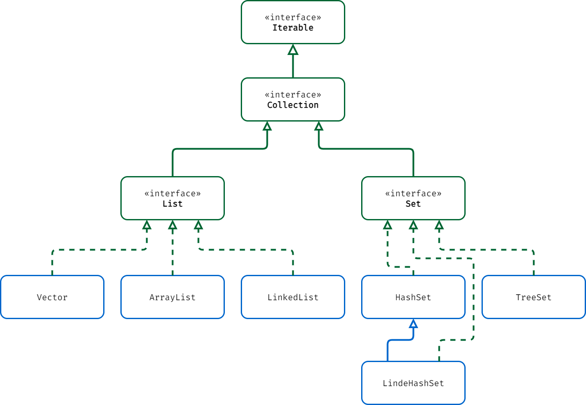

# Java | 集合框架

集合就是由若干个确定的元素所构成的整体。

## 集合体系图

**List、Set 集合体系图：**



**Map 集合体系图：**


## 单列集合

### Iterator 接口

迭代器（Iterator）主要用来操作 Java 中的集合对象（Collection），迭代器提供了统一的语法进行集合对象遍历操作，无需关心集合对象内部的实现方式，迭代器只能向前移，无法后退。

**Iterator 接口的特点：**

- Iterator 接口的对象称为迭代器，主要用于遍历 Collection 集合中的元素。

- Iterator 接口的对象仅用于遍历集合，它本身并不存放对象。

**Iterator 接口的方法：**

| 方法名称    | 描述                   |
| ----------- | ---------------------- |
| `hasNext()` | 判断是否还有下一个元素 |
| `next()`    | 返回下一个元素         |

> 注意：在调用 `next()` 方法之前必须要调用 `hasNext()` 进行检测。若不进行检测，且下一条记录无效，直接调用 `next()` 会抛出 NoSuchElementException 异常。

### Collection 接口

Collection 接口是 List、Set 和 Queue 接口的父接口，通常情况下不被直接使用。Collection 接口定义了一些通用的方法，通过这些方法可以实现对集合的基本操作。定义的方法既可用于操作 Set 集合，也可用于操作 List 和 Queue 集合。

**Collection 接口的特点：**

- Collection 的实现类可以存放多个元素，每个元素可以是 Object。

- Collection 的实现类，有些可以存放重复的元素，有些不可以。

- Collection 的实现类，有些是有序的（List），有些是无序的（Set）。

- Collection 接口没有直接的实现子类，是通过它的子接口 List 和 Set 来实现的。

- 所有实现了 Collection 接口的集合类都有一个 `iterator()` 方法，用于返回一个迭代器。

**Collection 接口的方法：**

| 方法名称        | 描述                   |
| --------------- | ---------------------- |
| `add()`         | 添加单个元素           |
| `addAll()`      | 添加多个元素           |
| `remove()`      | 删除指定元素           |
| `removeAll()`   | 删除多个元素           |
| `contains()`    | 查找元素是否存在       |
| `containsAll()` | 查找多个元素是否都存在 |
| `size()`        | 获取元素个数           |
| `isEmpty()`     | 判断是否为空           |
| `clear()`       | 清除所有元素           |

### List 接口

List 是一个有序、可重复的集合，集合中每个元素都有其对应的顺序索引。

**List 接口的特点：**

- List 接口是 Collection 接口的子接口。

- List 集合中的元素有序（添加顺序和取出顺序一致）、且可重复。

- List 集合中的每个元素都有其对应的顺序索引（从 0 开始），即支持索引。

- List 集合中的元素都对应一个整数型的序号记载元素在集合中的位置，可以根据序号存取集合中的元素。

**List 接口的方法：**

| 方法名称        | 描述                                                                      |
| --------------- | ------------------------------------------------------------------------- |
| `get()`         | 获取此集合中指定索引位置的元素                                            |
| `set()`         | 替换此集合中指定索引位置的元素                                            |
| `indexOf()`     | 返回此集合中第一次出现指定元素的索引，如果此集合不包含该元素，则返回 -1   |
| `lastIndexOf()` | 返回此集合中最后一次出现指定元素的索引，如果此集合不包含该元素，则返回 -1 |
| `subList()`     | 截取集合中的一部分形成一个新的集合并返回                                  |

**List 接口的遍历方式：**

```java
import java.util.*;

public class Main {
    public static void main(String[] args) {
        // 以 ArrayList 类为例，其他 List 接口的实现类同理
        List list = new ArrayList();

        list.add(new Book("三国演义", "罗贯中", 10.1));
        list.add(new Book("小李飞刀", "古龙", 5.1));
        list.add(new Book("红楼梦", "曹雪芹", 34.6));

        // 方式一：使用迭代器
        System.out.println("========== 第一种方式 ==========");
        Iterator iterator = list.iterator(); // 获取 arrayList 的迭代器
        while (iterator.hasNext()) {
            Object book = iterator.next(); // 返回下一个元素，使用 Object 类接收
            System.out.println(book);
        }
        iterator = list.iterator(); // 重置迭代器

        // 方式二：使用增强 for 循环遍历集合，其底层任然是迭代器
        System.out.println("========== 第二种方式 ==========");
        for (Object book : list) {
            System.out.println(book);
        }
        
        // 方式三：使用普通 for 循环
        System.out.println("========== 第三种方式 ==========");
        for (int i = 0; i < list.size(); i++) {
            System.out.println(list.get(i));
        }
    }
}

class Book {
    private String name;
    private String author;
    private double price;

    public Book(String name, String author, double price) {
        this.name = name;
        this.author = author;
        this.price = price;
    }

    public String getName() {
        return name;
    }

    public void setName(String name) {
        this.name = name;
    }

    public String getAuthor() {
        return author;
    }

    public void setAuthor(String author) {
        this.author = author;
    }

    public double getPrice() {
        return price;
    }

    public void setPrice(double price) {
        this.price = price;
    }

    @Override
    public String toString() {
        return "Book{" +
                "name='" + name + '\'' +
                ", author='" + author + '\'' +
                ", price=" + price +
                '}';
    }
}
```

#### ArrayList 类

**ArrayList 和 Vector 类的特点：**

- 两者几乎是一样的，区别在于 Vector 类是线程安全的，因此效率差于 ArrayList 类。

- 底层都是使用 Object 类型的数组 `elementData` 来存储元素。

- 底层都实现了可变长数组，可以添加任意元素且可以重复，包括 `null` 值。

**ArrayList 和 Vector 类的扩容机制：**

- 如果使用无参构造器创建对象时，初始 `elementData` 容量为 0，第一次添加元素则扩容 `elementData` 为 10。

- 如需再次扩容，ArrayList 类扩容为原来大小的 1.5 倍，Vector 类则是扩容为原来的 2 倍。

- 如果使用的是指定大小的构造器，则初始 `elementData` 容量为指定大小，扩容机制不变。

#### LinkedList 类

**LinkedList 类的特点：**

- LinkedList 类是线程不安全的。

- 底层使用 Node（静态内部类）类型的结点来存储元素。

- 底层有两个属性 `first` 和 `last` 分别指向头结点和尾结点。

- 每个结点中又有三属性，`prev` 指向直接前驱结点，`next` 指向直接后继结点，`item` 存储真正的元素。

- 底层实现了双向链表和双端队列，可以添加任意元素且可以重复，包括 `null` 值。

- 底层采用双向链表的结构保存元素，这种结构的优点是便于向集合中插入或者删除元素。

#### 两者的区别

**ArrayList 和 LinkedList 类的区别：**

- 需要频繁修改和查询元素时，使用 ArrayList 类。

- 需要频繁插入和删除元素时，使用 LinkedList 类。

- ArrayList 是底层基于可变长数组，增删效率较低（扩容需要大量拷贝），改查效率较高（通过索引直接定位）。

- LinkedList 是底层基于双向链表，增删效率较高（元素通过指针连接），改查效率较低（查询需要依次遍历）。

- ArrayList 与 LinkedList 都是 List 接口的实现类，因此都实现了 List 的所有未实现的方法，只是实现的方式有所不同。

### Set 接口

Set 是一个无序、不可重复的集合，且没有索引。

**Set 接口的特点：**

- Set 接口是 Collection 接口的子接口。

- Set 集合中的元素无序（添加顺序和取出顺序不一致，但是取出顺序是固定的），且不可重复。

- Set 集合中的元素不按特定的方式排序，只是简单地把元素加入集合。

- Set 集合中不能包含重复的元素，并且只允许包含一个 `null` 值。

**Set 接口的方法：**

和 List 接口一样，Set 接口也是 Collection 的子接口，因此常用方法和 Collection 接口一样。

**Set 接口的遍历方式：**

和 Collection 的遍历方式一样，可以使用迭代器和增强 `for` 循环，但不能使用索引的方式来获取。

#### HashSet 类

**HashSet 类的特点：**

- HashSet 类是线程不安全的。

- 底层使用 Node（静态内部类）类型的结点数组 `table` 来存储元素。

- 底层实际上是 HashMap 类，是由数组和链表以及红黑树构成的。

- HashSet 类是按照 Hash 算法来存储集合中的元素，因此具有很好的存取和查找性能。

**HashSet 类添加元素的底层机制：**

1. 添加元素时会先计算哈希值，再将哈希值转换为索引值。

2. 找到 `table` 数组，查看该索引的位置是否有元素。

3. 如果没有则直接加入元素。如果有，则比较两个元素是否相同。

4. 相同就放弃添加，不相同就以链表的方式添加到尾部，形成数组加链表的模式。

    > 注意：比较两个元素是否相同是通过 `equals()` 方法和 `hashCode()` 方法的返回值来一同决定的；`equals()` 方法和 `hashCode()` 方法可以重写来修改比较的标准；只有在哈希值相同的情况下才会使用 `equals()` 方法进行比较。

**HashSet 类扩容和转成红黑树的底层机制：**

1. 第一次添加元素时，`table` 数组扩容到 16，且临界值设为 `16 * 0.75 = 12`（`0.75` 是加载因子）。

2. 当集合中的元素个数达到临界值 12 时，`table` 数组就会扩容到 `16 * 2 = 32`。

3. 新的临界值就是 `32 * 0.75 = 24`，以此类推。

    > 注意：这里的扩容机制判断的是整个集合中的元素个数，并非一定是 `table` 数组中的元素个数。

4. 如果单条链表中元素达到 8，同时 `table` 数组的大小达到 64 时，就会进行树化（红黑树），若 `table` 数组大小未达到 64，则采用数组扩容机制进行扩容，直到 `table` 数组大小达到 64，再树化。

    > 注意：这里的扩容机制主要是为了防止单条链表上的元素过多，所以会进行扩容，加快树化的进度。

#### LinkedHashSet 类

**LinkedHashSet 类的特点：**

- LinkedHashSet 类继承了 HashSet 类。

- 底层实际上是 LinkedHashMap 类，是由数组和双向链表构成的。

- 底层使用 Entry（静态内部类）类型的结点来存储元素。

- 每个结点中有 `before` 和 `after` 属性，`before` 指向直接前驱结点，`after` 指向直接后继结点。

- 底层是根据元素的哈希值决定元素的存储位置，同时使用双向链表维护元素的次序，这使得元素看起来是以插入顺序保存的。

**LinkedHashSet 类添加元素的底层机制：**

1. LinkedHashSet 类和 HashSet 类的机制大同小异。

2. LinkedHashSet 类在添加元素时不仅会执行 HashSet 类同样的操作，同时还会将元素加入到双向链表。

## 双列集合

### Map 接口

Map 是一种键值对（key-value）集合，Map 集合中的每一个元素都包含一个键（key）对象和一个值（value）对象。用于保存具有映射关系的数据。

**Map 接口的特点：**

- Map 集合中的 key 和 value 可以是任何引用类型的数据，会封装到 HashMap 类中的 Node 静态内部类对象中。

- Map 集合中的 key 不允许重复，但 value 可以重复；key 可以有一个为 `null` 值，value 可以多个为 `null` 值。

- Map 集合中的 key 和 value 之间存在单向一对一关系，即通过指定的 key 总能找到对应的 value。

**Map 接口的方法：**

| 方法名称        | 描述                   |
| --------------- | ---------------------- |
| `put()`         | 添加键值对             |
| `remove()`      | 根据键删除映射关系     |
| `get()`         | 根据键获取值           |
| `size()`        | 获取键值对个数         |
| `isEmpty()`     | 判断键值对个数是否为 0 |
| `containsKey()` | 查找键是否存在         |
| `clear()`       | 清除所有键值对         |
| `keySet()`      | 获取所有的键           |
| `values()`      | 获取所有的值           |
| `entrySet()`    | 获取所有的键值对       |

**Map 接口的遍历方式：**

```java
import java.util.*;

public class Main {
    public static void main(String[] args) {
        Map map = new HashMap();

        map.put("No.1", "张浩太");
        map.put("No.2", "刘思诚");
        map.put("No.3", "王强文");
        map.put("No.4", "李国量");
        map.put("No.5", "王路路");

        // 第一组：先取出所有的 key，通过 key 取出对应的 value
        Set keySet = map.keySet();
        // 使用增强 for 循环
        System.out.println("========== 第一种方式 ==========");
        for (Object key : keySet) {
            System.out.println(key + ":" + map.get(key));
        }
        // 使用迭代器
        System.out.println("========== 第二种方式 ==========");
        Iterator iterator1 = keySet.iterator();
        while (iterator1.hasNext()) {
            Object key = iterator1.next();
            System.out.println(key + ":" + map.get(key));
        }

        // 第二组：直接取出所有的 value
        Collection values = map.values();
        // 使用增强 for 循环
        System.out.println("========== 第三种方式 ==========");
        for (Object value : values) {
            System.out.println(value);
        }
        // 使用迭代器
        System.out.println("========== 第四种方式 ==========");
        Iterator iterator2 = values.iterator();
        while (iterator2.hasNext()) {
            Object value = iterator2.next();
            System.out.println(value);
        }

        // 第三组：通过 entrySet() 方法获取键值对
        Set entrySet = map.entrySet();
        // 使用增强 for 循环
        System.out.println("========== 第五种方式 ==========");
        for (Object entry : entrySet) {
            Map.Entry m = (Map.Entry) entry;
            System.out.println(m.getKey() + ":" + m.getValue());
        }
        // 使用迭代器
        System.out.println("========== 第六种方式 ==========");
        Iterator iterator3 = entrySet.iterator();
        while (iterator3.hasNext()) {
            Object entry = iterator3.next();
            Map.Entry m = (Map.Entry) entry;
            System.out.println(m.getKey() + ":" + m.getValue());
        }
    }
}
```

#### HashMap 类

**HashMap 类的特点：**

- HashMap 类是线程不安全的。

- 底层使用 Node（静态内部类）类型的结点数组 `table` 来存储元素。

- 每个结点中又有四个属性，`key` 存放键，`value` 存放值，`hash` 存放键的哈希值，`next` 存放直接后继结点。

**HashMap 类添加元素的底层机制：**

1. 添加元素时，通过 `key` 的哈希值得到在 `table` 数组的索引。

2. 判断该索引处是否有元素，如果没有则直接添加。

3. 如果该索引处有元素，则判断该元素的 `key` 是否和准备加入的元素的 `key` 相等。

4. 如果相等，则直接替换 `value`，如果不相等，则需要判断是树结构还是链表结构，做出相应的处理。

5. 如果添加时发现容量不够，则需要扩容。HashMap 类的扩容和转成红黑树的底层机制和 HashSet 类相同。

#### Hashtable 类

**Hashtable 类的特点：**

- Hashtable 类是线程安全的。

- 底层使用 Entry（静态内部类）类型的结点数组 `table` 来存储元素。

- Hashtable 类的使用方法基本上和 HashMap 类一样。

- Hashtable 类的键和值都不能为 `null`，否则会抛出 NullPointerException 异常。

**Hashtable 类扩容的底层机制：**

1. 首次添加元素时，初始化 `table` 数组为 11。

2. 临界值为 `table` 数组的大小乘以 0.75。

3. 当集合中的元素达到临界值时，则按照原 `table` 数组大小的两倍再加 1 进行扩容。

#### Properties 类

**Properties 类的特点：**

- Properties 类继承了 Hashtable 类。

- Properties 类的键和值都不能为 `null`，否则会抛出 NullPointerException 异常。

#### TreeMap 类

**TreeMap 类的特点：**

- 底层是由二叉树构成，实现了红黑树的结构。

- TreeMap 类默认会对键进行排序，所以键必须实现自然排序和定制排序中的一种。

## 集合选型规则

在开发中，选择什么集合实现类，主要取决于业务操作特点，然后根据集合实现类的特性进行选择。

- 先判断存储的类型：一组对象（单列）还是一组键值对（双列）。

- 一组对象：Collection 接口

  - 允许重复的：List 接口
    - 增删操作多：LinkedList 类
    - 改查操作多：ArrayList 类

  - 不允许重复的：Set 接口
    - 无序的：HashSet 类
    - 可排序的：TreeSet 类
    - 插入和取出顺序一致的：LinkedHashSet 类

- 一组键值对：Map 接口
  - 键是无序的：HashMap 类
  - 键是可排序的：TreeMap 类
  - 键的插入和取出顺序一致的：LinkedHashMap 类
  - 可读取文件的：Properties 类

## Collections 工具类

Collections 类是一个操作 Set、List 和 Map 等集合的工具类。Collections 类中提供了一系列静态的方法对集合元素进行排序、查询和修改等操作。

**Collections 工具类的常用方法：**

| 方法名称                  | 描述                                                   |
| ------------------------- | ------------------------------------------------------ |
| `Collections.reverse()`   | 反转 List 集合中元素的顺序                             |
| `Collections.shuffle()`   | 对 List 集合中的元素进行随机排序                       |
| `Collections.sort()`      | 根据元素的自然顺序对指定的 List 集合中的元素按升序排序 |
| `Collections.swap()`      | 将指定 List 集合中的两个元素进行交换                   |
| `Collections.frequency()` | 返回指定集合中指定元素的出现次数                       |
