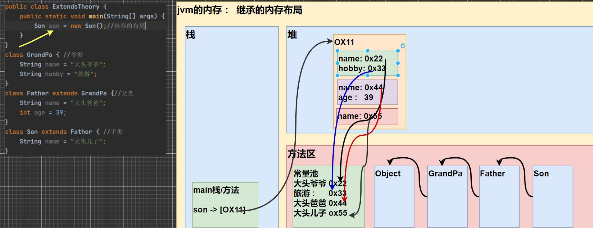

# 中级部分

## 包

> 在 Java 中，包（package）是一种组织类的方式。
>
> 包的本质实际上就是创建不同的文件夹（目录）来保存类文件。

- 包的三大作用

  - 区分相同名字的类，避免类名冲突。
  - 管理大量的类，使项目结构更加清晰。
  - 控制访问范围。

- 包的命名规则

  - 语法：`package com.公司名.项目名.业务模块名`
  - 使用 `package` 关键字声明类所属的包。
  - `com.公司名.项目名.业务模块名` 是包名，通常采用公司域名的倒序加上业务模块名的形式。

- 常用的包

  | 包名          | 说明                                                  | 示例类                           |
  | ------------- | ----------------------------------------------------- | -------------------------------- |
  | `java.lang.*` | 基本包，Java 中最常用的类，默认引入，不需要显式导入。 | `String`, `Math`, `Object`       |
  | `java.util.*` | 系统提供的工具包，包含许多常用的工具类。              | `Scanner`, `ArrayList`, `Date`   |
  | `java.net.*`  | 网络相关的包，提供网络通信的类和接口。                | `Socket`, `URL`, `URLConnection` |
  | `java.awt.*`  | Java 的界面开发包，提供图形用户界面（GUI）组件。      | `Button`, `Frame`, `Panel`       |

- 如何引入包

  - 语法：`import 包名`
  - 我们引入一个包的主要目的是要使用该包下的类
  - 建议按需导入，即需要使用哪个类，就导入哪个类。不建议使用 `*` 导入。

- 注意事项和使用细节

  - `package` 的作用是声明当前类所在的包，必须放在类的最上面，且一个类中最多只能有一句 `package` 声明。
  - `import` 指令的位置在 `package` 声明之后，类定义之前。可以有多句 `import` 语句，且没有顺序要求。

## 访问修饰符

> Java 提供四种访问控制修饰符号，用于控制方法和属性 (成员变量) 的访问权限（范围）:

- 访问修饰符的访问范围

  - 公开级别：用 `public` 修饰，对外公开。
  - 受保护级别：用 `protected` 修饰，对子类和同一个包中的类公开。
  - 默认级别：没有修饰符号，向同一个包的类公开。
  - 私有级别：用 `private` 修饰，只有类本身可以访问，不对外公开。

  | 访问级别 | 访问控制修饰符 | 同类 | 同包 | 子类 | 不同包 |
  | -------- | -------------- | ---- | ---- | ---- | ------ |
  | 公开     | `public`       | √    | √    | √    | √      |
  | 受保护   | `protected`    | √    | √    | √    | ×      |
  | 默认     | 没有修饰）     | √    | √    | ×    | ×      |
  | 私有     | `private`      | √    | ×    | ×    | ×      |

- 使用的注意事项

  - 修饰符可以用来修饰类中的属性、成员方法以及类。
  - 只有默认的和 `public` 才能修饰类，并且遵循上述访问权限的特点。
  - 成员方法的访问规则和属性完全一样。

## 封装

> 封装就是把抽象出的数据属性和对数据的操作方法封装在一起，数据被保护在内部，程序的其它部分只有通过被授权的操作方法，才能对数据进行操作。

- 隐藏实现细节

  - 封装使得类的内部实现对外部隐藏，外部只需通过方法调用即可使用功能，无需了解内部实现细节。
  - 例如，连接数据库的方法，外部只需传入参数即可，无需关心连接的具体过程。

- 提高安全性

  - 封装可以对数据进行验证，确保数据的有效性和安全性。
  - 通过设置访问控制修饰符，可以限制对数据的直接访问，防止非法操作。

- 封装的实现步骤

  1. 将属性进行私有化 `private`，防止外部直接修改属性。
  2. 提供一个公共的 `set` 方法，用于对属性进行判断和赋值。
  3. 提供一个公共的 `get` 方法，用于获取属性的值。

- 将构造器和 `set` 方法结合

  ```java
  public Person(String name, int age, double salary) {
      // this.name = name;
      // this.age = age;
      // this.salary = salary;
      // 我们可以将 set 方法写在构造器中，这样仍然可以验证
      setName(name);
      setAge(age);
      setSalary(salary);
  }
  ```

## 继承

> 继承可以解决代码复用，让我们的编程更加靠近人类思维。
>
> 当多个类具有共同的属性和方法时，可以将这些共同的特征抽象成一个父类。
>
> 子类通过 `extends` 关键字声明继承父类后，便自动拥有父类中定义的属性和方法，无需重复定义。

- 基本概念

  - 语法：`class 子类 extends 父类`
  - 子类：继承父类的类，也被称为派生类。
  - 父类：被继承的类，也叫基类或超类。
  - Java 中所有类都是 `Object` 类的子类，`Object` 类是所有类的基类（顶级父类）。
  - Java 是单继承机制，即一个类只能继承一个父类（直接继承）。
  - 不能滥用继承，子类和父类之间必须满足 "is-a" 的逻辑关系。

- 使用细节

  - 非私有的属性和方法可以在子类直接访问，但私有属性和方法须通过父类提供的公共方法去访问。
  - 创建子类对象时，父类的构造器会先被调用，之后才会执行子类的构造器。
  - 默认情况下，父类的无参构造器会被自动调用。如果父类没有无参构造器，则子类必须通过 `super()` 显式调用父类的某个构造器。
  - 父类构造器的调用不限于直接父类，将一直向上追溯直到 `Object` 类。

- 继承的本质分析

  :::: details 点击查看案例演示

  ::: code-group

  ```java [ExtendsTheory.java]
  public class ExtendsTheory {
      public static void main(String[] args) {
          Son son = new Son();  // 创建子类对象

          // 这时请大家注意，要按照查找关系来返回信息
          // (1) 首先看子类是否有该属性
          // (2) 如果子类有这个属性，并且可以访问，则返回信息
          // (3) 如果子类没有这个属性，就看父类有没有这个属性 (如果父类有该属性，并且可以访问，就返回信息)
          // (4) 如果父类没有就按照 (3) 的规则，继续找上级父类，直到 Object

          System.out.println(son.name);  // 大头儿子
          // System.out.println(son.age);  // 编译错误，因为 age 是私有的
          System.out.println(son.getAge());  // 39
          System.out.println(son.hobby);  // 旅游
      }
  }

  class GrandPa {  // 爷爷类
      String name = "大头爷爷";
      String hobby = "旅游";
  }

  class Father extends GrandPa {  // 父类
      String name = "大头爸爸";
      private int age = 39;

      public int getAge() {
          return age;
      }
  }

  class Son extends Father {  // 子类
      String name = "大头儿子";
  }
  ```

  ```txt [输出]
  大头儿子
  39
  旅游

  进程已结束，退出代码为 0
  ```

  :::

  ::::

  

  - 加载顺序：类的加载顺序是从顶级父类开始的。首先加载 `Object` 类，然后是 `GrandPa` 类，再加载 `Father` 类，最后加载 `Son` 类。
  - 内存分配：在堆内存中，每个类都有自己的空间来存储成员变量。即使不同类中存在相同名称的属性，它们也不会发生冲突。
  - 对象创建：在完成类的加载和内存分配后，最终会创建 `Son` 类的实例，并将其返回给 `main` 方法中的引用。

## 多态

- 基本概念

  - 方法或对象具有多种形态。多态是面向对象的第三大特征，它建立在封装和继承的基础上。
  - 注意：属性没有重写的概念，属性的值是根据编译类型来决定的。

- 多态的应用

  - 重写和重载体现了多态的特性。
  - 多态数组：数组的声明类型为父类类型，数组元素的实际类型可以是子类类型。
  - 多态参数：方法的参数类型为父类类型，实际传入的参数可以是子类类型的实例。

### 重写和重载

- 方法重写

  - 子类对父类方法的重新定义，目的是改变父类方法的行为。
  - 子类方法的名称、返回类型、形参列表必须与父类方法一致。
  - 子类方法的返回类型可以是父类返回类型的子类。
  - 子类方法不能缩小父类方法的访问权限，最好大于等于父类的权限。

- 方法重载

  - 方法重载通常用来增加方法的灵活性，例如同一个方法名处理不同类型的数据。
  - 在同一个类中定义多个同名方法，但参数的数量或类型不同。
  - 方法重载可以有不同的返回类型。

- 重写和重载比较

  | 名称             | 发生范围 | 方法名   | 形参列表                             | 返回类型                                                 | 修饰符                             |
  | ---------------- | -------- | -------- | ------------------------------------ | -------------------------------------------------------- | ---------------------------------- |
  | 重载（overload） | 本类     | 必须一样 | 类型、个数或者顺<br>序至少有一个不同 | 无要求                                                   | 无要求                             |
  | 重写（override） | 父子类   | 必须一样 | 相同                                 | 子类重写的方法返回类型必须<br>与父类一致，或是其子类类型 | 子类方法不能缩小父类方法的访问范围 |

### 对象的多态

> 一个对象的编译类型和运行类型可以不一致。

- 编译类型看定义时 `=` 号的左边，运行类型看 `=` 号的右边。
- 编译类型：在定义对象时确定，并且在程序运行期间不能改变。决定了对象可以调用哪些方法。
- 运行类型：在对象实际创建时确定，可以随着程序执行过程中对象的变化而改变。决定了实际调用的方法版本（如果有重写）。

```java
Animal animal = new Dog();  // animal 的编译类型是 Animal，运行类型是 Dog
animal = new Cat();         // animal 的编译类型仍然是 Animal，运行类型变成了 Cat
```

- 向上转型

  - 语法：`父类类型 引用名 = new 子类类型()`
  - 本质：父类类型的引用指向了子类的对象。
  - 前提：两个对象的类存在继承关系。
  - 使用细节：
    - 可以调用父类中的所有成员（需遵守访问权限），但不能调用子类中独有的成员。
    - 最终运行效果看子类的具体实现（运行时看运行类型，例如找方法时就是采用就近原则）。
    - 因为在编译阶段，能调用哪些成员，是由编译类型决定的。

- 向下转型

  - 语法：`子类类型 引用名 = (子类类型) 父类引用;`
  - 本质：将父类引用强制转换回子类类型。
  - 前提：父类的引用实际指向的对象是目标子类类型的对象。
  - 使用细节：
    - 向下转型只能强制转换父类的引用，而不能强制转换父类的对象。
    - 转型之后，可以访问子类中的所有成员（包括子类独有的成员）。
    - `instanceof` 操作符用于判断对象的运行类型是否是指定类型或其子类类型的实例。

### 动态绑定机制

- 当调用对象的方法时，该方法会和该对象的内存地址（运行类型）绑定。
- 当调用对象的属性时，没有动态绑定机制，哪里声明就在哪里使用，找不到再去父类中寻找。

:::: details 点击查看案例演示

::: code-group

```java [Test.java]
public class Test {
    public static void main(String[] args) {
        Animal animal = new Dog();

        // 调用方法，进行动态绑定
        animal.sound();

        // 访问属性，进行静态绑定
        System.out.println("Animal's name: " + animal.name);
    }
}

class Animal {
    String name = "Animal";

    void sound() {
        System.out.println(name + " sound");
    }
}

class Dog extends Animal {
    String name = "Dog";

    @Override
    void sound() {
        System.out.println(name + " Bark");
    }
}
```

```txt [输出]
Dog Bark
Animal's name: Animal

进程已结束，退出代码为 0
```

:::

::::

## super 关键字

- 基本介绍

  - `super` 代表父类的引用，用于访问父类的属性、方法和构造器。

- 基本语法

  - 通过 `super.属性名` 访问父类的属性，但不能访问父类的 `private` 属性。
  - 通过 `super.方法名(参数列表)` 调用父类的方法，但不能访问父类的 `private` 方法。
  - 使用 `super(参数列表)` 调用父类构造器。只能放在构造器的第一句，且只能出现一次。

- 使用细节

  - 调用父类的构造器的好处 (分工明确，父类属性由父类初始化，子类的属性由子类初始化)
  - 当子类中有和父类中的成员 (属性和方法) 重名时，为了访问父类的成员，必须通过 super。如果没有重名，使用 super、this、直接访问是一样的效果！
  - super 的访问不限于直接父类，如果爷爷类和本类中有同名的成员，也可以使用 super 去访问爷爷类的成员; 如果多个基类 (上级类) 中都有同名的成员，使用 super 访问遵循就近原则。A->B->C，当然也需要遵守访问权限的相关规则

- `super` 和 `this` 的比较

  | 区别点     | `this`                                                     | `super`                                  |
  | ---------- | ---------------------------------------------------------- | ---------------------------------------- |
  | 访问属性   | 访问当前类中的属性，如果当前类没有此属性，则从父类继续查找 | 从父类开始查找属性                       |
  | 调用方法   | 调用当前类中的方法，如果当前类没有此方法，则从父类继续查找 | 从父类开始查找方法                       |
  | 调用构造器 | 调用当前类的构造器，必须放在构造器的首行                   | 调用父类构造器，必须放在子类构造器的首行 |
  | 特殊作用   | 表示当前对象的引用                                         | 表示父类对象的引用                       |

## Object 类详解

### equals 方法

- `==` 和 `equals` 的对比

  - `==` 是一个比较运算符，既可以判断基本类型，又可以判断引用类型。
  - `==` 如果判断基本类型，判断的是值是否相等。如果判断引用类型，判断的是地址是否相等，即判定是不是同一个对象。
  - `equals` 是 `Object` 类中的方法，只能判断引用类型。
  - `equals` 默认判断的是地址是否相等，子类中往往重写该方法，用于判断内容是否相等。比如 `Integer` 和 `String`。

### hashCode 方法

> 返回该对象的哈希码值。实现 `hashCode` 方法的目的是提高哈希表的性能。

- 主要特点

  - 提高哈希结构容器的效率：`hashCode` 方法有助于优化哈希表等数据结构的性能，尤其是在大量数据操作时。
  - 相同对象的哈希值相同：如果两个引用指向同一个对象，它们的哈希值一定是相同的。
  - 不同对象的哈希值不同：对于指向不同对象的引用，哈希值通常是不同的，但也有可能发生哈希碰撞。
  - 哈希值与地址的关系：哈希值主要根据对象的内存地址生成，但它不能完全等同于地址，因为程序无法直接访问对象的真实内存地址。

### toString 方法

- 基本介绍
  
  - 如果没有重写 `toString` 方法，默认返回的是对象的全类名 + @ + 哈希值的十六进制表示。
  - 当直接输出一个对象时，`toString` 方法会被默认调用。
  - 子类通常会重写 `toString` 方法，返回对象的属性信息，这样能更直观地输出对象的状态。

### finalize 方法

- 基本介绍

  - `finalize` 方法是一个由 `Object` 类提供的方法，当对象被垃圾回收器回收之前，JVM 会自动调用该对象的 `finalize` 方法。
  - 子类可以重写该方法，用于做一些资源释放的操作（例如关闭数据库连接、释放文件资源等）。

- 触发时机

  - 当对象没有任何引用指向时，JVM 会认为该对象是垃圾对象，进而触发垃圾回收机制。在回收对象之前，会先调用 `finalize` 方法。
  - 垃圾回收机制的调用由 JVM 根据其内部的 GC 算法自动决定，也可以通过 `System.gc()` 主动请求 JVM 执行垃圾回收。

- 注意

  - 在实际开发中，`finalize` 方法很少被直接使用，通常是应付面试时讨论的一种机制。
  - 因为垃圾回收时并不保证及时调用 `finalize`，它的执行时机是不可预测的。
  - Java 中的资源释放，通常通过 `try-with-resources` 语句或者显式调用 `close()` 方法来处理，而不是依赖于 `finalize`。
