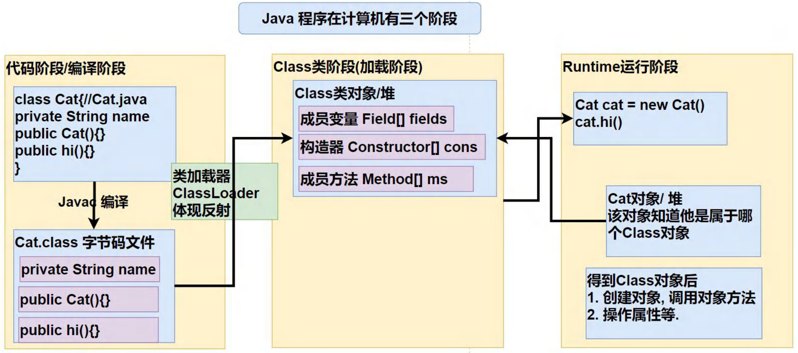
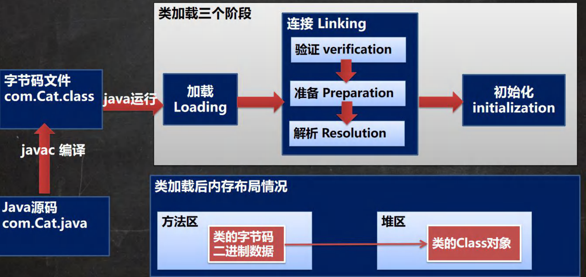
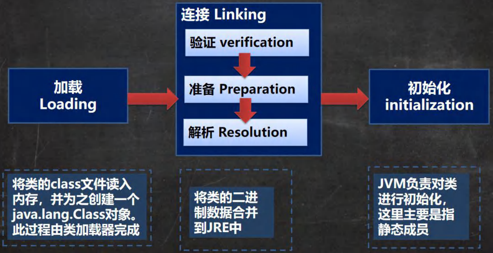

# Java | 反射

## 反射机制

> 反射机制允许程序在执行期借助于 `Reflection API` 取得任何类的内部信息（比如成员变量，构造器，成员方法等等），并能操作对象的属性及方法。反射在设计模式和框架底层都会用到。
>
> 加载完类之后，在堆中就产生了一个 Class 类型的对象（一个类只有一个 Class 对象），这个对象包含了类的完整结构信息。通过这个对象得到类的结构。这个 Class 对象就像一面镜子，透过这个镜子看到类的结构。

- 反射机制原理图

  

- 反射机制可以完成

  1. 在运行时判断任意一个对象所属的类
  2. 在运行时构造任意一个类的对象
  3. 在运行时得到任意一个类所具有的成员变量和方法
  4. 在运行时调用任意一个对象的成员变量和方法
  5. 生成动态代理

- 反射相关的主要类

  1. `java.lang.Class`：代表一个类，Class 对象表示某个类加载后在堆中的对象
  2. `java.lang.reflect.Method`：代表类的方法，Method 对象表示某个类的方法
  3. `java.lang.reflect.Field`：代表类的成员变量，Field 对象表示某个类的成员变量
  4. `java.lang.reflect.Constructor`：代表类的构造方法，Constructor 对象表示构造器

- 反射优点和缺点

  1. 优点：可以动态的创建和使用对象（也是框架底层核心），使用灵活，没有反射机制，框架技术就失去底层支撑。
  2. 缺点：使用反射基本是解释执行，对执行速度有影响。

- 反射调用优化（关闭访问检查）

  1. Method、Field 和 Constructor 对象都有 `setAccessible()` 方法。
  2. `setAccessible()` 方法是启用和禁用访问安全检查的开关。
  3. 参数值为 `true` 表示反射的对象在使用时取消访问检查，提高反射的效率，使其可以访问 `private` 修饰的构造器、方法和属性。
  4. 参数值为 `false` 则表示反射的对象执行访问检查。

## Class 类

> Class 也是类，因此也继承 Object 类。
>
> Class 类的对象不是 `new` 出来的，而是系统创建的。
>
> 对于某个类的 Class 对象，在内存中只有一份，因为类只加载一次。
>
> 每个类的实例都会记得自己是由哪个 Class 对象所生成。
>
> 通过 Class 对象可以完整地得到一个类的结构。
>
> Class 对象是存放在堆的。
>
> 类的字节码二进制数据，是放在方法区的，有的地方称为类的元数据（包括方法代码、变量名、方法名、访问权限等等）。

### 获取 Class 对象

- 已知一个类的全类名，可通过 Class 类的静态方法 `forName("全类名")` 获取，可能抛出 `ClassNotFoundException`。  
  应用场景：多用于从配置文件中读取类的全路径，动态加载类。

- 若已知具体的类，可通过 `类名.class` 获取，该方式最为安全可靠，程序性能最高。  
  应用场景：多用于参数传递，比如通过反射得到对应构造器对象。

- 已知某个类的实例，调用该实例的 `getClass()` 方法获取 Class 对象。  
  应用场景：通过创建好的对象，获取 Class 对象。

- 通过类加载器来获取到类的 Class 对象。

- 基本数据类型通过 `类型名称.class` 得到 Class 对象（基本数据类型会被自动装箱为包装类）。

- 基本数据类型对应的包装类，可以通过 `包装类名称.TYPE` 得到 Class 对象。

:::: details 点击查看案例演示

::: code-group

```java [Person.java]
package com.example;

public class Person {
    private String name;
    private int age;

    public Person() {}

    public Person(String name, int age) {
        this.name = name;
        this.age = age;
    }

    // Getter and Setter methods
    public String getName() {
        return name;
    }

    public void setName(String name) {
        this.name = name;
    }

    public int getAge() {
        return age;
    }

    public void setAge(int age) {
        this.age = age;
    }

    @Override
    public String toString() {
        return "Person{name='" + name + "', age=" + age + "}";
    }
}
```

```java [GetClassDemo.java]
import com.example.Person;

public class GetClassDemo {
    public static void main(String[] args) throws ClassNotFoundException {

        // 1. 使用 Class.forName() 获取 Class 对象
        // 通常从配置文件中读取类的全限定名并加载类
        String classAllPath = "com.example.Person"; // 类的全限定名
        Class<?> cls1 = Class.forName(classAllPath);
        System.out.println("Class.forName() -> " + cls1);

        // 2. 使用 类名.class 获取 Class 对象
        // 常用于传递参数，例如获取构造器对象时传递类名
        Class<?> cls2 = Person.class;
        System.out.println("类名.class -> " + cls2);

        // 3. 使用 对象.getClass() 获取 Class 对象
        // 当已有实例对象时，通过该方法获取 Class 对象
        Person person = new Person();
        Class<?> cls3 = person.getClass();
        System.out.println("对象.getClass() -> " + cls3);

        // 4. 通过类加载器获取 Class 对象
        // 先获取类加载器，然后加载类
        ClassLoader classLoader = person.getClass().getClassLoader();
        Class<?> cls4 = classLoader.loadClass(classAllPath);
        System.out.println("类加载器 -> " + cls4);

        // 验证 cls1, cls2, cls3, cls4 是同一个 Class 对象
        System.out.println("cls1 hashCode: " + cls1.hashCode());
        System.out.println("cls2 hashCode: " + cls2.hashCode());
        System.out.println("cls3 hashCode: " + cls3.hashCode());
        System.out.println("cls4 hashCode: " + cls4.hashCode());

        // 5. 获取基本数据类型的 Class 对象
        Class<?> intClass = int.class;
        Class<?> charClass = char.class;
        System.out.println("int.class -> " + intClass);
        System.out.println("char.class -> " + charClass);

        // 6. 获取基本数据类型的包装类的 Class 对象
        Class<?> integerType = Integer.TYPE;
        Class<?> characterType = Character.TYPE;
        System.out.println("Integer.TYPE -> " + integerType);
        System.out.println("Character.TYPE -> " + characterType);

        // 验证基本数据类型的 Class 对象与其包装类的 TYPE 是同一个对象
        System.out.println("int.class hashCode: " + intClass.hashCode());
        System.out.println("Integer.TYPE hashCode: " + integerType.hashCode());
    }
}
```

```txt [输出]
Class.forName() -> class com.example.Person
类名.class -> class com.example.Person
对象.getClass() -> class com.example.Person
类加载器 -> class com.example.Person
cls1 hashCode: 1324119927
cls2 hashCode: 1324119927
cls3 hashCode: 1324119927
cls4 hashCode: 1324119927
int.class -> int
char.class -> char
Integer.TYPE -> int
Character.TYPE -> char
int.class hashCode: 460141958
Integer.TYPE hashCode: 460141958

进程已结束，退出代码为 0
```

:::

::::

### 具有 Class 对象的类型

- 外部类
- 内部类：成员内部类、静态内部类、局部内部类、匿名内部类
- 接口：interface
- 数组
- 枚举：enum
- 注解：annotation
- 基本数据类型（包括 void）

:::: details 点击查看案例演示

::: code-group

```java [AllTypeClassDemo.java]
import java.io.Serializable;

public class AllTypeClassDemo {
    public static void main(String[] args) {
        // 外部类
        Class<String> cls1 = String.class;
        // 接口
        Class<Serializable> cls2 = Serializable.class;
        // 一维数组
        Class<Integer[]> cls3 = Integer[].class;
        // 二维数组
        Class<float[][]> cls4 = float[][].class;
        // 注解
        Class<Deprecated> cls5 = Deprecated.class;
        // 枚举
        Class<Thread.State> cls6 = Thread.State.class;
        // 基本数据类型
        Class<Long> cls7 = long.class;
        // void 数据类型
        Class<Void> cls8 = void.class;
        // Class 本身
        Class<?> cls9 = Class.class;

        // 输出各类型的 Class 对象
        System.out.println("外部类 -> " + cls1);
        System.out.println("接口 -> " + cls2);
        System.out.println("一维数组 -> " + cls3);
        System.out.println("二维数组 -> " + cls4);
        System.out.println("注解 -> " + cls5);
        System.out.println("枚举 -> " + cls6);
        System.out.println("基本数据类型 -> " + cls7);
        System.out.println("void 数据类型 -> " + cls8);
        System.out.println("Class 本身 -> " + cls9);
    }
}
```

```txt [输出]
外部类 -> class java.lang.String
接口 -> interface java.io.Serializable
一维数组 -> class [Ljava.lang.Integer;
二维数组 -> class [[F
注解 -> interface java.lang.Deprecated
枚举 -> class java.lang.Thread$State
基本数据类型 -> long
void 数据类型 -> void
Class 本身 -> class java.lang.Class

进程已结束，退出代码为 0
```

:::

::::

## 类加载

> 类加载是指在运行时将类的字节码加载到 JVM 中的过程。
>
> Java 的反射机制是实现动态语言特性的重要手段，通过反射可以实现类的动态加载。

### 加载方式

#### 静态加载

在编译时就将相关类加载到内存中，如果类不存在，会直接报错。这种方式依赖性较强，通常出现在以下场景：

- 使用 `new` 关键字创建对象时。
- 当子类被加载时，父类也会被加载。
- 调用类中的静态成员（如静态变量、静态方法）时。

#### 动态加载

在运行时才加载所需的类。这种方式可以在运行时灵活地加载类，如果没有使用某个类，即使类不存在，也不会导致错误，从而降低了依赖性。常见的使用场景是：

- 通过反射机制创建对象。

动态加载的优势在于其灵活性，能够在程序运行过程中根据需要加载和使用类，从而提升了程序的扩展性和维护性。

### 加载过程

- 类加载过程图

  

  加载后方法区存储的是类的字节码二进制文件，而堆区就创建了相应的类的 Class 对象。

- 类加载各阶段完成任务

  

  注意：这里是针对类的加载阶段，并不是 `new` 的阶段，因此是针对静态成员。

#### 加载阶段

  JVM 在该阶段的主要目的是将字节码从不同的数据源（如 `.class` 文件、`.jar` 包、网络）转化为二进制字节流加载到内存中，并生成一个代表该类的 Class 对象。

#### 连接阶段

1. 验证（verification）

    - 目的是为了确保 Class 文件的字节流中包含的信息符合当前虚拟机的要求，并且不会危害虚拟机自身的安全。
    - 包括：文件格式验证（是否以魔数 `oxcafebabe` 开头）、元数据验证、字节码验证和符号引用验证。
    - 可以考虑使用 `-Xverify:none` 参数来关闭大部分的类验证措施，缩短虚拟机类加载的时间。

2. 准备（Preparation）

    - JVM 会在该阶段对静态变量分配内存并进行默认初始化（对应数据类型的默认初始值有 `0`、`0.0`、`null`、`false` 等）。
    - 这些变量所使用的内存都将在方法区中进行分配。

    ::: details 点击查看案例演示

    ```java
    public class ClassLoadDemo {
        public static void main(String[] args) {

        }
    }

    class A {
        public int n1 = 10;  // 实例变量，不会在准备阶段分配内存
        public static int n2 = 20;  // 静态变量，准备阶段分配内存并且默认初始化为 0，直到初始化阶段才会赋值为 20
        public static final int n3 = 30;  // 常量，和静态变量不一样，因为一旦赋值就不变，所以直接初始化为 30
    }
    ```

    :::

3. 解析（Resolution）

    - 虚拟机将常量池内的**符号引用**替换为**直接引用**的过程。
    - 这个过程是由 JVM 机自动完成的。

#### 初始化阶段

- 在初始化阶段，类中定义的 Java 程序代码才会真正开始执行，此时会执行 `clinit()` 方法。
- `clinit()` 方法是由编译器根据源文件中语句的出现顺序，自动收集所有**静态变量的赋值操作**和**静态代码块中的语句**，并将它们合并在一起。
- 虚拟机会确保 `clinit()` 方法在多线程环境中被正确加锁和同步。如果多个线程同时尝试初始化一个类，只有一个线程会执行 `clinit()` 方法，其他线程则会阻塞等待，直到该方法执行完毕。
- 这一机制确保了每个类在内存中只有一个 Class 对象，从而保持类加载过程的安全性和一致性。

:::: details 点击查看案例演示

::: code-group

```java [ClassLoadDemo.java]
public class ClassLoadDemo {
    public static void main(String[] args) {
        /*
          类加载阶段：加载 B 类，并生成其 Class 对象。
          连接阶段：
            - 验证：检查 Class 文件格式是否正确。
            - 准备：为静态变量分配内存并初始化默认值 num = 0。
            - 解析：将符号引用转换为直接引用。
          初始化阶段：
            - 合并静态变量的赋值操作和静态代码块中的语句，生成 `clinit()` 方法。
            - 执行 `clinit()` 方法，进行如下操作：
              - System.out.println("B 静态代码块被执行"); // 静态代码块中的输出语句
              - num = 300; // 静态代码块中的赋值
              - num = 100; // 静态变量的显式赋值
            - 这就是为什么 num 最终值为 100 的原因
          注意：创建对象和访问类的静态变量都会触发类加载
         */

        B b = new B();
        System.out.println(B.num);  // 输出 100
    }
}

class B {
    static {
        System.out.println("B 静态代码块被执行");
        num = 300;  // 静态代码块中为 num 赋值
    }

    static int num = 100;  // 静态变量的显式赋值

    public B() {
        System.out.println("B() 构造器被执行");
    }
}
```

```txt [输出]
B 静态代码块被执行
B() 构造器被执行
100

进程已结束，退出代码为 0
```

:::

::::

## 反射用法

### 获取类的结构信息

| 类                            | 方法                        | 描述                                               |
| ----------------------------- | --------------------------- | -------------------------------------------------- |
| java.lang.Class               | `getName()`                 | 获取全类名                                         |
|                               | `getSimpleName()`           | 获取简单类名                                       |
|                               | `getFields()`               | 获取所有 `public` 修饰的属性，包含本类以及父类     |
|                               | `getDeclaredFields()`       | 获取本类中所有属性                                 |
|                               | `getMethods()`              | 获取所有 `public` 修饰的方法，包含本类以及父类     |
|                               | `getDeclaredMethods()`      | 获取本类中所有方法                                 |
|                               | `getConstructors()`         | 获取本类所有 `public` 修饰的构造器                 |
|                               | `getDeclaredConstructors()` | 获取本类中所有构造器                               |
|                               | `getPackage()`              | 以 `Package` 形式返回包信息                        |
|                               | `getSuperclass()`           | 以 `Class` 形式返回父类信息                        |
|                               | `getInterfaces()`           | 以 `Class[]` 形式返回接口信息                      |
|                               | `getAnnotations()`          | 以 `Annotation[]` 形式返回注解信息                 |
| java.lang.reflect.Field       | `getModifiers()`            | 以 `int` 形式返回修饰符                            |
|                               | `getType()`                 | 以 `Class` 形式返回类型（属性对应类的 Class 对象） |
|                               | `getName()`                 | 返回属性名                                         |
| java.lang.reflect.Method      | `getModifiers()`            | 以 `int` 形式返回修饰符                            |
|                               | `getReturnType()`           | 以 `Class` 形式获取返回类型                        |
|                               | `getName()`                 | 返回方法名                                         |
|                               | `getParameterTypes()`       | 以 `Class[]` 返回参数类型数组                      |
| java.lang.reflect.Constructor | `getModifiers()`            | 以 `int` 形式返回修饰符                            |
|                               | `getName()`                 | 返回构造器名（全类名）                             |
|                               | `getParameterTypes()`       | 以 `Class[]` 返回参数类型数组                      |

### 通过反射创建对象

- 通过 Class 对象获取类的默认构造函数，并调用 `newInstance()` 方法创建对象。

  ```java
  Class<?> clazz = Class.forName("com.example.MyClass");
  Object obj = clazz.getConstructor().newInstance();
  ```

- 通过 Class 对象获取指定参数类型的构造函数，并调用 `newInstance()` 方法创建对象。

  ```java
  Class<?> clazz = Class.forName("com.example.MyClass");
  Object obj = clazz.getConstructor(String.class, int.class).newInstance("参数", 123);
  ```

- 获取类的无参构造函数（包括 private），并使用 `newInstance()` 方法创建对象。

  ```java
  Class<?> clazz = Class.forName("com.example.MyClass");
  Constructor<?> constructor = clazz.getDeclaredConstructor();
  constructor.setAccessible(true); // 如果构造函数是私有的，需要设置可访问
  Object obj = constructor.newInstance();
  ```

- 通过 Class 对象直接调用 `newInstance()` 方法创建对象。注意：该方法已被废弃，推荐使用 `getConstructor().newInstance()`。

  ```java
  Class<?> clazz = Class.forName("com.example.MyClass");
  Object obj = clazz.newInstance();
  ```

- 注意 `getConstructor(Class...)` 和 `getDeclaredConstructor(Class...)` 只能获取到当前类定义的构造方法。

### 访问类中的成员

- 访问属性

  - 获取 `Field` 对象：通过 Class 对象的 `getDeclaredField()` 方法，传入属性名即可获取类中的字段对象。
  - 暴力访问：要访问私有属性，需要调用 `setAccessible(true)`，以绕过 Java 的访问控制检查。
  - 设置和获取属性：使用 `Field` 的 `set` 和 `get` 方法来操作属性值。对于静态属性，`set` 和 `get` 的对象参数可以为 `null`。

- 访问方法

  - 获取 `Method` 对象：通过 Class 对象的 `getDeclaredMethod()` 方法，传入方法名和参数类型来获取类中的方法对象。
  - 暴力访问：同样需要调用 `setAccessible(true)` 以绕过方法的访问权限限制。
  - 调用方法：使用 `Method` 的 `invoke` 方法，传入对象实例和参数来调用指定的方法。对于静态方法，`invoke` 的对象参数可以为 `null`。

:::: details 点击查看案例演示

::: code-group

```java [Person.java]
// 父类 Person，包含字段 name 和方法 getName、sayHello
public class Person {
    public String name;

    // 获取 name 的方法
    public String getName() {
        return name;
    }

    // 打印问候信息的方法
    public void sayHello(String name, int age) {
        System.out.printf("%s：你好，我的名字是%s，今年 %d 岁\n", getClass().getName(), name, age);
    }
}
```

```java [Student.java]
// 子类 Student，继承自 Person，并增加 score、grade 和 ID 字段及相关方法
public class Student extends Person {
    public int score;
    private int grade;
    private static int ID;

    // 无参构造方法
    public Student() {
    }

    // 获取 score 的方法
    public int getScore() {
        return score;
    }

    // 获取 grade 的方法，private 修饰
    private int getGrade() {
        return grade;
    }

    // 获取 ID 的静态方法，private 修饰
    private static int getID() {
        return ID;
    }
}
```

```java [ReflectionDemo.java]
import java.lang.reflect.Field;
import java.lang.reflect.Method;

public class ReflectionDemo {
    public static void main(String[] args) throws Exception {
        // 获取 Student 类的 Class 对象
        Class<Student> studentClass = Student.class;

        // 通过无参构造方法实例化 Student 对象
        Student student = studentClass.getConstructor().newInstance();

        // 获取并设置父类中的 public 字段 name
        Field name = studentClass.getField("name");
        name.set(student, "小明");
        System.out.println(name + " -> " + name.get(student));

        // 获取并设置 Student 类中的 public 字段 score
        Field score = studentClass.getField("score");
        score.set(student, 78);
        System.out.println(score + " -> " + score.get(student));

        // 获取并设置 Student 类中的 private 字段 grade
        Field grade = studentClass.getDeclaredField("grade");
        grade.setAccessible(true); // 允许访问 private 字段
        grade.set(student, 3);
        System.out.println(grade + " -> " + grade.get(student));

        // 获取并设置 Student 类中的 private static 字段 ID
        Field id = studentClass.getDeclaredField("ID");
        id.setAccessible(true); // 允许访问 private 字段
        id.set(student, 250001);
        System.out.println(id + " -> " + id.get(null)); // 静态字段用 null 获取值

        System.out.println("--------------------");

        // 获取并调用 public 方法 getName
        Method getName = studentClass.getMethod("getName");
        System.out.println(getName + " return " + getName.invoke(student));

        // 获取并调用 public 方法 getScore
        Method getScore = studentClass.getMethod("getScore");
        System.out.println(getScore + " return " + getScore.invoke(student));

        // 获取并调用 private 方法 getGrade
        Method getGrade = studentClass.getDeclaredMethod("getGrade");
        getGrade.setAccessible(true); // 允许访问 private 方法
        System.out.println(getGrade + " return " + getGrade.invoke(student));

        // 获取并调用 private static 方法 getID
        Method getID = studentClass.getDeclaredMethod("getID");
        getID.setAccessible(true); // 允许访问 private 方法
        System.out.println(getID + " return " + getID.invoke(null)); // 静态方法用 null 调用

        System.out.println("--------------------");

        // 使用反射调用 sayHello 方法，展示继承关系中的方法调用
        Method sayHello = studentClass.getMethod("sayHello", String.class, int.class);
        sayHello.invoke(new Person(), "小明", 20); // 调用父类的方法
        sayHello.invoke(student, "小红", 18); // 调用子类的方法
    }
}
```

```txt [输出]
public java.lang.String Person.name -> 小明
public int Student.score -> 78
private int Student.grade -> 3
private static int Student.ID -> 250001
--------------------
public java.lang.String Person.getName() return 小明
public int Student.getScore() return 78
private int Student.getGrade() return 3
private static int Student.getID() return 250001
--------------------
Person：你好，我的名字是小明，今年 20 岁
Student：你好，我的名字是小红，今年 18 岁

进程已结束，退出代码为 0
```

:::

::::
