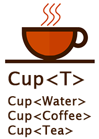

# Java | 泛型

泛型在 Java 中有很重要的地位，在面向对象编程及各种设计模式中有非常广泛的应用。

## 泛型说明

泛型是一种“代码模板”，可以用一套代码套用各种类型。



**泛型的作用：**

- 泛型其实就是将类型参数化，从而提高参数类型的表达能力。
- 泛型可以使用在类、接口和方法上，分别被称为泛型类、泛型接口和泛型方法。
- 泛型可以在类声明时通过一个标识符表示类中某个属性的类型，或者是某个方法的返回值的类型，或者是参数类型。

**使用泛型的优势有：**

- 泛型可以使得程序在编译期间就发现类型匹配问题，而不是在运行期间发现问题。
- 泛型可以明确特定对象实例化时的类型信息，避免不必要的类型转换。
- 泛型可以提高代码重用性。

## 泛型语法

泛型的标识是在一对尖括号“<>”中包含类型形参，其中的类型形参可以有一个或多个，如：`<T>`、`<T, U>`、`<K, V>`。从语法上来说，类型形参可以是任意字符。但是从开发规范的角度来讲，一般都是采用简短的大写字母来表示：

- 用 `E` 表示集合元素；
- `K` 和 `V` 分别表示键和值；
- `T` 可以表示任意类型，如果有多个任意类型时，可以使用和 `T` 相邻的字母，如：`U`、`S`。

**使用细节：**

- 泛型的类型实参只能使用引用类型，不能使用基本数据类型。
- 在指定泛型的类型实参后，可以传入该类型或其子类型。
- 泛型没有继承性。

```java
// 错误示范
// ArrayList<int> list = new ArrayList<>();

// 错误示范
// ArrayList<Object> arrayList = new ArrayList<String>();
```

### 泛型类

**使用细节：**

- 泛型类的类型形参是在创建对象时确定的。
- 泛型类中可以定义泛型的数组但不能初始化。
- 普通成员（属性、方法）可以使用泛型变量。
- 静态成员（属性、方法）不能使用类中的泛型变量，因为静态成员在类加载时还无法获得泛型变量的类型。
- 如果泛型类被继承或者被实例化时，没有指定类型实参，则默认为 Object 类。

```java
class Test<K, V> {
    private K key;
    private V value;

    public Test(K key, V value) {
        this.key = key;
        this.value = value;
    }

    public K getKey() {
        return key;
    }

    public void setKey(K key) {
        this.key = key;
    }

    public V getValue() {
        return value;
    }

    public void setValue(V value) {
        this.value = value;
    }
}
```

### 泛型接口

**使用细节：**

- 泛型接口的类型形参是在继承接口和实现接口时确定的。
- 静态成员（属性、方法）不能使用接口中的泛型变量。
- 如果泛型接口被继承或被实现时，没有指定类型实参，则默认为 Object 类型。

```java
interface Test<K, V> {

    V get(K key);

    V put(K key, V value);
}
```

### 泛型方法

**使用细节：**

- 泛型方法的类型形参在被调用时确定。
- 泛型方法既可以定义在普通类中也可以定义在泛型类中。
- 泛型方法的形参列表既可以使用类声明的泛型也可以使用自己声明的泛型。

```java
public class Main {
    public static void main(String[] args) {
        getObject("abc", 123);
    }

    public static <K, V> void getObject(K key, V value) {
        System.out.println(key.getClass());
        System.out.println(value.getClass());
    }
}
```

## 泛型的通配符

泛型的表达能力是非常强的，在某些场景下，如果需要限定一个类型范围，而不是某个具体类型的时候，就需要使用类型限定符或类型通配符。

**类型限定符可以归结为下面几种类型：**

- `<?>`，表示无限制通配符。

- `<? extends Type>`，表示限定的类型只能是 `Type` 本身或它的子类，限定了泛型的上限。

- `<? super Type>`，表示限定的类型只能是 `Type` 本身或它的父类，限定了泛型的下限。
