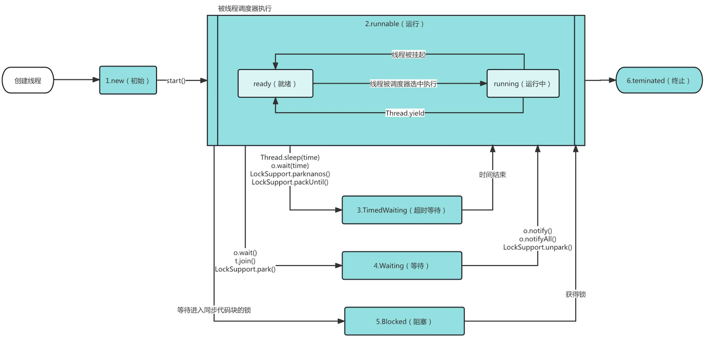

# Java | 多线程

## 基本概念

> Java 语言内置了多线程支持。当 Java 程序启动的时候，实际上是启动了一个 JVM 进程，然后，JVM 启动主线程来执行 `main()` 方法。在 `main()` 方法中，我们又可以启动其他线程。

- 程序：程序是一组为完成特定任务而用某种语言编写的指令集合。

- 进程：进程是程序的一次执行过程，或是正在运行的一个程序。

- 线程：线程是由进程创建的一个执行单元。可以理解为进程中的一个“子任务”，一个进程可以包含多个线程。

- 其他相关概念

  - 单线程：一个时间点上只能运行一个线程。
  - 多线程：一个时间点上可以运行多个线程。
  - 并发：多个任务在同一时间段内交替执行。
  - 并行：多个任务在同一时间真正同时运行。

## 线程的状态

在 Java 程序中，一个线程对象只能调用一次 `start()` 方法启动新线程，并在新线程中执行 `run()` 方法。一旦 `run()` 方法执行完毕，线程就结束了。因此，Java 线程的生命周期包括以下几种状态：

- NEW（新建）
  - 线程对象已经被创建，但尚未调用 `start()` 方法，此时线程处于新建状态。

- RUNNABLE（可运行）
  - 线程调用了 `start()` 方法，进入可运行状态。
  - 此时线程并不一定立刻执行，而是等待 JVM 调度。
  - 处于此状态的线程可能正在执行，也可能在等待 CPU 分配时间片。

- TIMED_WAITING（超时等待）
  - 线程进入计时等待状态，会在指定时间后自动返回。
  - 例如调用 `Thread.sleep()`、`join(timeout)` 或 `wait(timeout)` 方法后，线程会处于此状态。

- WAITING（等待）
  - 线程进入等待状态，需要其他线程显示地唤醒它。
  - 例如调用 `Object.wait()` 后线程会进入此状态，直到被其他线程通过 `notify()` 或 `notifyAll()` 唤醒。

- BLOCKED（阻塞）
  - 线程尝试获取一个被其他线程占用的锁时，会进入阻塞状态。
  - 只有当锁被释放后，线程才会重新进入可运行状态。

- TERMINATED（终止）
  - 线程的 `run()` 方法执行完毕或因异常退出后，线程进入终止状态，表示生命周期结束。
  - 终止状态的线程不可再次启动。

有些书中说一共有 7 个状态，实际上就是将 Runnable 状态中 Ready 和 Running 分开了。到底是否运行还是取决于内核态的调度情况。



## 线程的使用

- 继承 `Thread` 类并重写其 `run()` 方法来创建线程对象，然后调用 `start()` 方法启动线程。
  - 如果线程类不需要继承其他类，可以直接继承 `Thread`，代码较为简单。
  - 适合只需要实现线程功能，不需要共享资源的情况。

  ::: details 点击查看案例演示

  ```java
  public class Main {
      public static void main(String[] args) {
          Thread t = new MyThread();
          t.start(); // 启动新线程
      }
  }

  class MyThread extends Thread {
      @Override
      public void run() {
          System.out.println("start new thread!");
      }
  }
  ```

  :::

- 实现 `Runnable` 接口并重写其 `run()` 方法，然后将该实现类的实例传入 `Thread` 构造器，再调用 `start()` 方法启动线程。
  - 更适合多个线程共享同一资源的场景，因为 `Runnable` 实现类可以被多个线程使用。
  - 避免了单继承的限制，继承其他父类的同时实现多线程功能。
  - 推荐使用 `Runnable`，设计更加灵活。

  :::: details 点击查看案例演示

  ::: code-group

  ```java [普通实现]
  public class Main {
      public static void main(String[] args) {
          Thread t = new Thread(new MyRunnable());
          t.start(); // 启动新线程
      }
  }

  class MyRunnable implements Runnable {
      @Override
      public void run() {
          System.out.println("start new thread!");
      }
  }
  ```

  ```java [lambda 实现]
  public class Main {
      public static void main(String[] args) {
          Thread t = new Thread(() -> {
              System.out.println("start new thread!");
          });
          t.start(); // 启动新线程
      }
  }
  ```

  :::

  ::::

- 两者的区别
  - `Thread` 类本身就实现了 `Runnable` 接口，因此通过继承 `Thread` 或实现 `Runnable` 创建线程在本质上没有区别。

- 线程常用方法

  | 方法                        | 描述                                                                                                   |
  | --------------------------- | ------------------------------------------------------------------------------------------------------ |
  | `setName(String name)`      | 设置线程名称，使线程的名称与参数 `name` 相同                                                           |
  | `getName()`                 | 返回线程的名称                                                                                         |
  | `start()`                   | 启动线程，调用 Java 虚拟机底层的 `start0` 方法来执行线程                                               |
  | `run()`                     | 线程执行的具体任务，通常在 `run` 方法中编写线程的工作逻辑                                              |
  | `setPriority(int priority)` | 更改线程的优先级，优先级范围为 1（最低）到 10（最高），默认值为 5                                      |
  | `getPriority()`             | 获取线程的优先级                                                                                       |
  | `sleep(long millis)`        | 让当前线程休眠指定的毫秒数（暂停执行），可以用来模拟任务延迟或降低线程频率                             |
  | `interrupt()`               | 中断线程，通知线程停止当前操作或退出，需配合线程内的中断状态检查使用                                   |
  | `yield()`                   | 线程的礼让，当前线程主动让出 CPU，允许其他线程执行。礼让的时间不确定，当前线程可能并不会立即让出 CPU |
  | `join()`                    | 线程的插队，当前线程会等待调用该方法的线程执行完毕后，再继续执行。插队线程的任务必须先执行完         |

### 线程终止

- 线程正常终止：`run()` 方法执行到 `return` 语句返回。
- 线程意外终止：`run()` 方法因为未捕获的异常导致线程终止。
- 通知线程终止：通过设置标志变量来控制线程的运行状态。

  :::: details 点击查看案例演示

  ::: code-group

  ```java [ThreadDemo.java]
  public class ThreadDemo {
      public static void main(String[] args) {
          MyThread thread = new MyThread();
          thread.start();

          try {
              Thread.sleep(2000); // 主线程等待 2 秒
          } catch (InterruptedException e) {
              e.printStackTrace();
          }

          // 通知子线程退出
          thread.stopThread();
          System.out.println("通知子线程停止。");
      }
  }
  ```

  ```java [MyThread.java]
  class MyThread extends Thread {
      // 定义标志变量，用于控制线程退出
      private boolean running = true;

      @Override
      public void run() {
          while (running) {
              System.out.println("线程正在运行...");
              try {
                  Thread.sleep(500); // 模拟线程工作
              } catch (InterruptedException e) {
                  e.printStackTrace();
              }
          }
          System.out.println("线程已停止。");
      }

      // 提供方法来修改标志变量，从而通知线程退出
      public void stopThread() {
          running = false;
      }
  }
  ```

  ```txt [输出]
  线程正在运行...
  线程正在运行...
  线程正在运行...
  线程正在运行...
  线程正在运行...
  通知子线程停止。
  线程已停止。

  进程已结束，退出代码为 0
  ```

  :::

  ::::

### 线程中断

> 线程中断是 Java 中的一种机制，用来通知一个线程应该停止当前的工作或者改变状态。
>
> 注意：中断并不会强制线程终止，而是通过设置“中断标志”（interrupt flag）来给线程传递一个信号。
>
> 线程可以根据这个信号自行决定如何响应，比如退出、重新尝试任务或清理资源。

- 中断标志位：
  - 每个线程都有一个中断标志位，用来表示该线程是否被请求中断。
  - `interrupt()` 方法会将目标线程的中断标志设置为 `true`。
  - 线程可以通过 `isInterrupted()` 检查自己的中断状态。

- 响应中断的两种方式：
  - 检查中断标志：线程定期调用 `isInterrupted()`，发现中断标志为 `true` 时自行退出或执行其他逻辑。

    :::: details 点击查看案例演示

    ::: code-group

    ```java [InterruptFlagExample.java]
    public class InterruptFlagExample {
        public static void main(String[] args) {
            Thread thread = new Thread(() -> {
                while (!Thread.currentThread().isInterrupted()) { // 检查中断标志
                    System.out.println("线程运行中...");
                    try {
                        Thread.sleep(1000); // 模拟工作
                    } catch (InterruptedException e) {
                        System.out.println("线程在休眠时被中断！");
                        Thread.currentThread().interrupt(); // 重新设置中断标志
                    }
                }
                System.out.println("线程已中断，退出运行。");
            });

            thread.start();

            try {
                Thread.sleep(3000); // 主线程休眠3秒
            } catch (InterruptedException e) {
                e.printStackTrace();
            }

            thread.interrupt(); // 主线程中断子线程
        }
    }
    ```

    ```txt [输出]
    线程运行中...
    线程运行中...
    线程运行中...
    线程在休眠时被中断！
    线程已中断，退出运行。

    进程已结束，退出代码为 0
    ```

    :::

    ::::

  - 捕获 `InterruptedException`：如果线程在调用阻塞方法时被中断，会抛出 `InterruptedException`。

    :::: details 点击查看案例演示

    ::: code-group

    ```java [InterruptedExceptionExample.java]
    public class InterruptedExceptionExample {
        public static void main(String[] args) {
            Thread thread = new Thread(() -> {
                try {
                    System.out.println("线程开始运行...");
                    Thread.sleep(5000); // 模拟阻塞操作
                    System.out.println("线程完成工作。");
                } catch (InterruptedException e) {
                    System.out.println("线程被中断，停止工作。");
                }
            });

            thread.start();

            try {
                Thread.sleep(2000); // 主线程等待2秒
            } catch (InterruptedException e) {
                e.printStackTrace();
            }

            thread.interrupt(); // 主线程中断子线程
        }
    }
    ```

    ```txt [输出]
    线程开始运行...
    线程被中断，停止工作。

    进程已结束，退出代码为 0
    ```

    :::

    ::::

### 守护线程

- 守护线程（Daemon Thread）是为后台服务提供支持的线程，常用于处理定时任务、日志记录或数据清理等不需要用户交互的任务。
- 与普通线程不同，守护线程不会阻止程序退出。当所有非守护线程结束时，守护线程会自动退出，无论它是否完成了任务。
- 在 Java 中，可以通过 `Thread.setDaemon(true)` 将线程标记为守护线程。一旦标记后，程序结束时守护线程会随之自动终止。

:::: details 点击查看案例演示

::: code-group

```java [DaemonThreadDemo.java]
public class DaemonThreadDemo {
    public static void main(String[] args) {
        // 创建一个普通线程
        Thread regularThread = new Thread(new RegularTask());
        regularThread.start();

        // 创建一个守护线程
        Thread daemonThread = new Thread(new DaemonTask());
        daemonThread.setDaemon(true);  // 设置为守护线程
        daemonThread.start();

        // 主线程的任务
        try {
            Thread.sleep(2000);  // 主线程睡眠2秒，等待其他线程执行
        } catch (InterruptedException e) {
            e.printStackTrace();
        }

        System.out.println("主线程执行完毕，程序结束");
    }
}
```

```java [DaemonTask.java]
class DaemonTask implements Runnable {
    @Override
    public void run() {
        while (true) {
            try {
                System.out.println("守护线程在执行...");
                Thread.sleep(1000);  // 模拟守护线程的工作
            } catch (InterruptedException e) {
                e.printStackTrace();
            }
        }
    }
}
```

```java [RegularTask.java]
class RegularTask implements Runnable {
    @Override
    public void run() {
        try {
            System.out.println("普通线程开始执行...");
            Thread.sleep(5000);  // 模拟一些需要较长时间的操作
            System.out.println("普通线程执行完毕");
        } catch (InterruptedException e) {
            e.printStackTrace();
        }
    }
}
```

```txt [输出]
普通线程开始执行...
守护线程在执行...
守护线程在执行...
主线程执行完毕，程序结束
守护线程在执行...
守护线程在执行...
守护线程在执行...
普通线程执行完毕

进程已结束，退出代码为 0
```

:::

::::

## 线程同步

> 在多线程编程中，为了保护敏感数据的完整性，必须使用线程同步技术。即当一个线程正在操作某块内存时，其他线程必须等待，直到操作完成后才能访问该内存。这确保了同一时刻最多只有一个线程访问该数据。

- 同步代码块

  ```java
  synchronized (this) { // 锁住 this 或其他锁对象
      // 需要被同步代码;
  }
  ```

- 同步方法

  ```java
  public synchronized void m(String name) { // 锁住 this
      // 需要被同步的代码
  }
  ```

### 互斥锁

- 基本介绍

  - Java 语言中，引入了对象互斥锁的概念，来保证共享数据操作的完整性。
  - 每个对象都对应于一个可称为“互斥锁”的标记，这个标记用来保证在任一时刻，只能有一个线程访问该对象。
  - 关键字 `synchronized` 来与对象的互斥锁联系。当某个对象用 `synchronized` 修饰时，表明该对象在任一时刻只能由一个线程访问。
  - 同步的局限性：导致程序的执行效率降低。
  - 非静态同步方法的锁可以是 `this`，也可以是其他对象（要求是同一个对象）。
  - 静态同步方法的锁为当前类本身。即该类的 Class 对象。

- 注意事项和细节

  - 同步方法如果没有使用 `static` 修饰，默认锁对象为 `this`。
  - 如果方法使用 `static` 修饰，默认锁对象为当前类的 Class 对象。

- 实现步骤

  - 需要先分析上锁的代码
  - 选择同步代码块或同步方法（同步的范围越小，当然效率也就越高）
  - 要求多个线程的锁对象为同一个即可

### 释放锁

- 下面操作会释放锁

  - 当前线程的同步代码块、同步方法执行结束。
  - 当前线程在同步代码块、同步方法中遇到 `break`、`return`。
  - 当前线程在同步代码块、同步方法中出现了未处理的 `Error` 或 `Exception`，导致异常结束。
  - 当前线程在同步代码块、同步方法中执行了线程对象的 `wait()` 方法，当前线程暂停，并释放锁。

- 下面操作不会释放锁

  - 线程执行同步代码块或同步方法时，程序调用 `Thread.sleep()`、`Thread.yield()` 方法暂停当前线程的执行，不会释放锁。
  - 线程执行同步代码块时，其他线程调用了该线程的 `suspend()` 方法将该线程挂起，该线程不会释放锁。提示：应尽量避免使用 `suspend()` 和 `resume()` 来控制线程，方法不再推荐使用。

### 死锁

- 死锁就是多个线程都占用了对方的锁资源，但不肯相让，导致了死锁，在编程中一定要避免死锁的发生。

  :::: details 点击查看案例演示

  ::: code-group

  ```java [DeadLockDemo.java]
  public class DeadLockDemo {
      public static void main(String[] args) {
          // 创建两个线程模拟死锁
          DeadLockThread threadA = new DeadLockThread(true);
          threadA.setName("线程A");
          DeadLockThread threadB = new DeadLockThread(false);
          threadB.setName("线程B");

          threadA.start();
          threadB.start();
      }
  }
  ```

  ```java [DeadLockThread.java]
  // 模拟死锁的线程类
  class DeadLockThread extends Thread {
      // 定义两个共享的锁对象
      private static final Object lock1 = new Object();
      private static final Object lock2 = new Object();

      private final boolean flag; // 决定线程的锁顺序

      /**
       * 构造函数
       * @param flag 如果为 true，先锁住 lock1，再尝试锁 lock2；反之亦然。
       */
      public DeadLockThread(boolean flag) {
          this.flag = flag;
      }

      @Override
      public void run() {
          if (flag) {
              synchronized (lock1) { // 锁住 lock1
                  System.out.println(Thread.currentThread().getName() + " 锁住 lock1，尝试获取 lock2...");
                  synchronized (lock2) { // 尝试锁住 lock2
                      System.out.println(Thread.currentThread().getName() + " 成功锁住 lock2！");
                  }
              }
          } else {
              synchronized (lock2) { // 锁住 lock2
                  System.out.println(Thread.currentThread().getName() + " 锁住 lock2，尝试获取 lock1...");
                  synchronized (lock1) { // 尝试锁住 lock1
                      System.out.println(Thread.currentThread().getName() + " 成功锁住 lock1！");
                  }
              }
          }
      }
  }
  ```

  :::

  ::::
