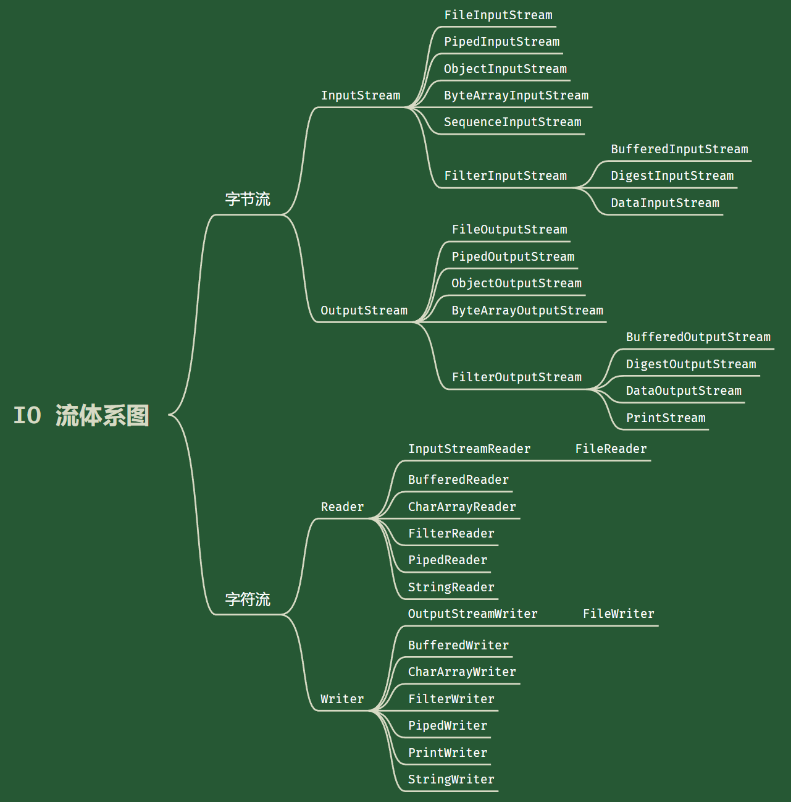

# Java | IO 流

## 基本概念

- 文件（File）

  - 定义：存储数据的载体，如文本、图片、程序等。
  - 核心作用：通过流对文件进行读写，实现数据持久化。

- 流（Stream）

  - 定义：数据在数据源（如文件）与程序内存之间传输的通道。
  - 核心作用：屏蔽底层细节，提供统一的数据操作接口。

- 输入流（InputStream / Reader）

  - 方向：数据源 → 程序内存  
  - 功能：从文件等数据源读取数据到内存中。  
  - 典型场景：读取文件内容、接收网络数据。

- 输出流（OutputStream / Writer）

  - 方向：程序内存 → 数据源  
  - 功能：将内存中的数据写入文件等数据源。  
  - 典型场景：保存文件、发送数据到网络。

## 文件

- 常用的文件操作

  | 类 别              | 方法/构造方法                       | 描述                                   |
  | ------------------ | ----------------------------------- | -------------------------------------- |
  | 创建文件对象       | `File(String pathname)`             | 通过路径字符串创建 File 对象           |
  |                    | `File(File parent, String child)`   | 通过父目录 File 对象和子路径字符串创建 |
  |                    | `File(String parent, String child)` | 通过父目录字符串和子路径字符串创建     |
  | 获取文件信息       | `getName()`                         | 获取文件或目录的名称                   |
  |                    | `getAbsolutePath()`                 | 获取文件或目录的绝对路径字符串         |
  |                    | `getParent()`                       | 获取父目录路径字符串（若无返回 null）  |
  |                    | `length()`                          | 返回文件长度（字节数）                 |
  |                    | `exists()`                          | 判断文件或目录是否存在                 |
  |                    | `isFile()`                          | 判断是否为文件                         |
  |                    | `isDirectory()`                     | 判断是否为目录                         |
  | 目录操作和文件删除 | `mkdir()`                           | 创建单层目录（要求父目录必须存在）     |
  |                    | `mkdirs()`                          | 递归创建多层目录（自动补齐缺失父目录） |
  |                    | `delete()`                          | 删除文件或空目录（目录必须为空）       |

## IO 流

- I/O 是 Input/Output 的缩写，I/O 技术用于处理数据传输，比如文件读写、网络通信等。

- Java 通过流的方式进行数据的输入和输出操作。

- 在 `java.io` 包下，提供了多种流类和接口，用于处理不同类型的数据输入和输出。

  - 输入（Input）：将外部存储设备（如磁盘、光盘）的数据读取到程序（内存）中。
  - 输出（Output）：将程序（内存）中的数据写入到外部存储设备（如磁盘、光盘）。

### 流的分类

Java 的 I/O 流包括 40 多个类，按照一定规则从四个抽象基类派生而来。子类的名称通常以父类名称作为后缀。

- 基本分类

  |        | 字节流         | 字符流   |
  | ------ | -------------- | -------- |
  | 输入流 | `InputStream`  | `Reader` |
  | 输出流 | `OutputStream` | `Weiter` |

- 详细分类

  | 分类方式       | 类型   | 说明                                                  |
  | -------------- | ------ | ----------------------------------------------------- |
  | 按操作数据类型 | 字节流 | 处理二进制数据，如声音、视频、Word 文件等，可无损操作 |
  |                | 字符流 | 处理文本文件                                          |
  | 按数据流的流向 | 输入流 | 读取外部数据到内存                                    |
  |                | 输出流 | 将内存中的数据写入外部存储设备                        |
  | 按功能         | 节点流 | 直接操作数据源                                        |
  |                | 处理流 | 包装其他流，提供缓冲、转换等功能                      |

- IO 流体系图

  

### 节点流和处理流

- 节点流

  | 分类       | 字节输入流           | 字节输出流            | 字符输入流      | 字符输出流      |
  | ---------- | -------------------- | --------------------- | --------------- | --------------- |
  | *抽象基类* | *InputStream*        | *OutputStream*        | *Reader*        | *Writer*        |
  | 访问文件   | FileInputStream      | FileOutputStream      | FileReader      | FileWriter      |
  | 访问数组   | ByteArrayInputStream | ByteArrayOutputStream | CharArrayReader | CharArrayWriter |
  | 访问管道   | PipedInputStream     | PipedOutputStream     | PipedReader     | PipedWriter     |
  | 访问字符串 |                      |                       | StringReader    | StringWriter    |

- 处理流

  | 分类       | 字节输入流          | 字节输出流           | 字符输入流        | 字符输出流         |
  | ---------- | ------------------- | -------------------- | ----------------- | ------------------ |
  | 缓冲流     | BufferedInputStream | BufferedOutputStream | BufferedReader    | BufferedWriter     |
  | 转换流     |                     |                      | InputStreamReader | OutputStreamWriter |
  | 对象流     | ObjectInputStream   | ObjectOutputStream   |                   |                    |
  | *抽象基类* | *FilterInputStream* | *FilterOutputStream* | *FilterReader*    | *FilterWriter*     |
  | 打印流     |                     | PrintStream          |                   | PrintWriter        |
  | 推回输入流 | PushbackInputStream |                      | PushbackReader    |                    |
  | 特殊流     | DataInputStream     | DataOutputStream     |                   |                    |

- 节点流和处理流的区别

  - 节点流是底层流，直接与数据源（如文件、网络等）连接，是处理数据的基本流。
  - 处理流（包装流）是对节点流的封装，目的是简化不同节点流实现上的差异，同时提供更便捷的操作方法来进行输入输出。
  - 处理流采用了修饰器设计模式，它通过包装节点流，增加额外功能，但不会直接与数据源相连接，类似于给节点流增加修饰，增强其功能。

- 处理流的功能

  - 性能的提高：处理流通常通过增加缓冲区来提高输入输出效率，减少每次读写操作的开销。比如，`BufferedInputStream` 和 `BufferedOutputStream` 就通过缓冲区来批量处理数据，从而显著提高了性能。
  - 操作的便捷：处理流提供了一些便捷的方法，简化了复杂的输入输出操作。比如，`ObjectOutputStream` 和 `ObjectInputStream` 让对象的序列化和反序列化变得更加简单。

### 标准输入输出流

- `System.in`：标准输入流，类型为 `InputStream`，通常用于从键盘读取输入。

- `System.out`：标准输出流，类型为 `OutputStream`，通常用于将输出显示到屏幕上。

## 序列化

序列化和反序列化是处理对象数据持久化和传输的关键机制。

- 序列化与反序列化

  - 序列化：将对象的状态（包括数据值和数据类型）转换为字节流的过程，使得对象能够保存到文件或通过网络进行传输。
  - 反序列化：将字节流恢复为原始对象的过程，恢复出对象的值和类型，以便后续操作。

- 实现序列化

  - 为了使一个类支持序列化，它必须实现其中一个接口：
  - `Serializable`：这是一个标记接口，没有任何方法。当一个类实现这个接口时，它就具备了序列化的能力。
  - `Externalizable`：这个接口与 `Serializable` 不同，它不仅是一个标记接口，还要求实现两个方法：`writeExternal(ObjectOutput out)` 和 `readExternal(ObjectInput in)`，因此它提供了更多的控制权，可以定制序列化和反序列化的过程。由于需要实现方法，通常我们更常用 `Serializable` 接口。

- 注意事项和细节说明

  - 序列化和反序列化时，必须确保顺序一致，以避免不匹配的错误。
  - 为了支持序列化或反序列化，类必须实现 `Serializable` 接口。
  - 序列化的类中建议添加 `SerialVersionUID`，为了提高版本的兼容性。当加入新属性时，序列化和反序列化会认为是原来的修改版，而不会认为是一个全新的类。
  - 默认情况下，序列化会保存对象的所有属性，但 `static` 和 `transient` 修饰的成员变量不会被序列化。
  - 序列化对象时，对象的属性类型也必须实现序列化接口，否则会抛出异常。
  - 序列化具备可继承性。如果一个类已经实现了序列化，则它的所有子类也默认实现了序列化。

## Properties 类

`Properties` 类是 Java 中专门用于读写配置文件的集合类，通常用于处理键值对格式的配置文件。

- 键值对格式

  - 配置文件中的键值对不需要空格，值也不需要用引号包裹。
  - 默认情况下，键和值的类型都是 `String`。

- 常用方法

  | 方法                                       | 说明                                                                                    |
  | ------------------------------------------ | --------------------------------------------------------------------------------------- |
  | `load(InputStream inStream)`               | 从输入流中加载配置文件的键值对并存储到 `Properties` 对象中                              |
  | `list(PrintStream out)`                    | 将 `Properties` 对象中的键值对输出到指定设备或流                                        |
  | `getProperty(String key)`                  | 根据指定的键获取对应的值。如果键不存在，返回 `null`                                     |
  | `setProperty(String key, String value)`    | 设置一个新的键值对到 `Properties` 对象中                                                |
  | `store(OutputStream out, String comments)` | 将 `Properties` 对象中的键值对保存到配置文件中。如果含有中文字符，会以 Unicode 编码存储 |
