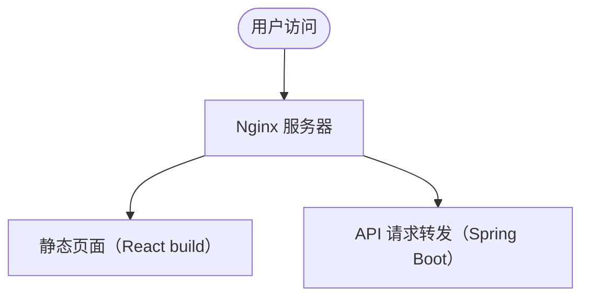

# 部署方案选型

项目开发完成后，选择合适的部署方式非常关键，直接影响到访问速度、稳定性、运维难度等。

## 常见部署方式

1. 静态托管平台

    适用于：**纯前端项目**（React/Vue 静态页面），**静态内容网站**（博客、文档）

    - [Vercel](https://vercel.com)
      - 特点：自动化部署、支持 Next.js 原生 SSR/SSG。
      - 优点：免费额度很良心，部署速度快，自动绑定 HTTPS。
    - [Netlify](https://www.netlify.com)
      - 特点：简单易用，支持自定义域名，自动 CI/CD。
      - 优点：适合部署静态站点、小型前后端分离项目。
    - [GitHub Pages](https://pages.github.com)
      - 特点：完全免费，但只支持纯静态内容（不支持 SSR）。
      - 优点：适合个人博客、项目文档。

2. 云服务器部署（传统方式）

    适用于：**有后端服务（如 Spring Boot、Express）**，**需要定制部署环境**的项目

    - 常见云服务商：
      - 阿里云、腾讯云、AWS、Azure
    - 部署方式：
      - 安装 Nginx，前端打包后放静态文件。
      - 后端独立部署（Java 服务、Node.js 服务等）。
      - 配置反向代理（前端走 80 端口，API 走 8080 端口等）。

3. [Docker](https://www.docker.com) 容器化部署

    适用于：**希望项目环境标准化、易于扩展、易于迁移**的项目

    - 特点：打包成镜像，哪里有 Docker 环境就能跑。
    - 优点：便于持续集成（CI/CD），一键部署，一键升级。
    - 常用工具：
      - Docker Compose（多服务一起部署）
      - [Kubernetes](https://kubernetes.io)（大规模部署调度）

## 前后端结合部署示例

- 前端 React 项目打包成静态文件（`npm run build`）
- 后端 Spring Boot 打包成 `jar` 文件，运行在服务器上
- 用 Nginx 作为反向代理：
  - `/api/*` 转发到 Spring Boot 后端
  - `/` 转发到前端静态页面

示意图：

