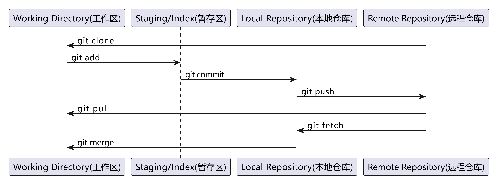

# Git | 学习笔记

## Git 分区详解

Git 将你的项目目录分成四个关键区域，便于版本控制和协作。

::: tip 有哪些分区，位于什么地方，其作用是什么？

- 工作区：
  - 你电脑中实际存在的目录，包含你正在编辑的文件。
  - 这是你进行修改、添加和删除文件的地方。

- 暂存区：
  - 也称为索引区，是一个位于 `.git` 目录下的临时区域。
  - 可以使用 `git add` 命令将工作区的修改添加到暂存区。
  - 以便 Git 知道你想要将哪些修改包含在下一次提交中。

- 本地仓库：
  - 也称为版本库，位于项目目录下的 `.git` 目录，存储了项目的完整历史记录。
  - 存储了所有提交的信息，以及分支和标签等元数据。
  - 是 Git 的核心，记录着项目的所有状态变化。

- 远程仓库：
  - 托管在服务器上的仓库，例如 GitHub、GitLab、Gitee 等。
  - 用于代码共享、备份和协作。
  - 只有推送到远程仓库的代码才能被其他人看到。

:::

::: tip 如何操作这些分区，操作流程是什么？

Git 命令或操作的本质，就是在这四个分区之间同步文件。

- 远程仓库 -> 本地仓库：
  - `git clone`: 首次克隆远程仓库到本地。
  - `git pull`: 从远程仓库拉取并合并更新到本地仓库和工作区。
  - `git fetch`：从远程仓库拉取更新到本地仓库，但不自动合并到工作区。

- 工作区 -> 暂存区：
  - `git add`: 将工作区中修改过的文件添加到暂存区。

- 暂存区 -> 本地仓库：
  - `git commit`: 将暂存区的文件提交到本地仓库，并附带提交信息。

- 本地仓库 -> 远程仓库：
  - `git push`: 将本地仓库的提交推送到远程仓库。



:::

::: details 图片 PlantUML 代码

```txt
@startuml
' Define the participants
participant "Working Directory(工作区)" as WD
participant "Staging/Index(暂存区)" as SI
participant "Local Repository(本地仓库)" as LR
participant "Remote Repository(远程仓库)" as RR

' Define the arrows and messages
RR -> WD : git clone
WD -> SI : git add
SI -> LR : git commit
LR -> RR : git push
RR -> WD : git pull

RR -> LR : git fetch
LR -> WD : git merge

@enduml
```

:::

::: tip 分区的目的/意义？

将项目划分成这些区域是为了实现更灵活、更精细的版本控制。

- 选择性提交：暂存区允许你选择性地提交工作区的修改。你可以只将部分修改添加到暂存区，然后提交这些修改，而将其他修改留在工作区。
- 原子提交：暂存区允许你将多个相关的修改组合成一个逻辑上的原子提交。这样可以使你的提交历史更清晰和易于理解。
- 撤销修改：如果你将修改添加到暂存区后又改变了主意，可以使用 `git reset` 命令将修改从暂存区移除，返回到工作区。
- 历史记录：本地仓库存储了项目的完整历史记录，这使得你可以随时回到之前的任何状态。

:::

## Git 核心概念

### Commit 提交

- Commit：每完成一次 Commit，Git 都保存一份仓库此时的状态的快照，所有文件的状态都被记录了下来，这样整个仓库都是可回溯的
- Commit ID：就是提交的 SHA 值，使用哈希算法生成的一个独一无二的 ID
- Commit Message：提交信息，提交代码的备注

### Branch 分支

- Branch：分支，存储库的不同版本
- 每个仓库都有一个 main 分支或者 master 分支，也就是主干分支
- 创建分支也就是创建一个副本，是主干分支当时的状态快照
- 除了基于主干分支创建分支以外，还可以基于任意一个分支创建分支
- 在各自分支上的代码修改不会相互影响

### Merge 合并

- Merge：合并，把分支合并回主干分支

### .git 文件夹

- `.git` 文件夹是 git 版本控制系统用来管理和存储项目历史的核心目录
- `object` 文件夹存储了所有的数据对象（文件、目录、提交）

  | 对象名称 | 存储内容 | 对象特点                                                                                                        |
  | -------- | -------- | --------------------------------------------------------------------------------------------------------------- |
  | blob     | 文件     | 存储文件内容，每个文件以及文件历史版本都会存储并且压缩为一个 blob 对象，如果历史版本的内容相同则共用同一个 blob |
  | tree     | 目录     | 存储了仓库的目录结构信息                                                                                        |
  | commit   | 提交     | 一个 commit 对象包含了该提交的作者、提交时间、提交信息、还有对 tree 对象的引用                                  |

- `refs` 文件夹
  - heads 包含所有的本地分支，记录了每个分支最新一次 commit 的 ID
  - remote 包含有所有的远程分支
  - tags 包含所有的标签

- `HEAD` 文件记录了本地当前是哪个分支

## Git 常用命令

```bash
# 基础命令
git init      # 初始化仓库
git status    # 查看状态
git add       # 添加到暂存区
git commit    # 提交到本地仓库
git push      # 推送到远程仓库
git pull      # 拉取远程更新
git clone     # 克隆远程仓库

# 分支管理
git branch                      # 查看分支
git branch [branch_name]        # 创建分支
git checkout [branch_name]      # 切换分支
git merge [branch_name]         # 合并分支
git branch -d [branch_name]     # 删除分支

# 其他常用命令
git log       # 查看提交历史
git diff      # 查看修改内容
git reset     # 撤销修改
git revert    # 撤销提交
git tag       # 标签管理
```
