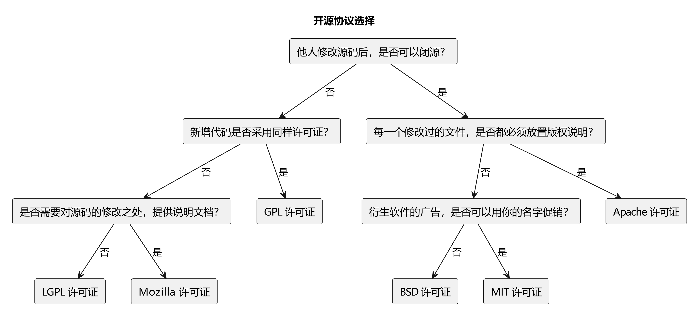
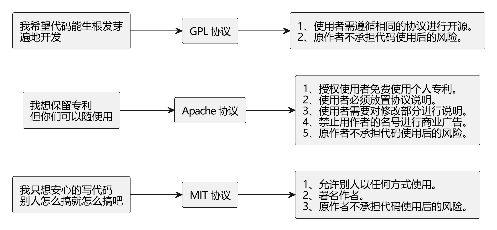

# Git | 学习笔记

## Git 分区

Git 将你的项目目录分成四个关键区域，便于版本控制和协作。

::: tip 有哪些分区，位于什么地方，其作用是什么？

- 工作区：
  - 你电脑中实际存在的目录，包含你正在编辑的文件。
  - 这是你进行修改、添加和删除文件的地方。

- 暂存区：
  - 也称为索引区，是一个位于 `.git` 目录下的临时区域。
  - 可以使用 `git add` 命令将工作区的修改添加到暂存区。
  - 以便 Git 知道你想要将哪些修改包含在下一次提交中。

- 本地仓库：
  - 也称为版本库，位于项目目录下的 `.git` 目录，存储了项目的完整历史记录。
  - 存储了所有提交的信息，以及分支和标签等元数据。
  - 是 Git 的核心，记录着项目的所有状态变化。

- 远程仓库：
  - 托管在服务器上的仓库，例如 GitHub、GitLab、Gitee 等。
  - 用于代码共享、备份和协作。
  - 只有推送到远程仓库的代码才能被其他人看到。

:::

::: tip 如何操作这些分区，操作流程是什么？

Git 命令或操作的本质，就是在这四个分区之间同步文件。

- 远程仓库 -> 本地仓库：
  - `git clone`: 首次克隆远程仓库到本地。
  - `git pull`: 从远程仓库拉取并合并更新到本地仓库和工作区。
  - `git fetch`：从远程仓库拉取更新到本地仓库，但不自动合并到工作区。

- 工作区 -> 暂存区：
  - `git add`: 将工作区中修改过的文件添加到暂存区。

- 暂存区 -> 本地仓库：
  - `git commit`: 将暂存区的文件提交到本地仓库，并附带提交信息。

- 本地仓库 -> 远程仓库：
  - `git push`: 将本地仓库的提交推送到远程仓库。


:::

::: details 图片 PlantUML 代码

```txt
@startuml
' Define the participants
participant "Working Directory(工作区)" as WD
participant "Staging/Index(暂存区)" as SI
participant "Local Repository(本地仓库)" as LR
participant "Remote Repository(远程仓库)" as RR

' Define the arrows and messages
RR -> WD : git clone
WD -> SI : git add
SI -> LR : git commit
LR -> RR : git push
RR -> WD : git pull

RR -> LR : git fetch
LR -> WD : git merge

@enduml
```

:::

::: tip 分区的目的/意义？

将项目划分成这些区域是为了实现更灵活、更精细的版本控制。

- 选择性提交：暂存区允许你选择性地提交工作区的修改。你可以只将部分修改添加到暂存区，然后提交这些修改，而将其他修改留在工作区。
- 原子提交：暂存区允许你将多个相关的修改组合成一个逻辑上的原子提交。这样可以使你的提交历史更清晰和易于理解。
- 撤销修改：如果你将修改添加到暂存区后又改变了主意，可以使用 `git reset` 命令将修改从暂存区移除，返回到工作区。
- 历史记录：本地仓库存储了项目的完整历史记录，这使得你可以随时回到之前的任何状态。

:::

## Git 基本概念

### Commit 提交

- Commit：每完成一次 Commit，Git 都保存一份仓库此时的状态的快照，所有文件的状态都被记录了下来，这样整个仓库都是可回溯的
- Commit ID：就是提交的 SHA 值，使用哈希算法生成的一个独一无二的 ID
- Commit Message：提交信息，提交代码的备注

### Branch 分支

- Branch：分支，存储库的不同版本
- 每个仓库都有一个 main 分支或者 master 分支，也就是主干分支
- 创建分支也就是创建一个副本，是主干分支当时的状态快照
- 除了基于主干分支创建分支以外，还可以基于任意一个分支创建分支
- 在各自分支上的代码修改不会相互影响

### Merge 合并

- Merge：合并，把分支合并回主干分支

### Pull Requet

- 简称 PR，意思是拉取请求、合并请求（将更改从一个分支合并到另外一个分支的提案）
- PR 会比较两个分支之间的代码差异，仓库的管理会来审核这个代码的改动，这个过程叫做 code review 也就是代码审计

### .git 文件夹

- `.git` 文件夹是 git 版本控制系统用来管理和存储项目历史的核心目录
- `object` 文件夹存储了所有的数据对象（文件、目录、commit）

| 对象名称 | 存储内容 | 对象特点                                                                                                        |
| -------- | -------- | --------------------------------------------------------------------------------------------------------------- |
| blob     | 文件     | 存储文件内容，每个文件以及文件历史版本都会存储并且压缩为一个 blob 对象，如果历史版本的内容相同则共用同一个 blob |
| tree     | 目录     | 存储了仓库的目录结构信息                                                                                        |
| commit   | 提交     | 一个 commit 对象包含了该提交的作者、提交时间、提交信息、还有对 tree 对象的引用                                  |

- refs 文件夹
  - heads 包含所有的本地分支，记录了每个分支最新一次 commit 的 ID
  - remote 包含有所有的远程分支
  - tags 包含所有的标签

- HEAD 文件记录了本地当前是哪个分支

## Git 常用命令

```bash
# 切换分支
git switch [BranchName]
```

## GitHub 基础操作

### Github 汉化

- <https://github.com/maboloshi/github-chinese>

### Fork

Fork 可以帮助我们更深入的学习源代码，可以根据自己的需求对源代码进行 DIY。

还可以尝试把自己的修改通过 Pull Request，合并进作者的主代码库，为开源项目添砖加瓦。

### Issues

GitHub Issues 是一个用于跟踪项目任务、bug、增强请求和其他事项的系统。

可以把它看作一个任务管理工具或者 bug 追踪系统，集成在 GitHub 仓库中。

在使用或学习开源项目的时候，不妨在这里搜索一番，因为有些问题可能别人也遇到过，并且在 Issues 里面已经有人给出了解决方案

主要功能：

- 问题跟踪：用于报告和讨论项目中的问题，例如 bug、新特性建议等。
- 任务管理：可以将 Issues 用作任务列表，分配任务给团队成员，并跟踪任务进度。
- 讨论平台：Issues 可以用于讨论项目相关的任何话题，例如设计决策、技术方案等。
- 关联提交：可以在提交信息中引用 Issue，将提交与 Issue 关联起来，方便追踪代码变更与 Issue 的关系。

### Repository

- Wiki：项目文档中心，可以用来编写项目文档、用户手册等。
- Insights：提供仓库的各种分析数据，例如代码提交统计、贡献者统计、活跃度统计等。可以帮助了解项目的健康状况和发展趋势。
- Project：项目管理工具，可以用来规划和跟踪项目进度，类似于看板。
- Discussion：讨论区，用于进行项目相关的讨论，例如提问、建议等。

### Pull Requests

- 作用：一种请求代码合并的机制。开发者在自己的分支上完成代码修改后，通过创建 PR 向主分支（通常是 `main` 或 `master`）发起合并请求。
- 重要性：是协同开发的核心流程。通过 PR，团队成员可以审查代码，进行讨论，确保代码质量和一致性。
- 流程：
  1. 创建分支 (branch)：从主分支创建一个新的分支进行开发。
  2. 进行修改 (commit)：在分支上进行代码修改，并提交 (commit) 到本地仓库。
  3. 推送分支 (push)：将本地分支推送到远程仓库。
  4. 创建 PR：在 GitHub 上发起一个从你的分支到目标分支的 Pull Request。
  5. 代码审查 (review)：其他开发者审查你的代码，并提出建议。
  6. 修改代码 (fix)：根据审查意见修改代码，并提交新的 commit。
  7. 合并 PR (merge)：当代码审查通过后，将 PR 合并到目标分支。

### Releases

- 作用：用于发布项目的特定版本。通过 Releases，可以为用户提供可下载的软件包、发行说明和版本号。
- 重要性：方便用户获取项目的稳定版本，并了解每个版本的新功能和修复。
- 功能：
  - 版本号：为每个 Release 分配一个唯一的版本号，例如 `v1.0.0`。
  - 发行说明：编写 Release Notes，描述该版本的新功能、改进、修复和已知问题。
  - 可下载文件：上传编译好的二进制文件、源代码包或其他相关文件。
  - Git 标签：在 Git 仓库中创建一个指向该 Release 的 tag。

### README

- 作用：项目的说明文档，通常用 Markdown 格式编写。用于介绍项目的功能、使用方法、安装步骤、贡献指南等。
- 重要性：是用户了解项目的第一个入口，一个好的 README 可以吸引更多用户使用和参与项目。
- 内容：
  - 项目名称和简介
  - 功能特性
  - 安装步骤
  - 使用方法
  - 贡献指南
  - 许可证信息
  - 作者信息

### License

- 作用：定义项目的使用许可，规定了其他人可以如何使用、修改和分发你的代码。
- 重要性：明确项目的开源协议，避免潜在的法律风险。
- 常见类型：MIT、Apache 2.0、GPL、BSD 等。

### .gitignore

- 作用：指定 Git 忽略的文件或目录，这些文件不会被 Git 跟踪和提交。
- 重要性：避免将敏感信息（例如密码、API 密钥）或临时文件（例如编译产生的中间文件）提交到版本库。
- 常见忽略文件：
  - 操作系统生成的文件：例如 `.DS_Store`（macOS）、`Thumbs.db`（Windows）
  - 编译产生的中间文件：例如 `*.o`、`*.class`
  - 日志文件：例如 `*.log`
  - 依赖管理工具的目录：例如 `node_modules` (npm)、`venv` (Python)
  - 包含敏感信息的配置文件

## 开源许可证

> 左侧是 GPL 系，特点是其他人修改完源码后，也必须保持开源（衍生作品必须开源）。
>
> 右侧则是比较宽松的开源协议，修改后的代码可以选择闭源。
>
> Apache 协议需要为每个修改后的文件都放置版权说明。
>
> MIT 与 BSD 协议则是最宽松的协议，只需要在项目中保留一份协议的副本，就可以几乎随意使用开源代码。
>
> BSD 有个额外的限制，是不可以使用原作者的名字对项目进行促销推广。



::: details 图片 PlantUML 代码

```txt
@startuml
title 开源协议选择

rectangle "他人修改源码后，是否可以闭源？" as A
rectangle "新增代码是否采用同样许可证？" as B
rectangle "是否需要对源码的修改之处，提供说明文档？" as C
rectangle "衍生软件的广告，是否可以用你的名字促销？" as D
rectangle "每一个修改过的文件，是否都必须放置版权说明？" as E
rectangle "GPL 许可证" as F
rectangle "LGPL 许可证" as G
rectangle "Mozilla 许可证" as H
rectangle "Apache 许可证" as I
rectangle "BSD 许可证" as J
rectangle "MIT 许可证" as K

A --> B : 否
A --> E : 是
B --> C : 否
B --> F : 是
C --> G : 否
C --> H : 是
E --> D : 否
E --> I : 是
D --> J : 否
D --> K : 是

@enduml
```

:::



::: details 图片 PlantUML 代码

```txt
@startuml
left to right direction

rectangle "我只想安心的写代码\n别人怎么搞就怎么搞吧" as Idea1
rectangle "我想保留专利\n但你们可以随便用" as Idea2
rectangle "我希望代码能生根发芽\n遍地开发" as Idea3

rectangle "MIT 协议" as MIT
rectangle "Apache 协议" as Apache
rectangle "GPL 协议" as GPL

rectangle "1、允许别人以任何方式使用。\n2、署名作者。\n3、原作者不承担代码使用后的风险。" as MIT_Details
rectangle "1、授权使用者免费使用个人专利。\n2、使用者必须放置协议说明。\n3、使用者需要对修改部分进行说明。\n4、禁止用作者的名号进行商业广告。\n5、原作者不承担代码使用后的风险。" as Apache_Details
rectangle "1、使用者需遵循相同的协议进行开源。\n2、原作者不承担代码使用后的风险。" as GPL_Details

Idea1 --> MIT
Idea2 --> Apache
Idea3 --> GPL

MIT --> MIT_Details
Apache --> Apache_Details
GPL --> GPL_Details

@enduml
```

:::
