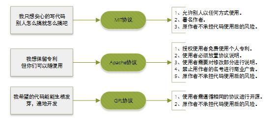

# Git | 学习笔记

## Git 分区概念

有哪些分区：

- 工作区：你电脑中实际存在的目录，包含你正在编辑的文件。这是你进行修改、添加和删除文件的地方。
- 暂存区：也称为索引，是一个位于 `.git` 目录下的临时区域。你使用 `git add` 命令将工作区的修改添加到暂存区，以便 Git 知道你想要将哪些修改包含在下一次提交中。可以理解为“预提交区”。
- 版本库：包含 `.git` 目录，存储了项目的完整历史记录。版本库存储了所有提交（commit）的信息，以及分支和标签等元数据。版本库是 Git 的核心，记录着项目的所有状态变化。

怎么用：

- 工作区 -> 暂存区：`git add` 命令
- 暂存区 -> 本地仓库：`git commit` 命令
- 本地仓库 -> 远程仓库：`git push` 命令
- 远程仓库 -> 本地仓库：`git pull` 或 `git fetch` 命令

为什么要分这些区域：

- 选择性提交：暂存区允许你选择性地提交工作区的修改。你可以只将部分修改添加到暂存区，然后提交这些修改，而将其他修改留在工作区。
- 原子提交：暂存区允许你将多个相关的修改组合成一个逻辑上的原子提交。这样可以使你的提交历史更清晰和易于理解。
- 撤销修改：如果你将修改添加到暂存区后又改变了主意，可以使用 `git reset` 命令将修改从暂存区移除，返回到工作区。
- 历史记录：版本库存储了项目的完整历史记录，这使得你可以随时回到之前的任何状态。

## Git 基本概念

### Commit 提交

- Commit：提交（每完成一次 Commit，Git 都保存一份仓库此时的状态的快照，所有文件的状态都被记录了下来，这样整个仓库都是可回溯的）
- Commit ID：提交 ID（就是提交的 SHA 值，使用哈希算法生成的一个独一无二的 ID）
- Commit Message：提交信息

### Branch 分支

- Branch：分支（存储库的不同版本）
- 每个仓库都有一个 main 分支或者 master 分支，也就是主干分支
- 创建分支也就是创建一个副本，是主干分支当时的状态快照
- 除了基于主干分支创建分支以外，还可以基于任意一个分支创建分支
- 在各自分支上的代码修改不会相互影响

### Merge 合并

- Merge：合并（把分支合并回主干分支）

### Pull Requet

- 简称 PR，意思是拉取请求、合并请求（将更改从一个分支合并到另外一个分支的提案）
- PR 会比较两个分支之间的代码差异，仓库的管理会来审核这个代码的改动，这个过程叫做 code review 也就是代码审计

### .git 文件夹

- `.git` 文件夹是 git 版本控制系统用来管理和存储项目历史的核心目录
- `object` 文件夹存储了所有的数据对象（文件、目录、commit）

| 对象名称 | 存储内容 | 对象特点                                                                                                        |
| -------- | -------- | --------------------------------------------------------------------------------------------------------------- |
| blob     | 文件     | 存储文件内容，每个文件以及文件历史版本都会存储并且压缩为一个 blob 对象，如果历史版本的内容相同则共用同一个 blob |
| tree     | 目录     | 存储了仓库的目录结构信息                                                                                        |
| commit   | 提交     | 一个 commit 对象包含了该提交的作者、提交时间、提交信息、还有对 tree 对象的引用                                  |

- refs 文件夹
  - heads 包含所有的本地分支，记录了每个分支最新一次 commit 的 ID
  - remote 包含有所有的远程分支
  - tags 包含所有的标签

- HEAD 文件记录了本地当前是哪个分支

## Git 常用命令

```bash
# 切换分支
git switch [BranchName]
```

## GitHub 基础操作

### Issues

GitHub Issues 是一个用于跟踪项目任务、bug、增强请求和其他事项的系统。

可以把它看作一个任务管理工具或者 bug 追踪系统，集成在 GitHub 仓库中。

主要功能：

- 问题跟踪：用于报告和讨论项目中的问题，例如 bug、新特性建议等。
- 任务管理：可以将 Issues 用作任务列表，分配任务给团队成员，并跟踪任务进度。
- 讨论平台：Issues 可以用于讨论项目相关的任何话题，例如设计决策、技术方案等。
- 关联提交：可以在提交信息中引用 Issue，将提交与 Issue 关联起来，方便追踪代码变更与 Issue 的关系。

### Repository

- Wiki：项目文档中心，可以用来编写项目文档、用户手册等。
- Insights：提供仓库的各种分析数据，例如代码提交统计、贡献者统计、活跃度统计等。可以帮助了解项目的健康状况和发展趋势。
- Project：项目管理工具，可以用来规划和跟踪项目进度，类似于看板。
- Discussion：讨论区，用于进行项目相关的讨论，例如提问、建议等。

### Pull Requests

- 作用：一种请求代码合并的机制。开发者在自己的分支上完成代码修改后，通过创建 PR 向主分支（通常是 `main` 或 `master`）发起合并请求。
- 重要性：是协同开发的核心流程。通过 PR，团队成员可以审查代码，进行讨论，确保代码质量和一致性。
- 流程：
  1. 创建分支 (branch)：从主分支创建一个新的分支进行开发。
  2. 进行修改 (commit)：在分支上进行代码修改，并提交 (commit) 到本地仓库。
  3. 推送分支 (push)：将本地分支推送到远程仓库。
  4. 创建 PR：在 GitHub 上发起一个从你的分支到目标分支的 Pull Request。
  5. 代码审查 (review)：其他开发者审查你的代码，并提出建议。
  6. 修改代码 (fix)：根据审查意见修改代码，并提交新的 commit。
  7. 合并 PR (merge)：当代码审查通过后，将 PR 合并到目标分支。

### Releases

- 作用：用于发布项目的特定版本。通过 Releases，可以为用户提供可下载的软件包、发行说明和版本号。
- 重要性：方便用户获取项目的稳定版本，并了解每个版本的新功能和修复。
- 功能：
  - 版本号：为每个 Release 分配一个唯一的版本号，例如 `v1.0.0`。
  - 发行说明：编写 Release Notes，描述该版本的新功能、改进、修复和已知问题。
  - 可下载文件：上传编译好的二进制文件、源代码包或其他相关文件。
  - Git 标签：在 Git 仓库中创建一个指向该 Release 的 tag。

### README

- 作用：项目的说明文档，通常用 Markdown 格式编写。用于介绍项目的功能、使用方法、安装步骤、贡献指南等。
- 重要性：是用户了解项目的第一个入口，一个好的 README 可以吸引更多用户使用和参与项目。
- 内容：
  - 项目名称和简介
  - 功能特性
  - 安装步骤
  - 使用方法
  - 贡献指南
  - 许可证信息
  - 作者信息

### License

- 作用：定义项目的使用许可，规定了其他人可以如何使用、修改和分发你的代码。
- 重要性：明确项目的开源协议，避免潜在的法律风险。
- 常见类型：MIT、Apache 2.0、GPL、BSD 等。

### .gitignore

- 作用：指定 Git 忽略的文件或目录，这些文件不会被 Git 跟踪和提交。
- 重要性：避免将敏感信息（例如密码、API 密钥）或临时文件（例如编译产生的中间文件）提交到版本库。
- 常见忽略文件：
  - 操作系统生成的文件：例如 `.DS_Store`（macOS）、`Thumbs.db`（Windows）
  - 编译产生的中间文件：例如 `*.o`、`*.class`
  - 日志文件：例如 `*.log`
  - 依赖管理工具的目录：例如 `node_modules` (npm)、`venv` (Python)
  - 包含敏感信息的配置文件

## 开源许可证

世界上的开源许可证，大概有上百种。

很少有人搞得清楚它们的区别。

即使在最流行的六种协议 (GPL、BSD、MIT、Mozilla、Apache 和 LGPL) 之中做选择，也很复杂。

图解分析：


> 左侧是 GPL 系，特点是其他人修改完源码后，也必须保持开源（衍生作品必须开源）。  
> 右侧则是比较宽松的开源协议，修改后的代码可以选择闭源，Apache 协议需要为每个修改后的文件都放置版权说明，MIT 与 BSD 协议则是最宽松的协议，只需要在项目中保留一份协议的副本，就可以几乎随意使用开源代码。  
> BSD 有个额外的限制，是不可以使用原作者的名字对项目进行促销推广。


