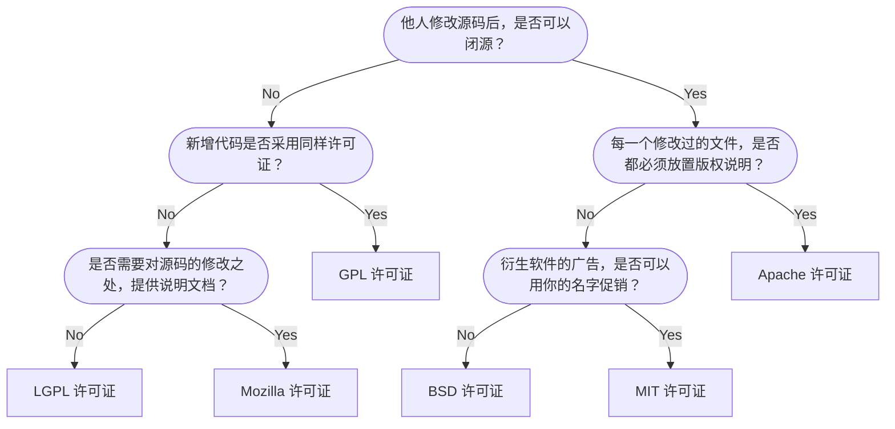

# Git | 学习笔记

## Git 安装

去[官网](https://git-scm.com/download)下载，运行安装包后默认安装即可。

## Git 配置

> Git 的所有用户配置文件可以存在于以下几个地方，按照优先级从低到高排列。
>
> 当 Git 需要查找某个配置项的值时，它会按照 "Local > Global > System" 的顺序查找。
>
> 也就是说，Local 配置优先级最高，System 配置优先级最低。

- System 配置

  ::: tip 说明

  位置：这个配置适用于系统上所有用户。它的位置取决于操作系统和 Git 的安装方式。

  - Linux: 通常是 `/etc/gitconfig` 或 `/usr/etc/gitconfig`。
  - Windows: 通常在 Git 的安装目录下，比如 `C:\Program Files\Git\etc\gitconfig`。

  作用：包含系统级别的默认配置。

  :::

- Global 配置

  ::: tip 说明

  位置：这个配置只适用于当前用户。

  - Linux: 通常是 `~/.gitconfig`。你也可以使用 `$HOME/.gitconfig`。
  - Windows: 通常是 `~/.gitconfig`。你也可以使用 `%USERPROFILE%/.gitconfig`。

  作用：包含用户级别的默认配置。这是最常用的配置文件。

  :::

- Local 配置

  ::: tip 说明

  位置：这个配置只适用于当前 Git 仓库。

  - 它位于仓库的 `.git` 目录下：`.git/config`。注意 `.git` 目录通常是隐藏的。

  作用：包含仓库级别的配置，可以覆盖 Global 和 System 配置。

  :::

- 列出所有配置项

  ::: tip 说明

  虽然你知道了这些文件的位置，但有时你想确定 Git 正在使用的实际配置文件。可以使用以下命令：

  ```bash
  git config --list --show-origin
  ```

  这个命令会列出所有配置项，以及它们来自哪个文件。这对于调试配置问题非常有用。

  :::

- 设置用户名和邮箱

  ::: tip 说明

  因为 Git 是分布式版本控制系统，所以需要填写用户名和邮箱作为一个标识。

  ```bash
  git config --global user.name "Your Name"            # 用户名标识，实际也可以填写您的 github 仓库的名称
  git config --global user.email "email@example.com"   # 邮箱标识，可以填写 github 仓库的邮箱
  ```

  `--global` 参数表示当前用户所有的 Git 仓库都会使用这个配置。也可以针对单个仓库单独配置，不加 `--global` 参数即可。

  :::

## Git 使用

- 初始化本地仓库

  - 打开 Git Bash
  - 使用 `mkdir` 新建一个文件夹
  - 使用 `cd` 进入到新建的文件夹
  - 使用 `git init` 初始化仓库

## 连接远程仓库

> Github 支持两种同步方式“HTTPS”和“SSH”。
>
> 如果使用 HTTPS 很简单基本不需要配置就可以使用，但是每次提交代码和下载代码时都需要输入用户名和密码。
>
> 如果使用 SSH 方式就需要客户端先生成一个密钥对，即一个公钥一个私钥。然后还需要把公钥放到 GitHib 的服务器上。

在使用 `git clone` 克隆远程仓库或 `git remote` 添加远程仓库时，如果参数 `<URL>` 是 `git@github.com` 则使用的是 SSH，如果是 `https://github.com` 则使用的是 HTTPS。

- 使用 SSH 连接

  - `git@github.com` 表示连接到 `github.com` 服务器，并使用 `git` 用户名进行身份验证。
  - 这种方式需要你已经在 GitHub 上配置了 SSH 公钥。
  - 当你执行 `git pull`、`git push` 等操作时，Git 会使用你的 SSH 私钥进行身份验证，而无需每次都输入用户名和密码。
  - 优点：安全性更高，因为使用了非对称加密。无需频繁输入密码。
  - 缺点：需要配置 SSH 密钥，对于初学者来说可能稍微复杂一些。

- 使用 HTTPS 连接

  - `https://github.com` 表示使用 HTTPS 协议连接到 `github.com` 服务器。
  - 当你在执行 `git pull`、`git push` 等操作时，Git 会提示你输入 GitHub 的用户名和密码（或者 Personal Access Token）。
  - 优点：配置简单，无需设置 SSH 密钥。易于使用。
  - 缺点：每次 push 或 pull 都需要输入用户名和密码（除非你配置了 credential helper）。安全性相对较低，因为密码是以明文形式传输的。

- 如何选择

  - 建议使用 SSH 连接，特别是对于经常需要进行代码推送的开发者来说，SSH 连接可以避免频繁输入密码，并且更安全。
  - HTTPS 连接适用于你只需要进行代码拉取操作，而不需要推送代码。

### HTTPS 连接

> 需要个人访问令牌。即使没有配置个人访问令牌，也是可以 `git clone` 的，但是 `git push` 的时候需要输入用户名和个人访问令牌。
>
> 由于访问 GitHub 的网络原因，走 HTTPS 协议可能会出现 `git clone` 和 `git push` 失败。

### SSH 连接

> 需要密钥对。如果没有配置密钥对，既不能 `git clone`，也不能 `git push`。

- 生成 SSH 密钥

  ::: tip 说明

  打开 Git Bash，使用 `cd` 进入 `~/.ssh` 目录，如果该目录不存在，则用 `mkdir` 命令创建
  
  分别运行以下命令，生成用于连接 GitHub 和 Gitee 的 SSH 密钥对

  ```bash
  ssh-keygen -t rsa -f id_rsa_github -C "github"
  ssh-keygen -t rsa -f id_rsa_gitee -C "gitee"
  ```

  连续按三次回车键，即可生成 SSH 密钥对

  同时会在 `.ssh` 文件夹下生成对应的私钥 `id_rsa_xxxx` 和公钥 `id_rsa_xxxx.pub` 文件

  参数解释：

  - `-t`：指定要创建的密钥的类型（type），默认是 RSA 可以省略，RSA 是一种常用的非对称加密算法，适合用于 SSH 密钥。
  - `-f`：指定要保存密钥的文件名（filename），选择一个有意义的文件名可以帮助你区分不同的密钥，尤其是在你有多个 SSH 密钥时。
  - `-C`：指定一个注释（comment），通常用来标识这个密钥是为哪个账户生成的，这只是一个标签，不影响密钥的功能，你可以使用任何你想要的注释。

  :::

- 配置 SSH 配置文件

  ::: tip 说明

  在 `~/.ssh` 目录下打开 config 文件，若没有则新建一个名为 config 的文件，然后添加以下内容

  注意：这个文件不带扩展名，全名就叫做 config

  ```ini
  # GitHub
  Host github.com
    User git
    Port 22
    HostName %h
    IdentityFile ~/.ssh/id_rsa_github
    ProxyCommand connect -S 127.0.0.1:10808 %h %p # 配置代理

  # Gitee
  Host gitee.com
    User git
    Port 22
    HostName %h
    IdentityFile ~/.ssh/id_rsa_gitee
  ```

  :::

- 添加公钥到 GitHub 和 Gitee

  ::: tip 说明

  - 登录 [GitHub](https://github.com/settings/keys)，进入 Settings，依次点击 SSH and GPG keys -> New SSH key，输入 Title 以及 Key。
  - GitHub 对应的公钥存放在 `id_rsa_github.pub` 文件中，打开全部复制即可。
  - 登录 [Gitee](https://gitee.com/profile/sshkeys)，进入设置，点击 SSH 公钥输入“标题”以及“公钥”。
  - Gitee 对应的公钥存放在 `id_rsa_gitee.pub` 文件中，打开全部复制即可。

  :::

- 测试是否添加成功

  ::: tip 说明

  依次在 Git Bash 中输入

  ```bash
  ssh -T git@github.com # 测试 GitHub
  ssh -T git@gitee.com # 测试 Gitee
  ```

  第一次连接会让输入 yes/no，输入 yes 即可。

  :::

## 同步远程仓库

- 方法一：克隆远程仓库到本地

  ::: tip 说明

  在 GitHub 创建空仓库，然后克隆到本地

  - 创建空仓库
    - 在 GitHub 网站上手动创建一个新的仓库。创建一个空的仓库，不要初始化任何文件（例如 `README.md` 或 `.gitignore`）。
    - 这样做是为了确保你的本地仓库和远程仓库的初始状态完全一致。
  - 克隆到本地
    - 使用 `git clone <URL>` 命令将 GitHub 上的空仓库克隆到你的本地计算机上。`<URL>` 是你在 GitHub 上创建的仓库的 URL。
    - `git clone` 命令会自动创建一个名为 origin 的远程仓库，并将其指向你克隆的仓库的 URL。
    - 克隆下来的本地仓库已经与远程仓库 origin 建立了连接。

  :::

- 方法二：为本地仓库添加远程仓库

  ::: tip 说明

  在 GitHub 创建空仓库，然后在本地创建空仓库，使用 `git remote` 将本地和远程两个仓库关联

  - 在 GitHub 上创建空仓库：同样，你需要在 GitHub 网站上手动创建一个空的仓库，不初始化任何文件。
  - 在本地创建空仓库：使用 `git init` 命令在你的本地初始化一个新的、空的 Git 仓库。
  - 将本地和远程两个仓库关联：使用 `git remote add origin <URL>` 命令将你的本地仓库连接到你在 GitHub 上创建的仓库。
    - `origin` 是你为远程仓库指定的名称。
    - `<URL>` 是你在 GitHub 上创建的仓库的 URL。

  :::

- 两种方法的比较

  ::: tip 说明

  - 克隆的优点：

    - 更简单：只需一个命令 `git clone` 即可完成所有设置。
    - 自动配置：自动设置了远程仓库 `origin`，你无需手动添加。
    - 更常用：克隆是开始使用现有仓库的常见方式。

  - 手动添加 `remote` 的优点：

    - 更灵活：可以让你更清晰地了解每个步骤的作用。
    - 适用于特殊情况：当你需要将本地仓库连接到多个远程仓库，或者需要使用不同的远程仓库名称时，手动添加 `remote` 更加灵活。

  :::

## 如何选择开源许可证？

世界上的开源许可证，大概有上百种。

很少有人搞得清楚它们的区别。

即使在最流行的六种协议 (GPL、BSD、MIT、Mozilla、Apache 和 LGPL) 之中做选择，也很复杂。

### 图解分析



> 左侧是 GPL 系，特点是其他人修改完源码后，也必须保持开源（衍生作品必须开源）。  
> 右侧则是比较宽松的开源协议，修改后的代码可以选择闭源，Apache 协议需要为每个修改后的文件都放置版权说明，MIT 与 BSD 协议则是最宽松的协议，只需要在项目中保留一份协议的副本，就可以几乎随意使用开源代码。  
> BSD 有个额外的限制，是不可以使用原作者的名字对项目进行促销推广。


## Git 分区概念

TODO

## 基本概念

## Commit 提交

- Commit：提交（每完成一次 Commit，Git 都保存一份仓库此时的状态的快照，所有文件的状态都被记录了下来，这样整个仓库都是可回溯的）
- Commit ID：提交 ID（就是提交的 SHA 值，使用哈希算法生成的一个独一无二的 ID）
- Commit Message：提交信息

### Branch 分支

- Branch：分支（存储库的不同版本）
- 每个仓库都有一个 main 分支或者 master 分支，也就是主干分支
- 创建分支也就是创建一个副本，是主干分支当时的状态快照
- 除了基于主干分支创建分支以外，还可以基于任意一个分支创建分支
- 在各自分支上的代码修改不会相互影响

### Merge 合并

- Merge：合并（把分支合并回主干分支）

### Pull Requet

- 简称 PR，意思是拉取请求、合并请求（将更改从一个分支合并到另外一个分支的提案）
- PR 会比较两个分支之间的代码差异，仓库的管理会来审核这个代码的改动，这个过程叫做 code review 也就是代码审计

### .git 文件夹

- .git 文件夹是 git 版本控制系统用来管理和存储项目历史的核心目录
- object 文件夹存储了所有的数据对象（文件、目录、commit）

| 对象名称 | 存储内容 | 对象特点                                                                                                        |
| -------- | -------- | --------------------------------------------------------------------------------------------------------------- |
| blob     | 文件     | 存储文件内容，每个文件以及文件历史版本都会存储并且压缩为一个 blob 对象，如果历史版本的内容相同则共用同一个 blob |
| tree     | 目录     | 存储了仓库的目录结构信息                                                                                        |
| commit   | 提交     | 一个 commit 对象包含了该提交的作者、提交时间、提交信息、还有对 tree 对象的引用                                  |

- refs 文件夹
  - heads 包含所有的本地分支，记录了每个分支最新一次 commit 的 ID
  - remote 包含有所有的远程分支
  - tags 包含所有的标签

- HEAD 文件记录了本地当前是哪个分支

## GitHub 基础操作

### Issues

TODO

### Repository

- Wiki
- Insights
- Project
- Discussion

### TODO

- ⬜ repository
- ⬜ README
- ⬜ license
- ⬜ .gitignore
- ⬜ Issues

## 命令

```bash
# 切换分支
git switch <BranchName>
```
