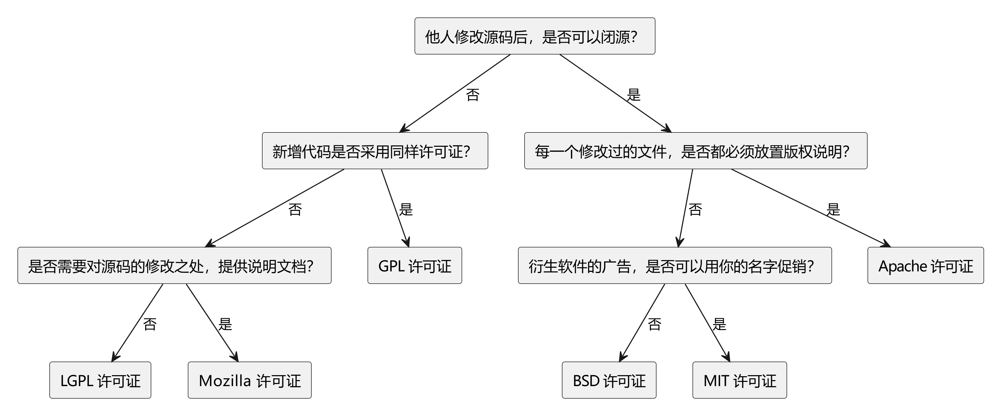
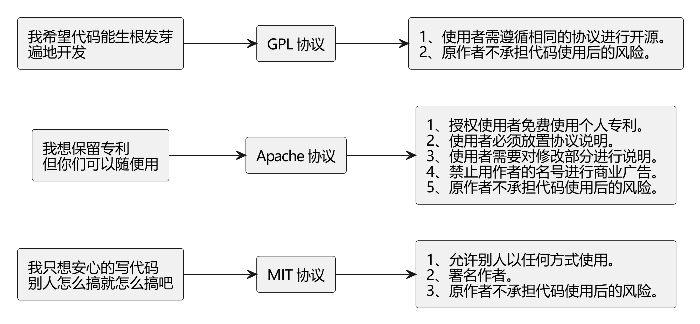

# 开源许可证

## 开源协议分类

开源协议大致可以分为两大类：

- GPL 系：
  - 特点：具有传染性，要求修改后的代码（衍生作品）也必须开源。
  - 强制开源性：修改后的代码必须保持开源，不允许闭源。

- 宽松型开源协议：
  - 特点：允许修改后的代码选择闭源。
  - 代表协议：Apache、MIT、BSD 等。



::: details 图片 PlantUML 代码

```txt
@startuml

rectangle "他人修改源码后，是否可以闭源？" as A
rectangle "新增代码是否采用同样许可证？" as B
rectangle "是否需要对源码的修改之处，提供说明文档？" as C
rectangle "衍生软件的广告，是否可以用你的名字促销？" as D
rectangle "每一个修改过的文件，是否都必须放置版权说明？" as E
rectangle "GPL 许可证" as F
rectangle "LGPL 许可证" as G
rectangle "Mozilla 许可证" as H
rectangle "Apache 许可证" as I
rectangle "BSD 许可证" as J
rectangle "MIT 许可证" as K

A --> B : 否
A --> E : 是
B --> C : 否
B --> F : 是
C --> G : 否
C --> H : 是
E --> D : 否
E --> I : 是
D --> J : 否
D --> K : 是

@enduml
```

:::

## 常见宽松型开源协议

- Apache 协议：
  - 要求：修改后的每个文件都需要包含版权说明。

- MIT 与 BSD 协议：
  - 特点：最为宽松，几乎可以随意使用开源代码。
  - 要求：项目中保留一份协议的副本即可。

- BSD 协议的额外限制：
  - 禁止事项：不得使用原作者的名字对项目进行促销推广。



::: details 图片 PlantUML 代码

```txt
@startuml
left to right direction

rectangle "我只想安心的写代码\n别人怎么搞就怎么搞吧" as Idea1
rectangle "我想保留专利\n但你们可以随便用" as Idea2
rectangle "我希望代码能生根发芽\n遍地开发" as Idea3

rectangle "MIT 协议" as MIT
rectangle "Apache 协议" as Apache
rectangle "GPL 协议" as GPL

rectangle "1、允许别人以任何方式使用。\n2、署名作者。\n3、原作者不承担代码使用后的风险。" as MIT_Details
rectangle "1、授权使用者免费使用个人专利。\n2、使用者必须放置协议说明。\n3、使用者需要对修改部分进行说明。\n4、禁止用作者的名号进行商业广告。\n5、原作者不承担代码使用后的风险。" as Apache_Details
rectangle "1、使用者需遵循相同的协议进行开源。\n2、原作者不承担代码使用后的风险。" as GPL_Details

Idea1 --> MIT
Idea2 --> Apache
Idea3 --> GPL

MIT --> MIT_Details
Apache --> Apache_Details
GPL --> GPL_Details

@enduml
```

:::
