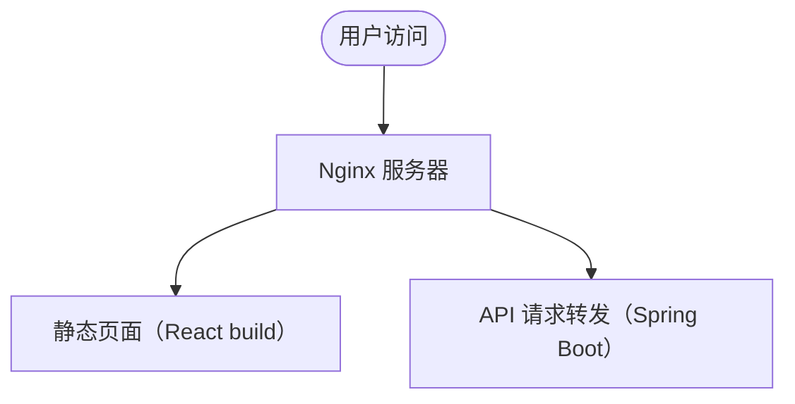

# 技术选型指南

前端、后端、移动端与前后端结合

## 1. 前端框架选型

### 1.1 [React](https://zh-hans.react.dev)

- 特点：组件化、虚拟 DOM、生态丰富（Next.js、Redux）
- 适用场景：中大型项目、复杂交互、需要高性能的网页应用

### 1.2 [Vue](https://cn.vuejs.org)

- 特点：简单易上手、响应式、渐进式开发
- 适用场景：快速开发、页面渲染灵活、中小型项目

### 1.3 [Angular](https://angular.dev)

- 特点：全家桶（自带路由、状态管理）、大型工程化支持
- 适用场景：企业级应用、团队协作开发、规范化需求强的项目

### 1.4 总结对比

| 框架    | 上手难度 | 生态系统 | 适合项目规模 | 社区活跃度 |
| ------- | -------- | -------- | ------------ | ---------- |
| React   | 中       | 极强     | 中大型       | 非常活跃   |
| Vue     | 简单     | 强       | 中小型       | 活跃       |
| Angular | 较难     | 完整     | 大型         | 活跃       |

## 2. 后端框架选型

### 2.1 [Spring Boot](https://spring.io/projects/spring-boot) (Java)

- 特点：企业级、稳定、高并发支持
- 适用场景：银行、教育、企业后台服务

### 2.2 [Express](https://expressjs.com) (Node.js)

- 特点：轻量、灵活、适合 API 服务
- 适用场景：中小型项目、快速原型开发

### 2.3 [Django](https://www.djangoproject.com/) (Python)

- 特点：自带管理后台、开发速度快
- 适用场景：内容管理系统（CMS）、数据驱动网站

### 2.4 [Laravel](https://laravel.com) (PHP)

- 特点：优雅的语法、活跃的社区
- 适用场景：传统 Web 开发、快速搭建后台

### 2.5 总结对比

| 框架        | 开发语言   | 特点         | 适合场景      |
| ----------- | ---------- | ------------ | ------------- |
| Spring Boot | Java       | 稳定、性能好 | 企业级项目    |
| Express     | JavaScript | 轻量、灵活   | API 服务      |
| Django      | Python     | 快速开发     | CMS、数据网站 |
| Laravel     | PHP        | 简洁易用     | 传统网站      |

## 3. 前后端结合方式

### 3.1 经典模式

- 前端（React/Vue）+ 后端（Spring Boot/Express）
- 前端通过 HTTP 请求（REST API / GraphQL）访问后端接口

### 3.2 服务端渲染 (SSR)

- [Next.js](https://nextjs.org)（基于 React）
- [Nuxt.js](https://nuxt.com)（基于 Vue）
- 在服务器上预先把 HTML 渲染好，再发给浏览器，提升首屏速度、利于 SEO

SSR 的优势：

- **首屏更快**：浏览器直接拿到完整 HTML，用户感知更快。
- **利于 SEO**：搜索引擎能抓取完整页面内容，适合需要曝光的页面（如博客、电商、新闻）。
- **分享体验好**：分享链接能自动生成预览（如标题、描述、缩略图）。

SSR 的劣势：

- **开发更复杂**：要处理服务器端和客户端不一致的问题（比如 `window`、`document` 在服务端是没有的）。
- **部署更复杂**：需要部署一个长期运行的 Node.js 服务，不能像纯前端那样随便放 CDN。
- **服务器负担大**：每次访问都要重新渲染，访问量大时对后端压力大（可结合缓存优化）。

### 3.3 API 统一管理

- API Gateway（如 Kong、Apigee）
- 后端统一出口，前端调用简洁、后端服务拆分灵活

## 4. 移动端技术选型

### 4.1 原生开发

- iOS：[Swift](https://www.swift.org)
- Android：[Kotlin](https://kotlinlang.org)
- 适合要求极高的性能体验项目（如大型游戏）

### 4.2 混合开发

- [React Native](https://reactnative.dev)：用 JavaScript 开发原生 APP
- [Flutter](https://flutter.dev)：用 Dart 开发原生体验的 APP

### 4.3 小程序生态

- 微信小程序、支付宝小程序、抖音小程序
- 适合国内快速推广的轻量应用场景

## 5. 部署方案选型

项目开发完成后，选择合适的部署方式非常关键，直接影响到访问速度、稳定性、运维难度等。

### 5.1 常见部署方式

1. 静态托管平台

    适用于：**纯前端项目**（React/Vue 静态页面），**静态内容网站**（博客、文档）

    - [Vercel](https://vercel.com)
      - 特点：自动化部署、支持 Next.js 原生 SSR/SSG。
      - 优点：免费额度很良心，部署速度快，自动绑定 HTTPS。
    - [Netlify](https://www.netlify.com)
      - 特点：简单易用，支持自定义域名，自动 CI/CD。
      - 优点：适合部署静态站点、小型前后端分离项目。
    - [GitHub Pages](https://pages.github.com)
      - 特点：完全免费，但只支持纯静态内容（不支持 SSR）。
      - 优点：适合个人博客、项目文档。

2. 云服务器部署（传统方式）

    适用于：**有后端服务（如 Spring Boot、Express）**，**需要定制部署环境**的项目

    - 常见云服务商：
      - 阿里云、腾讯云、AWS、Azure
    - 部署方式：
      - 安装 Nginx，前端打包后放静态文件。
      - 后端独立部署（Java 服务、Node.js 服务等）。
      - 配置反向代理（前端走 80 端口，API 走 8080 端口等）。

3. [Docker](https://www.docker.com) 容器化部署

    适用于：**希望项目环境标准化、易于扩展、易于迁移**的项目

    - 特点：打包成镜像，哪里有 Docker 环境就能跑。
    - 优点：便于持续集成（CI/CD），一键部署，一键升级。
    - 常用工具：
      - Docker Compose（多服务一起部署）
      - [Kubernetes](https://kubernetes.io)（大规模部署调度）

### 5.2 前后端结合部署示例

- 前端 React 项目打包成静态文件（`npm run build`）
- 后端 Spring Boot 打包成 `jar` 文件，运行在服务器上
- 用 Nginx 作为反向代理：
  - `/api/*` 转发到 Spring Boot 后端
  - `/` 转发到前端静态页面

示意图：

## 6. 综合选型建议

| 类型         | 推荐组合                      | 适合项目           |
| ------------ | ----------------------------- | ------------------ |
| 网页应用     | React + Spring Boot / Express | 企业后台、内容平台 |
| 移动应用     | React Native / Flutter        | 移动端 APP 开发    |
| 快速开发网站 | Vue + Django / Laravel        | 中小型项目         |
| SEO 要求网站 | Next.js + 任意后端            | 电商、博客         |
