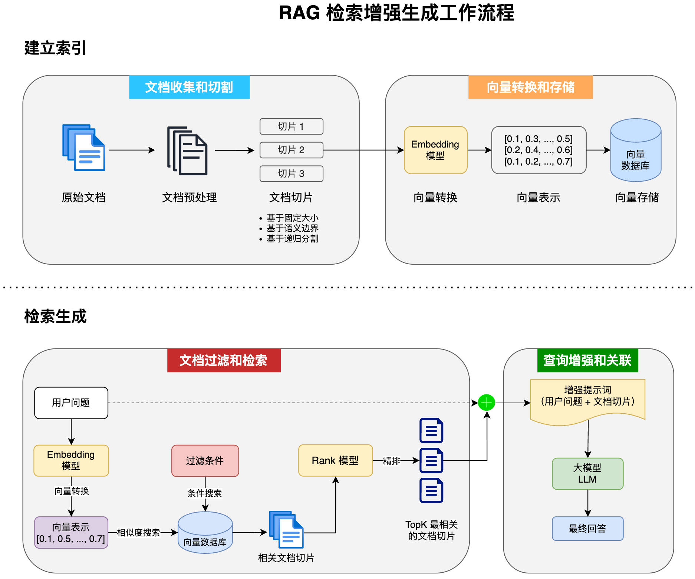

# LangChain4j

## 结构化输出

结构化输出是指将大模型返回的文本输出转换为结构化的数据格式，例如 JSON、一个对象或复杂的对象列表。

结构化输出有以下三种实现方式：

> 默认情况下，LangChain4j 使用 Prompt 模式。它会在用户的提示词后附加一段内容，强制大模型输出包含特定字段的 JSON 文本。

### JSON Schema

1. **构建 JSON Schema**
2. **发送 Schema**：LangChain4j 将该 Schema 发送给模型。
3. **组合输入**：将用户输入的 Prompt 和 Schema 一起发送给模型。
4. **模型推理**：模型根据输入选择要调用的工具，并自动生成参数的 JSON。
5. **框架解析**：LangChain4j 自动反序列化模型返回的 JSON。
6. **获取结果**：得到结构化的输出对象。

### Prompt + JSON Mode

1. **设置响应模式**：将模型的响应模式设置为 JSON。
2. **构造 Prompt**：创建相应的提示。
3. **发送输入**：将用户输入传递给模型。
4. **模型推理**：模型被限制只能返回 JSON 格式的输出，不允许包含自然语言。
5. **框架解析**：LangChain4j 解析返回的 JSON。

### Prompt

1. **构造 Prompt**
2. **发送请求**：在没有 JSON Mode 的情况下发送请求。
3. **模型生成**：模型生成结果。
4. **后处理**：手动从结果中提取 JSON 子串。

## RAG（检索增强生成）

RAG（Retrieval-Augmented Generation，检索增强生成）是一种结合了信息检索技术和 AI 内容生成的混合架构，旨在解决大模型知识时效性限制和幻觉问题。

简单来说，RAG 就像给 AI 配备了一个“小抄本”。在回答问题前，AI 会先查询特定的知识库以获取相关信息，确保其回答基于真实资料而非凭空想象。许多企业利用 RAG 搭建智能客服，使用自己积累的领域知识来回复用户。

RAG 的完整工作流程如下：

1. **数据处理**：文档切片
2. **数据存储**：向量转换、存储
3. **数据检索**：当用户提问时，从已存储的数据中检索相关信息。
4. **内容生成**：将检索到的相关数据和用户的提问一同发送给 AI，由 AI 生成最终回答。

## Tool Calling（工具调用）

工具调用（Tool Calling）让 AI 大模型能够借助外部工具来完成自身无法独立完成的任务。

这就像人类在无法仅凭双手完成工作时，会使用工具箱来辅助一样。工具可以是任何东西，例如网页搜索、调用外部 API、访问外部数据或执行特定代码等。

例如，当用户提问“帮我查询上海最新的天气”时，AI 本身没有实时天气信息，但它可以通过调用“查询天气工具”来完成这个任务。

**核心机制**：工具调用的本质并非 AI 服务器直接执行这些工具，也不是将工具代码发送给 AI 服务器执行。AI 只能提出请求，表示“我需要执行 XX 工具来完成任务”。真正执行工具的是我们的应用程序。应用程序执行工具后，将结果返回给 AI，AI 再根据结果继续工作。

1. **用户输入**：用户以自然语言提出请求。
2. **发送请求**：LangChain4j 将请求连同所有可用工具的定义（名称、描述、Schema）发送给模型。
3. **模型决策**：模型判断是否需要调用工具，并返回一个包含调用请求的 JSON。
4. **执行工具**：LangChain4j 解析 JSON，并通过反射执行对应的 Java 方法。
5. **返回结果**：将方法的返回值发送给模型。
6. **生成回复**：模型根据工具执行结果生成最终的自然语言回复，并返回给用户。

## MCP（模型上下文协议）

MCP（Model Context Protocol，模型上下文协议）是一种开放标准，旨在增强 AI 与外部系统的交互能力。MCP 为 AI 提供了与外部工具、资源和服务交互的标准化方式，使其能够访问最新数据、执行复杂操作并与现有系统集成。

可以将 MCP 想象成 AI 应用的 **USB 接口**。就像 USB 为设备连接各种外设和配件提供了标准化方式一样，MCP 为 AI 模型连接不同的数据源和工具提供了标准化的方法。

简单来说，通过 MCP 协议，AI 应用可以轻松接入第三方提供的服务来实现更多功能，例如查询地理位置、操作数据库、部署网站，甚至是进行支付等。

## Guardrail（护轨）

其实我感觉护轨这个名字起的不太好，其实我们把它理解为拦截器就好了。分为输入护轨‍（input guardrails）和输出护轨（ou⁠tput guardrails），可以在请求 AI ⁠前和接收到 AI 的响应后执行一些额外操作，比如调用‌ AI 前鉴权、调用 AI 后记录日志。

## 日志和可观测性

之前我们都是通过 Debug‍ 查看运行信息，不⁠仅不便于调试，而且⁠生产环境肯定不‌能这么做。

官方提供了 日志 和 可观测性，来帮我们更好地调试程序、发现问题。

### 日志

开启日志的方法很简单，直接构造模型‍时指定开启、或者直接编⁠写 Spring Bo⁠ot 配置，支持打印 ‌AI 请求和响应日志。

但并不是所有的 ChatModel‍ 都支持，比如我测试下⁠来 QwenChatM⁠odel 就不支持。这‌时只能把希望交给可观测性了。

### 可观测性

可以通过自定义 Listen‍er 获取 Cha⁠tModel 的调⁠用信息，比较灵活。

## SSE 流式接口开发

LangChain 提供了 ‍2 种方式来支持流⁠式响应（注意，流式⁠响应不支持结构‌化输出）。

一种方法是 TokenStream，先让 AI 对话方法返回 TokenStream，然后创建 AI Service 时指定流式对话模型 StreamingChatModel。

另一种方法，使用 Flux 代替 TokenStream，熟悉响应式编程的同学应该对 Flux 不陌生吧？让 AI 对话方法返回 Flux 响应式对象即可。
