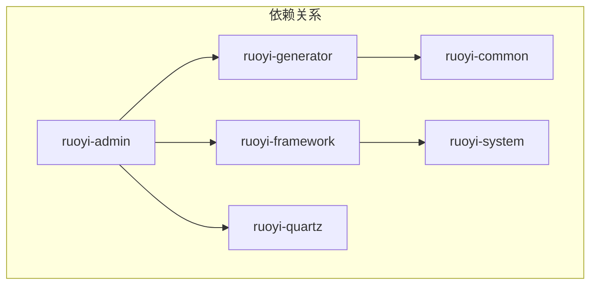

# RuoYi 脚手架

## 简介

RuoYi 是一个基于 Spring Boot 和 Vue 的前后端分离的快速开发脚手架。它内置了用户管理、部门管理、岗位管理、菜单管理、角色管理、字典管理等一系列系统功能，可以帮助开发者快速搭建企业级中后台产品原型。

## 项目结构

RuoYi 的后端项目是一个多模块的 Maven 项目，结构清晰，职责分明。

```txt
ruoyi
├── ruoyi-admin      -- Web 入口，存放 Controller
├── ruoyi-common     -- 公共模块，存放通用代码
├── ruoyi-framework  -- 框架模块，集成第三方框架，如 Spring Security
├── ruoyi-generator  -- 代码生成器模块
├── ruoyi-quartz     -- 定时任务模块
└── ruoyi-system     -- 系统核心模块，包含 domain, service, mapper
```

## 依赖关系

各个模块之间的依赖关系如下，核心思想是上层模块依赖下层模块，`ruoyi-admin` 作为入口模块，依赖所有其他业务模块。



最终其实所有代码都整合到了 ruoyi-admin 当中。

## 表结构

RuoYi 内置了一套完整的权限管理和系统监控相关的表。

| 表名             | 描述               |
| :--------------- | :----------------- |
| gen_table        | 代码生成器表信息   |
| gen_table_column | 生成列表信息       |
| sys_config       | 系统配置信息       |
| sys_dept         | 部门表             |
| sys_dict_data    | 字典目录表         |
| sys_dict_type    | 字典类型表         |
| sys_job          | 定时任务表         |
| sys_job_log      | 任务日志表         |
| sys_logininfor   | 登录信息表         |
| sys_menu         | 菜单表             |
| sys_notice       | 系统通知表         |
| sys_oper_log     | 执行日志表         |
| sys_post         | 岗位表             |
| sys_role         | 角色表             |
| sys_role_dept    | 角色和部门关系表   |
| sys_role_menu    | 角色和菜单关系表   |
| sys_user         | 用户表             |
| sys_user_post    | 用户和岗位关系表   |
| sys_user_role    | 用户和角色的关系表 |
