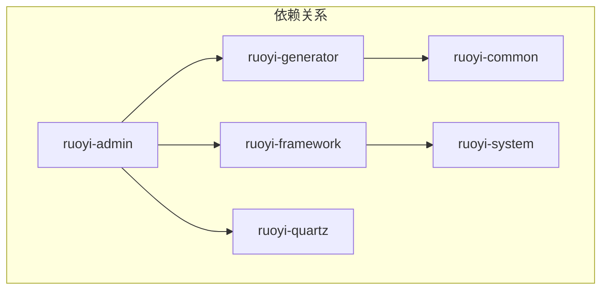

# RuoYi 脚手架

## 简介

RuoYi 是一个基于 Spring Boot 和 Vue 的前后端分离的快速开发脚手架。它内置了用户管理、部门管理、岗位管理、菜单管理、角色管理、字典管理等一系列系统功能，可以帮助开发者快速搭建企业级中后台产品原型。

## 项目结构

RuoYi 的后端项目是一个多模块的 Maven 项目，结构清晰，职责分明。

```txt
ruoyi
├── ruoyi-admin      -- Web 入口，存放 Controller
├── ruoyi-common     -- 公共模块，存放通用代码
├── ruoyi-framework  -- 框架模块，集成第三方框架，如 Spring Security
├── ruoyi-generator  -- 代码生成器模块
├── ruoyi-quartz     -- 定时任务模块
└── ruoyi-system     -- 系统核心模块，包含 domain, service, mapper
```

## 依赖关系

各个模块之间的依赖关系如下，核心思想是上层模块依赖下层模块，`ruoyi-admin` 作为入口模块，依赖所有其他业务模块。



最终其实所有代码都整合到了 ruoyi-admin 当中。

## 表结构

RuoYi 内置了一套完整的权限管理和系统监控相关的表。

| 表名             | 描述               |
| :--------------- | :----------------- |
| gen_table        | 代码生成器表信息   |
| gen_table_column | 生成列表信息       |
| sys_config       | 系统配置信息       |
| sys_dept         | 部门表             |
| sys_dict_data    | 字典目录表         |
| sys_dict_type    | 字典类型表         |
| sys_job          | 定时任务表         |
| sys_job_log      | 任务日志表         |
| sys_logininfor   | 登录信息表         |
| sys_menu         | 菜单表             |
| sys_notice       | 系统通知表         |
| sys_oper_log     | 执行日志表         |
| sys_post         | 岗位表             |
| sys_role         | 角色表             |
| sys_role_dept    | 角色和部门关系表   |
| sys_role_menu    | 角色和菜单关系表   |
| sys_user         | 用户表             |
| sys_user_post    | 用户和岗位关系表   |
| sys_user_role    | 用户和角色的关系表 |

## 数据字典

若依通过 `sys_dict_type`（字典类型表）和 `sys_dict_data`（字典数据表）的组合来实现数据字典功能，实现了配置与代码的分离。

- **`sys_dict_type` (字典类型表):**
  - 这张表用来定义一个字典的类别。例如，我们可以定义一个名为 `sys_user_sex` 的字典类型，用于表示用户的性别。
  - 它相当于一个分组，将同一类型的字典数据归集在一起。

- **`sys_dict_data` (字典数据表):**
  - 这张表存放具体的键值对数据。
  - 它通过外键（通常是 `dict_type` 字段）与 `sys_dict_type` 表关联。
  - 例如，对于 `sys_user_sex` 这个字典类型，我们可以在 `sys_dict_data` 表中存储以下数据：
    - 标签为“男”，值为“0”
    - 标签为“女”，值为“1”
    - 标签为“未知”，值为“2”

**工作流程：**

1. **定义类型**：在 `sys_dict_type` 表中创建一个新的字典类型，比如 `sys_notice_status`（通知状态）。
2. **添加数据**：在 `sys_dict_data` 表中添加与 `sys_notice_status` 类型关联的多条记录，如 `{标签："正常", 值："0"}`，`{标签："关闭", 值："1"}`。
3. **前端调用**：前端可以通过调用后端提供的接口，传入字典类型 `sys_notice_status`，从而获取其下所有的字典数据（一个包含“正常”和“关闭”选项的列表）。
4. **后端使用**：后端在需要使用这些固定值的地方，可以通过字典工具类，根据字典类型和字典值来获取对应的标签，反之亦然。

通过这种方式，当需要修改或增加某个状态时，只需在数据库中操作 `sys_dict_data` 表，而无需修改任何代码，提高了系统的灵活性和可维护性。
