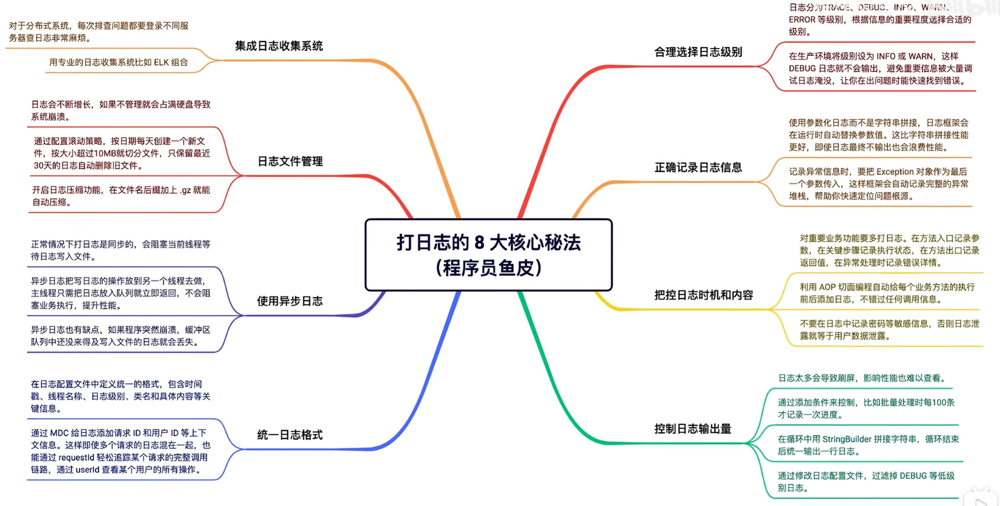

# 日志记录

## 为什么需要日志

当程序出现 Bug 时，如果没有日志，我们很难定位问题。日志是用来记录程序运行时的状态和信息，当系统出现问题时，我们可以通过日志快速定位问题。

## 日志框架

每种编程语言都有很多日志框架和工具库，比如 Java 可以选用 `Log4j2`、`Logback` 等等。

Spring Boot 默认集成了 `Logback` 日志框架，我们直接用就行，不用再引入额外的库了。

### 使用方法

先获取到 `Logger` 日志对象，然后调用 `log.xxx()` 就能输出日志了。

```java
Logger logger = LoggerFactory.getLogger(当前类名.class);
logger.info("Hello World");
```

每个需要打日志的类都要加上这行代码，有些麻烦。

可以使用 `Lombok` 工具库提供的 `@Slf4j` 注解，可以自动为当前类生成日志对象，不用手动定义了。

```java
@Slf4j
public class UserController {
    public void test() {
        log.info("Hello World");
    }
}
```

### 和 `System.out.println` 的区别

`System.out.println` 是一个同步方法，每次调用都会导致耗时的 IO 操作，频繁调用会影响程序的性能。而且它只能输出信息到控制台，不能灵活控制输出位置、输出格式、输出时机等等。

日志框架提供了丰富的打日志方法，它可以通过修改日志配置文件来随心所欲的调教日志，比如把日志同时输出到控制台和文件中，设置日志格式，控制日志级别等等。

## 打日志的 8 大核心秘法

### 1. 合理选择日志级别

日志的级别是按照重要程度进行划分的，其中 `DEBUG`、`INFO`、`WARN` 和 `ERROR` 用的最多。

- `DEBUG`：调试信息
- `INFO`：普通信息
- `WARN`：警告信息
- `ERROR`：错误信息

在生产环境，我们通常会把日志级别调高（`INFO` 或 `WARN`），这样 `DEBUG` 级别的日志就不会输出了，防止重要信息被无用日志淹没。

### 2. 正确记录日志信息

#### 参数化日志

尖括号 `{}` 是一个占位符，日志框架会在运行时自动把后面的参数值替换进去。

```java
log.info("用户 {} 登录成功", userId);
```

**优点**

- **性能**：字符串拼接是在调用 `log` 方法之前就执行的，即使这条日志最终不被输出，字符串拼接操作还是会执行，白白浪费性能。
- **可读性**：参数化日志比字符串拼接看起来更舒服。

#### 输出异常信息

当你要输出异常信息时，也可以使用参数化日志，这样日志框架会同时记录上下文信息和完整的异常堆栈信息，便于排查问题。

```java
try {
    // ...
} catch (Exception e) {
    log.error("操作失败，用户 ID：{}", userId, e);
}
```

### 3. 把控日志时机和内容

对于重要的业务功能，我建议采用防御性编程，先多多打日志，比如在方法代码的入口和出口记录参数和返回值，在每个关键步骤记录执行状态，而不是等出了问题无法排查时才追悔莫及，之后可以再慢慢移除掉不需要的日志。

可以利用 **AOP 切面编程**，自动给每个业务方法的执行前后添加日志，这样就不会错过任何一次调用信息了。

> 注意：不要在日志中记录了敏感信息，比如用户密码。

### 4. 控制日志输出量

- **条件输出**：比如每处理 100 条数据时才记录一次。
- **批量输出**：在循环中利用 `StringBuilder` 进行字符串拼接，循环结束后统一输出。
- **修改配置**：通过修改日志配置文件过滤掉特定级别的日志，防止日志刷屏。

### 5. 统一日志格式

可以在日志配置文件中定义统一的日志格式，包含时间戳、线程名称、日志级别、类名、方法名、具体内容等关键信息，这样输出的日志更整齐易读。

此外，你还可以通过 **MDC** 给日志添加额外的上下文信息，比如请求 ID、用户 ID 等等，方便追踪。

在 Java 代码中可以为 MDC 设置属性值：

```java
MDC.put("requestId", "xxx");
MDC.put("userId", "123");
```

然后在日志配置文件中就可以使用这些值了：

```xml
<pattern>%d{HH:mm:ss.SSS} [%thread] %-5level %logger{36} - %X{requestId} %X{userId} - %msg%n</pattern>
```

这样每个请求、每个用户的操作一目了然。

### 6. 使用异步日志

正常情况下，你调用 `log.info()` 打日志时，程序会立刻把日志写入文件，这个过程是同步的，会阻塞当前线程。

而异步日志会把写日志的操作放到另一个线程里去做，不会阻塞主线程，性能更好。

只需要修改一下配置文件就好。

> 缺点：如果程序突然崩溃，缓冲区中还没来得及写入文件的日志可能会丢失。

### 7. 日志文件管理

通过修改日志配置文件，让框架帮忙管理日志。

- **滚动策略**：可以根据文件大小和日期自动对日志文件进行切分。
  - 每天会创建一个新的日志文件。
  - 如果日志文件大小超过 10M，就再创建一个。
- **保留期限**：只保留最近 30 天的日志。
- **日志压缩**：开启日志压缩功能，进一步节省磁盘空间。

### 8. 集成日志收集系统

对于分布式系统，就必须要用专业的日志收集系统了，比如很流行的 **ELK**。

- **Logstash**：负责收集各个服务的日志。
- **Elasticsearch**：存储和索引日志。
- **Kibana**：提供了一个可视化的界面，让我们可以方便的集中搜索、查看、分析日志。

> ELK 成本比较高，对于小项目可能有点重，要按需采用。

## 总结

日志不是写给机器看的，是写给未来的你和你的队友看的。


