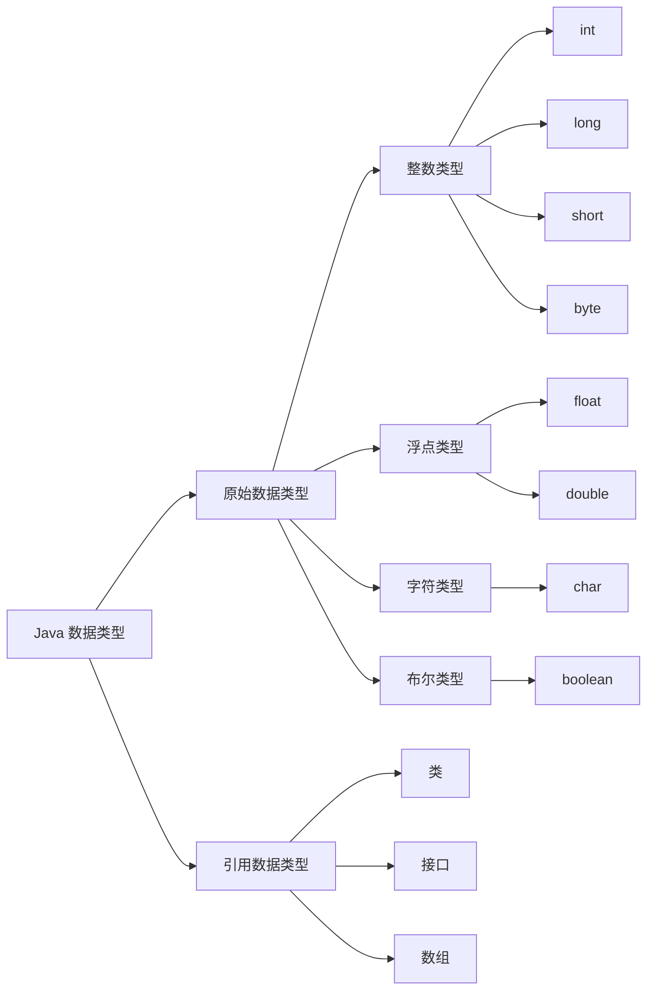
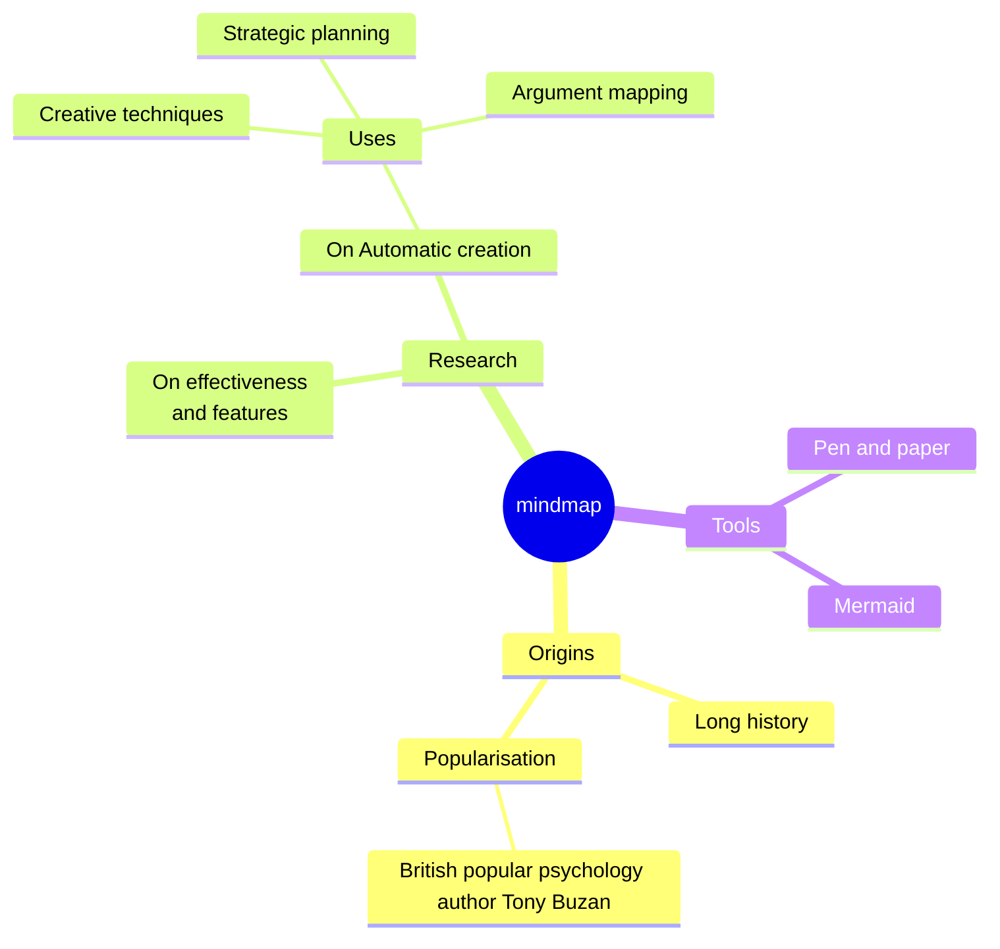
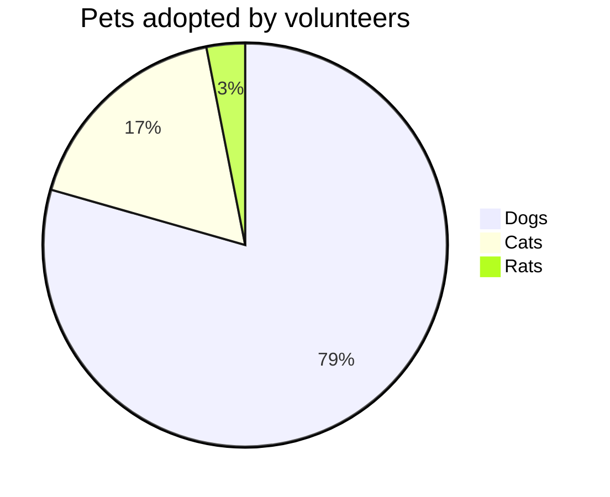
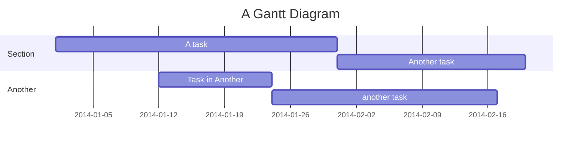

# 测试页

::: info 注释
注释是灰色
:::

::: tip 提示
提示是绿色
:::

::: warning 警告
警告是橘色
:::

::: danger 危险
危险是红色
:::

- <sapn class="marker-text">这里是重重点</sapn>

- <sapn class="marker-text-highlight">这里是荧光笔</sapn>

- <sapn class="marker-evy">这里是尤雨溪的主页样式，鼠标放在我上面看效果</sapn>

```sh
#默认有行号
pnpm -v
```

```sh:no-line-numbers
#关闭行号
pnpm -v
```

::: code-group

```sh [pnpm]
#查询pnpm版本
pnpm -v
```

```sh [yarn]
#查询yarn版本
yarn -v
```

:::

When $a \ne 0$, there are two solutions to $(ax^2 + bx + c = 0)$ and they are

$$ x = {-b \pm \sqrt{b^2-4ac} \over 2a} $$

**Maxwell's equations:**

| equation                                                                                                                                                                  | description                                                                            |
| ------------------------------------------------------------------------------------------------------------------------------------------------------------------------- | -------------------------------------------------------------------------------------- |
| $\nabla \cdot \vec{\mathbf{B}}  = 0$                                                                                                                                      | divergence of $\vec{\mathbf{B}}$ is zero                                               |
| $\nabla \times \vec{\mathbf{E}}\, +\, \frac1c\, \frac{\partial\vec{\mathbf{B}}}{\partial t}  = \vec{\mathbf{0}}$                                                          | curl of $\vec{\mathbf{E}}$ is proportional to the rate of change of $\vec{\mathbf{B}}$ |
| $\nabla \times \vec{\mathbf{B}} -\, \frac1c\, \frac{\partial\vec{\mathbf{E}}}{\partial t} = \frac{4\pi}{c}\vec{\mathbf{j}}    \nabla \cdot \vec{\mathbf{E}} = 4 \pi \rho$ | _wha?_                                                                                 |









